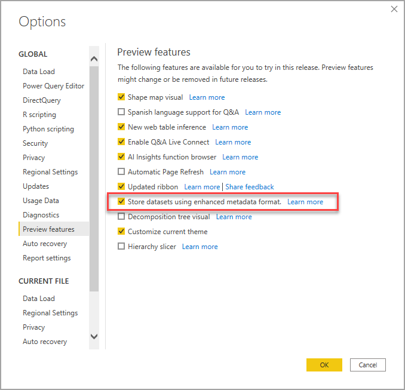

# <a name="using-enhanced-dataset-metadata-preview"></a>향상된 데이터 세트 메타데이터 사용(미리 보기)

Power BI Desktop 보고서를 만들 때 해당 PBIX 및 PBIT 파일에서도 데이터 세트 메타데이터를 만듭니다. 이전에는 메타데이터가 Power BI Desktop에 한정된 형식으로 저장되었습니다. Base-64로 인코딩된 M 식과 데이터 원본을 사용했고 메타데이터가 저장된 방법에 대한 가정이 생성되었습니다.

**향상된 데이터 세트 메타데이터** 기능이 릴리스되어 해당 제한 사항이 대부분 제거되었습니다. **향상된 데이터 세트 메타데이터** 기능을 사용하면 Power BI Desktop에서 만든 메타데이터는 [테이블 형식 개체 모델](/analysis-services/tom/introduction-to-the-tabular-object-model-tom-in-analysis-services-amo)을 기반으로 하는 Analysis Services 테이블 형식 모델에 사용되는 것과 비슷한 형식을 사용합니다.


향후 Power BI 기능은 메타데이터를 기반으로 할 것이므로 **향상된 데이터 세트 메타데이터** 기능은 전략적이며 기초적인 기능입니다. 향상된 데이터 세트 메타데이터를 활용하기 위해 제공하는 몇 가지 추가 기능에는 Power BI 데이터 세트를 관리하는 작업과 차세대 기능을 활용하기 위해 Analysis Services 워크로드를 Power BI로 마이그레이션하는 작업을 위한 [XMLA 읽기/쓰기](https://docs.microsoft.com/power-platform-release-plan/2019wave2/business-intelligence/xmla-readwrite)가 포함됩니다.


## <a name="enable-enhanced-dataset-metadata"></a>향상된 데이터 세트 메타데이터 사용

**향상된 데이터 세트 메타데이터** 기능은 현재 미리 보기로 제공됩니다. 향상된 데이터 세트 메타데이터를 사용하려면 Power BI Desktop에서 **파일 > 옵션 및 설정 > 옵션 > 미리 보기 기능**을 선택하고 다음 이미지에 표시된 것처럼 **향상된 메타데이터 형식을 사용하여 데이터 세트 저장** 확인란을 선택합니다. 



Power BI Desktop를 다시 시작하라는 메시지가 표시됩니다.


미리 보기 기능이 사용하도록 설정되면 Power BI Desktop은 이전 메타데이터 형식을 사용하는 PBIX 및 PBIT 파일을 업그레이드하려고 시도합니다. 

> [!IMPORTANT]
> **향상된 데이터 세트 메타데이터** 기능을 사용하도록 설정하면 보고서가 업그레이드되며 이는 되돌릴 수 없습니다. **향상된 데이터 세트 메타데이터**가 설정되면 Power BI Desktop을 사용하여 로드하거나 만든 모든 Power BI 보고서는 향상된 데이터 세트 메타데이터 형식으로 변환됩니다.

## <a name="report-backup-files"></a>보고서 백업 파일

**향상된 데이터 세트 메타데이터** 기능을 사용하도록 보고서를 업데이트하는 경우 취소할 수 없습니다. 그러나 업데이트를 수행하는 동안 보고서를 원래(업데이트 이전) 형식의 버전으로 저장하기 위해 보고서 백업 파일이 생성됩니다. 이 백업 파일은 30일 후에 제거됩니다. 

백업 보고서 파일을 찾으려면 다음을 수행합니다.

1. 다음 위치로 이동합니다. ```C:\Users\<user>\AppData\Local\Microsoft\Power BI Desktop\TempSaves\Backup```. Microsoft Store 버전의 Power BI Desktop을 사용하는 경우 다음 위치를 사용합니다. ```C:\Users\<user>\Microsoft\Power BI Desktop Store App\TempSaves\Backups``` 

2. 여기에서 원본 파일의 이름 및 타임스탬프로 보고서의 복사본을 찾습니다.

3. 파일을 유지하려면 원하는 위치에 파일을 복사합니다.

4. 원본 파일을 열거나 사용하려는 경우 Power BI Desktop에서 **향상된 메타데이터 형식** 미리 보기 기능을 사용하지 않도록 설정했는지 확인합니다. 

보고서를 업그레이드할 때 백업 파일이 만들어지므로 업그레이드 이후 변경된 내용은 포함되지 않습니다. **향상된 메타데이터 형식** 기능이 사용하도록 설정된 상태에서 생성되는 새 보고서는 백업 파일이 없습니다.


## <a name="considerations-and-limitations"></a>고려 사항 및 제한 사항

미리 보기 버전에서는 미리 보기 기능을 사용할 수 있는 경우 다음 제한 사항이 적용됩니다.

### <a name="unsupported-features-and-connectors"></a>지원되지 않는 기능 및 커넥터

다음과 같은 제한 사항이 적용됩니다.

업그레이드되지 않은 기존 PBIX 또는 PBIT 파일을 열 때 데이터 세트에 다음 기능 또는 커넥터가 포함되어 있으면 업그레이드에 실패합니다. 해당 오류가 발생하는 경우 사용자 환경에 즉각적인 영향을 미치지 않으며 Power BI Desktop은 이전 메타데이터 형식을 계속 사용합니다.

* 모든 사용자 지정 커넥터(2020년 5월 릴리스 제한 사항)
* Python 스크립트
* Azure DevOps Server
* BI Connector
* Denodo
* Dremio
* Exasol
* Indexima
* IRIS
* Jethro ODBC
* Kyligence Enterprise
* Mark Logic ODBC
* Qubole Presto
* Team Desk
* 열 이름에 “\\n”과 같은 특정 문자 조합을 포함하는 M 식
* **향상된 데이터 세트 메타데이터** 기능이 사용하도록 설정된 데이터 세트를 사용하는 경우 Power BI 서비스에서 SSO(Single Sign On) 데이터 원본을 설정할 수 없습니다.

Power BI Desktop **2020년 6월** 릴리스 이상 버전을 사용하는 경우 Power BI Desktop과 Power BI 서비스에서 모든 사용자 지정 커넥터와 모든 기본 제공 커넥터가 지원됩니다. 2020년 6월 릴리스 이상을 사용할 때 게시 프로세스 중에 게이트웨이에 문제가 발생하면 데이터 세트는 성공적으로 게시되지만 사용자는 데이터를 새로 고치기 위해 보고서를 다시 게시해야 합니다. **데이터 원본 설정** 대화 상자를 통해서만 게시 프로세스에 문제가 발생했음을 알 수 있습니다.

지원되지 않는 커넥터나 기능을 사용하는 보고서는 새 형식으로 업그레이드되지 않습니다. 이미 업그레이드되었거나 이 새로운 기능이 설정된 이후에 만들어진 보고서는 나열된 지원되지 않는 기능 또는 커넥터를 추가하는 것을 지원하지 않습니다. 

동적 데이터 원본을 사용하는 쿼리는 지원되지 않습니다. 동적 데이터 원본을 포함하는 보고서는 새 형식으로 업그레이드되지 않으며, 이미 업그레이드되었거나 이 기능이 설정된 상태에서 새로 만들어진 보고서는 동적 데이터 원본 추가를 지원하지 않습니다. 원본이 매개 변수, 함수 입력 또는 휘발성 함수에 따라 변경되는 경우 쿼리는 동적 데이터 원본을 가집니다. 

업스트림 단계 또는 분기에서 오류가 발생한 쿼리는 지원되지 않습니다. 

또한 **향상된 데이터 세트 메타데이터**를 사용하도록 이미 업그레이드된 PBIX 및 PBIT 파일은 위의 기능 또는 지원되지 않는 커넥터를 사용할 수 없습니다.

### <a name="lineage-view"></a>계보 보기
새 메타데이터 형식을 사용하는 데이터 세트에는 현재 Power BI 서비스의 계보 보기에 있는 데이터 흐름에 대한 링크가 표시되지 않습니다.

## <a name="next-steps"></a>다음 단계

Power BI Desktop으로 모든 종류의 작업을 수행할 수 있습니다. 해당 기능에 대한 자세한 내용은 다음 리소스를 확인하세요.

* [Power BI Desktop이란?](../fundamentals/desktop-what-is-desktop.md)
* [Power BI Desktop의 새로운 기능](../fundamentals/desktop-latest-update.md)
* [Power BI Desktop을 사용한 쿼리 개요](../transform-model/desktop-query-overview.md)
* [Power BI Desktop의 데이터 형식](desktop-data-types.md)
* [Power BI Desktop에서 데이터 셰이핑 및 결합](desktop-shape-and-combine-data.md)
* [Power BI Desktop의 일반적인 쿼리 작업](../transform-model/desktop-common-query-tasks.md)
