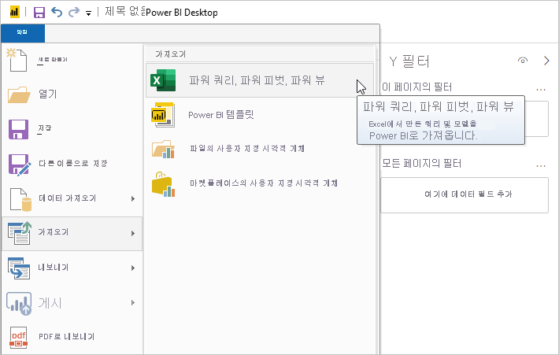
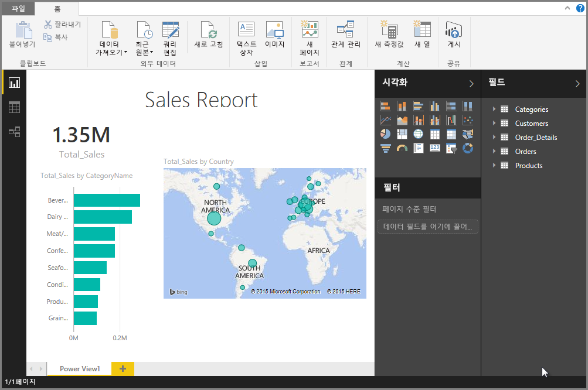

# Power BI Desktop에 Excel 통합 문서 가져오기
Power BI Desktop을 사용하면 파워 쿼리의 쿼리, 파워 피벗 모델, 파워 뷰 워크시트를 포함하는 Excel 통합 문서를 간편하게 Power BI Desktop에 가져올 수 있습니다. Power BI Desktop은 Excel 통합 문서에 따라 보고서 및 시각화를 자동으로 만듭니다. 가져온 후에는 기존 기능과, 각 Power BI Desktop 월별 업데이트에서 제공되는 새로운 기능을 사용하여 계속해서 Power BI Desktop으로 해당 보고서를 개선하고 구체화할 수 있습니다.

## Excel 통합 문서를 가져오려면 어떻게 해야 하나요?
1. Power BI Desktop에 Excel 통합 문서를 가져오려면 **파일** > **가져오기** > **파워 쿼리, 파워 피벗, 파워 뷰**를 선택합니다.

   

2. **열기** 창에서 가져올 Excel 통합 문서를 선택합니다. 

   현재 통합 문서의 크기나 개체 수에는 제약이 없지만 통합 문서가 커지면 Power BI Desktop의 분석 및 가져오기가 더 오래 걸립니다.

   > [!NOTE]
   > 공유된 비즈니스용 OneDrive 폴더 또는 Microsoft 365 그룹 폴더에서 Excel 파일을 로드하거나 가져오려면 Excel 파일의 URL을 사용하고 웹 데이터 원본을 Power BI Desktop에 입력합니다. 비즈니스용 OneDrive URL의 형식을 제대로 지정하기 위해 따라야 하는 몇 가지 단계가 있습니다. 자세한 내용 및 올바른 일련의 단계는 [Power BI Desktop에서 비즈니스용 OneDrive 링크 사용](desktop-use-onedrive-business-links.md)을 참조하세요.
   > 
   > 

3. 표시되는 [가져오기] 대화 상자에서 **시작**을 선택합니다.

   

   Power BI Desktop이 통합 문서를 분석하고 Power BI Desktop 파일(.pbix)로 변환합니다. 이 작업은 일회성 이벤트입니다. 절차를 거쳐 Power BI Desktop 파일이 만들어진 후에는 Power BI Desktop 파일이 원래의 Excel 통합 문서에 종속되지 않으며 원래의 통합 문서에 영향을 미치지 않고 수정, 저장 및 공유할 수 있습니다.

   가져오기가 완료되면 변환된 항목을 설명하고, 가져올 수 없는 항목을 나열하는 요약 페이지가 표시됩니다.

   

4. **닫기**를 선택합니다. 

   Power BI Desktop은 Excel 통합 문서를 가져오고 통합 문서 콘텐츠를 기반으로 보고서를 로드합니다.

   

통합 문서를 가져온 후 보고서 작업을 계속할 수 있습니다. Power BI Desktop에 포함된 모든 기능을 사용하여 새 시각화를 만들거나, 데이터를 추가하거나 새 보고서 페이지를 만들 수 있습니다.

## 가져올 수 없는 통합 문서 요소는 무엇인가요?
Power BI Desktop은 Excel에서 일반적으로 *개체*라고 하는 다음 요소를 가져올 수 있습니다.

| Excel 통합 문서의 개체 | Power BI Desktop 파일의 최종 결과 |
| --- | --- |
| Power Query 쿼리 |Excel에서 모든 Power Query 쿼리는 Power BI Desktop의 쿼리로 변환됩니다. Excel 통합 문서에 정의된 쿼리 그룹이 있다면 동일한 구성이 Power BI Desktop에 복제됩니다. **데이터 가져오기** Excel 대화 상자에서 **연결만 만들기**로 설정되지 않았다면 모든 쿼리가 로드됩니다. 로드 동작은 Power BI Desktop에서 Power Query 편집기의 **홈** 탭에서 **속성**을 선택하여 사용자 지정합니다. |
| 파워 피벗 외부 데이터 연결 |모든 파워 피벗 외부 데이터 연결은 Power BI Desktop의 쿼리로 변환됩니다. |
| 연결된 테이블 또는 현재 통합 문서 테이블 |Excel의 워크시트 테이블이 데이터 모델에 연결되었거나 쿼리(M에서 *From Table* 또는 *Excel.CurrentWorkbook()* 함수 사용)에 연결된 경우 다음 옵션이 제시됩니다. <ol><li><b>Power BI Desktop 파일에 테이블을 가져옵니다</b>. 이 테이블은 데이터의 일회성 스냅샷으로, 이후에 데이터는 Power BI Desktop의 테이블에서 읽기 전용입니다. 이 옵션을 사용하여 만들어진 테이블에는 1백만 자(총계, 모든 열 머리글 및 셀 결합)의 크기 제한이 있습니다.</li><li><b>원래 통합 문서와 연결을 유지합니다</b>. 또는 원래의 Excel 통합 문서와의 연결을 유지하고, Power BI Desktop에서 Excel 통합 문서에 대해 만든 다른 쿼리와 마찬가지로 Power BI Desktop이 새로 고칠 때마다 이 테이블에서 최신 콘텐츠를 검색하도록 할 수 있습니다.</li></ul> |
| 데이터 모델 계산 열, 측정값, KPI, 데이터 범주 및 관계 |해당 데이터 모델 개체는 Power BI Desktop에서 해당하는 개체로 변환됩니다. Power BI Desktop에는 사용할 수 없는 특정 데이터 범주가 있습니다(예: 이미지). 이 경우 문제의 열에 대해 데이터 범주 정보가 다시 설정됩니다. |
| 파워 뷰 워크시트 |Excel에서 각 Power View 워크시트에 대해 새 보고서 페이지가 생성됩니다. 이러한 보고서 페이지의 순서와 이름은 원래의 Excel 통합 문서와 일치합니다. |

## 통합 문서를 가져오는 데 제한 사항이 있나요?
통합 문서를 Power BI Desktop으로 가져오는 데는 몇 가지 제한 사항이 있습니다.

* **SQL Server Analysis Services 테이블 형식 모델에 대한 외부 연결:** Excel 2013에서는 SQL Server Analysis Services 테이블 형식 모델에 연결하고, 이 모델을 바탕으로 데이터를 가져올 필요 없이 파워 뷰 보고서를 만들 수 있습니다. 현재 Power BI Desktop에 Excel 통합 문서를 가져올 때 이러한 유형의 연결이 지원되지 않습니다. 해결 방법으로, Power BI Desktop에서 이러한 외부 연결을 다시 만들어야 합니다.
* **계층 구조:** 현재 Power BI Desktop에서는 이 유형의 데이터 모델 개체가 지원되지 않습니다. 따라서 Power BI Desktop에 Excel 통합 문서를 가져올 때 계층 구조를 건너뜁니다.
* **이진 데이터 열:** 현재 Power BI Desktop에서는 이 유형의 데이터 모델 열이 지원되지 않습니다. 이진 데이터 열은 Power BI Desktop의 결과 테이블에서 제거됩니다.
* **지원되지 않는 파워 뷰 요소:** Power BI Desktop에서는 몇 가지 파워 뷰 기능(예: 테마, 특정 유형의 시각화(재생 축이 있는 분산형 차트, 드릴다운 동작 등))이 지원되지 않습니다. 이렇게 지원되지 않는 시각화 기능으로 인해 Power BI Desktop 보고서의 해당 위치에 *지원되지 않는 시각화* 메시지가 표시됩니다. 이 메시지는 필요에 따라 삭제하거나 재구성할 수 있습니다.
* **파워 쿼리의** ***From Table*****을 사용하거나 M의** ***Excel.CurrentWorkbook*****을 사용하는 명명된 범위**: 현재 Power BI Desktop에 이 명명된 범위 데이터를 가져오는 기능은 지원되지 않지만, 향후 업데이트에서 지원할 계획입니다. 현재 이렇게 명명된 범위는 외부 Excel 통합 문서 연결에 따라 Power BI Desktop에 로드됩니다.
* **SSRS로 PowerPivot 연결 :** 현재 Power BI Desktop에서 PowerPivot 데이터 원본을 사용할 수 없으므로 SSRS(SQL Server Reporting Services)에 대한 PowerPivot 외부 연결이 지원되지 않습니다.

