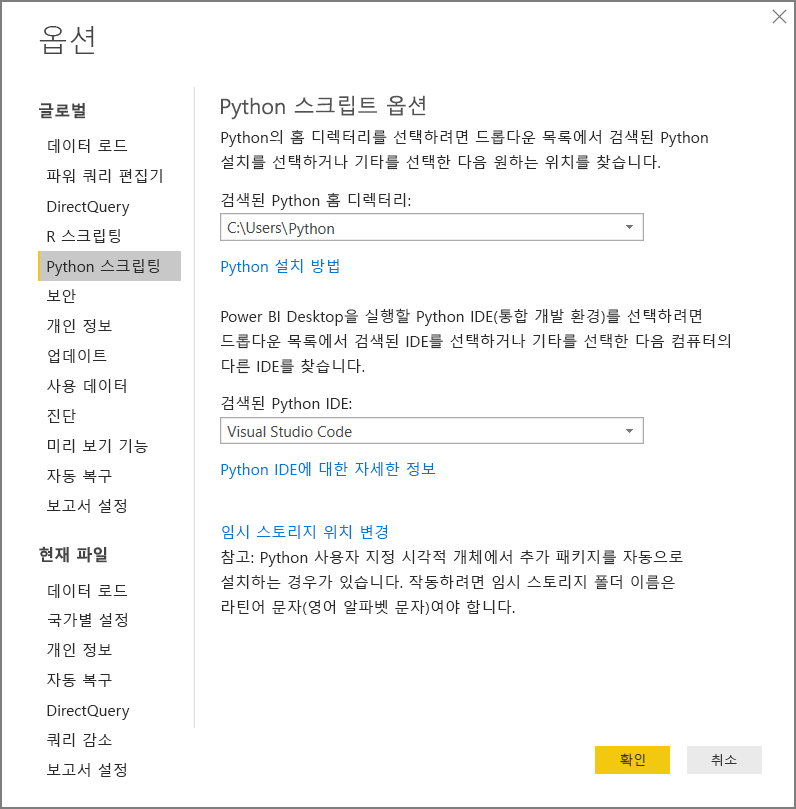
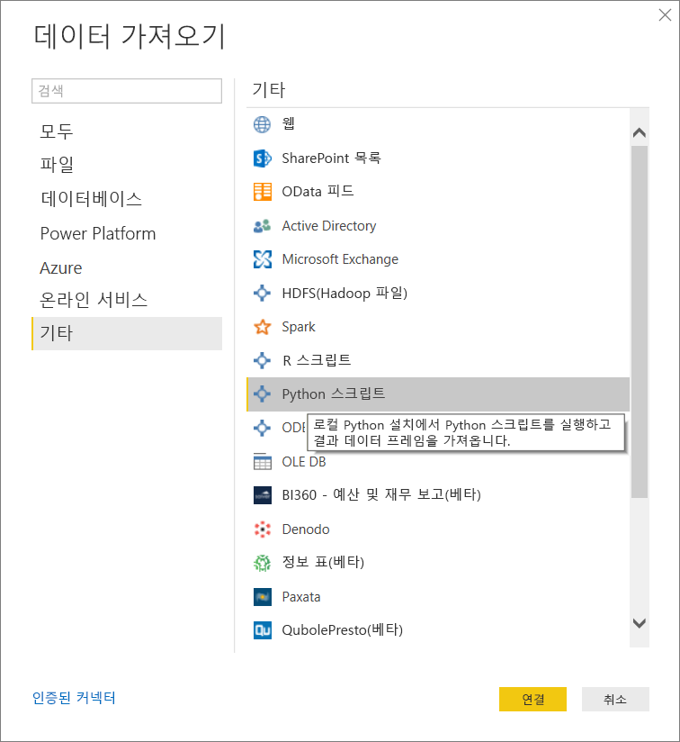
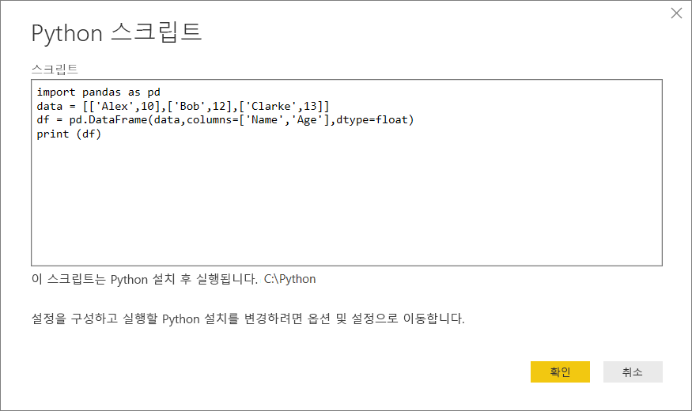
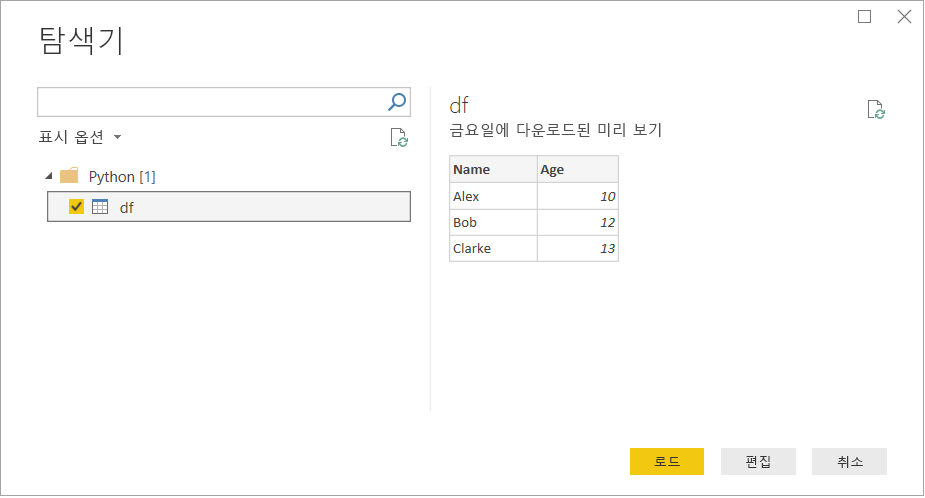
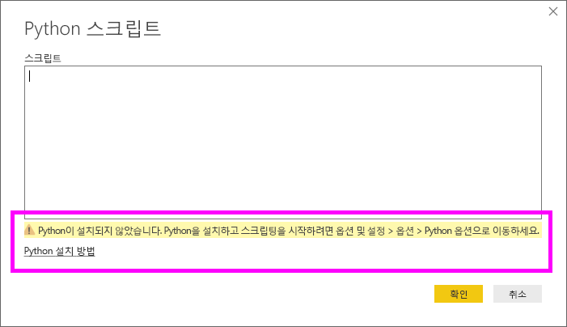

# <a name="run-python-scripts-in-power-bi-desktop"></a>Power BI Desktop에서 Python 스크립트 실행

Power BI Desktop에서 직접 Python 스크립트를 실행하고 결과 데이터 세트를 Power BI Desktop 데이터 모델로 가져올 수 있습니다.

## <a name="install-python"></a>Python 설치

Power BI Desktop에서 Python 스크립트를 실행하려면 로컬 머신에 Python을 설치해야 합니다. Python은 [Python 웹사이트](https://www.python.org/)에서 다운로드할 수 있습니다. 현재 Python 스크립팅 릴리스는 설치 경로에 유니코드 문자와 공백을 사용할 수 있도록 지원합니다.

### <a name="install-required-python-packages"></a>필수 Python 패키지 설치

Power BI Python 통합을 사용하려면 다음 두 가지 Python 패키지를 설치해야 합니다.

* [Pandas](https://pandas.pydata.org/). 데이터 조작 및 분석을 위한 소프트웨어 라이브러리입니다. 숫자 테이블 및 시계열을 조작하기 위한 데이터 구조와 작업을 제공합니다. 가져온 데이터는 [pandas 데이터 프레임](https://www.tutorialspoint.com/python_pandas/python_pandas_dataframe.htm)에 있어야 합니다. 데이터 프레임은 2차원 데이터 구조입니다. 예를 들어 데이터가 테이블 형식으로, 행과 열에 정렬되어 있습니다.
* [Matplotlib](https://matplotlib.org/). Python 및 숫자 수학 확장 [NumPy](https://www.numpy.org/)용 그리기 라이브러리입니다. 이 라이브러리는 Tkinter, wxPython, Qt 또는 GTK+와 같은 범용 GUI 도구 키트를 사용하여 그림을 애플리케이션에 포함하기 위한 개체 지향 API를 제공합니다.

콘솔 또는 셸에서 [pip](https://pip.pypa.io/en/stable/) 명령줄 도구를 사용하여 두 패키지를 설치합니다. pip 도구는 최신 Python 버전과 함께 패키징됩니다.

```CMD
pip install pandas
pip install matplotlib
```

## <a name="enable-python-scripting"></a>Python 스크립팅 사용

Python 스크립팅을 사용하도록 설정하려면 다음을 수행합니다.

1. Power BI Desktop에서 **파일** > **옵션 및 설정** > **옵션** > **Python 스크립팅** 을 선택합니다. **Python 스크립트 옵션** 페이지가 나타납니다.

   

1. 필요한 경우, **검색된 Python 홈 디렉터리** 에 로컬 Python 설치 경로를 지정합니다.

   위의 그림에서 Python의 설치 로컬 경로는 *C:\Python* 입니다. 경로가 Power BI Desktop에서 사용할 로컬 Python 설치 경로인지 확인합니다.

1. **확인** 을 선택합니다.

Python 설치를 지정하면, Power BI Desktop에서 Python 스크립트 실행을 시작할 준비가 된 것입니다.

## <a name="run-python-scripts"></a>Python 스크립트 실행

몇 가지 단계만 수행하면 Python 스크립트를 실행하고 데이터 모델을 만들 수 있습니다. 이 모델에서 보고서를 만들어 Power BI 서비스에서 공유할 수 있습니다.

### <a name="prepare-a-python-script"></a>Python 스크립트 준비

먼저, 로컬 Python 개발 환경에서 스크립트를 만들고 성공적으로 실행되는지 확인합니다. 예를 들어 다음은 pandas를 가져오고 데이터 프레임을 사용하는 간단한 Python 스크립트입니다.

```python
import pandas as pd
data = [['Alex',10],['Bob',12],['Clarke',13]]
df = pd.DataFrame(data,columns=['Name','Age'],dtype=float)
print (df)
```

이 스크립트를 실행하면 다음이 반환됩니다.

```python
     Name   Age
0    Alex  10.0
1     Bob  12.0
2  Clarke  13.0
```

Power BI Desktop에서 Python 스크립트를 준비하고 실행하는 경우 몇 가지 제한 사항이 있습니다.

* pandas 데이터 프레임만 가져오므로, Power BI로 가져오려는 데이터가 데이터 프레임에 표시되는지 확인함
* 30분 이상 실행하는 Python 스크립트는 시간이 초과됨
* 사용자 입력을 기다리는 등의 Python 스크립트의 대화형 호출은 스크립트의 실행을 중지함
* Python 스크립트 내에서 작업 디렉터리를 설정할 때, 작업 디렉터리에 ‘반드시’ 상대 경로가 아닌 전체 경로를 정의해야 합니다.
* 중첩된 표는 현재 지원되지 않습니다.

### <a name="run-your-python-script-and-import-data"></a>Python 스크립트 실행 및 데이터 가져오기

Power BI Desktop에서 Python 스크립트를 실행하려면 다음을 수행합니다.

1. 홈 리본에서 **데이터 가져오기** > **기타** 를 선택합니다.

1. 다음 그림과 같이 **기타** > **Python 스크립트** 를 선택합니다.

   

1. **연결** 을 선택합니다. 로컬에 설치된 최신 Python 버전이 Python 엔진으로 선택됩니다. 표시되는 **Python 스크립트** 대화 상자에 스크립트를 복사합니다. 여기서는 앞에 표시된 간단한 Python 스크립트를 입력합니다.

   

1. **확인** 을 선택합니다. 스크립트가 성공적으로 실행되면 **탐색기** 가 표시되고, 데이터를 로드하여 사용할 수 있습니다. 예에서는 그림과 같이 **df** 를 선택한 다음 **로드** 를 선택합니다.

    

### <a name="troubleshooting"></a>문제 해결

Python이 설치되어 있지 않거나 식별되지 않으면 경고가 표시됩니다. 로컬 머신을 여러 개 설치한 경우에도 경고가 표시될 수 있습니다. 이전의 Python 설치 및 Python 스크립팅 사용 섹션을 다시 검토합니다.



#### <a name="using-custom-python-distributions"></a>사용자 지정 Python 배포 사용

Power BI는 설정 페이지를 통해 제공되는 사용자 제공 디렉터리에서 python.exe 실행 파일을 사용하여 스크립트를 직접 실행합니다. 환경을 준비하기 위해 추가 단계를 수행해야 하는 배포(예: Conda)의 경우 실행에 실패하는 문제가 발생할 수 있습니다.

관련 문제를 방지하려면 https://www.python.org/ 에서 공식 Python 배포를 사용하는 것이 좋습니다.

가능한 해결 방법으로, 사용자 지정 Python 환경 프롬프트에서 Power BI Desktop을 시작할 수 있습니다.

### <a name="refresh"></a>새로 고침

Power BI Desktop에서 Python 스크립트를 새로 고칠 수 있습니다. 새로 고치려면 **홈** 리본으로 이동한 다음, **새로 고침** 을 선택합니다. Python 스크립트를 새로 고치면 Power BI Desktop에서 Python 스크립트를 다시 실행합니다.

## <a name="known-limitations"></a>알려진 제한 사항

현재는 **향상된 메타데이터(미리 보기)** 기능을 사용하여 만든 보고서에서 Python 스크립트를 사용할 수 없습니다. 기존 보고서는 계속 작동합니다. 자세한 내용은 [향상된 데이터 세트 메타데이터 사용(미리 보기)](desktop-enhanced-dataset-metadata.md)을 확인하세요. 

## <a name="next-steps"></a>다음 단계

Power BI의 Python에 대한 자세한 내용은 다음을 참조하세요.

* [Power BI Desktop에서 Python 시각적 개체 만들기](desktop-python-visuals.md)
* [Power BI로 외부 Python IDE 사용](desktop-python-ide.md)
