# 자습서:  Power BI Desktop을 사용하여 Facebook 데이터 분석

이 자습서에서는 Facebook에서 데이터를 가져오고 Power BI Desktop에서 사용하는 방법을 알아봅니다. Power BI Facebook 페이지에 연결하여 이 페이지에서 데이터를 가져오고, 가져온 데이터에 변환을 적용하고, 보고서 시각화에서 데이터를 사용합니다.

> [!WARNING]
> Facebook 앱 권한 제한으로 인해 이 문서에 설명된 커넥터 기능이 현재 제대로 작동하지 않습니다. 이 기능을 최대한 빨리 되돌리기 위해 Facebook과 공조하고 있습니다.

## Facebook 페이지에 연결

이 자습서에서는 [Microsoft Power BI Facebook 페이지](https://www.facebook.com/microsoftbi)의 데이터를 사용합니다. 개인 Facebook 계정을 제외하고 이 페이지에 연결하여 데이터를 가져오는 데는 특별한 자격 증명이 필요하지 않습니다.

1. Power BI Desktop을 열고 **시작** 대화 상자에서 **데이터 가져오기**를 선택하거나, **홈** 리본 탭의 **데이터 가져오기**를 선택한 다음, **자세히**를 선택합니다.
   
2. **데이터 가져오기** 대화 상자의 **온라인 서비스** 그룹에서 **Facebook**을 선택한 다음, **연결**을 선택합니다.
   
   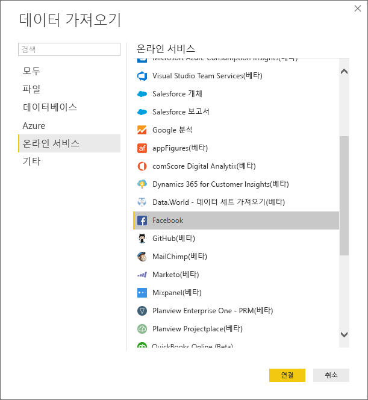
   
   타사 서비스의 사용에 따른 위험을 경고하는 대화 상자가 나타납니다.
   
   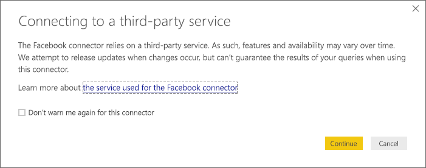
   
3. **계속**을 선택합니다. 
   
4. **Facebook** 대화 상자에서 페이지 이름 **microsoftbi**를 **사용자 이름**으로 입력하고, **연결** 드롭다운에서 **게시물**을 선택한 다음, **확인**을 선택합니다.
   
   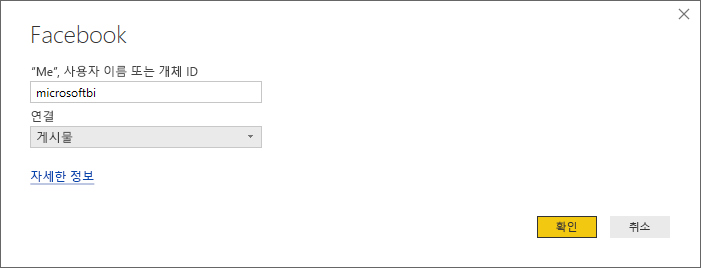
   
5. 자격 증명을 묻는 메시지가 표시되면 Facebook 계정에 로그인하고 해당 계정에 대한 Power BI 액세스를 허용합니다.
   
   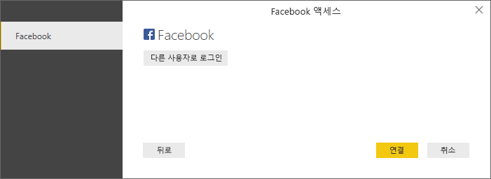

   Power BI Facebook 페이지에 연결한 후 페이지의 게시물 데이터 미리 보기가 표시됩니다. 
   
   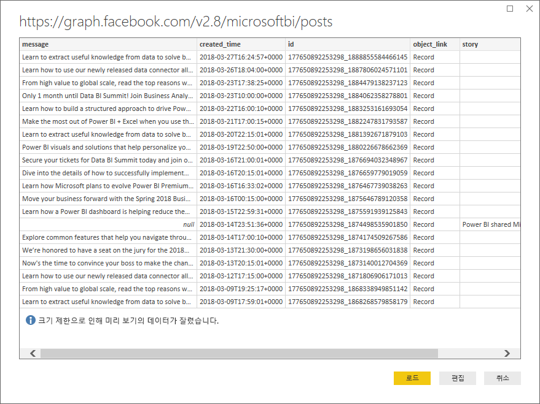
   
## 가져온 데이터 모양 지정 및 변환

시간이 지남에 따라 어떤 게시물에 가장 많은 댓글이 있는지 확인하고 표시하려고 하지만 게시물 데이터 미리 보기에서는 **created_time** 데이터가 읽고 이해하기 어렵고 댓글 데이터가 없다는 것을 알았다고 가정해보겠습니다. 데이터를 최대한 활용하기 위해 데이터를 셰이핑하고 정리합니다. 이 작업을 위해 Power BI Desktop Power Query 편집기를 사용하여 Power BI Desktop으로 가져오기 전이나 가져온 후에 데이터를 편집합니다. 

### 날짜/시간 열 분할

먼저 **created_time** 열의 날짜 및 시간 값을 보다 읽기 쉽게 구분합니다. 

1. Facebook 데이터 미리 보기에서 **편집**을 선택합니다. 
   
   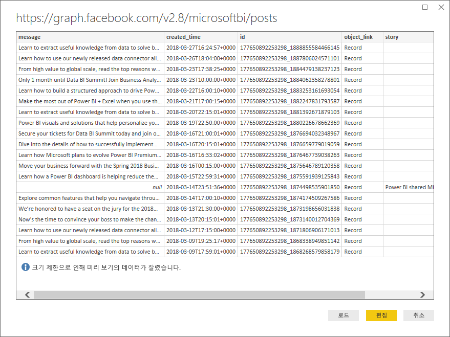
   
   Power BI Desktop Power Query 편집기가 새 창에서 열리고 Power BI Facebook 페이지에 데이터 미리 보기가 표시됩니다. 
   
   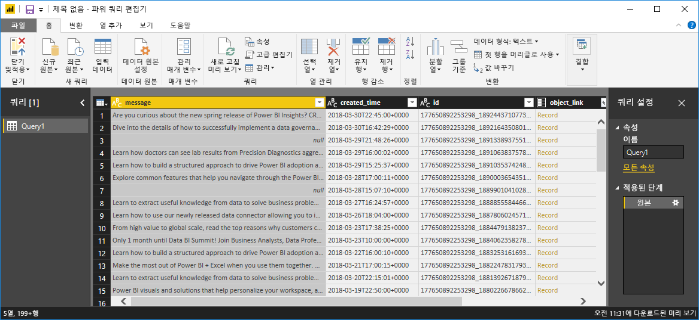
   
2. **created_time** 열을 선택합니다. 열 머리글에 **ABC** 아이콘이 표시된 것으로 **텍스트** 데이터 형식임을 알 수 있습니다. 머리글을 마우스 오른쪽 단추로 클릭하고 드롭다운 목록에서 **열 분할** > **구분 기호 기준**을 선택합니다. 또는 리본의 **홈** 탭에 있는 **변환** 그룹에서 **열 분할** > **구분 기호 기준**을 선택합니다.  
   
   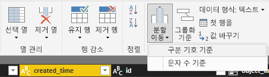
   
3. **구분 기호로 열 분할** 대화 상자의 드롭다운에서 **사용자 지정**을 선택하고, 입력 필드에 **T**(**created_time** 값의 시간 부분을 시작하는 문자)를 입력한 다음, **확인**을 선택합니다. 
   
   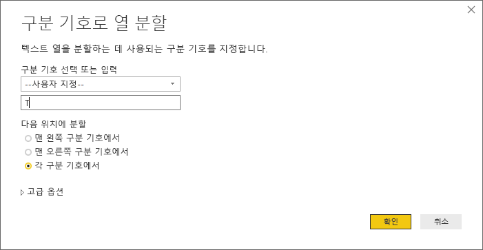
   
   해당 열은 *T* 구분 기호의 앞뒤에 문자열을 포함하는 두 개의 열로 분할됩니다. 새 열의 이름은 각각 **created_time.1** 및 **created_time.2**로 지정됩니다. Power BI에서는 데이터 형식을 자동으로 검색하여 첫 번째 열에 대해 **날짜**로, 두 번째 열에 대해 **시간**으로 변경하고 날짜 및 시간 값의 서식을 보다 읽기 쉽게 지정했습니다.
   
4. 두 열의 이름을 바꿉니다. **created_time.1** 열을 선택한 다음, 리본에 있는 **변환** 탭의 **임의 열** 그룹에서 **이름 바꾸기**를 선택합니다. 또는 열 머리글을 두 번 클릭하고 새 열 이름 **created_date**를 입력합니다. **created_time.2** 열에 대해 반복하고 이름을 **created_time**으로 바꿉니다.
   
   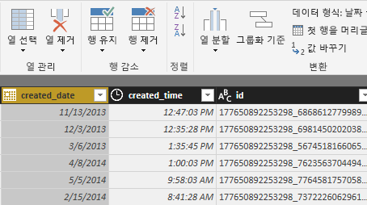
   
### 중첩 열 확장

날짜 및 시간 데이터를 원하는 대로 표시했으므로 중첩 열을 확장하여 댓글 데이터를 표시합니다. 

1. **object_link** 열의 맨 위에 있는  아이콘을 선택하여 **확장/집계** 대화 상자를 엽니다. **connections**를 선택한 후 **확인**을 선택합니다. 
   
   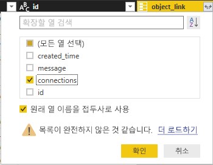
   
   열 제목이 **object_link.connections**로 변경됩니다.
2. **object_link.connections** 열의 맨 위에 있는  아이콘을 선택하고, **comments**를 선택한 후, **확인**을 선택합니다. 열 제목이 **object_link.connections.comments**로 변경됩니다.
   
3. **object_link.connections.comments** 열의 맨 위에 있는  아이콘을 선택하고, 이때 대화 상자에서 **확장** 대신 **집계**를 선택합니다. **# Count of id**를 선택한 후 **확인**을 선택합니다. 
   
   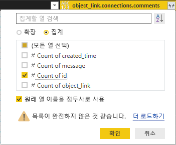
   
   이제 열에 각 메시지에 대한 댓글 수가 표시됩니다. 
   
4. **Count of object_link.connections.comments.id** 열의 이름을 **Number of comments**로 바꿉니다.
   
5. **Number of comments** 열 머리글 옆의 아래쪽 화살표를 선택하고 **내림차순 정렬**을 선택하면 게시물이 가장 많은 댓글부터 가장 적은 댓글 순으로 정렬됩니다. 
   
   
   
### 쿼리 단계 검토

Power Query 편집기에서 데이터를 셰이핑하고 변환할 때 각 단계가 **Power Query 편집기** 창 오른쪽에 있는 **쿼리 설정** 창의 **적용된 단계** 영역에 기록되었습니다. **적용된 단계**를 통해 이전 단계로 돌아가서 정확히 무엇을 변경했는지 확인하고, 필요한 경우 변경 내용을 편집, 삭제 또는 다시 정렬할 수 있습니다. 이전 단계를 변경하면 이후 단계가 중단될 수 있으므로 해당 단계를 수정할 경우 주의하세요. 

지금까지 데이터 변환을 적용한 후 **적용된 단계**는 다음과 같이 표시됩니다.
   
   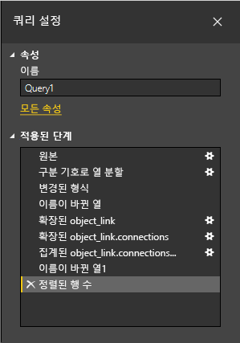
   
   >[!TIP]
   >**적용된 단계**의 기초는 [파워 쿼리 M 수식 언어](/powerquery-m/quick-tour-of-the-power-query-m-formula-language)로 작성된 수식입니다. 수식을 보고 편집하려면 리본 메뉴의 **홈** 탭에 있는 **쿼리** 그룹에서 **고급 편집기**를 선택합니다. 

### 변환된 데이터 가져오기

데이터에 만족하면 리본의 **홈** 탭에서 **닫기 및 적용** > **닫기 및 적용**을 선택하여 Power BI Desktop으로 가져옵니다. 
   
   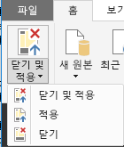
   
   대화 상자에 Power BI Desktop 데이터 모델에 데이터를 로드하는 작업의 진행률이 표시됩니다. 
   
   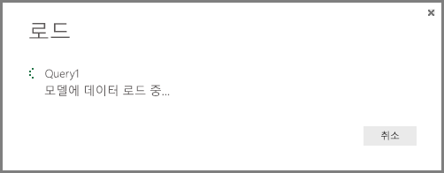
   
   데이터가 로드되면 **보고서** 뷰의 **필드** 창에 새 쿼리로 표시됩니다.
   
   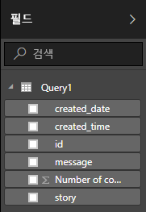
   
## 보고서 시각화에 데이터 사용 

이제 Facebook 페이지에서 데이터를 가져왔으므로 시각화를 사용하여 데이터를 쉽고 빠르게 파악할 수 있습니다. 시각화를 만드는 것은 쉽습니다. **필드** 창에서 필드를 선택하거나 보고서 캔버스로 끌어서 놓으면 됩니다.

### 가로 막대형 차트 만들기

1. Power BI Desktop **보고서** 뷰의 **필드** 창에서 **message**를 선택하거나 보고서 캔버스로 끌어서 놓습니다. 모든 게시 메시지를 보여주는 테이블이 캔버스에 나타납니다. 
   
   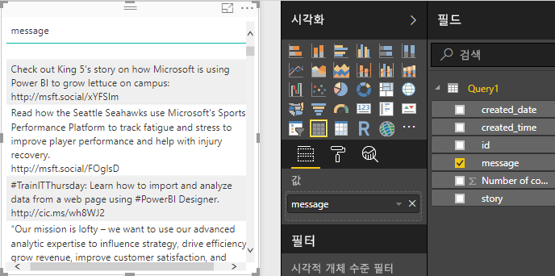
   
2. 해당 테이블을 선택한 채 **필드** 창에서 **Number of comments**를 선택하거나 테이블로 끌어서 놓습니다. 
   
3. **시각화** 창에서 **누적 가로 막대형 차트** 아이콘을 선택합니다. 테이블은 게시물당 댓글 수를 보여주는 가로 막대형 차트로 변경됩니다. 
   
   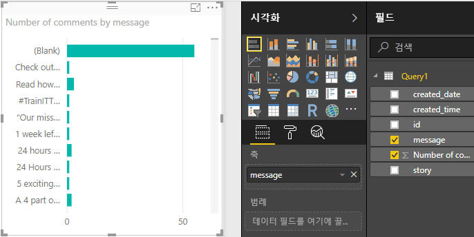
   
4. 시각화 옆에 있는 **추가 옵션**(...)을 선택한 다음, **정렬 기준** > **Number of comments**를 선택하여 댓글 수의 내림차순으로 테이블을 정렬합니다. 

   가장 많은 댓글이 **(공백)** 메시지와 연결되어 있었습니다(해당 게시물은 스토리, 링크, 비디오 또는 기타 텍스트가 아닌 콘텐츠였을 수 있음). 
   
5. 공백 행을 필터링하려면 **필터** 창에서 **메시지(모두)** 를 선택하고, **모두 선택**을 선택한 다음, **(공백)** 을 선택하여 선택 취소합니다. 

   **필터** 창 항목이 **메시지가 (공백)이 아님**으로 변경되고 **(공백)** 행이 차트 시각화에 표시되지 않습니다.
   
   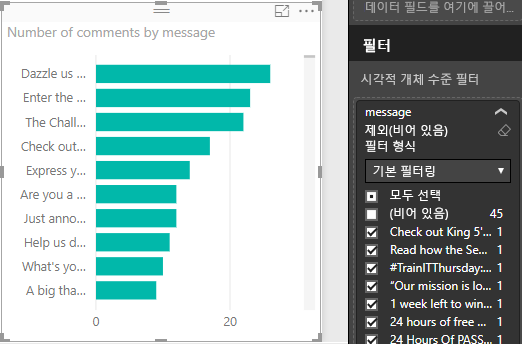
   
### 차트 서식 지정

시각화는 더 흥미로워지지만 차트에서 게시 텍스트를 많이 볼 수 없습니다. 게시 텍스트를 더 많이 표시하려면:

1. 차트 시각화의 핸들을 사용하여 차트 크기를 최대한 크게 조정합니다. 
   
2. 차트를 선택한 채 **시각화** 창에서 **서식** 아이콘(페인트 롤러)을 선택합니다.
   
3. **Y축** 옆의 아래쪽 화살표를 선택하고 **최대 크기** 슬라이더를 완전히 오른쪽(**50%** )으로 끕니다. 
4. 또한 더 많은 텍스트가 표시되도록 **텍스트 크기**를 **10pt**로 줄입니다.
   
   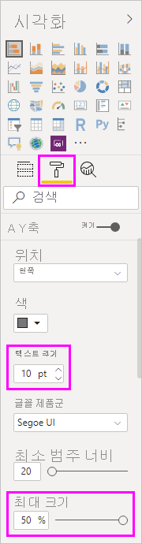
   
   이제 차트에 더 많은 게시 콘텐츠가 표시됩니다. 
   
   
   
차트의 X축(댓글 수)이 정확한 값을 표시하지 않고 차트의 맨 아래에 사라진 것으로 보입니다. 대신 데이터 레이블을 사용해 보겠습니다. 

1. **서식** 아이콘을 선택하고 **X축** 슬라이더를 **끄기**로 설정합니다. 
   
2. **데이터 레이블** 슬라이더를 **켜기**로 선택합니다. 

   이제 차트에 각 게시물에 대한 정확한 댓글 수가 표시됩니다.
   
   
   
### 데이터 형식 편집

더 나아지기는 했지만 데이터 레이블에는 모두 **.0** 소수 자릿수가 포함되는데, **Number of posts**는 정수여야 하기 때문에 이 소수 자릿수가 혼란을 주고 잘못 이해할 수 있습니다. 수정하려면 **Number of posts** 열의 데이터 형식을 **정수**로 변경해야 합니다.

1. **필드** 창에서 **Query1**을 마우스 오른쪽 단추로 클릭하거나, 해당 항목을 가리키고 **추가 옵션**(...)을 선택합니다. 

2. 상황에 맞는 메뉴에서 **쿼리 편집**을 선택합니다. 또는 리본에 있는 **홈** 탭의 **외부 데이터** 그룹에서 **쿼리 편집** > **쿼리 편집**을 선택합니다. 
   
3. **Power Query 편집기** 창에서 **Number of comments** 열을 선택하고 다음 단계 중 하나를 수행하여 데이터 형식을 변경합니다. 
   - **Number of comments** 열 머리글 옆에 있는 **1.2** 아이콘을 선택한 다음, 드롭다운 목록에서 **정수**를 선택합니다.
   - 열 머리글을 마우스 오른쪽 단추로 클릭한 다음, **형식 변경** > **정수**를 선택합니다.
   - **데이터 형식: 10진수**를 **홈** 탭의 **변환** 그룹에서 선택하거나 **변환** 탭의 **임의 열** 그룹에서 선택한 다음, **정수**를 선택합니다.
   
   열 머리글의 아이콘이 **정수** 데이터 형식을 나타내는 **123**으로 변경됩니다.
   
   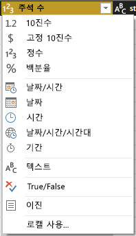
   
3. 변경 내용을 적용하려면 **파일** > **닫기 및 적용**을 선택하거나, **파일** > **적용**을 선택하여 **Power Query 편집기** 창을 열어 둡니다. 

   변경 내용이 로드되면 차트의 데이터 레이블이 정수가 됩니다.
   
   
   
### 날짜 슬라이서 만들기

시간이 지남에 따른 게시물의 댓글 수를 시각화하려고 한다고 가정해보겠습니다. 슬라이서 시각화를 만들어 차트 데이터를 여러 시간 프레임으로 필터링할 수 있습니다. 

1. 캔버스의 빈 영역을 선택한 다음, **시각화** 창에서 **슬라이서** 아이콘을 선택합니다. 

   빈 슬라이서 시각화가 나타납니다.
   
   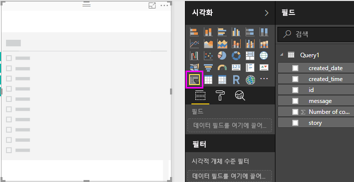
   
2. **필드** 창에서 **created_date** 필드를 선택하거나 새 슬라이서로 끌어서 놓습니다. 

   슬라이서는 필드의 **날짜** 데이터 형식을 기준으로 날짜 범위 슬라이더로 변경됩니다.
   
   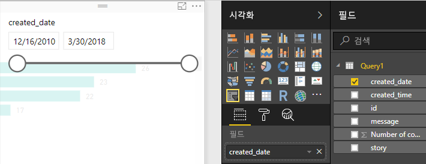
   
3. 슬라이더 핸들을 움직여 다른 날짜 범위를 선택하고 차트 데이터 필터에 이에 따라 어떻게 필터링되는지 확인합니다. 슬라이서에서 날짜 필드를 선택하고 특정 날짜를 입력하거나 달력 팝업에서 선택할 수도 있습니다.
    
   
   
### 시각화 서식 지정

차트에 더 자세하고 매력적인 제목을 제공합니다. 

1. 차트를 선택한 채 **시각화** 창에서 **서식** 아이콘을 선택한 다음, **제목** 옆에 있는 드롭다운 화살표를 선택하여 확장합니다.

2. **제목 텍스트**를 **Comments per post**로 변경합니다. 

3. **글꼴색** 옆의 드롭다운 화살표를 선택하고 녹색을 선택하여 시각화의 녹색 막대와 일치시킵니다.

4. **텍스트 크기**를 **10pt**로 늘리고 **글꼴 패밀리**를 **Segoe (Bold)** 로 변경합니다.

5. 다른 서식 옵션 및 설정을 사용하여 시각화 모양을 변경해 봅니다. 

   

## 추가 시각화 만들기

살펴봤듯이 보고서에서 시각화를 쉽게 사용자 지정하여 원하는 방식으로 데이터를 표시할 수 있습니다. 예를 들어 가져온 Facebook 데이터를 사용하여 시간이 지남에 따른 댓글 수를 보여 주는 꺾은선형 차트를 만들어 봅니다.

Power BI Desktop은 다양한 데이터 원본에서 데이터를 가져오고 이 데이터를 풍부한 대화형 방식으로 시각화하기 위해 분석 요구 사항에 맞게 모양을 지정하는 원활한 엔드투엔드 환경을 제공합니다. 보고서가 준비되면 [Power BI 서비스로 업로드](../create-reports/desktop-upload-desktop-files.md)하고, 보고서에 따라 대시보드를 만든 후, 다른 Power BI 사용자와 공유할 수 있습니다.

## 다음 단계
* [Power BI를 위한 Microsoft Learn](/learn/powerplatform/power-bi?WT.mc_id=powerbi_landingpage-docs-link)
* [Power BI 포럼 방문](https://go.microsoft.com/fwlink/?LinkID=519326)
* [Power BI 블로그 참고](https://go.microsoft.com/fwlink/?LinkID=519327)