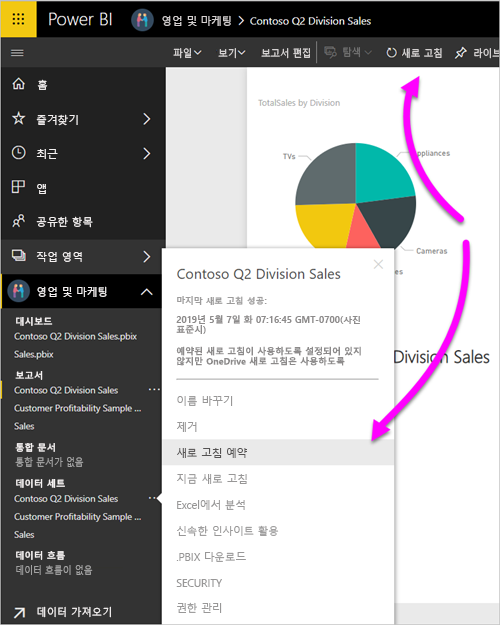
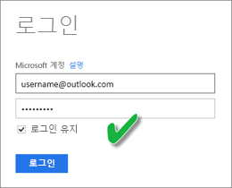

# OneDrive 또는 SharePoint Online에 저장된 데이터 세트 새로 고침
OneDrive 또는 SharePoint Online에서 Power BI 서비스로 파일을 가져오면 Power BI Desktop의 작업이 Power BI 서비스와 동기화를 유지할 수 있습니다.

## OneDrive 또는 SharePoint Online에 있는 Power BI Desktop 파일을 저장하는 이점
OneDrive 또는 SharePoint Online에서 Power BI Desktop 파일을 저장하는 경우 파일의 모델에 로드한 데이터를 데이터 세트에 가져옵니다. 파일에서 만든 보고서는 Power BI 서비스의 **보고서** 에 로드됩니다. OneDrive 또는 SharePoint Online에서 파일을 변경해 보겠습니다. 이 변경 내용에는 새 측정값 추가, 열 이름 변경 또는 시각화 편집이 포함될 수 있습니다. 파일을 저장하면 Power BI 서비스는 일반적으로 약 1시간 이내에 이 변경 내용과도 동기화됩니다.

**홈** 리본에서 **새로 고침** 을 선택하여 Power BI Desktop에서 바로 일회성인 수동 새로 고침을 수행할 수 있습니다. **새로 고침** 을 선택하는 경우 원래 데이터 원본에서 업데이트된 데이터로 파일의 모델을 새로 고칩니다. 이러한 종류의 새로 고침은 완전히 Power BI Desktop 애플리케이션 자체에서 수행됩니다. Power BI의 수동 또는 예약된 새로 고침과 다르기 때문에 차이를 이해하는 것이 중요합니다.

OneDrive 또는 SharePoint Online에서 Power BI Desktop 파일을 가져올 때 데이터 및 모델 정보를 Power BI의 데이터 세트에 로드합니다. 보고서의 기반이 되는 내용이므로 Power BI 서비스의 데이터 세트를 새로 고치려고 합니다. 데이터 원본이 외부이기 때문에 **지금 새로 고침** 을 사용하여 데이터 세트를 수동으로 새로 고치거나 **새로 고침 예약** 을 사용하여 새로 고침 일정을 설정할 수 있습니다. 

데이터 세트를 새로 고칠 때 Power BI는 업데이트된 데이터를 쿼리하기 위해 OneDrive 또는 SharePoint Online의 파일에 연결하지 않습니다. 데이터 세트의 정보를 사용하여 데이터 원본에 직접 연결하고 업데이트된 데이터를 쿼리합니다. 그런 다음, 해당 데이터를 데이터 세트에 로드합니다. 새로 고친 데이터 세트의 데이터는 OneDrive 또는 SharePoint Online에 있는 파일에 다시 동기화되지 않습니다.

## 무엇이 지원되나요?
Power BI는 다음 데이터 원본에 연결하고 해당 데이터 원본에서 데이터를 로드하는 데 **데이터 가져오기** 또는 **쿼리 편집기** 를 사용하는 로컬 드라이브에서 가져온 Power BI Desktop 파일에서 생성된 데이터 세트에 대한 **새로 고침** 및 **새로 고침 예약** 을 지원합니다.

> [!NOTE]
> 라이브 연결 데이터 세트를 위한 OneDrive 새로 고침이 지원됩니다. 그러나 이미 게시된 보고서의 한 데이터 세트에서 다른 데이터 세트로 라이브 연결 데이터 세트를 변경하는 것은 OneDrive 새로 고침 시나리오에서 지원되지 않습니다.

### Power BI 게이트웨이 - 개인
* Power BI Desktop의 **데이터 가져오기** 및 **쿼리 편집기** 에 표시된 모든 온라인 데이터 원본.
* Hadoop 파일(HDFS) 및 Microsoft Exchange를 제외하고 Power BI Desktop의 **데이터 가져오기** 및 **쿼리 편집기** 에 표시되는 모든 온-프레미스 데이터 원본.

<!-- Refresh Data sources-->
[!INCLUDE [refresh-datasources](../includes/refresh-datasources.md)]

> [!NOTE]
> 게이트웨이는 Power BI가 온-프레미스 데이터 원본에 연결하고 데이터 세트를 새로 고치기 위해 설치되고 실행됩니다.
> 
> 

## OneDrive 또는 비즈니스용 OneDrive. 차이점은 무엇인가요?
개인 OneDrive와 비즈니스용 OneDrive가 모두 있으면 비즈니스용 OneDrive의 Power BI에 가져오려는 파일을 유지해야 합니다. 그 이유는 다음과 같습니다. 로그인하려면 두 개의 계정을 사용할 가능성이 있습니다.

Power BI에서 비즈니스용 OneDrive에 연결하는 경우 일반적으로 Power BI 계정이 비즈니스용 OneDrive 계정과 동일한 계정이기 때문에 연결이 쉽습니다. 개인 OneDrive를 사용하는 경우에는 일반적으로 다른 [Microsoft 계정](https://account.microsoft.com)으로 로그인합니다.

Microsoft 계정으로 로그인하는 경우 **로그인 유지** 를 선택해야 합니다. 그런 다음, Power BI는 Power BI Desktop의 파일에 있는 모든 업데이트를 Power BI의 데이터 세트와 동기화할 수 있습니다.

Microsoft 자격 증명을 변경한 경우 OneDrive의 파일과 Power BI의 데이터 세트 간에 변경 내용을 동기화할 수 없습니다. 다시 OneDrive에 연결하고 OneDrive에서 파일을 가져와야 합니다.

## 새로 고침을 예약하려면 어떻게 해야 하나요?
새로 고침 일정을 설정하면 Power BI는 데이터 원본에 직접 연결합니다. Power BI는 데이터 세트의 연결 정보 및 자격 증명을 사용하여 업데이트된 데이터를 쿼리합니다. 그런 다음, Power BI는 업데이트된 데이터를 데이터 세트에 로드합니다. 그런 다음, Power BI 서비스의 해당 데이터 세트를 기반으로 한 모든 보고서 시각화 및 대시보드를 업데이트합니다.

예약된 새로 고침을 설정하는 방법에 대한 자세한 내용은 [예약된 새로 고침 구성](refresh-scheduled-refresh.md)을 참조하세요.

## 오류가 발생할 때
무언가 잘못된 경우, 이는 일반적으로 Power BI가 데이터 원본에 로그인할 수 없기 때문입니다. 데이터 세트가 온-프레미스 데이터 원본에 연결하려고 하지만 게이트웨이가 오프라인 상태인 경우에도 문제가 발생할 수 있습니다. 이 문제를 방지하려면 Power BI가 데이터 원본에 로그인할 수 있는지 확인합니다. **데이터 원본 자격 증명** 에서 데이터 원본에 로그인해 봅니다. 경우에 따라 데이터 원본에 로그인하는 데 사용하는 암호가 변경되거나 Power BI가 데이터 원본에서 로그아웃됩니다.

OneDrive에서 Power BI Desktop 파일의 변경 내용을 저장하고 약 1시간 이내에 해당 변경 내용이 Power BI에 표시되지 않는 경우에는 Power BI가 OneDrive에 연결할 수 없기 때문일 수 있습니다. OneDrive에서 파일에 다시 연결해봅니다. 로그인할지 묻는 메시지가 표시되면 **로그인 유지** 를 선택해야 합니다. Power BI는 OneDrive에 연결하여 파일과 동기화할 수 없기 때문에 파일을 다시 가져와야 합니다.

**새로 고침 실패 알림 전자 메일을 내게 보내기** 를 체크된 상태로 남겨두어야 합니다. 예약된 새로 고침이 실패하는 경우 바로 알아야 합니다.

## 문제 해결
경우에 따라 데이터 새로 고침이 예상대로 진행되지 않을 수 있습니다. 일반적으로 게이트웨이와 연결될 때 데이터 새로 고침 문제가 발생합니다. 게이트웨이 문제 해결 문서에서 도구 및 알려진 문제를 살펴 보세요.

[온-프레미스 데이터 게이트웨이 문제 해결](service-gateway-onprem-tshoot.md)

[Power BI 게이트웨이 - 개인 문제 해결](service-admin-troubleshooting-power-bi-personal-gateway.md)

궁금한 점이 더 있나요? [Power BI 커뮤니티](https://community.powerbi.com/)에 질문합니다.
