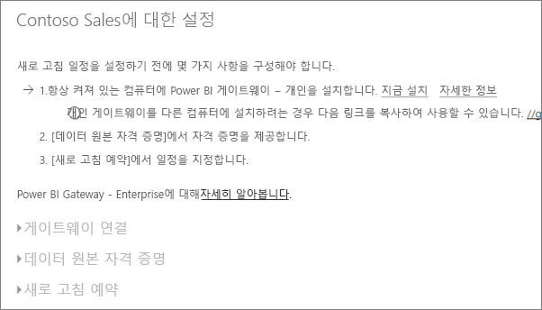
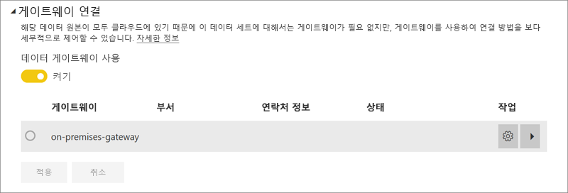

# 예약된 새로 고침 구성

>[!NOTE]
>두 달 동안 비활성 상태이면 데이터 세트에 대해 예약된 새로 고침이 일시 중지됩니다. 자세한 내용은 이 문서의 뒷부분에 있는 [*예약된 새로 고침*](#scheduled-refresh)을 참조하세요.

이 문서에서는 [온-프레미스 데이터 게이트웨이(개인 모드)](service-gateway-personal-mode.md) 및 [온-프레미스 데이터 게이트웨이](service-gateway-onprem.md)에 대해 예약된 새로 고침에 사용할 수 있는 옵션을 설명합니다. Power BI 서비스의 다음 영역에서 새로 고침 옵션을 지정합니다. **게이트웨이 연결**, **데이터 원본 자격 증명**, **예약된 새로 고침**입니다. 차례로 살펴보겠습니다. 새로 고침 일정의 제한 사항을 포함하여 데이터 새로 고침에 대한 자세한 내용은 [데이터 새로 고침](refresh-data.md#data-refresh)을 참조하세요.

**예약된 새로 고침** 화면으로 이동하려면 다음을 수행합니다.

1. 탐색 창의 **데이터 세트** 아래에서, 표시된 데이터 세트 옆에 있는 **추가 옵션**(...)을 선택합니다.
2. **새로 고침 예약**을 선택합니다.

    

## 게이트웨이 연결

개인 또는 엔터프라이즈인지, 게이트웨이가 온라인 상태이고 사용할 수 있는지 여부에 따라 다른 옵션이 여기에 표시됩니다.

사용할 수 있는 게이트웨이가 없는 경우 **게이트웨이 연결**이 비활성화됩니다. 또한 개인 게이트웨이를 설치하는 방법을 나타내는 메시지가 표시됩니다.

개인 게이트웨이를 구성했고 온라인 상태인 경우 선택할 수 있습니다. 사용할 수 없는 경우 오프라인으로 표시됩니다.

또한 엔터프라이즈 게이트웨이를 사용할 수 있는 경우 선택할 수 있습니다. 계정이 지정된 게이트웨이에 대해 구성된 데이터 원본의 **사용자** 탭에 표시된 경우 사용할 수 있는 엔터프라이즈 게이트웨이가 표시됩니다.

## 데이터 원본 자격 증명

### Power BI 게이트웨이 - 개인

개인 게이트웨이를 사용하여 데이터를 새로 고치는 경우 백 엔드 데이터 원본에 연결할 자격 증명을 제공해야 합니다. 온라인 서비스에서 콘텐츠 팩에 연결되어 있는 경우 예약된 새로 고침을 위해 연결하도록 입력한 자격 증명을 사용합니다.

데이터 원본에서 새로 고침을 처음 사용하는 경우 해당 데이터 세트에 로그인해야 합니다. 한 번 입력하면, 해당 자격 증명은 데이터 세트와 함께 유지됩니다.

> [!NOTE]
> 일부 인증 방법의 경우, 데이터 원본에 로그인하는 데 사용한 암호가 만료되거나 변경되면 **데이터 원본 자격 증명**의 데이터 원본에 대해서도 변경해야 합니다.

무언가 잘못된 경우, 문제는 대개 Windows에 로그인하여 서비스를 시작하지 못했기 때문에 게이트웨이가 오프라인 상태이거나, 업데이트된 데이터를 쿼리하기 위해 Power BI가 데이터 원본에 로그인할 수 없는 경우와 관련이 있습니다. 새로 고칠 수 없는 경우, 데이터 세트 설정을 확인합니다. 게이트웨이 서비스가 오프라인 상태인 경우, **상태**는 오류로 나타납니다. Power BI가 데이터 원본에 로그인할 수 없는 경우, 데이터 원본 자격 증명에 오류가 표시됩니다.

### 온-프레미스 데이터 게이트웨이

온-프레미스 데이터 게이트웨이를 사용하여 데이터를 새로 고치는 경우 게이트웨이 관리자가 데이터 원본에 정의한 대로 자격 증명을 제공할 필요가 없습니다.

> [!NOTE]
> 데이터 새로 고침을 위해 온-프레미스 SharePoint에 연결할 때 Power BI는 *익명*, *기본* 및 *Windows(NTLM/Kerberos)* 인증 메커니즘만 지원합니다. Power BI는 온-프레미스 SharePoint 데이터 원본의 데이터 새로 고침에 *ADFS* 또는 임의의 양식 기반 인증을 지원하지 않습니다. 

## 예약된 새로 고침

**예약된 새로 고침** 섹션에서 데이터 세트를 새로 고치는 빈도 및 시간 슬롯을 정의합니다. 일부 데이터 원본에서는 새로 고침을 위해 게이트웨이를 구성할 필요가 없습니다. 다른 데이터 원본에는 게이트웨이가 필요합니다.

설정을 구성하기 위해 **데이터를 최신 상태로 유지** 슬라이더를 **설정**으로 변경합니다.

> [!NOTE]
> 목표는 예약된 시간 슬롯에서 15분 이내에 새로 고침을 시작하는 것이지만, 서비스에서 필요한 리소스를 더 빨리 할당할 수 없는 경우 최대 1시간까지 지연될 수 있습니다.

> [!NOTE]
> 두 달 동안 비활성 상태이면 데이터 세트에 대해 예약된 새로 고침이 일시 중지됩니다. 데이터 세트를 기반으로 하는 대시보드 또는 보고서를 방문한 사용자가 없는 경우 데이터 세트는 비활성 상태로 간주됩니다. 이때 예약된 새로 고침이 일시 중지되었음을 나타내는 메일이 데이터 세트 소유자에게 전송됩니다. 그런 다음 데이터 세트의 새로 고침 일정이 **사용 안 함**으로 표시됩니다. 예약된 새로 고침을 다시 시작하려면 데이터 세트를 기반으로 하는 대시보드 또는 보고서를 다시 방문하면 됩니다.

## 지원되는 내용은 무엇입니까?

> [!NOTE]
> 또한 예약된 새로 고침은 4개의 연속된 오류 후 자동으로 비활성화됩니다.

특정 데이터 세트는 예약된 새로 고침을 위해 다른 게이트웨이에 대해 지원됩니다. 다음은 제공되는 지원에 대한 참조입니다.

### Power BI 게이트웨이 - 개인

**Power BI Desktop**

* Power BI Desktop의 **데이터 가져오기** 및 쿼리 편집기에 표시된 모든 온라인 데이터 원본.
* Hadoop 파일(HDFS) 및 Microsoft Exchange를 제외하고 Power BI Desktop의 **데이터 가져오기** 및 쿼리 편집기에 표시되는 모든 온-프레미스 데이터 원본.

**Excel**

* 파워 쿼리에 표시된 모든 온라인 데이터 원본.
* Hadoop 파일(HDFS) 및 Microsoft Exchange를 제외하고 파워 쿼리에 표시되는 모든 온-프레미스 데이터 원본.
* 파워 피벗에 표시된 모든 온라인 데이터 원본.
* Hadoop 파일(HDFS) 및 Microsoft Exchange를 제외하고 파워 피벗에 표시되는 모든 온-프레미스 데이터 원본.

> [!NOTE]
> Excel 2016 이상에서 파워 쿼리는 **데이터 가져오기 및 변환** 아래 리본 메뉴의 **데이터** 섹션에 나열되어 있습니다.

### Power BI 게이트웨이

지원되는 데이터 원본에 대한 자세한 내용은 [Power BI 데이터 원본](power-bi-data-sources.md)을 참조하세요.

## 문제 해결
경우에 따라 데이터 새로 고침이 예상대로 진행되지 않을 수 있습니다. 일반적으로 이것은 게이트웨이와 관련된 문제입니다. 게이트웨이 문제 해결 문서에서 도구 및 알려진 문제를 살펴 보세요.

- [온-프레미스 데이터 게이트웨이 문제 해결](service-gateway-onprem-tshoot.md)
- [Power BI 게이트웨이 - 개인 문제 해결](service-admin-troubleshooting-power-bi-personal-gateway.md)

## 다음 단계

- [Power BI에서 데이터 새로 고침](refresh-data.md)  
- [Power BI 게이트웨이 - 개인](service-gateway-personal-mode.md)  
- [온-프레미스 데이터 게이트웨이(개인 모드)](service-gateway-onprem.md)  
- [온-프레미스 데이터 게이트웨이 문제 해결](service-gateway-onprem-tshoot.md)  
- [Power BI 게이트웨이 - 개인 문제 해결](service-admin-troubleshooting-power-bi-personal-gateway.md)  

궁금한 점이 더 있나요? [Power BI 커뮤니티에 질문합니다.](https://community.powerbi.com/)