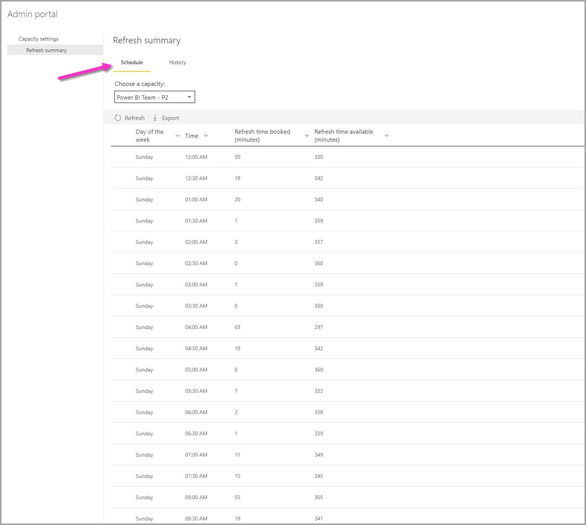

# Power BI의 새로 고침 요약

Power BI 관리 포털에 있는 Power BI **새로 고침 요약** 페이지에서는 새로 고침 일정, 용량 및 겹칠 수 있는 새로 고침 일정을 제어하고 파악할 수 있습니다. 새로 고침 요약 페이지를 사용하여 새로 고침 일정을 조정할지 여부를 결정하고, 새로 고침 문제와 연관된 오류 코드를 알아보고, 데이터 새로 고침 일정을 적절히 관리할 수 있습니다. 

새로 고침 요약 페이지에는 두 가지 보기가 있습니다.

* **기록** - 사용자가 관리자인 Power BI Premium 용량의 새로 고침 요약 기록을 표시합니다.

* **일정**- 예약된 새로 고침의 일정 보기를 표시하며, 초과 구독된 시간 슬롯 관련 문제를 발견할 수도 있습니다.

새로 고침 이벤트에 대한 정보를 .CSV 파일로 내보내 예정된 새로 고침 이벤트의 성능이나 완료에 영향을 줄 수 있는 새로 고침 이벤트 또는 오류에 관한 중요한 정보와 인사이트를 제공할 수도 있습니다.

다음 섹션에서는 이러한 각 보기를 차례로 살펴봅니다. 

## 새로 고침 기록

새로 고침 요약 페이지에서 **기록** 을 클릭하여 **기록** 보기를 선택할 수 있습니다.

기록에서는 사용자에게 관리 권한이 있는 용량에서 최근에 예약된 새로 고침의 결과를 개략적으로 설명합니다. 원하는 열을 클릭하여 열을 기준으로 보기를 정렬할 수 있습니다. 보기를 선택한 열을 기준으로 오름차순 또는 내림차순으로 정렬하거나 텍스트 필터를 사용하여 정렬할 수 있습니다.

기록 보기에서 지정된 새로 고침과 관련된 데이터는 예약된 각 새로 고침의 최근 60개 레코드를 기반으로 합니다.

또한 예약된 새로 고침에 대한 정보를 각 새로 고침 이벤트의 오류 메시지를 비롯한 세부 정보를 포함하여 .CSV 파일로 내보낼 수도 있습니다. .CSV 파일로 내보내면 원하는 열을 기준으로 파일을 정렬하거나, 단어를 검색하거나, 오류 코드 또는 소유자를 기준으로 정렬하는 등을 할 수 있습니다. 다음 이미지는 내보낸 .CSV 파일의 예를 보여 줍니다. 

내보낸 파일의 정보를 사용하여 용량, 기간 및 새로 고침 인스턴스에 대해 기록된 오류 메시지를 검토할 수 있습니다. 

## 새로 고침 일정

새로 고침 요약에서 **일정** 을 클릭하여 **일정** 보기를 선택할 수 있습니다. 일정 보기에서는 주의 일정 정보를 30분 시간 슬롯으로 분할해서 표시합니다. 

일정 보기는 모든 새로 고침이 겹치지 않고 완료될 수 있도록 예약된 새로 고침 이벤트가 올바른 간격으로 설정되었는지 여부나 너무 오래 걸리고 리소스 경합을 일으키는 새로 고침 이벤트를 예약했는지 여부를 확인하는 데 유용합니다. 이러한 리소스 경합이 있는 경우 예약된 새로 고침이 완료될 수 있도록 새로 고침 일정을 조정하여 충돌이나 겹침을 방지해야 합니다. 

*새로 고침 예약 시간(분)* 열은 연관된 각 데이터 세트의 최대 60개 레코드의 평균을 계산한 값입니다. 각 30분 시간 슬롯의 숫자 값은 시간 슬롯에서 시작하도록 예약된 모든 새로 고침 **및** *이전* 시간 슬롯에서 시작하도록 설정되었지만 평균 기간이 선택된 시간 슬롯으로 오버플로되는 모든 예약된 새로 고침에 대해 계산된 시간(분)의 합계입니다.

사용 가능한 새로 고침 시간(분) 열은 각 시간 슬롯에서 새로 고칠 수 있는 시간(분)을 계산하여 해당 시간 슬롯에 대해 이미 예약된 새로 고침을 뺀 값입니다. 예를 들어 P2 구독에서 12개의 동시 실행 새로 고침을 제공하는 경우 12개의 30분 슬롯을 사용할 수 있으므로 12개 새로 고침에 30분을 곱하면 해당 시간 슬롯에서 총 360분을 새로 고침에 사용할 수 있습니다. 슬롯에 20분이 소요되는 새로 고침 1건이 예약되어 있는 경우 해당 슬롯에서 사용 가능한 새로 고침 시간(분)은 340분입니다(총 사용 가능한 시간 360분 - 이미 예약된 20분 = 남은 시간 340분). 

시간 슬롯을 선택하고 관련 **세부 정보** 단추를 선택하여 예약된 새로 고침 시간에 영향을 주는 예약된 새로 고침 이벤트, 소유자 및 완료에 걸리는 시간을 확인할 수 있습니다.

작동 방식을 알아보기 위해 예를 살펴보겠습니다. 일요일 오후 8시 30분 시간 슬롯을 선택하고 **세부 정보** 를 클릭하면 다음과 같은 대화 상자가 표시됩니다.

이 시간 슬롯에서는 3개의 예약된 새로 고침 이벤트가 발생합니다. 

예약된 새로 고침 #1 및 #3은 모두 이 오후 8시 30분 시간 슬롯에 예약되었습니다. **예약된 시간 슬롯** 열의 값을 보면 확인할 수 있습니다. 해당 이벤트의 평균 기간은 4분 39초와 6초(0:06)입니다. 모두 정상입니다.

하지만 예약된 새로 고침 #2는 오후 8:00 슬롯에 예약되었지만 완료하는 데 평균 48분 이상 걸리므로(**평균 기간** 열에 표시) 해당 새로 고침 이벤트는 다음 30분 시간 슬롯으로 오버플로됩니다. 

이건 좋지 않습니다. 이 경우 관리자는 예약된 새로 고침 인스턴스의 소유자에게 연락하여 예약된 새로 고침을 위한 다른 시간 슬롯을 찾거나 겹치지 않도록 다른 새로 고침을 다시 예약하거나 겹침을 방지하는 다른 방법을 찾아 보라고 제안해야 합니다. 

## 다음 단계

- [Power BI에서 데이터 새로 고침](refresh-data.md)  
- [Power BI 게이트웨이 - 개인](service-gateway-personal-mode.md)  
- [온-프레미스 데이터 게이트웨이(개인 모드)](service-gateway-onprem.md)  
- [온-프레미스 데이터 게이트웨이 문제 해결](service-gateway-onprem-tshoot.md)  
- [Power BI 게이트웨이 - 개인 문제 해결](service-admin-troubleshooting-power-bi-personal-gateway.md)  

궁금한 점이 더 있나요? [Power BI 커뮤니티에 질문합니다.](https://community.powerbi.com/)