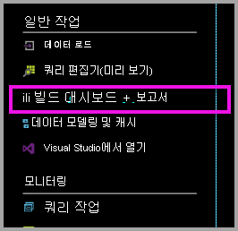
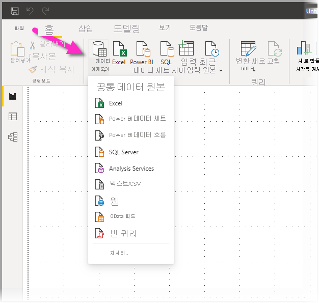
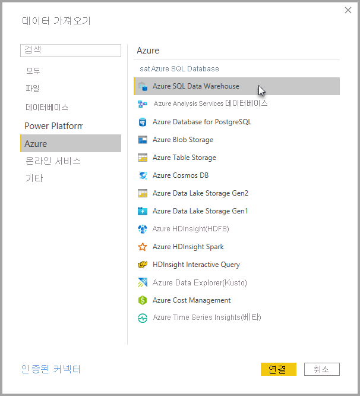
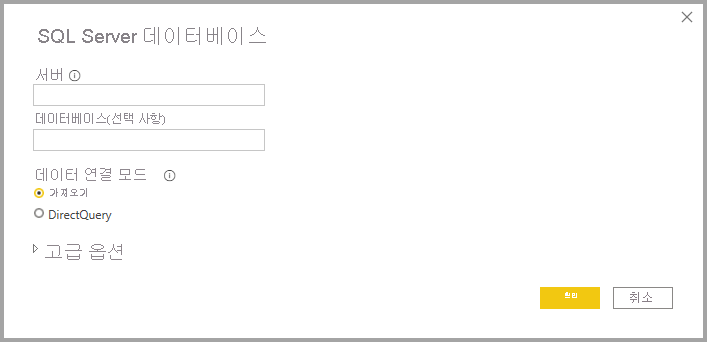
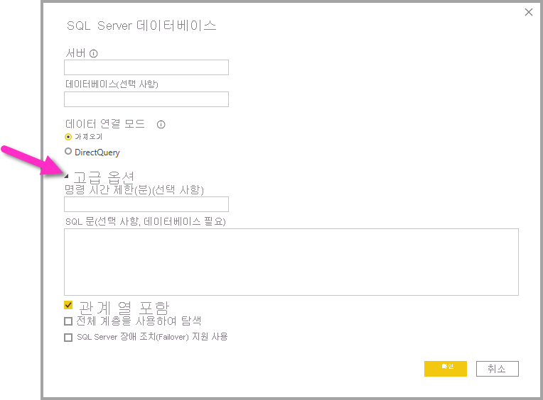
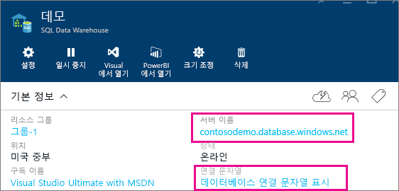

# DirectQuery를 사용한 Azure SQL Data Warehouse

DirectQuery을 사용한 Azure SQL Data Warehouse를 통해 Azure SQL Data Warehouse에 이미 있는 데이터와 메트릭을 기반으로 하는 동적 보고서를 만들 수 있습니다. DirectQuery을 사용할 경우 데이터를 탐색할 때 쿼리가 Azure SQL Data Warehouse로 다시 전송됩니다. 실시간 쿼리가 SQL Data Warehouse의 규모와 결합하여 테라바이트의 데이터를 상대로 몇 분 안에 동적 보고서를 만들 수 있습니다. 또한 **대시보드 + 보고서 작성** 링크를 사용하면 사용자가 SQL Data Warehouse를 사용하여 Power BI 보고서를 만들 수 있습니다.

SQL Data Warehouse 커넥터를 사용할 때

* 연결 시 정규화된 서버 이름을 지정합니다.(자세한 내용은 아래 참조)
* 서버에 대한 방화벽 규칙이 "Azure 서비스에 대한 액세스 허용"으로 구성되었는지 확인합니다.
* 열 선택 또는 필터 추가와 같은 모든 작업은 직접 데이터 웨어하우스에 쿼리합니다.
* 타일은 약 15분마다 새로 고쳐지도록 설정되며 새로 고침을 예약할 필요가 없습니다.  새로 고침은 연결할 때 고급 설정에서 조정할 수 있습니다.
* DirectQuery 데이터 세트에 대해 질문 및 답변을 사용할 수 없습니다.
* 스키마 변경 내용은 자동으로 선택되지 않습니다.

이러한 제한 사항 및 참고는 환경이 계속 향상됨에 따라 변경될 수 있습니다. 연결 단계는 아래에서 자세히 설명합니다.

## Power BI의 대시보드 및 보고서 작성

> [!Important]
> Azure SQL Data Warehouse에 대한 연결이 향상되었습니다. Azure SQL Data Warehouse 데이터 원본에 연결하는 최상의 환경을 위해 Power BI Desktop을 사용합니다. 모델 및 보고서를 빌드하면 Power BI 서비스에 게시할 수 있습니다. Power BI 서비스에서 Azure SQL Data Warehouse에 대해 이전에 사용 가능했던 직접 커넥터는 이제 사용할 수 없습니다.

SQL Data Warehouse와 Power BI 간을 이동하는 가장 쉬운 방법은 Power BI Desktop에서 보고서를 만드는 것입니다. Azure Portal 내에서 **대시보드 + 보고서 작성** 단추를 사용할 수 있습니다.

1. 시작하려면 Power BI Desktop을 다운로드하여 설치합니다. 다운로드 및 설치에 대한 자세한 내용을 보려면 [Power BI Desktop 다운로드](../fundamentals/desktop-get-the-desktop.md) 문서를 참조하거나, 다음 단계로 직접 이동합니다.

2. **대시보드 + 보고서 작성** 링크를 클릭하여 Power BI Desktop을 다운로드할 수도 있습니다.

    

## Power BI Desktop을 통해 연결

Power BI Desktop의 **데이터 가져오기** 단추를 사용하여 SQL Data Warehouse에 연결할 수 있습니다. 

1. **홈** 메뉴에서 **데이터 가져오기** 단추를 선택합니다.  

    

2. **추가...** 를 선택하여 사용 가능한 모든 데이터 원본을 표시합니다. 표시되는 창의 왼쪽 부분에서 **Azure** 를 선택하고 오른쪽 부분의 사용 가능한 커넥터 목록에서 **Azure SQL Data Warehouse** 를 선택합니다.

    

3. 표시되는 창에 서버를 입력하고 필요에 따라 연결할 데이터베이스의 상태를 지정할 수 있습니다. 다음과 같은 데이터 연결 모드를 선택할 수도 있습니다. 가져오기 또는 DirectQuery. Azure SQL Data Warehouse의 정보에 실시간으로 액세스하려면 DirectQuery를 사용합니다.

    

4. Azure SQL Data Warehouse 연결에 대한 고급 옵션을 보려면 **고급 옵션** 옆에 있는 아래쪽 화살표를 선택하여 연결에 대한 추가 옵션을 표시합니다.

    

다음 섹션에서는 연결에 대한 매개 변수 값을 찾는 방법에 대해 설명합니다. 

## 매개 변수 값 찾기

정규화된 서버 이름과 데이터베이스 이름은 Azure Portal에서 확인할 수 있습니다. 현재 SQL Data Warehouse는 Azure Portal에만 있습니다.

> [!NOTE]
> Power BI 테넌트가 Azure SQL Data Warehouse와 동일한 영역에 있는 경우 송신 요금이 청구되지 않습니다. [이 지침](../admin/service-admin-where-is-my-tenant-located.md)을 사용하여 Power BI 테넌트의 위치를 찾을 수 있습니다.

[!INCLUDE [direct-query-sso](../includes/direct-query-sso.md)]

## 다음 단계

* [Power BI에서 DirectQuery를 사용하는 방법](desktop-directquery-about.md)
* [Power BI란?](../fundamentals/power-bi-overview.md)  
* [Power BI에 대한 데이터 가져오기](service-get-data.md)  
* [Azure SQL Data Warehouse](/azure/sql-data-warehouse/sql-data-warehouse-overview-what-is/)

궁금한 점이 더 있나요? [Power BI 커뮤니티를 이용하세요.](https://community.powerbi.com/)