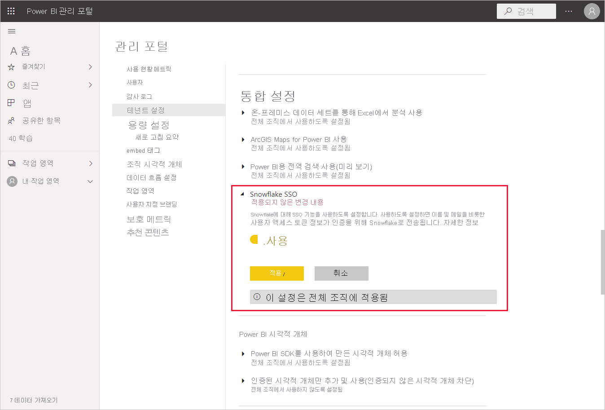
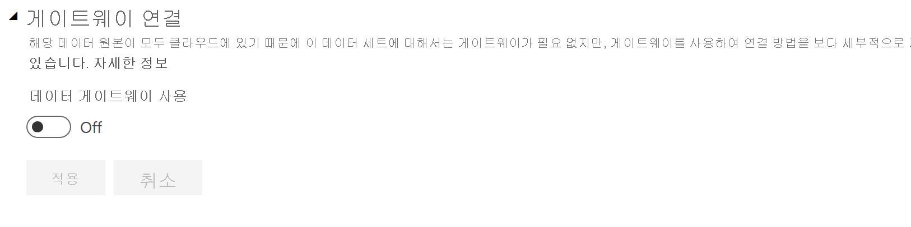
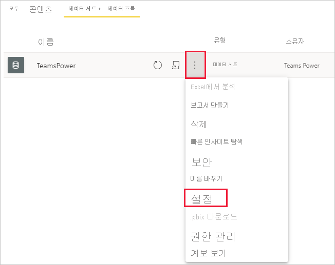
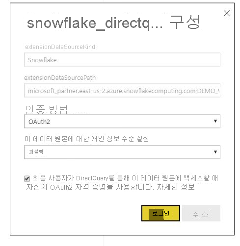

# Power BI 서비스에서 Snowflake에 연결

## 소개

Power BI 서비스에서 Snowflake에 연결하는 것은 다른 커넥터와 한 가지만 다릅니다. Snowflake에는 SSO용 옵션과 함께 AAD(Azure Active Directory)에 대한 추가 기능이 있습니다. 통합의 부분마다 Snowflake, Power BI 및 Azure에서 서로 다른 관리 역할이 필요합니다. SSO를 사용하지 않고 AAD 인증을 사용하도록 선택할 수도 있습니다. 기본 인증은 서비스의 다른 커넥터와 유사하게 작동합니다.

AAD 통합을 구성하고 필요에 따라 SSO를 사용하도록 설정하려면 이 문서의 단계를 수행합니다.

* Snowflake 관리자인 경우 Snowflake 설명서의 [Power BI SSO to Snowflake - Getting Started](https://docs.snowflake.com/en/user-guide/oauth-powerbi.html)(Snowflake에 Power BI SSO 사용 - 시작) 문서를 참조하세요.
* Power BI 관리자인 경우 SSO를 사용하도록 설정하는 방법을 알아보려면 [Power BI 서비스 구성 - 관리 포털](service-connect-snowflake.md#admin-portal)을 참조하세요.
* Power BI 데이터 세트 작성자인 경우 SSO를 사용하도록 설정하는 방법을 알아보려면 [Power BI 서비스 구성 - AAD를 사용하여 데이터 세트 구성](service-connect-snowflake.md#configuring-a-dataset-with-aad)을 참조하세요.

## Power BI 서비스 구성

### 관리 포털

SSO를 사용하도록 설정하려면 전역 관리자가 Power BI 관리 포털에서 이 설정을 켜야 합니다. 이 설정은 전체 조직에 대해 인증을 위해 Snowflake로 AAD 자격 증명을 보내는 것을 승인합니다. SSO를 사용하도록 설정하려면 다음 단계를 따르세요.

1. 전역 관리자 자격 증명을 사용하여 [Power BI에 로그인](https://app.powerbi.com)합니다.
1. 페이지 머리글 메뉴에서 **설정** 을 선택한 다음 **관리 포털** 을 선택합니다.
1. **테넌트 설정** 을 선택한 다음 스크롤하여 **통합 설정** 를 찾습니다.

   

4. **Snowflake SSO** 를 확장하고 설정을 **사용** 으로 전환한 다음 **적용** 을 선택합니다.

이 단계는 AAD 토큰을 Snowflake 서버에 전송하는 데 동의하는 데 필요합니다. 이 설정을 사용하도록 설정하면 적용되는 데 최대 1시간이 걸릴 수 있습니다.

SSO를 사용하도록 설정한 후에는 SSO와 함께 보고서를 사용할 수 있습니다.

### AAD를 사용하여 데이터 세트 구성

Snowflake 커넥터를 기반으로 하는 보고서가 Power BI 서비스에 게시된 후에는 데이터 세트 작성자가 SSO를 사용하도록 적절한 작업 영역에 대한 설정을 업데이트해야 합니다.

Power BI의 작동 방식 때문에 SSO는 온-프레미스 데이터 게이트웨이를 통해 실행되는 데이터 원본이 없는 경우에만 작동합니다. 제한 사항은 아래에 나열되어 있습니다.

* 데이터 모델에서 Snowflake 원본만 사용하는 경우 온-프레미스 데이터 게이트웨이를 사용하지 않도록 선택하면 SSO를 사용할 수 있습니다.
* Snowflake 원본과 함께 다른 원본을 사용하는 경우 온-프레미스 데이터 게이트웨이를 사용하는 원본이 없으면 SSO를 사용할 수 있습니다.
* 온-프레미스 데이터 게이트웨이를 통해 Snowflake 원본을 사용하는 경우 현재 AAD 자격 증명이 지원되지 않습니다. 이 고려 사항은 전체 Power BI IP 범위가 아닌 게이트웨이가 설치되어 있는 단일 IP에서 VNet에 액세스하려는 경우와 관련될 수 있습니다.
* Snowflake 원본과 함께 게이트웨이가 필요한 다른 원본을 사용하는 경우에는 Snowflake도 온-프레미스 데이터 게이트웨이를 통해 사용해야 합니다. 이 경우 SSO를 사용할 수 없습니다.

[온-프레미스 데이터 게이트웨이란?](service-gateway-onprem.md) 문서에서 온-프레미스 데이터 게이트웨이를 사용하는 방법을 자세히 알아보세요.

게이트웨이를 사용하지 않는 경우에는 아무런 문제가 없습니다. 온-프레미스 데이터 게이트웨이에 Snowflake 자격 증명이 구성되어 있지만 모델에서 해당 데이터 원본만 사용하는 경우 데이터 세트 설정 페이지에서 토글을 클릭하여 해당 데이터 모델에 대해 게이트웨이를 끌 수 있습니다.

데이터 세트에 대해 SSO를 설정하려면 다음 단계를 수행합니다.

1. 데이터 세트 작성자 자격 증명을 사용하여 [Power BI에 로그인](https://app.powerbi.com)합니다.
1. 해당 작업 영역을 선택하고 데이터 세트 이름 옆에 있는 추가 옵션 메뉴에서 **설정** 를 선택합니다.
  
1. **데이터 원본 자격 증명** 을 선택하고 로그인합니다. 데이터 세트는 기본 또는 OAuth2(AAD) 자격 증명을 사용하여 Snowflake에 로그인 할 수 있습니다. AAD를 사용하는 경우 다음 단계에서 SSO를 사용하도록 설정할 수 있습니다.
1. **최종 사용자가 DirectQuery를 통해 이 데이터 원본에 액세스할 때 자신의 OAuth2 자격 증명을 사용합니다.** 옵션을 선택합니다. 이 설정은 AAD SSO를 사용하도록 설정합니다. 최초 사용자가 기본 인증 또는 OAuth2(AAD)를 사용하여 로그인하는지 여부와 관계없이 AAD 자격 증명이 SSO를 위해 전송됩니다.

    

이러한 단계가 완료되면 사용자는 자동으로 AAD 인증을 사용하여 해당 Snowflake 데이터 세트의 데이터에 연결합니다.

SSO를 사용하도록 설정하지 않으면, 대부분의 다른 Power BI 보고서처럼 보고서를 새로 고치는 사용자는 로그인한 사용자의 자격 증명을 사용합니다.

### 문제 해결

통합 관련 문제가 발생하는 경우에는 Snowflake [문제 해결 가이드](https://docs.snowflake.com/en/user-guide/oauth-powerbi.html#troubleshooting)를 참조하세요.

## 다음 단계

* [Power BI 서비스용 데이터 원본](service-get-data.md)
* [Power BI Desktop에서 Power BI 서비스의 데이터 세트에 연결](desktop-report-lifecycle-datasets.md)
* [Snowflake 컴퓨팅 웨어하우스에 연결](desktop-connect-snowflake.md)