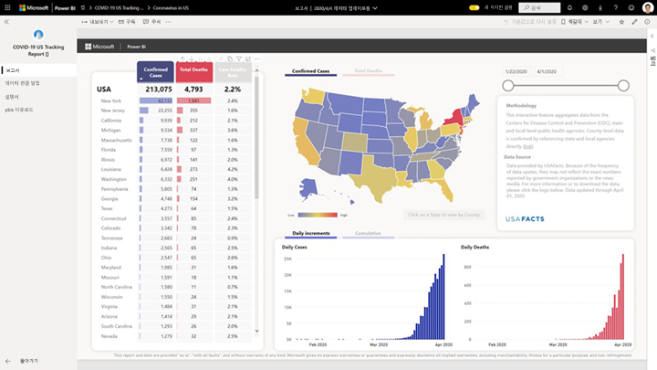

# 코로나바이러스감염증-19 미국 추적 보고서에 연결
이 문서에서는 코로나바이러스감염증-19 추적 보고서의 템플릿 앱을 설치하고 데이터 원본에 연결하는 방법을 설명합니다.

데이터에 대한 정보와 부인이 포함된 보고서 자체에 대한 자세한 내용은 [미국 주 및 지방 정부를 위한 코로나바이러스감염증-19 추적 샘플](../create-reports/sample-covid-19-us.md)을 참조하세요.

템플릿 앱을 설치하고 데이터 원본에 연결할 후에는 필요에 맞게 보고서를 사용자 지정할 수 있습니다. 그런 다음, 조직의 동료들에게 이 보고서를 앱으로 배포할 수 있습니다.

## 앱 설치

1. 다음 링크를 클릭하여 앱을 가져옵니다. [코로나바이러스감염증-19 미국 추적 보고서 템플릿 앱](https://appsource.microsoft.com/en-us/product/power-bi/pbi-contentpacks.covid19ms)

1. 앱의 AppSource 페이지에서 [**지금 가져오기**](https://appsource.microsoft.com/en-us/product/power-bi/pbi-contentpacks.covid19ms)를 클릭합니다.

    

1. 메시지가 표시되면 **설치**를 클릭합니다. 앱이 설치되면 앱 페이지에 설치된 앱이 표시됩니다.

   

## 데이터 원본 연결

1. 앱 페이지에서 아이콘을 클릭하여 앱을 엽니다.

1. 표시되는 시작 화면에서 **연결**을 선택합니다.

   

1. 로그인 대화 상자 두 개가 차례로 표시됩니다. 두 대화 상자에서 개인 정보 수준을 공용으로 설정합니다.

   

   보고서가 데이터 원본에 연결되고 최신 데이터로 채워집니다. 데이터가 채워지는 동안 활동 모니터가 회전합니다.

   

## 보고서 새로 고침 예약

데이터 새로 고침이 완료되면 앱의 작업 영역이 표시됩니다. [새로 고침 일정을 설정](../refresh-scheduled-refresh.md)하여 보고서 데이터를 최신 상태로 유지합니다.

## 사용자 지정 및 공유

자세한 내용은 [앱 사용자 지정 및 공유](../service-template-apps-install-distribute.md#customize-and-share-the-app)를 참조하세요. 앱을 게시하거나 배포하기 전에 반드시 [보고서 고지 사항](../create-reports/sample-covid-19-us.md#disclaimers)을 검토하세요.

## 다음 단계
* [미국 주 및 지방 정부를 위한 코로나바이러스감염증-19 추적 샘플](../create-reports/sample-covid-19-us.md)
* 궁금한 점이 더 있나요? [Power BI 커뮤니티에 질문합니다.](https://community.powerbi.com/)
* [Power BI 템플릿 앱이란?](../service-template-apps-overview.md)
* [조직에 템플릿 앱 설치 및 배포](../service-template-apps-install-distribute.md)
