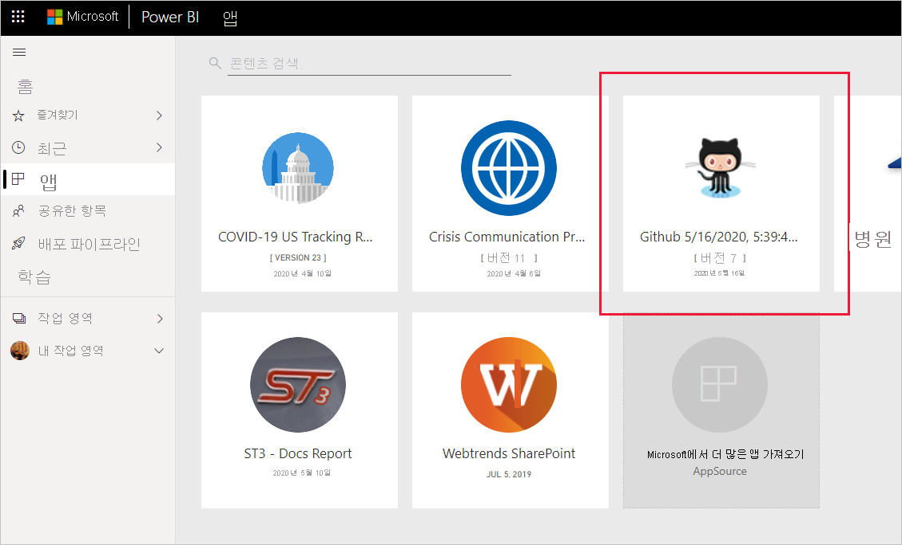
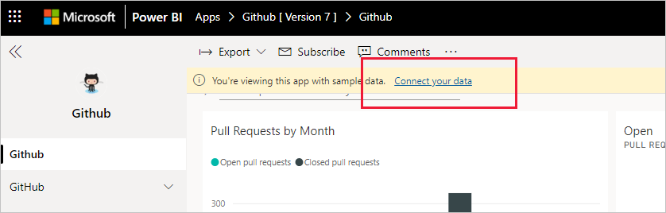
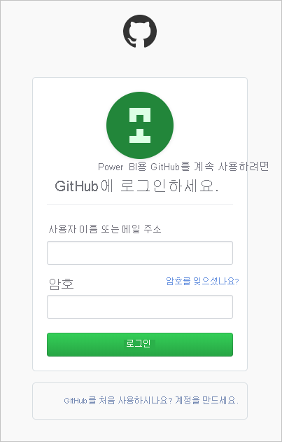
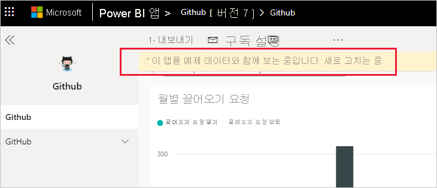
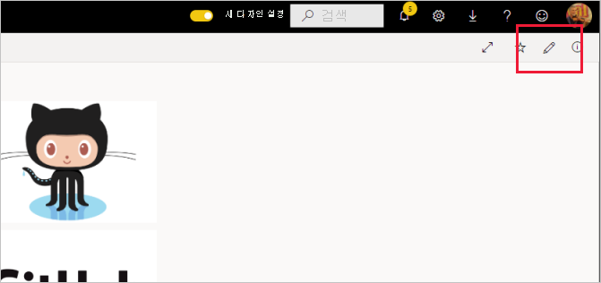
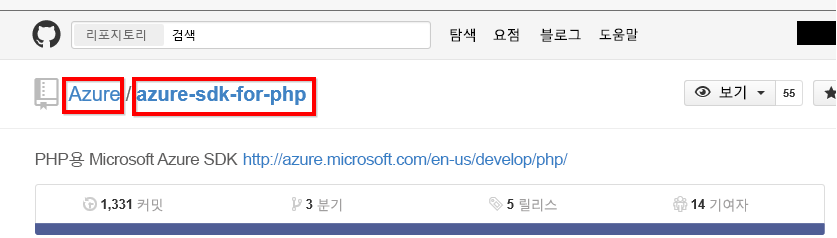

# <a name="connect-to-github-with-power-bi"></a>Power BI로 GitHub에 연결
이 문서에서는 Power BI 템플릿 앱을 사용하여 GitHub 계정에서 데이터를 가져오는 과정을 안내합니다. 템플릿 앱은 대시보드, 보고서 세트 및 데이터 세트로 구성되고 GitHub 데이터를 탐색할 수 있게 해주는 작업 영역을 생성합니다. Power BI용 GitHub 앱은 기여, 이슈, 끌어오기 요청 및 활성 사용자와 관련된 데이터가 포함된 GitHub 리포지토리(리포라고도 함)의 인사이트를 표시합니다.


템플릿 앱을 설치한 후에 대시보드와 보고서를 변경할 수 있습니다. 그런 다음, 조직의 동료에게 앱으로 배포할 수 있습니다.

[GitHub 템플릿 앱](https://app.powerbi.com/groups/me/getapps/services/pbi-contentpacks.pbiapps-github)에 연결하거나 Power BI와 [GitHub 통합](https://powerbi.microsoft.com/integrations/github)에 대해 자세히 알아보세요.

[GitHub 자습서](service-tutorial-connect-to-github.md)를 살펴볼 수도 있습니다. 이 자습서는 Power BI 설명서의 공용 리포지토리에 대한 실제 GitHub 데이터를 설치합니다.

>[!NOTE]
>이 템플릿 앱을 사용하려면 리포지토리 액세스 권한이 있는 GitHub 계정이 필요합니다. 요구 사항에 대한 자세한 내용은 아래에 나와 있습니다.
>
>이 템플릿 앱은 GitHub Enterprise를 지원하지 않습니다.

## <a name="install-the-app"></a>앱 설치

1. 다음 링크를 클릭하여 앱을 가져옵니다. [GitHub 템플릿 앱](https://app.powerbi.com/groups/me/getapps/services/pbi-contentpacks.pbiapps-github)

1. 앱의 AppSource 페이지에서 [**지금 가져오기**](https://app.powerbi.com/groups/me/getapps/services/pbi-contentpacks.pbiapps-github)를 선택합니다.

    [](https://app.powerbi.com/groups/me/getapps/services/pbi-contentpacks.pbiapps-github)

1. **설치** 를 선택합니다. 

    

    앱이 설치되면 앱 페이지에 설치된 앱이 표시됩니다.

   

## <a name="connect-to-data-sources"></a>데이터 원본 연결

1. 앱 페이지에서 아이콘을 선택하여 앱을 엽니다.

   앱이 열리고 샘플 데이터가 표시됩니다.

1. 페이지 맨 위에 있는 배너에서 **데이터 연결** 링크를 선택합니다.

   

1. 이렇게 하면 데이터 원본을 샘플 데이터에서 자체 데이터 원본으로 변경하는 매개 변수 대화 상자([알려진 제한 사항 ](service-template-apps-overview.md#known-limitations) 참조)가 열린 다음 인증 방법 대화 상자가 열립니다. 이러한 대화 상자에서 값을 다시 정의해야 할 수도 있습니다.

   


1. GitHub 자격 증명을 입력하고 GitHub 인증 프로세스를 수행합니다(브라우저를 사용하여 이미 로그인한 경우 이 단계를 건너뛸 수 있음).

   


연결 대화 상자 입력을 완료하고 GitHub에 로그인하면 연결 프로세스가 시작됩니다. 배너에서는 데이터가 새로 고쳐지고 있고 그동안 샘플 데이터가 표시된다고 알려줍니다.



로그인 과정에 사용하지 않도록 설정하지 않으면 보고서 데이터가 하루에 한 번 자동으로 새로 고쳐집니다. 원하는 경우 [새로 고침 일정을 직접 설정](./refresh-scheduled-refresh.md)하여 보고서 데이터를 최신 상태로 유지할 수도 있습니다.

## <a name="customize-and-share"></a>사용자 지정 및 공유

앱을 사용자 지정하고 공유하려면 페이지의 오른쪽 위 모서리의 연필 아이콘을 선택합니다.




작업 영역에서 아티팩트를 편집하는 방법에 대한 자세한 내용은 다음을 참조하세요.
* [Power BI의 보고서 편집기 둘러보기](../create-reports/service-the-report-editor-take-a-tour.md)
* [Power BI 서비스의 디자이너를 위한 기본 개념](../fundamentals/service-basic-concepts.md)

작업 영역에서 아티팩트 변경을 완료하면 앱을 게시하고 공유할 준비가 됩니다. 이 작업을 수행하는 방법을 알아보려면 [앱 게시](../collaborate-share/service-create-distribute-apps.md#publish-your-app)를 참조하세요.

## <a name="whats-included-in-the-app"></a>앱에 포함된 내용
Power BI의 GitHub에서 다음 데이터를 사용할 수 있습니다.     

| 테이블 이름 | 설명 |
| --- | --- |
| Contributions |기여 테이블은 기여자가 작성한 총 추가, 삭제 및 커밋 수를 주별로 집계하여 제공합니다. 상위 100개의 참가자가 포함됩니다. |
| Issues |선택한 리포지토리에 대한 모든 문제를 나열하며 문제가 닫힐 때까지의 총 시간과 평균 시간, 열린 총 문제 수, 닫힌 총 문제 수와 같은 계산을 포함합니다. 리포지토리에 이슈가 없으면 이 테이블은 비어 있습니다. |
| 끌어오기 요청 |이 표에는 리포지토리에 대한 모든 끌어오기 요청과 요청을 끌어온 사용자가 포함됩니다. 또한 열린 끌어오기 요청 수, 닫힌 끌어오기 요청 수 및 총 끌어오기 요청 수, 요청을 끌어오는 데 걸린 시간, 끌어오기 요청의 평균 소요 시간과 관련된 계산이 포함됩니다. 리포지토리에 pull 요청이 없으면 이 테이블은 비어 있습니다. |
| 사용자 |이 테이블에서는 선택한 리포지토리와 관련하여 기여했거나, 이슈를 보고했거나, 끌어오기 요청을 해결한 GitHub 사용자 또는 기여자 목록을 제공합니다. |
| Milestones |선택한 리포지토리에 대한 모든 중요 시점이 포함됩니다. |
| DateTable |이 테이블에는 GitHub 데이터를 날짜별로 분석할 수 있도록 오늘 이후의 날짜와 과거 연도의 날짜가 포함됩니다. |
| ContributionPunchCard |이 테이블을 선택한 리포지토리에 대한 기여 펀치 카드로 사용할 수 있습니다. 요일 및 시간별로 커밋이 표시됩니다. 이 테이블은 모델의 다른 테이블에 연결되어 있지 않습니다. |
| RepoDetails |이 테이블에서는 선택한 리포지토리에 대한 세부 정보를 제공합니다. |

## <a name="system-requirements"></a>시스템 요구 사항
* 리포지토리에 액세스할 수 있는 GitHub 계정.  
* 처음 로그인하는 동안 GitHub용 Power BI 앱에 부여된 권한. 액세스 취소에 대한 내용은 아래의 세부 정보를 참조하세요.  
* 데이터를 끌어오고 새로 고치는 데 사용할 수 있는 충분한 API 호출.
>[!NOTE]
>이 템플릿 앱은 GitHub Enterprise를 지원하지 않습니다.

### <a name="de-authorize-power-bi"></a>Power BI 권한 부여 취소
Power BI가 GitHub 리포지토리에 연결할 수 없도록 권한 부여를 취소하려면 GitHub에서 액세스를 철회할 수 있습니다. 자세한 내용은 [GitHub 도움말](https://help.github.com/articles/keeping-your-ssh-keys-and-application-access-tokens-safe/#reviewing-your-authorized-applications-oauth) 항목을 참조하세요.

<a name="FindingParams"></a>
## <a name="finding-parameters"></a>매개 변수 찾기
GitHub의 리포지토리 자체를 보면 소유자와 리포지토리를 확인할 수 있습니다.



첫 번째 부분 "Azure"는 소유자이고 두 번째 부분 "azure-sdk-for-php"는 리포지토리 자체입니다.  리포지토리의 URL에도 동일한 두 항목이 표시됩니다.

```console
<https://github.com/Azure/azure-sdk-for-php> .
```

## <a name="troubleshooting"></a>문제 해결
필요한 경우 GitHub 자격 증명을 확인할 수 있습니다.  

1. 다른 브라우저 창에서 GitHub 웹 사이트로 이동한 다음, GitHub에 로그인합니다. GitHub 사이트의 오른쪽 위에서 로그인한 상태를 확인할 수 있습니다.    
2. GitHub에서 Power BI를 통해 액세스하려는 리포지토리의 URL로 이동합니다. 예: https://github.com/dotnet/corefx.  
3. Power BI로 돌아와서 GitHub에 연결을 시도합니다. GitHub 구성 대화 상자에서 동일한 리포지토리의 리포지토리 이름과 리포지토리 소유자를 사용합니다.  

## <a name="next-steps"></a>다음 단계

* [자습서: Power BI를 사용하여 GitHub 리포지토리에 연결](service-tutorial-connect-to-github.md)
* [Power BI에서 새 작업 영역 만들기](../collaborate-share/service-create-the-new-workspaces.md)
* [Power BI에서 앱 설치 및 사용](../consumer/end-user-apps.md)
* [외부 서비스용 Power BI 앱에 연결](service-connect-to-services.md)
* 궁금한 점이 더 있나요? [Power BI 커뮤니티에 질문합니다.](https://community.powerbi.com/)
