# 병원 응급 대응 의사 결정 지원 대시보드에 연결
병원 응급 대응 의사 결정 지원 대시보드 템플릿 앱은 [의료 응급 대응을 위한 Microsoft Power Platform 솔루션](https://powerapps.microsoft.com/blog/emergency-response-solution-a-microsoft-power-platform-solution-for-healthcare-emergency-response/)의 보고 구성 요소입니다. 이 대시보드는 응급 관리자들이 적시에 올바른 의사 결정을 내릴 수 있도록 의료 시스템 전반의 집계 데이터를 보여 줍니다.

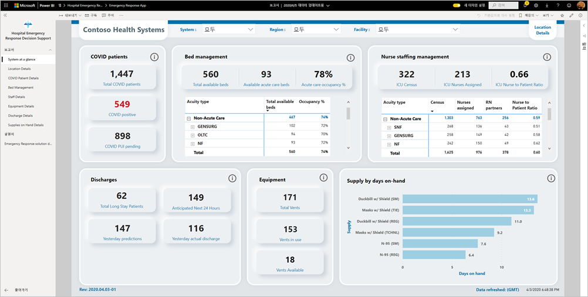

이 문서에서는 앱을 설치하고 데이터 원본에 연결하는 방법을 설명합니다. 이 앱의 보고서를 사용하는 방법을 알아보려면 [병원 응급 대응 의사 결정 지원 대시보드 설명서](/powerapps/sample-apps/emergency-response/deploy-configure#view-the-power-bi-dashboard)를 참조하세요.

템플릿 앱을 설치하고 데이터 원본에 연결할 후에는 필요에 맞게 보고서를 사용자 지정할 수 있습니다. 그런 다음, 조직의 동료들에게 이 보고서를 앱으로 배포할 수 있습니다.

## 필수 조건

이 템플릿 앱을 설치하기 전에 먼저 [병원 응급 대응 Power Platform 솔루션](/powerapps/sample-apps/emergency-response/deploy-configure)을 설치하고 설정해야 합니다. 이 솔루션을 설치하면 앱에 데이터를 채우는 데 필요한 데이터 원본 참조가 만들어집니다.

병원 응급 대응 Power Platform 솔루션을 설치할 때는 [Common Data Service 환경 인스턴스의 URL](/powerapps/sample-apps/emergency-response/deploy-configure#publish-the-power-bi-dashboard)을 기록해 두세요. 데이터에 템플릿 앱을 연결할 때 이 URL이 필요합니다.

## 앱 설치

1. 다음 링크를 클릭하여 앱을 가져옵니다. [병원 응급 대응 의사 결정 지원 대시보드 템플릿 앱](https://aka.ms/AppSource_Hospital_offer)

1. 앱의 AppSource 페이지에서 [**지금 가져오기**](https://aka.ms/AppSource_Hospital_offer)를 선택합니다.

    [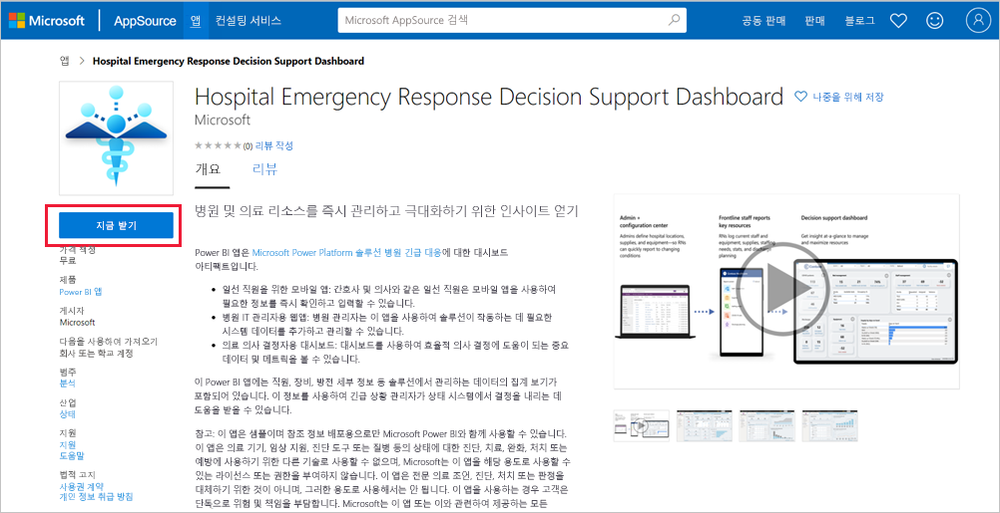](https://aka.ms/AppSource_Hospital_offer)

1. **한 가지 더** 의 정보를 읽고 **계속** 을 선택합니다.

    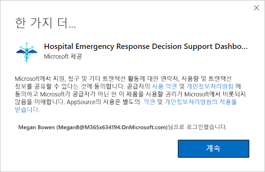

1. **설치** 를 선택합니다. 

    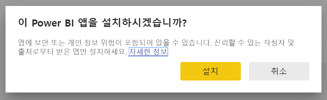

    앱이 설치되면 앱 페이지에 설치된 앱이 표시됩니다.

   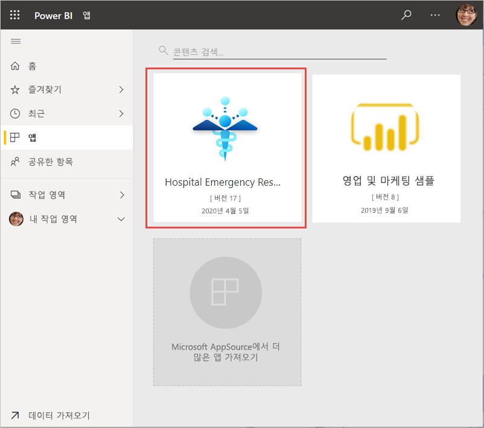

## 데이터 원본 연결 

1. 앱 페이지에서 아이콘을 선택하여 앱을 엽니다.

1. 시작 화면에서 **탐색** 을 선택합니다.

   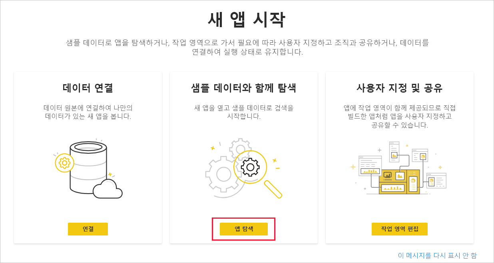

   앱이 열리고 샘플 데이터가 표시됩니다.

1. 페이지 맨 위에 있는 배너에서 **데이터 연결** 링크를 선택합니다.

   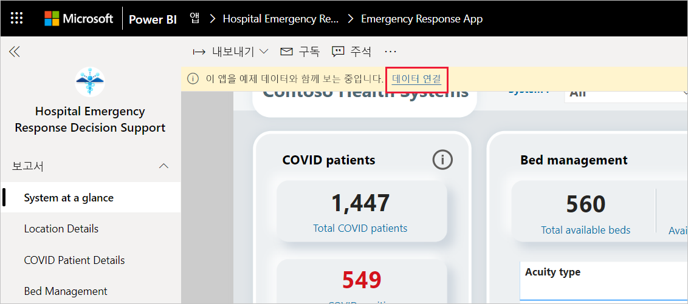

1. 대화 상자에서
   1. 조직 이름 필드에 조직의 이름을 입력합니다(예: “Contoso Health Systems”). 이 필드는 선택 사항입니다. 이 이름은 대시보드의 왼쪽 위에 표시됩니다.
   1. CDS_base_solution 필드에 [Common Data Service 환경 인스턴스의 URL](/powerapps/sample-apps/emergency-response/deploy-configure#publish-the-power-bi-dashboard)을 입력합니다. 예: https://[myenv].crm.dynamics.com. 완료하면 **다음** 을 클릭합니다.

   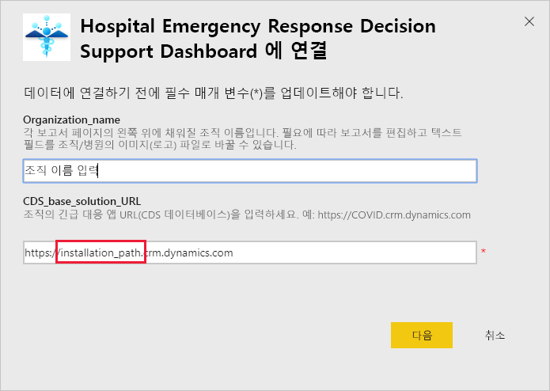

1. 표시되는 다음 대화 상자에서 인증 방법을 **OAuth2** 로 설정합니다. 개인 정보 수준 설정은 변경하지 않아도 됩니다.

   **로그인** 을 선택합니다.

   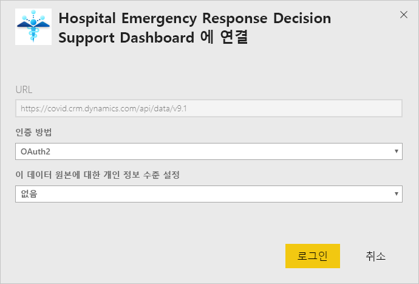

1. Microsoft 로그인 화면에서 Power BI에 로그인합니다.

   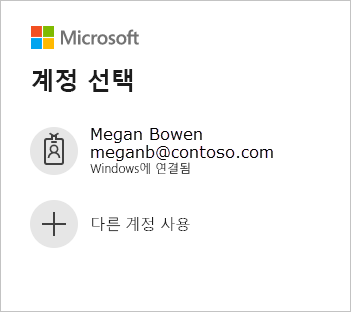

   로그인하면 보고서가 데이터 원본에 연결되고 최신 데이터로 채워집니다. 데이터가 채워지는 동안 활동 모니터가 회전합니다.

   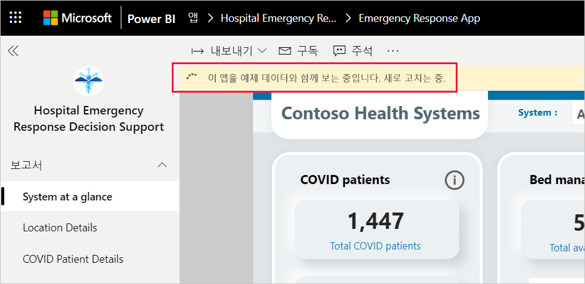

## 보고서 새로 고침 예약

데이터 새로 고침이 완료되면 [새로 고침 일정을 설정](../connect-data/refresh-scheduled-refresh.md)하여 보고서 데이터를 최신 상태로 유지합니다.

1. 위쪽 헤더 표시줄에서 **Power BI** 를 선택합니다.

   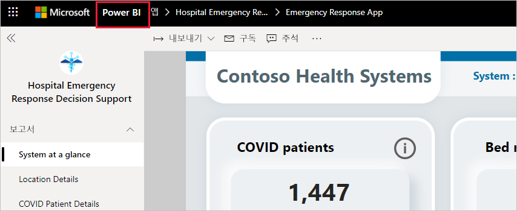

1. 왼쪽 탐색 창의 **작업 영역** 아래에서 병원 응급 대응 의사 결정 지원 대시보드 작업 영역을 찾은 다음, [예약된 새로 고침 구성](../connect-data/refresh-scheduled-refresh.md) 문서의 지침을 따릅니다.

## 사용자 지정 및 공유

자세한 내용은 [앱 사용자 지정 및 공유](../connect-data/service-template-apps-install-distribute.md#customize-and-share-the-app)를 참조하세요. 앱을 게시하거나 배포하기 전에 반드시 [보고서 고지 사항](../create-reports/sample-covid-19-us.md#disclaimers)을 검토하세요.

## 다음 단계
* [병원 응급 대응 보고서의 이해](/powerapps/sample-apps/emergency-response/deploy-configure#view-the-power-bi-dashboard)
* [Power Apps에서 재난 안내 샘플 템플릿 설정 및 알아보기](/powerapps/maker/canvas-apps/sample-crisis-communication-app)
* 궁금한 점이 더 있나요? [Power BI 커뮤니티에 질문합니다.](https://community.powerbi.com/)
* [Power BI 템플릿 앱이란?](../connect-data/service-template-apps-overview.md)
* [조직에 템플릿 앱 설치 및 배포](../connect-data/service-template-apps-install-distribute.md)