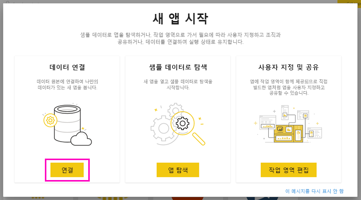

# Microsoft Sustainability Calculator 연결
IT 인프라의 탄소 배출에 대한 인사이트를 확보하여 보다 지속 가능한 컴퓨팅 의사 결정을 수립합니다.

Microsoft Sustainability Calculator는 Azure 서비스와 연결된 탄소 배출 데이터에 대한 새로운 인사이트를 제공합니다. 이제 조직 내에서 지속 가능성을 보고하고 추진하는 책임자는 각 Azure 구독의 탄소 영향을 정량화하고 온-프레미스 데이터 센터와 비교하여 Azure에서 실행되는 워크로드의 탄소 절감을 추정할 수 있습니다. 이 데이터는 범주 3의 온실가스 배출 보고에 사용할 수 있습니다. Microsoft Sustainability Calculator에 액세스하려면 일반적으로 조직의 Azure 관리자를 통해 사용할 수 있는 테넌트 ID 및 액세스 키가 필요합니다.

이 앱을 사용하려면 Azure Enterprise Portal의 정보가 필요합니다. 회사 시스템 관리자에게서 이 정보를 얻는 데 도움을 받을 수 있습니다. 앱을 설치하기 전에 이러한 지침을 검토하고 필요한 정보를 확보하세요. 

이 커넥터 버전은 [https://ea.azure.com](https://ea.azure.com/)의 엔터프라이즈 등록만 지원합니다. 중국 등록은 현재 지원되지 않습니다.

## 연결 방법
[!INCLUDE [powerbi-service-apps-get-more-apps](../includes/powerbi-service-apps-get-more-apps.md)]

1. **Microsoft Sustainability Calculator** \> **지금 받기**를 선택합니다.
1. **이 Power BI 앱을 설치하겠습니까?** 에서 **설치**를 선택합니다.
1. **앱** 창에서 **Microsoft Sustainability Calculator** 타일을 선택합니다.
1. **새 앱 시작**에서 **데이터**를 선택합니다.

    

1. **회사 이름, 사용자 등록 번호** 및 **개월 수 \> 로그인**을 입력합니다. 아래에서 [해당 매개 변수 찾기](#finding-parameters)에 대한 세부 정보를 참조하세요.

    

1. **인증 방법**에 대해 **키**를 선택하고 **개인 정보 수준**에서 **조직**을 선택합니다.
1. **키**에서 **액세스 키 \> 로그인**을 입력합니다.

    

1. 가져오기 프로세스가 자동으로 시작됩니다. 완료되면 새 대시보드, 보고서 및 모델이 **탐색 창**에 나타납니다. 보고서를 선택하여 가져온 데이터를 표시합니다.

## 매개 변수 찾기

회사 **등록 ID** 및 **액세스 키**를 찾으려면 Azure 관리자에게 문의하여 필요한 정보를 얻습니다. 관리자가

1. [Azure Enterprise Portal](https://ea.azure.com)에 로그인하여 왼쪽 리본에서 **관리**를 클릭하고 아래와 같은 **등록 번호**를 가져옵니다.
2. [Azure Enterprise Portal](https://ea.azure.com)에서 아래와 같이 **보고서**를 클릭하고 API 액세스 키를 클릭하여 기본 등록 계정 키를 가져옵니다.

## 앱 사용

언제든지 매개 변수를 업데이트하려면 **데이터 세트** 설정으로 이동하여 앱과 연결된 작업 영역에 액세스하고 테넌트 ID, 회사 이름 또는 개월 수 데이터를 업데이트합니다. 매개 변수를 적용한 후 **새로 고침**을 클릭하여 새 매개 변수를 적용한 데이터를 다시 로드합니다.