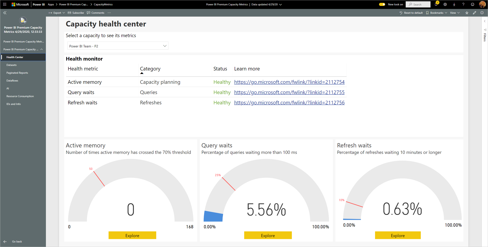

# Power BI Premium Capacity Metrics에 연결
용량 모니터링은 프리미엄 용량 리소스를 최대한 활용하는 방법에 대한 합리적인 결정을 하는 데 필수적입니다. Power BI Premium Capacity Metrics 앱은 용량이 수행되는 방법에 대해 가장 심층적인 정보를 제공합니다.

이 문서에서는 앱을 설치하고 데이터 원본에 연결하는 방법을 설명합니다. 보고서의 내용 및 사용 방법에 대한 자세한 내용은 [앱을 사용하여 프리미엄 용량 모니터링](../service-admin-premium-monitor-capacity.md) 및 [프리미엄 용량 메트릭 앱 블로그 게시물](https://powerbi.microsoft.com/blog/premium-capacity-metrics-app-new-health-center-with-kpis-to-explore-relevant-metrics-and-steps-to-mitigate-issues/)을 참조하세요.

앱을 설치하고 데이터 원본에 연결할 후에는 필요에 맞게 보고서를 사용자 지정할 수 있습니다. 그런 다음, 조직의 동료에게 이 보고서를 배포할 수 있습니다.

> [!NOTE]
> 템플릿 앱을 설치하려면 [권한](./service-template-apps-install-distribute.md#prerequisites)이 있어야 합니다. 권한이 없는 경우 테넌트 관리자에게 문의하세요.

## 앱 설치

1. 다음 링크를 클릭하여 앱을 가져옵니다. [Power BI Premium Capacity Metrics 템플릿 앱](https://app.powerbi.com/groups/me/getapps/services/pbi_pcmm.capacity-metrics-dxt)

1. 앱의 AppSource 페이지에서 [**지금 가져오기**](https://app.powerbi.com/groups/me/getapps/services/pbi_pcmm.capacity-metrics-dxt)를 선택합니다.

    

1. **설치**를 선택합니다. 

    

    > [!NOTE]
    > 이전에 앱을 설치한 경우 [해당 설치 덮어쓸지](./service-template-apps-install-distribute.md#update-a-template-app), 새 작업 영역에 설치할지를 묻는 메시지가 표시됩니다.

    앱이 설치되면 앱 페이지에 설치된 앱이 표시됩니다.

   

## 데이터 원본 연결

1. 앱 페이지에서 아이콘을 선택하여 앱을 엽니다.

1. 시작 화면에서 **탐색**을 선택합니다.

   

   앱이 열리고 샘플 데이터가 표시됩니다.

1. 페이지 맨 위에 있는 배너에서 **데이터 연결** 링크를 선택합니다.

   

1. 나타나는 대화 상자에서 UTC 오프셋, 즉 협정 세계시와 위치의 시간 사이의 차이(시간)를 설정합니다. 그런 다음 **다음**을 클릭합니다.
  
   
   **참고: 30분 단위는 소수 형식(예: 5.5, 2.5 등)으로 작성해야 합니다.**

1. 나타나는 다음 대화 상자에서 필요한 작업은 없고, **로그인**만 선택하면 됩니다.

   

1. Microsoft 로그인 화면에서 Power BI에 로그인합니다.

   

   로그인하면 보고서가 데이터 원본에 연결되고 최신 데이터로 채워집니다. 데이터가 채워지는 동안 활동 모니터가 회전합니다.

   

   로그인 과정에 사용하지 않도록 설정하지 않으면 보고서 데이터가 하루에 한 번 자동으로 새로 고쳐집니다. 원하는 경우 [새로 고침 일정을 직접 설정](./refresh-scheduled-refresh.md)하여 보고서 데이터를 최신 상태로 유지할 수도 있습니다.

## 사용자 지정 및 공유

앱 사용자 지정을 시작하려면 오른쪽 위 모서리의 연필 아이콘을 클릭합니다.

 

자세한 내용은 [앱 사용자 지정 및 공유](./service-template-apps-install-distribute.md#customize-and-share-the-app)를 참조하세요.

## 다음 단계
* [앱을 사용하여 프리미엄 용량 모니터링](../admin/service-admin-premium-monitor-capacity.md)
* [프리미엄 용량 메트릭 앱 블로그 게시물](https://powerbi.microsoft.com/blog/premium-capacity-metrics-app-new-health-center-with-kpis-to-explore-relevant-metrics-and-steps-to-mitigate-issues/)
* [Power BI 템플릿 앱이란?](./service-template-apps-overview.md)
* [조직에 템플릿 앱 설치 및 배포](./service-template-apps-install-distribute.md)
* 궁금한 점이 더 있나요? [Power BI 커뮤니티에 질문합니다.](https://community.powerbi.com/)
