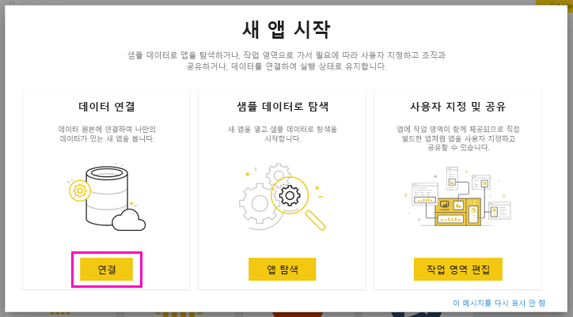
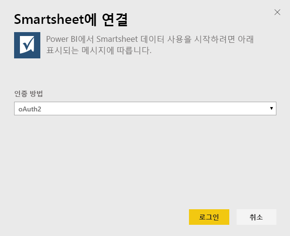
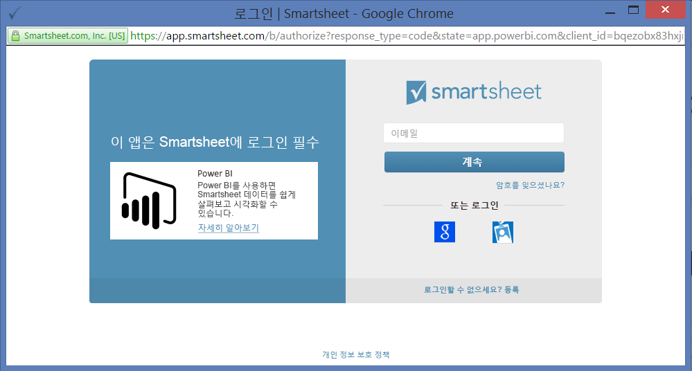
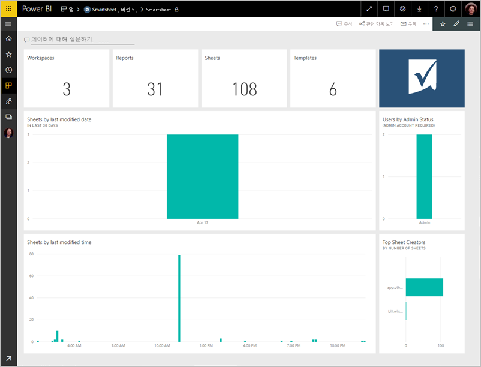
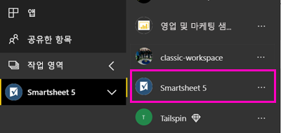
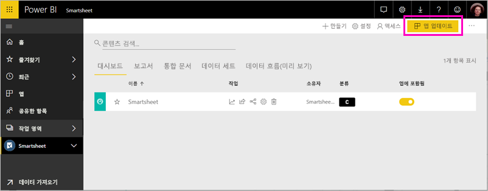

# Power BI로 Smartsheet에 연결
이 문서에서는 Power BI 템플릿 앱을 사용하여 Smartsheet 계정에서 데이터를 가져오는 과정을 안내합니다. Smartsheet는 간편하게 협업하고 파일을 공유할 수 있는 플랫폼을 제공합니다. Power BI용 Smartsheet 템플릿 앱은 Smartsheet 계정의 개요를 보여 주는 대시보드, 보고서 및 데이터 세트를 제공합니다. [Power BI Desktop](desktop-connect-to-data.md)을 사용하여 계정의 개별 시트에 직접 연결할 수도 있습니다. 

템플릿 앱을 설치한 후에 대시보드와 보고서를 변경할 수 있습니다. 그런 다음, 조직의 동료에게 앱으로 배포할 수 있습니다.

Power BI용 [Smartsheet 템플릿 앱](https://app.powerbi.com/groups/me/getapps/services/pbi-contentpacks.pbiapps-smartsheet)에 연결합니다.

>[!NOTE]
>Smartsheet 관리자 계정은 추가 액세스 권한이 있으므로 Power BI 템플릿 앱을 연결 및 로드하는 데 선호됩니다.

## 연결 방법

[!INCLUDE [powerbi-service-apps-get-more-apps](../includes/powerbi-service-apps-get-more-apps.md)]

3. **Smartsheet** \> **지금 받기** 를 선택합니다.
4. **이 Power BI 앱을 설치하겠습니까?** 에서 **설치** 를 선택합니다.
4. **앱** 창에서 **Smartsheet** 타일을 선택합니다.

    

6. **새 앱 시작** 에서 **데이터** 를 선택합니다.

    

4. 인증 방법에 대해 **oAuth2 \> 로그인** 을 선택합니다.
   
   메시지가 표시되면 Smartsheet 자격 증명을 입력하고 인증 프로세스를 따릅니다.
   
   
   
   

5. Power BI가 데이터를 가져오면 Smartsheet 대시보드가 열립니다.
   
   

## 앱 수정 및 배포

Smartsheet 템플릿 앱을 설치했습니다. 즉, Smartsheet 작업 영역도 만들었습니다. 작업 영역에서 보고서와 대시보드를 변경한 다음, 조직의 동료에게 ‘앱’으로 배포할 수 있습니다. 

1. 새 Smartsheet 작업 영역의 모든 콘텐츠를 보려면 탐색 창에서 **작업 영역** > **Smartsheet** 를 선택합니다. 

    

    이 보기는 작업 영역의 콘텐츠 목록입니다. 오른쪽 위에 **앱 업데이트** 가 표시됩니다. 동료에게 앱을 배포할 준비가 되었으면 여기서 시작합니다. 

    

2. **보고서** 및 **데이터 세트** 를 선택하여 작업 영역의 다른 요소를 확인합니다.

    동료에게 [앱을 배포](../collaborate-share/service-create-distribute-apps.md)하는 방법을 참조하세요.

## 포함된 내용
Power BI용 Smartsheet 템플릿 앱은 수정되는 경우 보유한 작업 영역, 보고서 및 시트의 수와 같은 Smartsheet 계정의 개요를 포함합니다. 또한 관리자 사용자는 위쪽 시트 작성자 등 해당 시스템에서 사용자에 대한 정보 일부를 확인합니다.  

계정의 개별 시트에 직접 연결하려면 [Power BI Desktop](desktop-connect-to-data.md)에서 Smartsheet 커넥터를 사용할 수 있습니다.  

## 다음 단계

* [Power BI에서 새 작업 영역 만들기](../collaborate-share/service-create-the-new-workspaces.md)
* [Power BI에서 앱 설치 및 사용](../consumer/end-user-apps.md)
* [외부 서비스용 Power BI 앱에 연결](service-connect-to-services.md)
* 궁금한 점이 더 있나요? [Power BI 커뮤니티에 질문합니다.](https://community.powerbi.com/)