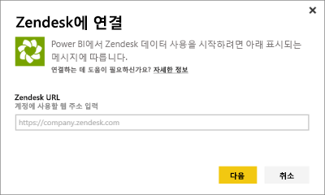
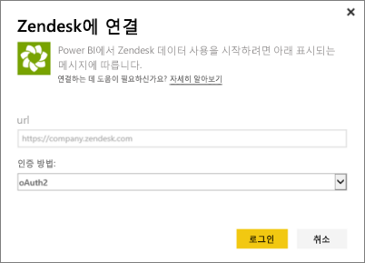
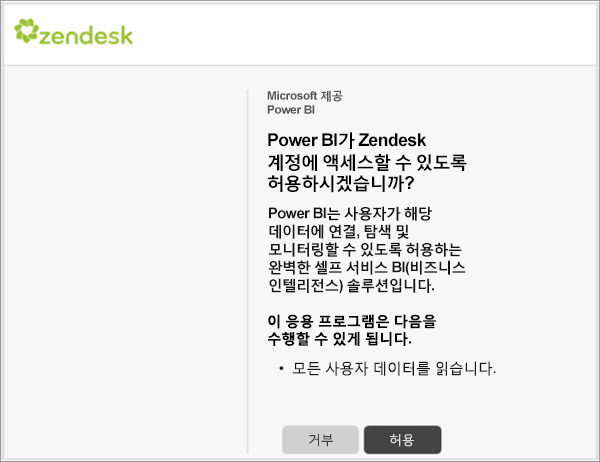
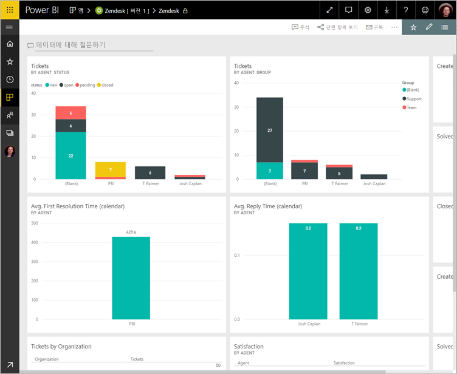
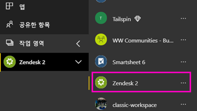
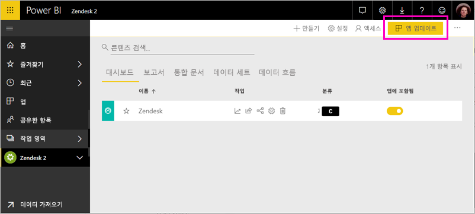

# Power BI로 Zendesk에 연결

이 문서에서는 Power BI 템플릿 앱을 사용하여 Zendesk 계정에서 데이터를 가져오는 과정을 안내합니다. Zendesk 앱은 티켓 볼륨 및 에이전트 성능에 대한 통찰력을 제공하는 Power BI 대시보드 및 Power BI 보고서 집합을 제공합니다. 하루에 한 번 자동으로 데이터가 새로 고쳐집니다. 

템플릿 앱을 설치한 후에는 대시보드 및 보고서를 사용자 지정하여 가장 관심 있는 정보를 강조 표시할 수 있습니다. 그런 다음, 조직의 동료에게 앱으로 배포할 수 있습니다.

[Zendesk 템플릿 앱](https://app.powerbi.com/getdata/services/zendesk)에 연결하거나 Power BI와의 [Zendesk 통합](https://powerbi.microsoft.com/integrations/zendesk)에 대해 자세히 알아보세요.

템플릿 앱을 설치한 후에 대시보드와 보고서를 변경할 수 있습니다. 그런 다음, 조직의 동료에게 앱으로 배포할 수 있습니다.

>[!NOTE]
>연결하려면 Zendesk 관리자 계정이 필요합니다. [요구 사항](#system-requirements)에 대한 자세한 내용은 아래에 나와 있습니다.

## 연결 방법

[!INCLUDE [powerbi-service-apps-get-more-apps](../includes/powerbi-service-apps-get-more-apps.md)]

3. **Zendesk** \> **지금 받기**를 선택합니다.
4. **이 Power BI 앱을 설치하겠습니까?** 에서 **설치**를 선택합니다.
4. **앱** 창에서 **Zendesk** 타일을 선택합니다.

    

6. **새 앱 시작**에서 **데이터**를 선택합니다.

    

4. 계정과 연결된 URL을 제공합니다. URL은 **https://company.zendesk.com** 형식입니다. 아래에서 [해당 매개 변수 찾기](#finding-parameters)에 대한 세부 정보를 참조하세요.
   
   

5. 메시지가 표시되면 Zendesk 자격 증명을 입력합니다.  **oAuth 2** 를 인증 메커니즘으로 선택하고 **로그인**을 클릭합니다. Zendesk 인증 흐름을 따릅니다. (브라우저에서 Zendesk에 이미 로그인한 경우 자격 증명을 묻는 메시지가 표시되지 않을 수도 있습니다.)
   
   > [!NOTE]
   > 이 템플릿 앱을 사용하려면 Zendesk 관리자 계정으로 연결해야 합니다. 
   > 
   
   
6. **허용** 을 클릭하여 Power BI가 Zendesk 데이터에 액세스할 수 있도록 합니다.
   
   
7. **연결** 을 클릭하여 가져오기 프로세스를 시작합니다. 
8. Power BI가 데이터를 가져오면 Zendesk 앱의 콘텐츠 목록, 즉 새 대시보드, 보고서 및 데이터 세트가 표시됩니다.
9. 대시보드를 선택하여 탐색 프로세스를 시작합니다.

    
   
## 앱 수정 및 배포

Zendesk 템플릿 앱을 설치했습니다. 즉, Zendesk 작업 영역도 만들었습니다. 작업 영역에서 보고서와 대시보드를 변경한 다음, 조직의 동료에게 ‘앱’으로 배포할 수 있습니다. 

1. 새 Zendesk 작업 영역의 모든 콘텐츠를 보려면 탐색 창에서 **작업 영역** > **Zendesk**를 선택합니다. 

    

    이 보기는 작업 영역의 콘텐츠 목록입니다. 오른쪽 위에 **앱 업데이트**가 표시됩니다. 동료에게 앱을 배포할 준비가 되었으면 여기서 시작합니다. 

    

2. **보고서** 및 **데이터 세트**를 선택하여 작업 영역의 다른 요소를 확인합니다.

    동료에게 [앱을 배포](../collaborate-share/service-create-distribute-apps.md)하는 방법을 참조하세요.

## 시스템 요구 사항
Zendesk 템플릿 앱에 액세스하려면 Zendesk 관리자 계정이 필요합니다. Zendesk 데이터를 보려고 하는 에이전트 또는 최종 사용자는 [Power BI Desktop](desktop-connect-to-data.md)에서 제안 사항을 추가하고 Zendesk 커넥터를 검토하세요.

## 매개 변수 찾기
Zendesk URL은 Zendesk 계정에 로그인하는 데 사용하는 URL과 동일합니다. Zendesk URL을 잘 모를 경우 Zendesk [로그인 도움말](https://www.zendesk.com/login/)을 사용할 수 있습니다.

## 문제 해결
연결 문제가 발생하는 경우 Zendesk URL을 확인하고 Zendesk 관리자 계정을 사용하고 있는지 확인합니다.

## 다음 단계

* [Power BI에서 새 작업 영역 만들기](../collaborate-share/service-create-the-new-workspaces.md)
* [Power BI에서 앱 설치 및 사용](../consumer/end-user-apps.md)
* [외부 서비스용 Power BI 앱에 연결](service-connect-to-services.md)
* 궁금한 점이 더 있나요? [Power BI 커뮤니티에 질문합니다.](https://community.powerbi.com/)
