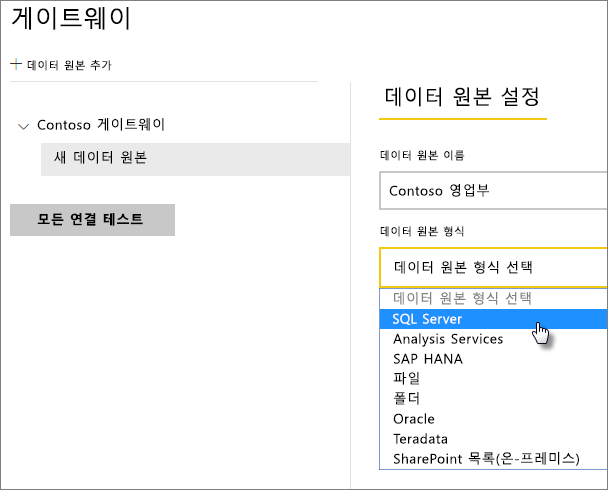
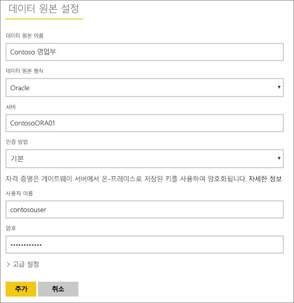
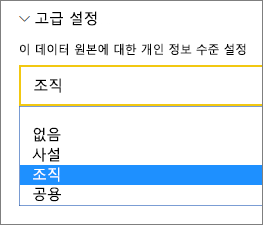
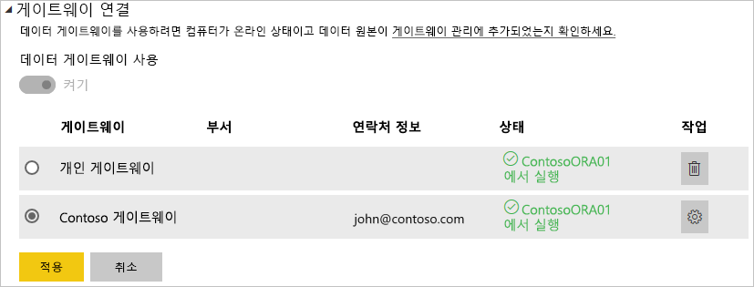

# 데이터 원본 관리 - 가져오기/예약된 새로 고침

[!INCLUDE [gateway-rewrite](../includes/gateway-rewrite.md)]

[온-프레미스 데이터 게이트웨이를 설치](/data-integration/gateway/service-gateway-install)한 후에는 게이트웨이와 함께 사용할 수 있는 [데이터 원본을 추가](service-gateway-data-sources.md#add-a-data-source)해야 합니다. 이 문서에서는 DirectQuery 또는 라이브 연결과 다르게 예약된 새로 고침에 사용되는 게이트웨이 및 데이터 원본으로 작업하는 방법을 살펴봅니다.

## 데이터 원본 추가

데이터 원본을 추가하는 방법에 대한 자세한 내용은 [데이터 원본 추가](service-gateway-data-sources.md#add-a-data-source)를 참조하세요. 데이터 원본 유형을 선택합니다.

나열된 모든 데이터 원본 유형을 온-프레미스 데이터 게이트웨이와 함께 예정된 새로 고침에 사용할 수 있습니다. Analysis Services, SQL Server 및 SAP HANA는 예정된 새로 고침 또는 DirectQuery/라이브 연결에 사용될 수 있습니다.

그런 다음, 데이터 원본에 액세스하는 데 사용되는 원본 정보 및 자격 증명을 포함하는 데이터 원본에 대한 정보를 입력합니다.

> [!NOTE]
> 데이터 원본에 대한 모든 쿼리는 이러한 자격 증명을 사용하여 실행됩니다. 자격 증명을 저장하는 방법에 대한 자세한 내용은 [클라우드에 암호화된 자격 증명 저장](service-gateway-data-sources.md#store-encrypted-credentials-in-the-cloud)을 참조하세요.

예약된 새로 고침에 사용할 수 있는 데이터 원본 유형 목록은 [사용 가능한 데이터 원본 유형 목록](service-gateway-data-sources.md#list-of-available-data-source-types)을 참조하세요.

모든 항목을 입력한 후 **추가**를 선택합니다. 이제 온-프레미스 데이터에 대한 예정된 새로 고침에 이 데이터 원본을 사용할 수 있습니다. 성공한 경우 *연결 성공*이 표시됩니다.

### 고급 설정

필요한 경우 데이터 원본의 프라이버시 수준을 구성할 수 있습니다. 이 설정은 데이터가 결합하는 방식을 제어합니다. 예약된 새로 고침에만 사용됩니다. 데이터 원본의 프라이버시 수준에 대한 자세한 내용은 [프라이버시 수준(파워 쿼리)](https://support.office.com/article/Privacy-levels-Power-Query-CC3EDE4D-359E-4B28-BC72-9BEE7900B540)을 참조하세요.

## 예약된 새로 고침에 데이터 원본 사용

데이터 원본을 만든 후 DirectQuery 연결 또는 예약된 새로 고침을 통해 사용할 수 있습니다.

> [!NOTE]
> 서버 및 데이터베이스 이름은 온-프레미스 데이터 게이트웨이 내에서 Power BI Desktop 및 데이터 원본 간에 일치해야 합니다.

게이트웨이 내에서 데이터 세트 및 데이터 원본 간의 링크는 서버 이름 및 데이터베이스 이름을 기반으로 합니다. 해당 이름은 서로 일치해야 합니다. 예를 들어 Power BI Desktop 내에서 서버 이름에 대한 IP 주소를 제공하는 경우 게이트웨이 구성 내에서 데이터 원본에 대한 IP 주소를 사용해야 합니다. Power BI Desktop에서 *SERVER\INSTANCE*를 사용하는 경우 게이트웨이에 대해 구성된 데이터 원본에서 이를 사용해야 합니다.

게이트웨이 내에서 구성된 데이터 원본의 **사용자** 탭에 나열되고 서버 이름 및 데이터베이스 이름이 일치하는 경우 예약된 새로 고침으로 사용하기 위한 옵션으로 게이트웨이가 표시됩니다.

> [!WARNING]
> 데이터 세트에 여러 데이터 원본이 포함된 경우 각 데이터 원본을 게이트웨이 내부에 추가해야 합니다. 게이트웨이에 하나 이상의 데이터 원본을 추가하지 않으면 예약된 새로 고침에 사용 가능한 게이트웨이가 표시되지 않습니다.

## 제한 사항

OAuth는 온-프레미스 데이터 게이트웨이와 함께 지원되는 인증 체계가 아닙니다. OAuth가 필요한 데이터 원본을 추가할 수 없습니다. OAuth가 필요한 데이터 원본이 데이터 세트에 있으면 예약된 새로 고침에 게이트웨이를 사용할 수 없습니다.

## 다음 단계

* [온-프레미스 데이터 게이트웨이 문제 해결](/data-integration/gateway/service-gateway-tshoot)
* [게이트웨이 문제 해결 - Power BI](service-gateway-onprem-tshoot.md)

궁금한 점이 더 있나요? [Power BI 커뮤니티](https://community.powerbi.com/)를 사용해 보세요.
