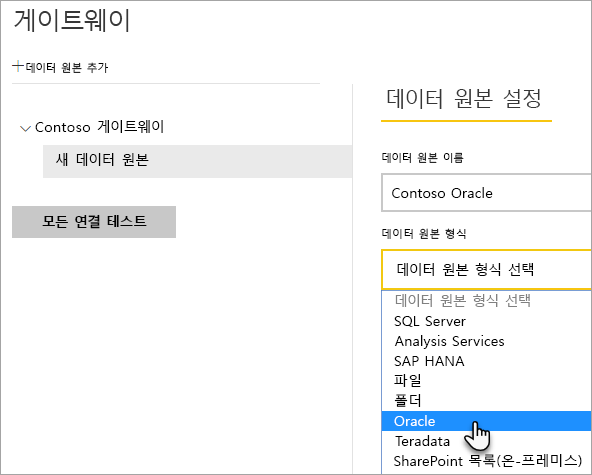
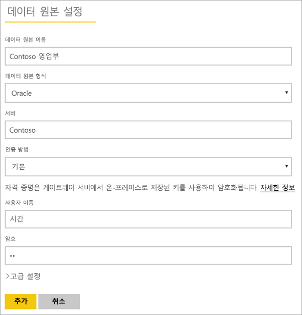
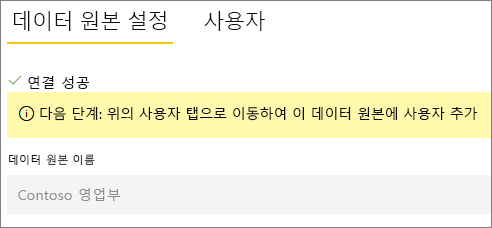
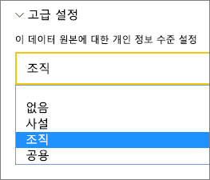
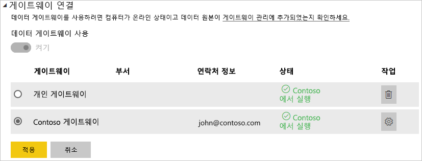

# 데이터 원본 관리 - Oracle

[!INCLUDE [gateway-rewrite](../includes/gateway-rewrite.md)]

[온-프레미스 데이터 게이트웨이를 설치](/data-integration/gateway/service-gateway-install)한 후에는 게이트웨이와 함께 사용할 수 있는 [데이터 원본을 추가](service-gateway-data-sources.md#add-a-data-source)해야 합니다. 이 문서에서는 예약된 새로 고침 또는 DirectQuery에 맞게 게이트웨이 및 Oracle 데이터 원본으로 작업하는 방법을 살펴봅니다.

## Oracle 데이터베이스에 연결
온-프레미스 데이터 게이트웨이를 사용하여 Oracle 데이터베이스에 연결하려면 게이트웨이를 실행하는 컴퓨터에 올바른 Oracle 클라이언트 소프트웨어를 설치해야 합니다. 사용하는 Oracle 클라이언트 소프트웨어는 Oracle 서버 버전에 따라 다르지만, 항상 64비트 게이트웨이와 일치합니다.

지원되는 Oracle 버전: 
- Oracle Server 9 이상
- ODAC(Oracle Data Access Client) 소프트웨어 11.2 이상

## Oracle 클라이언트 설치
- [64비트 Oracle 클라이언트를 다운로드하여 설치합니다](https://www.oracle.com/database/technologies/odac-downloads.html).

> [!NOTE]
> Oracle Server와 호환되는 ODAC(Oracle Data Access Client) 버전을 선택합니다. 예를 들어 ODAC 12.x는 Oracle Server 버전 9를 항상 지원하지는 않습니다.
> Oracle 클라이언트의 Windows Installer를 선택합니다.
> Oracle 클라이언트를 설치하는 과정에서 설치 마법사를 실행하는 동안 해당 확인란을 선택하여 *컴퓨터 전체 수준에서 ASP.NET에 대한 ODP.NET 및/또는 Oracle 공급자를 구성*할 수 있는지 확인합니다. Oracle 클라이언트 마법사의 일부 버전에서는 기본적으로 확인란을 선택하고 나머지 버전에서는 그렇지 않습니다. Power BI를 Oracle 데이터베이스에 연결할 수 있도록 확인란이 선택되어 있는지 확인합니다.
 
클라이언트가 설치되고 ODAC가 제대로 구성된 후에는 Power BI Desktop 또는 다른 테스트 클라이언트를 사용하여 게이트웨이에서 올바른 설치 및 구성을 확인하는 것이 좋습니다.

## 데이터 원본 추가

데이터 원본을 추가하는 방법에 대한 자세한 내용은 [데이터 원본 추가](service-gateway-data-sources.md#add-a-data-source)를 참조하세요. **데이터 원본 형식**에서 **Oracle**을 선택합니다.

Oracle 데이터 원본 형식을 선택한 후 **서버** 및 **데이터베이스**를 포함하는 데이터 원본에 대한 정보를 입력합니다. 

**인증 방법**에서 **Windows** 또는 **기본**을 선택할 수 있습니다. Windows 인증 대신 Oracle 내에서 만든 계정을 사용하려는 경우 **기본**을 선택합니다. 그런 다음 이 데이터 원본에 사용할 자격 증명을 입력합니다.

> [!NOTE]
> 데이터 소스에 대한 모든 쿼리는 이러한 자격 증명을 사용하여 실행됩니다. 자격 증명을 저장하는 방법에 대한 자세한 내용은 [클라우드에 암호화된 자격 증명 저장](service-gateway-data-sources.md#store-encrypted-credentials-in-the-cloud)을 참조하세요.

모든 항목을 입력한 후 **추가**를 선택합니다. 이제 온-프레미스의 Oracle 서버에 대해 예약된 새로 고침 또는 DirectQuery를 위해 이 데이터 원본을 사용할 수 있습니다. 성공한 경우 *연결 성공*이 표시됩니다.

### 고급 설정

필요한 경우 데이터 원본의 프라이버시 수준을 구성할 수 있습니다. 이 설정은 데이터가 결합하는 방식을 제어합니다. 예약된 새로 고침에만 사용됩니다. DirectQuery에는 적용되지 않습니다. 데이터 원본의 프라이버시 수준에 대한 자세한 내용은 [프라이버시 수준(파워 쿼리)](https://support.office.com/article/Privacy-levels-Power-Query-CC3EDE4D-359E-4B28-BC72-9BEE7900B540)을 참조하세요.

## 데이터 원본 사용

데이터 원본을 만든 후 DirectQuery 연결 또는 예약된 새로 고침을 통해 사용할 수 있습니다.

> [!WARNING]
> 서버 및 데이터베이스 이름은 온-프레미스 데이터 게이트웨이 내에서 Power BI Desktop 및 데이터 원본 간에 일치해야 합니다.

게이트웨이 내에서 데이터 세트 및 데이터 원본 간의 링크는 서버 이름 및 데이터베이스 이름을 기반으로 합니다. 해당 이름은 서로 일치해야 합니다. 예를 들어 Power BI Desktop 내에서 서버 이름에 대한 IP 주소를 제공하는 경우 게이트웨이 구성 내에서 데이터 원본에 대한 IP 주소를 사용해야 합니다. 이 이름은 tnsnames.ora 파일 내에서 정의된 별칭과 일치해야 합니다. tnsnames.ora 파일에 대한 자세한 내용은 [Oracle 클라이언트 설치](#install-the-oracle-client)를 참조하세요.

이 요구 사항은 DirectQuery와 예약된 새로 고침에 대한 경우입니다.

### DirectQuery 연결로 데이터 원본 사용

서버 및 데이터베이스 이름이 Power BI Desktop 및 게이트웨이에 대해 구성된 데이터 원본 간과 일치하는지 확인합니다. 또한 DirectQuery 데이터 세트를 게시하려면 사용자가 데이터 원본의 **사용자** 탭에 나열되는지 확인해야 합니다. DirectQuery의 경우 처음으로 데이터를 가져올 때 Power BI Desktop 내에서 선택이 발생합니다. DirectQuery를 사용하는 방법에 대한 자세한 내용은 [Power BI Desktop에서 DirectQuery 사용](desktop-use-directquery.md)을 참조하세요.

게시한 후 Power BI Desktop 또는 **데이터 가져오기**에서 보고서 작업을 시작해야 합니다. 연결을 사용할 수 있으려면 게이트웨이 내에서 데이터 원본을 만든 후 몇 분 정도가 걸릴 수 있습니다.

### 예약된 새로 고침으로 데이터 원본 사용

게이트웨이 내에서 구성된 데이터 원본의 **사용자** 탭에 나열되고 서버 이름 및 데이터베이스 이름이 일치하는 경우 예약된 새로 고침으로 사용하기 위한 옵션으로 게이트웨이가 표시됩니다.

## 문제 해결

명명 구문이 잘못되었거나 적절히 구성되지 않은 경우 Oracle에서 여러 가지 오류가 발생할 수 있습니다.

* ORA-12154: TNS: 지정된 연결 식별자를 확인할 수 없습니다.
* ORA-12514: TNS: 수신기는 현재 연결 설명자에서 요청된 서비스를 알지 못합니다.
* ORA-12541: TNS: 수신기 없음
* ORA-12170: TNS: 연결 시간 초과가 발생함
* ORA-12504: TNS: 수신기가 CONNECT_DATA에서 SERVICE_NAME을 제공받지 못했습니다.

Oracle 클라이언트가 설치되지 않거나 제대로 구성되지 않은 경우 이 오류가 발생할 수 있습니다. 설치된 경우 tnsnames.ora 파일이 제대로 구성되어 있고 적절한 net_service_name을 사용하는지 확인합니다. net_service_name이 Power BI Desktop을 사용하는 머신과 게이트웨이를 실행하는 머신 간에 동일한지 확인해야 합니다. 자세한 내용은 [Oracle 클라이언트 설치](#install-the-oracle-client)를 참조하세요.

Oracle 서버 버전과 Oracle Data Access Client 버전 간에 호환성 문제가 발생할 수도 있습니다. 일반적으로 해당 버전을 일치시키려 하는데 일부 조합이 호환되지 않습니다. 예를 들어 ODAC 12.x는 Oracle Server 버전 9를 지원하지 않습니다.

데이터 원본 서버와 게이트웨이 머신 간에 발생하는 연결 문제를 진단하려면 게이트웨이 머신에 클라이언트(예: Power BI Desktop 또는 Oracle ODBC 테스트)를 설치하는 것이 좋습니다. 클라이언트를 사용하여 데이터 원본 서버에 대한 연결을 확인할 수 있습니다.

게이트웨이와 관련된 추가 문제 해결 정보는 [온-프레미스 데이터 게이트웨이 문제 해결](/data-integration/gateway/service-gateway-tshoot)을 참조하세요.

## 다음 단계

* [게이트웨이 문제 해결 - Power BI](service-gateway-onprem-tshoot.md)
* [Power BI 프리미엄](../admin/service-premium-what-is.md)

궁금한 점이 더 있나요? [Power BI 커뮤니티](https://community.powerbi.com/)에 질문합니다.
