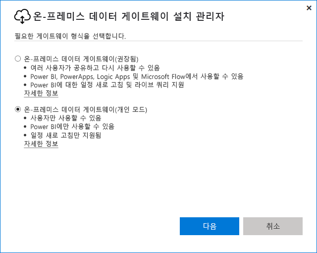
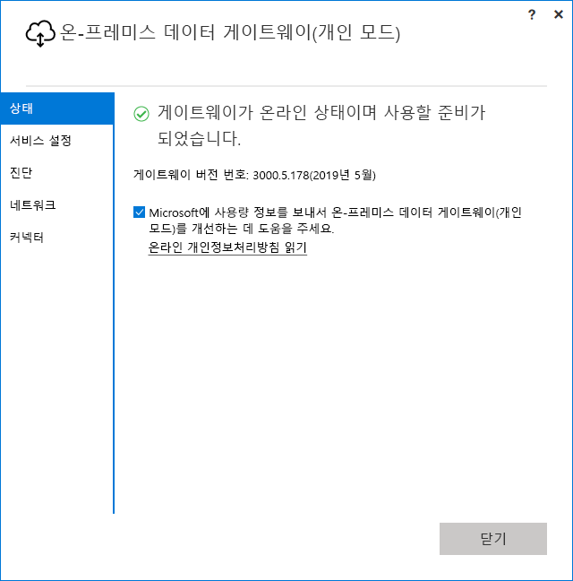

# <a name="use-personal-gateways-in-power-bi"></a>Power BI에서 개인 게이트웨이 사용

[!INCLUDE [gateway-rewrite](../includes/gateway-rewrite.md)]

온-프레미스 데이터 게이트웨이(개인 모드)는 Power BI에서만 작동하는 온-프레미스 데이터 게이트웨이 버전입니다. 개인 게이트웨이를 사용하여 자신의 컴퓨터에 게이트웨이를 설치하고 온-프레미스 데이터에 대한 액세스 권한을 얻을 수 있습니다.

> [!NOTE]
> 각 Power BI 사용자에 대해 하나의 개인 모드 게이트웨이만 실행할 수 있습니다. 다른 컴퓨터에도 동일한 사용자에 대한 다른 개인 모드 게이트웨이를 설치하는 경우 가장 최근 설치가 기존의 이전 설치를 대신합니다.

## <a name="on-premises-data-gateway-vs-on-premises-data-gateway-personal-mode"></a>온-프레미스 데이터 게이트웨이 및 온-프레미스 데이터 게이트웨이(개인 모드)

다음 표에서는 온-프레미스 데이터 게이트웨이 및 온-프레미스 데이터 게이트웨이(개인 모드)의 차이점을 설명합니다.

|   |온-프레미스 데이터 게이트웨이 | 온-프레미스 데이터 게이트웨이(개인 모드) |
| ---- | ---- | ---- |
|**지원되는 클라우드 서비스** |Power BI, PowerApps, Azure Logic Apps, Power Automate, Azure Analysis Services, 데이터 흐름 |Power BI |
|**실행** |게이트웨이에 액세스할 수 있는 사용자가 구성한 대로 |관리자로 Windows 인증의 경우 다른 인증 유형에 대해 구성한 대로 |
|**컴퓨터 관리자로만 설치할 수 있음** |예 |아니요 |
|**중앙 집중화된 게이트웨이 및 데이터 원본 관리** |예 |아니요 |
|**데이터 가져오기 및 새로 고침 예약** |예 |예 |
|**DirectQuery 지원** |예 |아니요 |
|**Analysis Services에 대한 LiveConnect 지원** |예 |아니요 |

## <a name="install-the-on-premises-data-gateway-personal-mode"></a>온-프레미스 데이터 게이트웨이(개인 모드) 설치

온-프레미스 데이터 게이트웨이(개인 모드)를 설치하려면:

1. [온-프레미스 데이터 게이트웨이를 다운로드합니다](https://go.microsoft.com/fwlink/?LinkId=820925&clcid=0x409).

2. 설치 관리자에서 온-프레미스 데이터 게이트웨이(개인 모드)를 선택하고 **다음** 을 선택합니다.

   

게이트웨이 파일은 _“%localappdata%\Microsoft\On-premises data gateway (personal mode)_ 에 설치됩니다. 설치가 성공적으로 완료되고 사용자가 로그인하고 나면 다음 화면이 표시됩니다.



## <a name="use-fast-combine-with-the-personal-gateway"></a>개인 게이트웨이로 빠른 결합 사용

개인 게이트웨이에서 빠른 결합을 사용하면 쿼리를 실행하는 동안 지정된 프라이버시 수준을 무시할 수 있습니다. 빠른 결합을 온-프레미스 데이터 게이트웨이(개인 모드)에서 작동하도록 설정하려면:

1. 파일 탐색기를 사용하여 다음 파일을 엽니다.

   `%localappdata%\Microsoft\On-premises data gateway (personal mode)\Microsoft.PowerBI.DataMovement.Pipeline.GatewayCore.dll.config`

2. 파일의 맨 아래에 다음 텍스트를 추가합니다.

    ```xml
    <setting name="EnableFastCombine" serializeAs="String">
       <value>true</value>
    </setting>
    ```

3. 완료되면 약 1분 후 설정이 적용됩니다. 제대로 작동하는지 확인하려면 Power BI 서비스에서 주문형 새로 고침을 시도하여 빠른 결합이 작동하는지 확인합니다.

## <a name="frequently-asked-questions-faq"></a>질문과 대답(FAQ)

**질문:** 온-프레미스 데이터 게이트웨이(개인 모드)를 온-프레미스 데이터 게이트웨이(이전에 엔터프라이즈 버전 게이트웨이로 알려짐)와 함께 실행할 수 있나요?
  
**답변:** 예. 두 게이트웨이 둘 다 동시에 실행할 수 있습니다.

**질문:** 온-프레미스 데이터 게이트웨이(개인 모드)를 서비스로 실행할 수 있나요?
  
**답변:** 아니요. 온-프레미스 데이터 게이트웨이(개인 모드)는 애플리케이션으로만 실행할 수 있습니다. 서비스 또는 관리자 모드에서 게이트웨이를 실행해야 하는 경우 [온-프레미스 데이터 게이트웨이](/data-integration/gateway/service-gateway-onprem)(이전에 엔터프라이즈 게이트웨이로 알려짐)를 고려해야 합니다.

**질문:** 온-프레미스 데이터 게이트웨이(개인 모드)의 업데이트 주기는 어떻게 되나요?
  
**답변:** 개인 게이트웨이는 달마다 업데이트할 계획입니다.

**질문:** 왜 내 자격 증명 업데이트를 요청해야 합니까?
  
**답변:** 대부분의 경우 자격 증명에 대한 요청을 트리거할 수 있습니다. 온-프레미스 데이터 게이트웨이(개인 모드)를 Power BI - 개인 게이트웨이와 다른 컴퓨터에 다시 설치하는 것이 가장 일반적입니다. 데이터 원본에서 문제가 되어 Power BI가 테스트 연결을 수행하지 못하거나 제한 시간 또는 시스템 오류가 발생할 수도 있습니다. Power BI 서비스에서 자격 증명을 업데이트하려면 기어 아이콘을 선택하고 **설정** > **데이터 세트** 를 선택합니다. 문제의 데이터 세트를 찾고 **데이터 원본 자격 증명** 을 선택합니다.

**질문:** 업그레이드하는 동안 내 이전 개인 게이트웨이는 얼마 동안 오프라인 상태가 되나요?
  
**답변:** 개인 게이트웨이를 새 버전으로 업그레이드하는 데는 몇 분이면 됩니다.

**질문:** R 및 Python 스크립트를 사용하고 있습니다. 지원되나요?
  
**답변:** R 및 Python 스크립트는 개인 모드에서 지원됩니다.

## <a name="next-steps"></a>다음 단계

* [게이트웨이 데이터 원본 추가 또는 제거](service-gateway-data-sources.md)
* [온-프레미스 데이터 게이트웨이에 대한 프록시 설정 구성](/data-integration/gateway/service-gateway-proxy)  

궁금한 점이 더 있나요? [Power BI 커뮤니티](https://community.powerbi.com/)를 사용해 보세요.
