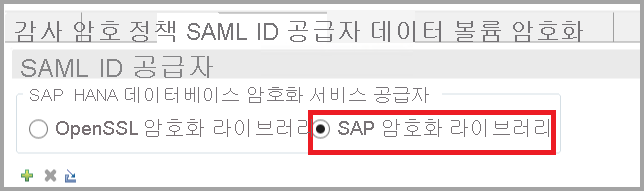
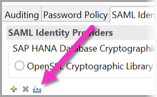
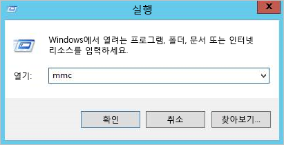
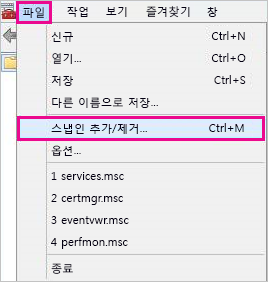
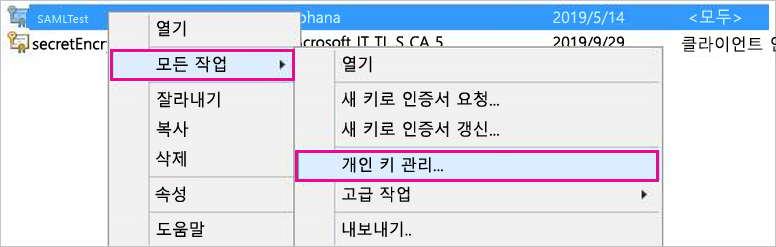

# <a name="use-security-assertion-markup-language-saml-for-sso-from-power-bi-to-on-premises-data-sources"></a>Power BI에서 온-프레미스 데이터 원본으로 SSO에 SAML(Security Assertion Markup Language)을 사용합니다.

SSO를 사용하도록 설정하면 Power BI 보고서 및 대시보드가 온-프레미스 원본에 구성된 사용자 수준 권한을 준수하면서 원본의 데이터를 손쉽게 새로 고칠 수 있습니다. SAML([Security Assertion Markup Language](https://www.onelogin.com/pages/saml))을 사용하여 원활한 Single Sign-On 연결을 구현합니다. 

## <a name="supported-data-sources"></a>지원되는 데이터 원본

현재 SAML을 사용하는 SAP HANA가 지원됩니다. SAML을 사용하여 SAP HANA에 대해 Single Sign-On을 설정하고 구성하는 방법에 대한 자세한 내용은 [BI 플랫폼-HANA 연결에 대한 SAML SSO](https://blogs.sap.com/2020/03/22/sap-bi-platform-saml-sso-to-hana-database/)를 참조하세요.

[Kerberos](service-gateway-sso-kerberos.md)(SAP HANA 포함)를 사용하여 추가 데이터 원본이 지원됩니다.

SAP HANA의 경우 SAML SSO 연결을 만들기 전에 암호화를 사용하도록 설정하는 것이 좋습니다. 암호화를 사용하도록 설정하려면 암호화된 연결을 허용하도록 HANA 서버를 구성하고, 암호화를 사용하여 HANA 서버와 통신하도록 게이트웨이를 구성합니다. HANA ODBC 드라이버는 기본적으로 SAML 어설션을 암호화하지 않으므로, 서명된 SAML 어설션이 ‘일반 텍스트로’ 게이트웨이에서 HANA 서버로 전송되며 제3자의 인터셉션 및 재사용에 취약합니다. 

> [!IMPORTANT]
> SAP가 OpenSSL을 더 이상 지원하지 않으므로 Microsoft도 지원을 중단했습니다. 기존 연결과 새 연결은 2020년 말까지 계속 제대로 작동하지만 2021년 1월 1일부터는 작동하지 않습니다. 대신 CommonCryptoLib를 사용합니다.

## <a name="configuring-the-gateway-and-data-source"></a>게이트웨이 및 데이터 원본 구성

SAML을 사용하려면 SSO와 게이트웨이를 사용하도록 설정할 HANA 서버 간에 트러스트 관계를 설정해야 합니다. 이 시나리오에서 게이트웨이는 SAML IdP(ID 공급자) 역할을 합니다. 다양한 방법으로 이 관계를 설정할 수 있습니다. SAP는 SAP 암호화 라이브러리(CommonCryptoLib 또는 sapcrypto라고도 함)를 사용하여 트러스트 관계를 설정하는 설정 단계를 완료하도록 권장합니다. 자세한 내용은 공식 SAP 설명서를 참조하세요.

다음 단계에서는 HANA 서버에서 신뢰하는 루트 CA로 게이트웨이 IdP의 X509 인증서에 서명하여 HANA 서버와 게이트웨이 IdP 간의 트러스트 관계를 설정하는 방법을 설명합니다. 

### <a name="create-the-certificates"></a>인증서 만들기

인증서를 만들려면 다음 단계를 수행합니다.

1. SAP HANA가 실행되는 디바이스에서 인증서를 저장할 빈 폴더를 만든 다음 해당 폴더로 이동합니다.
2. 다음 명령을 실행하여 루트 인증서를 만듭니다.

   ```
   openssl req -new -x509 -newkey rsa:2048 -days 3650 -sha256 -keyout CA_Key.pem -out CA_Cert.pem -extensions v3_ca'''
   ```

    이 인증서를 사용하여 다른 인증서에 서명하려면 암호를 기억해야 합니다.
    *CA_Cert.pem* 및 *CA_Key.pem* 을 만들어야 합니다.

   
3. 다음 명령을 실행하여 IdP 인증서를 만듭니다.
 
    ```
    openssl req -newkey rsa:2048 -days 365 -sha256 -keyout IdP_Key.pem -out IdP_Req.pem -nodes
    ```
    *IdP_Key.pem* 및 *IdP_Req.pem* 을 만들어야 합니다.

4. 루트 인증서를 사용하여 IdP 인증서에 서명합니다.

    ```
    openssl x509 -req -days 365 -in IdP_Req.pem -sha256 -extensions usr_cert -CA CA_Cert.pem -CAkey CA_Key.pem -CAcreateserial -out IdP_Cert.pem
    ```
    *CA_Cert.srl* 및 *IdP_Cert.pem* 을 만들어야 합니다.
    *IdP_Cert.pem* 에 대해서만 우려합니다.    

### <a name="create-saml-identity-provider-certificate-mapping"></a>SAML ID 공급자 인증서 매핑 만들기

다음 단계를 사용하여 SAML ID 공급자 인증서 매핑을 만듭니다.

1. **SAP HANA Studio** 에서 SAP HANA 서버 이름을 마우스 오른쪽 단추로 클릭한 다음, **보안 > 보안 콘솔 열기 > SAML ID 공급자** 로 이동합니다.
2. SAP 암호화 라이브러리를 선택하지 않은 경우 선택합니다. OpenSSL 암호화 라이브러리(다음 이미지의 왼쪽에 있는 선택 항목)가 SAP에서 지원되지 않는 경우 사용하지 ‘마세요’.

    

3. 다음 이미지에 표시된 파란색 가져오기 단추를 클릭하여 서명된 인증서 *IdP_Cert.pem* 을 가져옵니다.

    

*ID 공급자 이름* 에 이름을 할당해야 합니다.

### <a name="import-and-create-the-signed-certificates-in-hana"></a>HANA에서 서명된 인증서 가져오기 및 만들기

다음으로, HANA에서 서명된 인증서를 가져오고 만듭니다. 다음 단계를 수행하세요.

1. **HANA Studio** 에서 다음 쿼리를 실행합니다.

    ```
    CREATE CERTIFICATE FROM '<idp_cert_pem_certificate_content>'
    ```
    
    예를 들면 다음과 같습니다.

    ```
    CREATE CERTIFICATE FROM
    '-----BEGIN CERTIFICATE-----
    MIIDyDCCArCgA...veryLongString...0WkC5deeawTyMje6
    -----END CERTIFICATE-----
    '
    ```

2. PSEwith SAML 용도가 없는 경우 **HANA Studio** 에서 다음 쿼리를 실행 하여 만듭니다.
    
    ```
    CREATE PSE SAMLCOLLECTION;<br>set pse SAMLCOLLECTION purpose SAML;<br>
    ```

3. 다음 명령을 사용하여 새로 만든 서명된 인증서를 PSE에 추가합니다.

    ```
    alter pse SAMLCOLLECTION add CERTIFICATE <certificate_id>;
    ```

    예를 들면 다음과 같습니다.
    ```
    alter pse SAMLCOLLECTION add CERTIFICATE 1978320;
    ```

    다음 쿼리를 사용하여 만든 인증서 목록을 확인할 수 있습니다.
    ```
    select * from PUBLIC"."CERTIFICATES"
    ```

    이제 인증서가 제대로 설치됩니다. 다음 쿼리를 실행하여 확인할 수 있습니다.
    ```
    select * from "PUBLIC"."PSE_CERTIFICATES"
    ```

### <a name="map-the-user"></a>사용자 매핑

사용자를 매핑하려면 다음 단계를 수행합니다.

1. **SAP HANA Studio** 에서 **보안** 폴더를 선택합니다.

    

2. **사용자** 를 확장한 다음, Power BI 사용자를 매핑할 사용자를 선택합니다.

3. **SAML** 확인란을 선택하고 다음 이미지에 강조 표시된 **구성** 를 선택합니다.

    

4. 이 문서의 앞부분에 있는 [SAML ID 공급자 인증서 매핑 만들기](#create-saml-identity-provider-certificate-mapping) 섹션에서 만든 ID 공급자를 선택합니다. 외부 ID에 Power BI 사용자의 UPN(일반적으로 사용자가 Power BI에 로그인하는 데 사용하는 메일 주소)을 입력하고 **추가** 를 선택합니다.  다음 이미지에서는 옵션 및 선택 항목을 보여 줍니다.

    

    *ADUserNameReplacementProperty* 구성 옵션을 사용하도록 게이트웨이를 구성한 경우, Power BI 사용자의 원래 UPN을 대체할 값을 입력합니다. 예를 들어 *ADUserNameReplacementProperty* 를 *SAMAccountName* 으로 설정하는 경우 사용자의 *SAMAccountName* 을 입력합니다.

### <a name="configure-the-gateway"></a>게이트웨이 구성

게이트웨이의 인증서와 ID를 구성했으므로, 이제 다음 단계를 사용하여 인증서를 pfx 형식으로 변환하고 인증서를 사용하도록 게이트웨이를 구성합니다.

1. 다음 명령을 실행하여 인증서를 pfx 형식으로 변환합니다. 이 명령은 생성된 .pfx 파일의 이름을 samlcert.pfx로 지정하고 *root* 를 암호로 설정합니다.

    ```
    openssl pkcs12 -export -out samltest.pfx -in IdP_Cert.pem -inkey IdP_Key.pem -passin pass:root -passout pass:root
    ```

2. 게이트웨이 머신에 pfx 파일을 복사합니다.

    1. *samltest.pfx* 를 두 번 클릭한 다음, **로컬 머신** > **다음** 을 선택합니다.

    2. 암호를 입력한 후 **다음** 을 선택합니다.

    3. **모든 인증서를 다음 저장소에 저장** 을 선택한 다음, **찾아보기** > **개인** > **확인** 을 선택합니다.

    4. **다음**, **마침** 을 차례로 선택합니다.

       

3. 다음 단계를 사용하여 인증서의 프라이빗 키에 게이트웨이 서비스 계정 액세스 권한을 부여합니다.

    1. 게이트웨이 머신에서 MMC(Microsoft Management Console)를 실행합니다.

        

    2. **파일** 에서 **스냅인 추가/제거** 를 선택합니다.

        

    3. **인증서** > **추가** 를 선택한 다음, **컴퓨터 계정** > **다음** 을 선택합니다.

    4. **로컬 컴퓨터** > **마침** > **확인** 을 선택합니다.

    5. **인증서** > **개인** > **인증서** 를 확장하고 인증서를 찾습니다.

    6. 인증서를 마우스 오른쪽 단추로 클릭하고 **모든 작업** &gt; **프라이빗 키 관리** 로 이동합니다.

        

    1. 게이트웨이 서비스 계정을 목록에 추가합니다. 기본적으로 계정은 **NT SERVICE\PBIEgwService** 입니다. **services.msc** 를 실행하고 **온-프레미스 데이터 게이트웨이 서비스** 를 찾아 게이트웨이 서비스를 실행 중인 계정을 확인할 수 있습니다.

        

마지막으로, 다음 단계를 수행하여 게이트웨이 구성에 인증서 지문을 추가합니다.

1. 다음 PowerShell 명령을 실행하여 머신의 인증서를 나열합니다.

    ```powershell
    Get-ChildItem -path cert:\LocalMachine\My
    ```

2. 만든 인증서의 지문을 복사합니다.

3. 게이트웨이 디렉터리(기본적으로 *C:\Program Files\On-premises data gateway* 임)로 이동합니다.

4. *PowerBI.DataMovement.Pipeline.GatewayCore.dll.config* 를 열고 *SapHanaSAMLCertThumbprint* 섹션을 찾습니다. 복사한 지문을 붙여넣습니다.

5. 게이트웨이 서비스를 다시 시작합니다.

## <a name="running-a-power-bi-report"></a>Power BI 보고서 실행

이제 Power BI에서 **게이트웨이 관리** 페이지를 사용하여 SAP HANA 데이터 원본을 구성할 수 있습니다. **고급 설정** 에서 SAML을 통해 SSO를 사용하도록 설정합니다. 이렇게 하면 해당 데이터 원본에 보고서와 데이터 세트 바인딩을 게시할 수 있습니다.

   

## <a name="troubleshooting"></a>문제 해결

SAML 기반 SSO를 구성한 후에 Power BI 포털에서 다음과 같은 오류가 표시될 수 있습니다. *‘제공된 자격 증명을 SapHana 원본에 사용할 수 없습니다.’* 이 오류는 SAML 자격 증명이 SAP HANA에 의해 거부되었음을 나타냅니다.

서버 쪽 인증 추적은 SAP HANA의 자격 증명 문제를 해결하기 위한 자세한 정보를 제공합니다. 다음 단계에 따라 SAP HANA 서버에 대해 추적을 구성합니다.

1. SAP HANA 서버에서 다음 쿼리를 실행하여 인증 추적을 켭니다.

    ```
    ALTER SYSTEM ALTER CONFIGURATION ('indexserver.ini', 'SYSTEM') set ('trace', 'authentication') = 'debug' with reconfigure 
    ```

1. 문제를 재현합니다.

1. HANA Studio에서 관리 콘솔을 열고 **진단 파일** 탭을 선택합니다.

1. 최신 인덱스 서버 추적을 열고 *SAMLAuthenticator.cpp* 를 검색합니다.

    근본 원인을 나타내는 자세한 오류 메시지를 찾아야 합니다. 예를 들면 다음과 같습니다.

    ```
    [3957]{-1}[-1/-1] 2018-09-11 21:40:23.815797 d Authentication   SAMLAuthenticator.cpp(00091) : Element '{urn:oasis:names:tc:SAML:2.0:assertion}Assertion', attribute 'ID': '123123123123123' is not a valid value of the atomic type 'xs:ID'.
    [3957]{-1}[-1/-1] 2018-09-11 21:40:23.815914 i Authentication   SAMLAuthenticator.cpp(00403) : No valid SAML Assertion or SAML Protocol detected
    ```

1. 문제 해결이 완료되면 다음 쿼리를 실행하여 인증 추적을 끕니다.

    ```
    ALTER SYSTEM ALTER CONFIGURATION ('indexserver.ini', 'SYSTEM') UNSET ('trace', 'authentication');
    ```

## <a name="next-steps"></a>다음 단계

온-프레미스 데이터 게이트웨이 및 DirectQuery에 대한 자세한 내용은 다음 리소스를 참조하세요.

* [온-프레미스 데이터 게이트웨이란?](/data-integration/gateway/service-gateway-onprem)
* [Power BI의 DirectQuery](desktop-directquery-about.md)
* [DirectQuery에서 지원하는 데이터 원본](power-bi-data-sources.md)
* [DirectQuery 및 SAP BW](desktop-directquery-sap-bw.md)
* [DirectQuery 및 SAP HANA](desktop-directquery-sap-hana.md)
