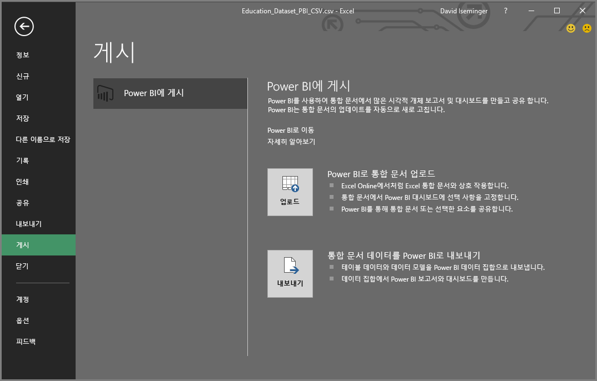
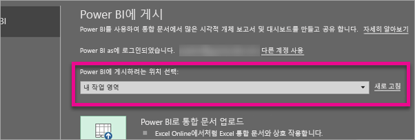
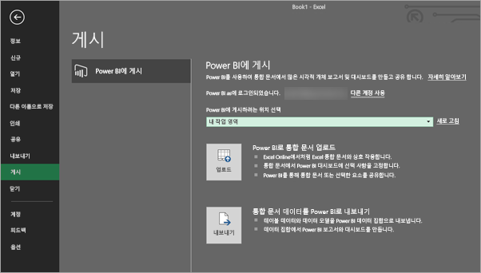
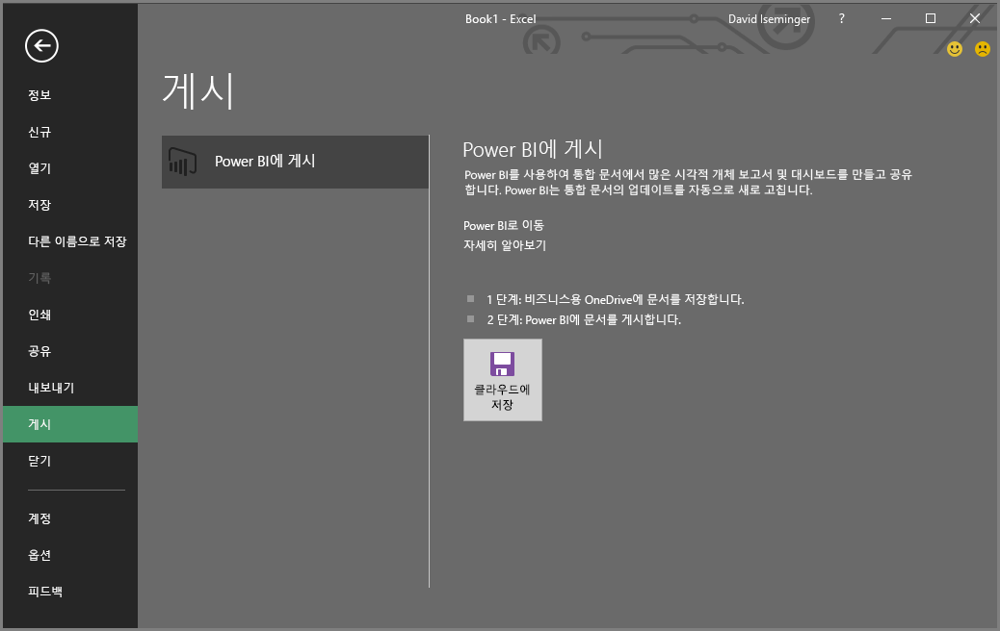

# Microsoft Excel에서 Power BI에 게시
Microsoft Excel 2016 이상에서는 [Power BI](https://powerbi.microsoft.com) 작업 영역에 직접 Excel 통합 문서를 게시할 수 있습니다. 그러면 통합 문서의 데이터를 기반으로 대화형 보고서 및 대시보드를 만들 수 있습니다. 그러면 조직에서 다른 사용자와 정보를 공유할 수 있습니다.

Power BI에 통합 문서를 게시하는 경우 다음과 같은 몇 가지 사항을 고려해야 합니다.

* Office, 비즈니스용 OneDrive(여기에 저장된 통합 문서를 사용하는 경우) 및 Power BI에 로그인하는 데 사용하는 계정은 동일한 계정이어야 합니다.
* 빈 통합 문서 또는 Power BI 지원 콘텐츠가 없는 통합 문서를 게시할 수 없습니다.
* 암호로 보호되고 정보 보호 관리가 있는 통합 문서인 암호화된 통합 문서를 게시할 수 없습니다.
* Power BI에 게시하려면 최신 인증이 사용하도록 설정되어 있어야 합니다(기본값). 사용하지 않도록 설정되어 있는 경우 파일 메뉴에서 게시 옵션을 사용할 수 없습니다.

## Excel 통합 문서에서 게시
Excel 통합 문서를 게시하려면 Excel에서 **파일** > **게시**를 선택하고 **업로드** 또는 **내보내기**를 선택합니다.

통합 문서를 Power BI에 **업로드**하는 경우 Excel Online을 사용하여 상호 작용하는 것처럼 통합 문서와 상호 작용할 수 있습니다. 또한 통합 문서의 선택 항목을 Power BI 대시보드에 고정하고 Power BI를 통해 통합 문서 또는 선택한 요소를 공유할 수 있습니다.

**내보내기**를 선택하는 경우 테이블 데이터와 해당 데이터 모델을 Power BI 데이터 세트로 내보낼 수 있습니다. 그러면 이 데이터 모델을 사용하여 Power BI 보고서와 대시보드를 만들 수 있습니다.

### 로컬 파일 게시
Excel은 로컬 Excel 파일의 게시를 지원합니다. 비즈니스용 OneDrive 또는 SharePoint Online에 저장할 필요는 없습니다.

> [!IMPORTANT]
> Microsoft 365 구독으로 Excel 2016 이상 버전을 사용하는 경우에만 로컬 파일을 게시할 수 있습니다. Excel 2016 독립 실행형 설치는 통합 문서가 비즈니스용 OneDrive 또는 SharePoint Online에 저장된 경우에만 Power BI에 게시할 수 있습니다.
> 

**게시**를 선택하는 경우 게시하려는 작업 영역을 선택할 수 있습니다. Excel 파일이 비즈니스용 OneDrive에 있는 경우 *내 작업 영역*에만 게시할 수 있습니다. Excel 파일이 로컬 드라이브에 있는 경우 *내 작업 영역* 또는 액세스 권한이 있는 공유 작업 영역에 게시할 수 있습니다.

통합 문서를 Power BI로 가져오는 두 가지 옵션.

통합 문서가 게시되면 게시하는 통합 문서 콘텐츠는 로컬 파일과 별도로 Power BI로 가져옵니다. Power BI에서 파일을 업데이트하려는 경우 업데이트된 버전을 다시 게시해야 합니다. 또는 통합 문서 또는 Power BI의 데이터 세트에서 예약된 새로 고침을 구성하여 데이터를 새로 고칠 수 있습니다.

### 독립 실행형 Excel 설치에서 게시
독립 실행형 Excel 설치에서 게시하는 경우 비즈니스용 OneDrive에 통합 문서를 저장해야 합니다. **클라우드로 저장**을 선택하고 비즈니스용 OneDrive에서 위치를 선택합니다.

통합 문서가 비즈니스용 OneDrive에 저장된 상태에서 **게시**를 선택하는 경우 통합 문서를 Power BI에 게시하는 두 가지 옵션 **업로드** 및 **내보내기**를 사용할 수 있습니다.

#### Power BI로 통합 문서 업로드
**업로드** 옵션을 선택하면 Excel Online에서와 같이 통합 문서가 Power BI에 나타납니다. 하지만 Excel Online과는 달리 워크시트의 요소를 대시보드에 고정할 수 있는 몇 가지 훌륭한 기능이 제공됩니다.

Power BI에서는 통합 문서를 편집할 수 없습니다. 데이터를 변경해야 할 경우 **편집**을 선택한 다음 Excel Online에서 통합 문서를 편집하거나 컴퓨터의 Excel에서 열 수 있습니다. 모든 변경 내용이 비즈니스용 OneDrive의 통합 문서에 저장됩니다.

**업로드**하면 Power BI에서 만들어지는 데이터 세트는 없습니다. 통합 문서는 작업 영역 탐색 창의 보고서에 나타납니다. Power BI로 업로드된 통합 문서에는 특별한 Excel 아이콘이 있어 업로드된 Excel 통합 문서임을 알 수 있습니다.

워크시트에 데이터만 있거나 Power BI에서 보고 싶은 피벗 테이블 및 차트가 있는 경우 **업로드** 옵션을 선택합니다.

Excel에서 Power BI에 게시에서 업로드 옵션을 사용하는 것은 브라우저의 Power BI에서 **데이터 가져오기 > 파일 > 비즈니스용 OneDrive > Power BI에서 Excel 연결, 관리 및 보기**를 사용하는 것과 비슷한 환경입니다.

#### 통합 문서 데이터를 Power BI로 내보내기
**내보내기** 옵션을 선택할 경우 테이블에서 지원되는 데이터 및/또는 데이터 모델을 Power BI에서 새로운 데이터 세트로 내보냅니다. 통합 문서의 모든 파워 뷰 시트가 Power BI에서 보고서로 다시 만들어집니다.

통합 문서 편집을 계속할 수 있습니다. 변경 내용이 저장되면 일반적으로 1시간 이내에 Power BI에서 해당 데이터 세트와 동기화됩니다. 보다 즉각적인 업데이트가 필요한 경우에는 Excel에서 다시 **게시**를 선택하면 변경 내용이 즉시 내보내집니다. 보고서 및 대시보드의 모든 시각화도 업데이트됩니다.

데이터 가져오기 및 변환 또는 파워 피벗 기능을 사용하여 데이터 모델로 데이터를 로드했거나 통합 문서에 Power BI에서 보려는 시각화가 포함된 파워 뷰 시트가 있을 경우 **게시** 옵션을 선택합니다.

**내보내기** 옵션을 사용하는 것은 브라우저의 Power BI에서 **데이터 가져오기 > 파일 > 비즈니스용 OneDrive > Power BI에서 Excel 데이터 내보내기**를 사용하는 것과 매우 비슷합니다.

## 게시
두 옵션 중 하나를 선택하면 Excel은 현재 계정으로 Power BI에 로그인한 다음 사용자의 통합 문서를 Power BI 작업 영역에 게시합니다. Excel에서 상태 표시줄을 모니터링하여 게시 프로세스의 진행 상황을 확인할 수 있습니다.

완료되면 Excel에서 바로 Power BI로 이동할 수 있습니다.

## 다음 단계
[Power BI의 Excel 데이터](service-excel-workbook-files.md)  
궁금한 점이 더 있나요? [Power BI 커뮤니티를 이용하세요.](https://community.powerbi.com/)

