# Power BI에서 템플릿 앱 만들기

Power BI *템플릿 앱*을 사용하면 Power BI 파트너는 코딩이 거의 없거나 전혀 없는 Power BI 앱을 만들고 모든 Power BI 고객에게 배포할 수 있습니다.  이 문서에는 Power BI 템플릿 앱을 만드는 단계별 지침이 포함되어 있습니다.

Power BI 보고서 및 대시보드를 만들 수 있는 사용자는 *템플릿 앱 작성자*가 될 수 있으며 분석 콘텐츠를 빌드하고 *앱*에 패키징할 수 있습니다. AppSource와 같은 사용 가능한 플랫폼을 통해 또는 자체 웹 서비스에서 사용하여 다른 Power BI 테넌트에 앱을 배포할 수 있습니다. 작성기는 배포를 위한 보호 분석 패키지를 만들 수 있습니다.

Power BI 관리자는 조직에서 템플릿 앱을 만들 수 있는 사람과 설치할 수 있는 사람을 관리하고 제어합니다. 권한이 있는 사용자는 템플릿 앱을 설치한 다음, 이를 수정하여 조직의 Power BI 소비자에게 배포할 수 있습니다.

## 필수 조건

템플릿 앱을 빌드하기 위한 요구 사항은 다음과 같습니다.  

- [Power BI pro 라이선스](../fundamentals/service-self-service-signup-for-power-bi.md)
- [Power BI Desktop 설치](../fundamentals/desktop-get-the-desktop.md)(선택 사항)
- [Power BI의 기본 개념](../fundamentals/service-basic-concepts.md) 숙지
- 템플릿 앱을 공개적으로 공유할 수 있는 권한(자세한 내용은 Power BI [관리 포털, 템플릿 앱 설정 참조](../admin/service-admin-portal.md#template-apps-settings)

## 템플릿 작업 영역 만들기

다른 Power BI 테넌트에 배포할 수 있는 템플릿 앱을 만들려면 새 작업 영역 중 하나에서 만들어야 합니다.

1. Power BI 서비스에서 **작업 영역** > **작업 영역 만들기**를 선택합니다.

    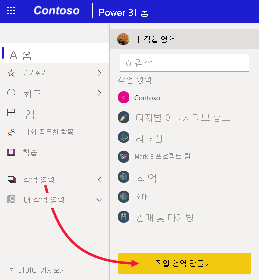

2. **작업 영역 만들기**에서 작업 영역의 이름, 설명(선택 사항) 및 로고 이미지(선택 사항)를 입력합니다.

    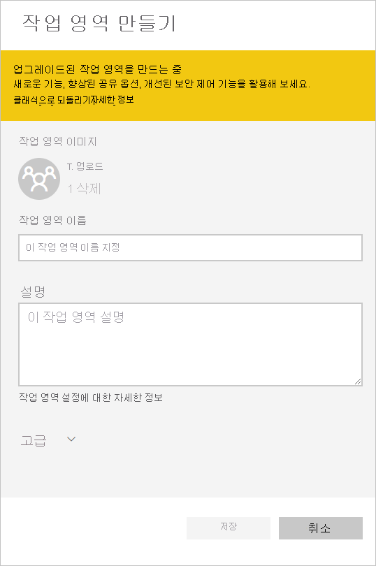

4. **고급** 섹션을 확장하고 **템플릿 앱 개발**을 선택합니다.

    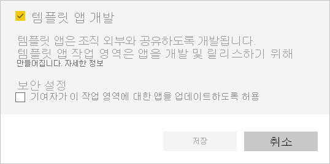

5. **저장**을 선택합니다.
>[!NOTE]
>템플릿 앱을 승격하려면 Power BI 관리자의 권한이 필요합니다.

## 템플릿 앱 작업 영역에 콘텐츠 추가

일반 Power BI 작업 영역에서와 마찬가지로 다음 단계는 작업 영역에 콘텐츠를 추가하는 것입니다.  

- 작업 영역에서 [Power BI 콘텐츠를 만듭니다](index.yml).

파워 쿼리에서 매개 변수를 사용하는 경우, 매개 변수가 잘 정의된 형식(예: 텍스트)인지 확인합니다. Any 및 Binary 형식은 지원되지 않습니다.

[Power BI에서 템플릿 앱 작성 팁](service-template-apps-tips.md)에는 템플릿 앱에 대한 보고서와 대시보드를 만들 때 고려해야 할 제안 사항이 있습니다.

## 템플릿 앱의 속성 정의

이제 작업 영역에 콘텐츠가 있으므로 템플릿 앱에 패키징할 준비가 되었습니다. 첫 번째 단계는 테넌트의 조직 내에서만 액세스할 수 있는 테스트 템플릿 앱을 만드는 것입니다.

1. 템플릿 앱 작업 영역에서 **앱 만들기**를 선택합니다.

    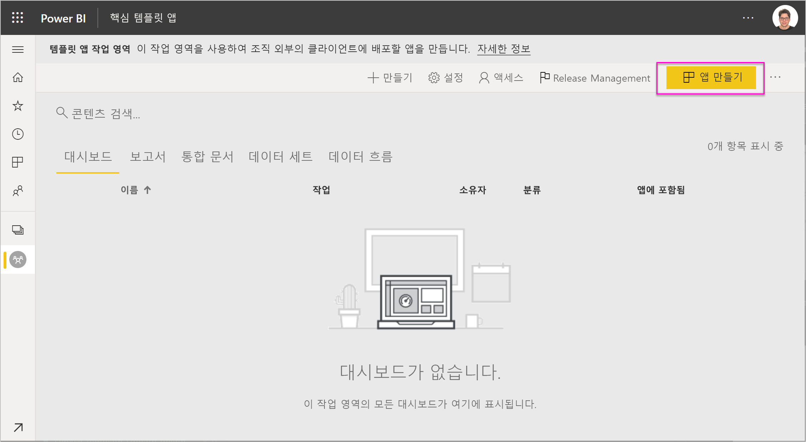

    이제 여섯 개의 탭에서 템플릿 앱의 추가 빌드 옵션을 입력합니다.

    **브랜딩**

    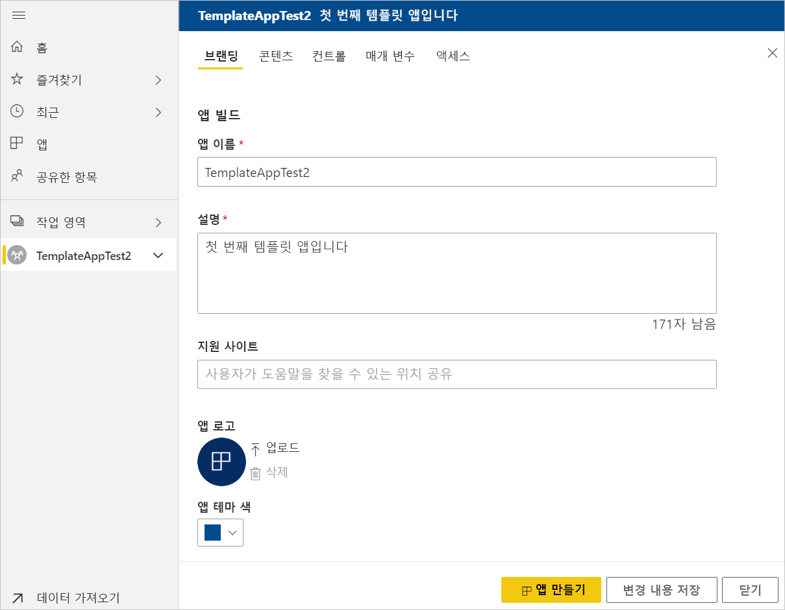
    - 앱 이름
    - Description
    - 지원 사이트(링크는 조직 앱으로 템플릿 앱을 재배포한 후 앱 정보에서 제공됨)
    - 앱 로고(45K 파일 크기 제한, 1:1 가로 세로 비율, .png .jpg .jpeg 형식)
    - 앱 테마 색

    **탐색**

    앱의 탐색 창을 정의할 수 있는 **새 탐색 작성기**를 활성화합니다(자세한 내용은 이 문서의 [탐색 환경 디자인](../collaborate-share/service-create-distribute-apps.md#design-the-navigation-experience) 참조).

   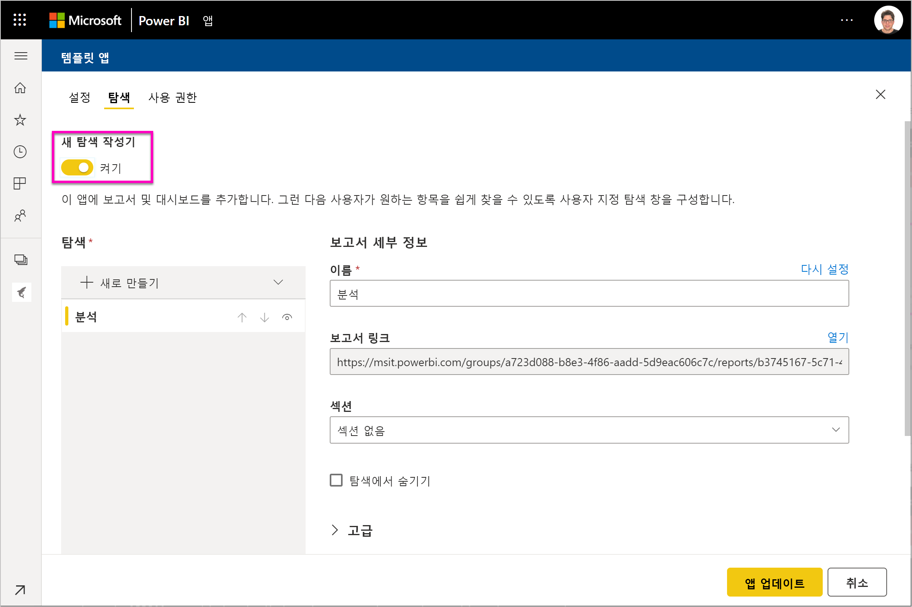
    
    **앱 방문 페이지:** 탐색 작성기를 옵트아웃하려고 한 경우에는 앱 방문 페이지를 선택할 수 있습니다. 보고서 또는 대시보드를 앱의 방문 페이지로 정의합니다. 올바른 권한을 부여하는 방문 페이지를 사용합니다.

    **제어**

    앱 사용자가 앱의 콘텐츠에 대해 갖게 될 제한 사항을 설정합니다. 이 컨트롤을 사용하여 앱의 지적 재산을 보호할 수 있습니다.

    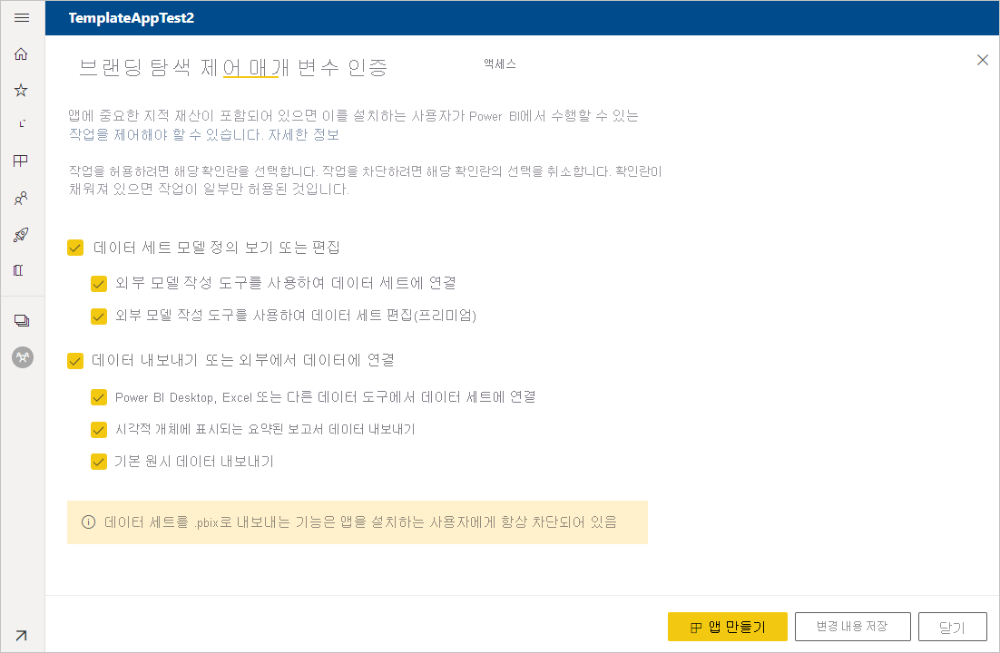

    >[!NOTE]
    >.pbix 형식으로 내보내기는 앱을 설치하는 사용자에 대해 항상 차단됩니다.

    **매개 변수**

    매개 변수는 원래의 .pbix 파일에 생성됩니다([쿼리 매개 변수 만들기](https://powerbi.microsoft.com/blog/deep-dive-into-query-parameters-and-power-bi-templates/)에 대해 자세히 알아보세요). 앱 설치 관리자가 설치 후 데이터에 연결할 때 앱을 구성하도록 지원하려면 이 탭의 기능을 사용합니다.

    이 탭에서는 앱 설명서의 링크도 제공합니다.

    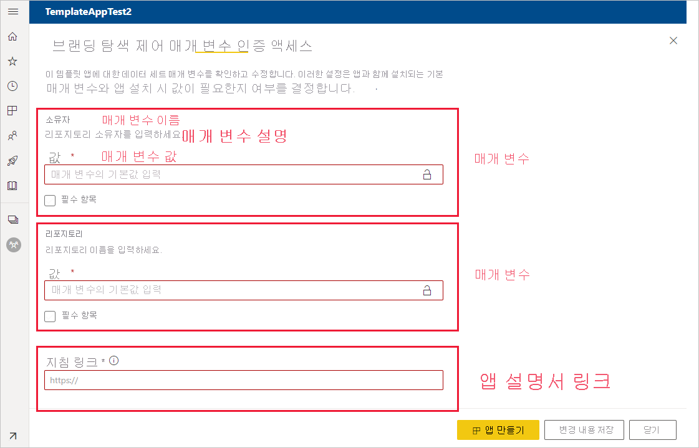

    각 매개 변수에는 쿼리에서 오는 이름과 설명 및 값 필드가 있습니다. 설치하는 동안 매개 변수의 값을 얻기 위한 세 가지 옵션이 있습니다.

    * 설치 관리자에 값을 입력하도록 요구할 수 있습니다. 이 경우 대체할 예제를 제공합니다. 이러한 방식으로 매개 변수를 구성하려면 **필수** 확인란을 선택하고 사용자에게 어떤 종류의 값을 입력해야 하는지를 보여 주는 예제를 텍스트 상자에 제공합니다. 예를 들면 다음과 같습니다.

       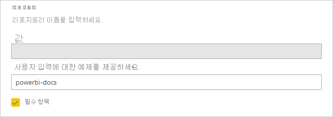

    * 앱을 설치하는 사용자가 변경할 수 없는 미리 채워진 값을 제공할 수 있습니다. 이 방식으로 구성된 매개 변수는 앱을 설치하는 사용자에게 표시되지 않습니다. 미리 채워진 값이 모든 사용자에게 유효한 경우에만 이 방법을 사용해야 합니다. 그 외의 경우에는 사용자가 입력하도록 하는 위에서 언급한 첫 번째 방법을 사용합니다.

       이 방식으로 매개 변수를 구성하려면 **값** 텍스트 상자에 값을 입력하고 잠금 아이콘을 클릭합니다. 이렇게 하면 값을 변경할 수 없게 됩니다. 예를 들면 다음과 같습니다.

       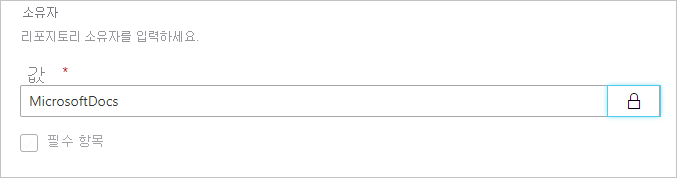

    * 설치하는 동안 사용자가 변경할 수 있는 기본값을 제공할 수 있습니다. 이 방식으로 매개 변수를 구성하려면 **값** 텍스트 상자에 원하는 기본값을 입력하고 잠금 아이콘의 잠금을 해제합니다. 예를 들면 다음과 같습니다.

      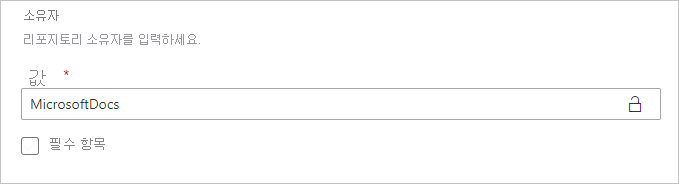

    **인증**
    
    이 탭에서는 사용할 인증 방법을 선택합니다. 사용 가능한 옵션은 사용 중인 데이터 원본 유형에 따라 달라집니다.

    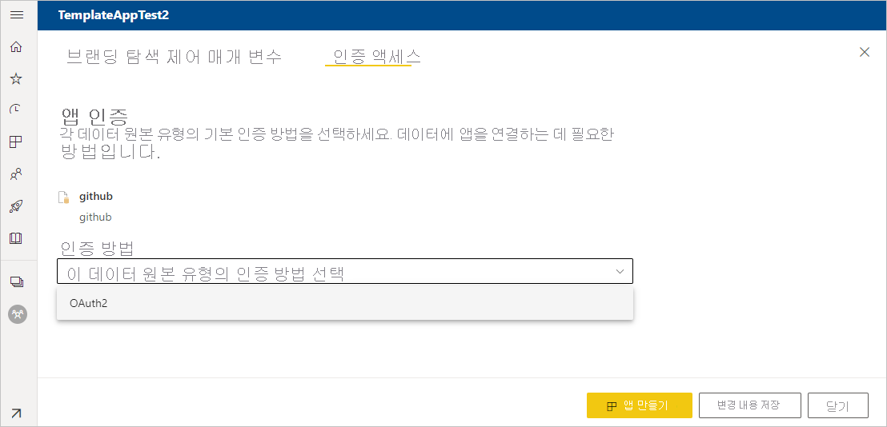

    개인 정보 수준은 자동으로 구성됩니다.
   * 단일 데이터 원본: 자동으로 비공개로 구성됩니다.
   * 다중 익명 데이터 원본: 자동으로 공개로 구성됩니다.

    **Access**
    
    테스트 단계에서는 앱을 설치하고 테스트할 수 있는 조직의 다른 사용자를 결정합니다. 걱정하지 마세요, 나중에 언제든지 돌아와서 이러한 설정을 변경할 수 있습니다. 설정은 배포된 템플릿 앱의 액세스에 영향을 미치지 않습니다.

    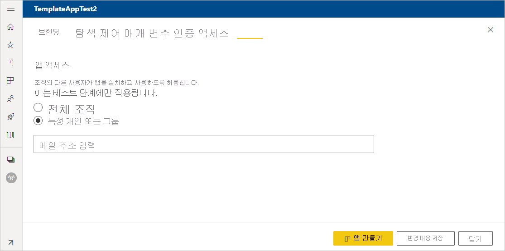

2. **앱 만들기**를 선택합니다.

    앱 테스터와 복사 및 공유할 수 있는 링크가 있는 테스트 앱이 준비되었다는 메시지가 표시됩니다.

    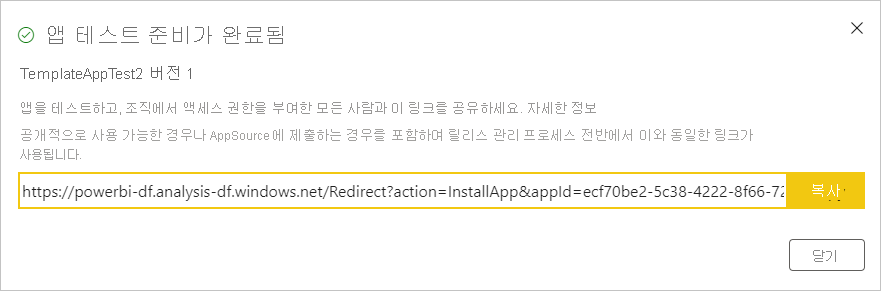

    다음 단계인 릴리스 관리 프로세스의 첫 번째 단계도 완료했습니다.

## 템플릿 앱 릴리스 관리

이 템플릿 앱을 공개적으로 릴리스하기 전에 이동할 준비가 되었는지 확인하려고 합니다. Power BI는 전체 앱 릴리스 경로를 따라 검사할 수 있는 릴리스 관리 창을 만들었습니다. 단계 간 전환을 트리거할 수도 있습니다. 일반적인 단계는 다음과 같습니다.

- 테스트 앱 생성: 조직 내에서만 테스트하기 위한 용도입니다.
- 테스트 패키지를 사전 프로덕션 단계로 승격: 조직 외부에서 테스트합니다.
- 사전 프로덕션 패키지를 프로덕션으로 승격: 프로덕션 버전입니다.
- 모든 패키지를 삭제하거나 이전 단계에서 다시 시작합니다.

URL은 릴리스 단계 간을 전환할 때 변경되지 않습니다. 승격은 URL 자체에 영향을 주지 않습니다.

단계를 진행해 보겠습니다.

1. 템플릿 작업 영역에서 **릴리스 관리**를 선택합니다.

    

2. 위의 **템플릿 앱의 속성 정의** 섹션에서 테스트 앱을 만든 경우 **링크 가져오기**를 선택합니다(그 결과 **테스트** 옆의 노란색 점이 이미 채워짐).

    앱을 아직 만들지 않은 경우 **앱 만들기**를 선택합니다. 그러면 템플릿 앱 만들기 프로세스로 돌아가게 됩니다.

    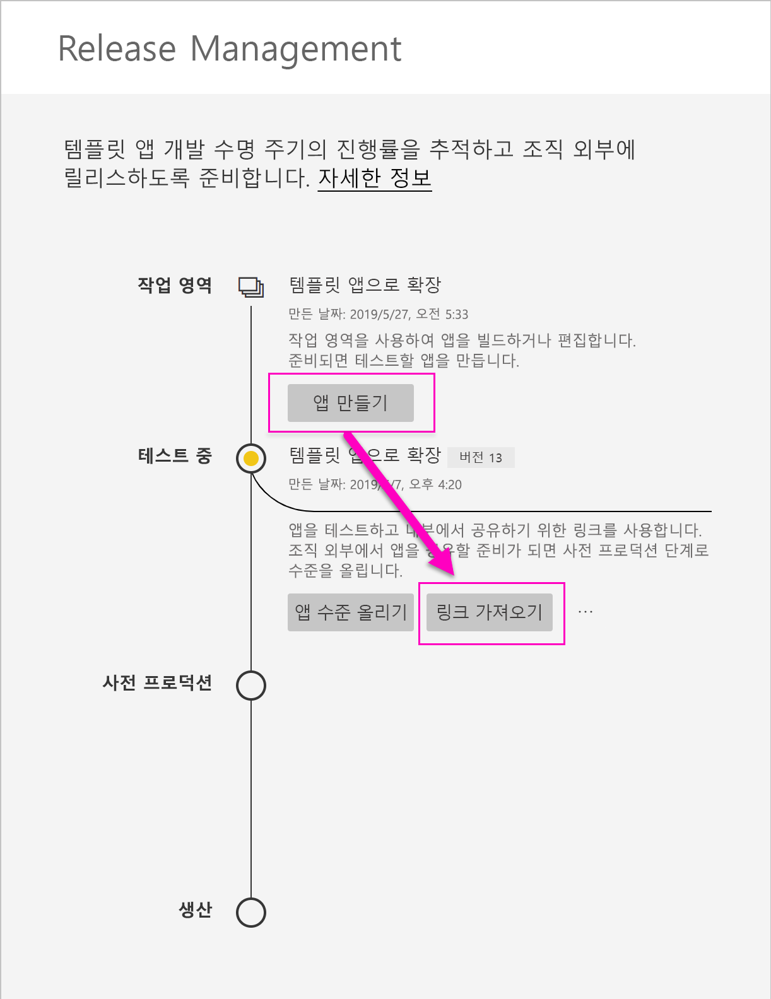

4. 앱 설치 환경을 테스트하려면 알림 창에서 링크를 복사하여 새 브라우저 창에 붙여넣습니다.

    여기에서 고객이 수행해야 할 동일한 절차를 수행하고 있습니다. [조직에 템플릿 앱 설치 및 배포](service-template-apps-install-distribute.md)를 참조하세요.

5. 대화 상자에서 **설치**를 선택합니다.

    설치가 성공하면 새 앱이 준비되었다는 알림이 표시됩니다.

6. **앱으로 이동**을 선택합니다.
7. **새 앱 시작**에서 고객에게 표시된 것처럼 앱이 표시됩니다.

    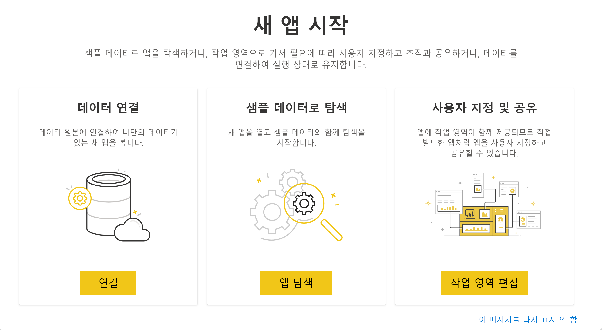
8. **앱 탐색**을 선택하여 샘플 데이터로 테스트 앱을 확인합니다.
9. 변경하려면 원래 작업 영역의 앱으로 돌아갑니다. 만족할 때까지 테스트 앱을 업데이트하세요.
10. 테넌트 외부 테스트에 대한 사전 프로덕션으로 앱을 승격할 준비가 되었으면 **릴리스 관리** 창으로 돌아가서 **앱 승격**을 선택합니다.

    
    >[!NOTE]
    > 앱이 승격되는 경우 조직 외부에서 공개적으로 사용할 수 있게 됩니다.

    해당 옵션이 표시되지 않으면 Power BI 관리자에게 문의하여 관리 포털에서 [템플릿 앱 개발에 대한 권한](../admin/service-admin-portal.md#template-apps-settings)을 부여합니다.
11. **승격**을 선택하여 선택 사항을 확인합니다.
12. 테스트를 위해 이 새 URL을 복사하여 테넌트 외부에서 공유합니다. 이 링크는 또한 [새 파트너 센터 제품](/azure/marketplace/partner-center-portal/create-power-bi-app-offer)을 만들어 AppSource에 앱을 배포하는 프로세스를 시작하기 위해 제출하는 링크입니다. 파트너 센터에 대한 사전 프로덕션 링크만 제출하세요. 앱이 승격되고 AppSource에 게시되었다는 알림을 받은 후에만 이 패키지를 Power BI의 프로덕션으로 승격할 수 있습니다.
13. AppSource를 통해 프로덕션 또는 공유할 준비가 되면 **Release Management** 창으로 돌아가서 **사전 프로덕션** 옆의 **앱 승격**을 선택합니다.
14. **승격**을 선택하여 선택 사항을 확인합니다.

    이제 앱이 프로덕션 중이며 배포할 준비가 되었습니다.

    

전 세계 수천 명의 Power BI 사용자가 앱을 널리 이용할 수 있도록 AppSource에 제출하는 것이 좋습니다. 자세한 내용은 [Power BI 애플리케이션 제안](/azure/marketplace/partner-center-portal/create-power-bi-app-offer)을 참조하세요.

## 다음 단계

[조직의 템플릿 앱 설치, 사용자 지정 및 배포](service-template-apps-install-distribute.md)에서 고객이 템플릿 앱과 상호 작용하는 방법을 참조하세요.

앱 배포에 대한 자세한 내용은 [Power BI 애플리케이션 제안](/azure/marketplace/partner-center-portal/create-power-bi-app-offer)을 참조하세요.