# 조직에 템플릿 앱 설치 및 배포

Power BI 분석가인가요? 그렇다면 이 문서에서는 Salesforce, Microsoft Dynamics, Google Analytics와 같이 비즈니스를 실행하는 데 사용하는 여러 서비스를 연결하기 위해 [템플릿 앱](service-template-apps-overview.md)을 설치하는 방법을 설명합니다. 그런 다음, 조직의 요구 사항에 맞게 템플릿 앱의 미리 빌드된 대시보드 및 보고서를 수정하고 [앱](../consumer/end-user-apps.md)으로 동료에게 배포할 수 있습니다. 

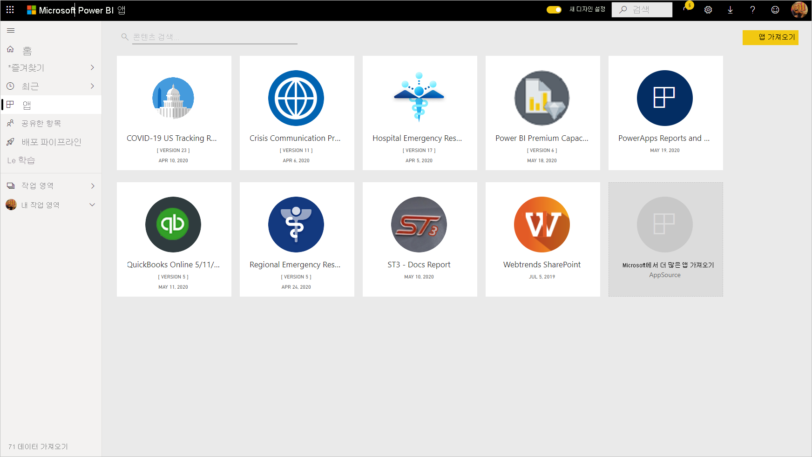

조직 외부에 배포하기 위해 템플릿 앱을 직접 만드는 데 관심이 있는 경우 [Power BI에서 템플릿 앱 만들기](service-template-apps-create.md)를 참조하세요. Power BI 파트너는 코딩이 거의 없거나 전혀 없이 Power BI 앱을 빌드하고 Power BI 고객에게 제공할 수 있습니다. 

## 필수 조건  

템플릿 앱을 설치, 사용자 지정 및 배포하려면 다음이 필요합니다. 

* [Power BI Pro 라이선스](../fundamentals/service-self-service-signup-for-power-bi.md)
* 테넌트에 템플릿 앱을 설치할 권한.
* AppSource 또는 앱 작성자에서 가져오는 앱의 유효한 설치 링크.
* [Power BI의 기본 개념](../fundamentals/service-basic-concepts.md)에 대한 이해.

## 템플릿 앱 설치

1. Power BI 서비스의 탐색 창에서 **앱** > **앱 가져오기**를 선택합니다.

    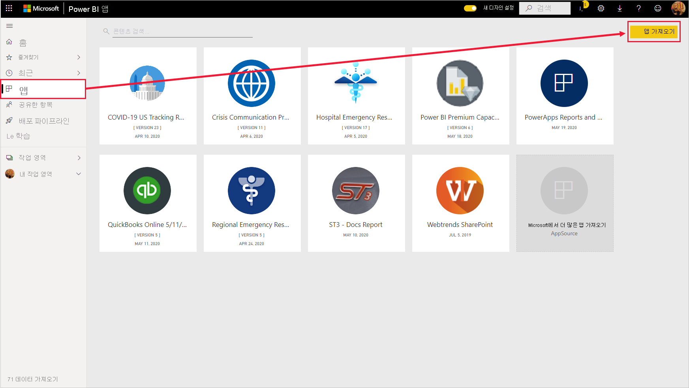

1. 표시되는 AppSource 창에서 **앱**을 선택합니다. 원하는 앱을 찾아보거나 검색한 다음, **지금 가져오기**를 선택합니다.

    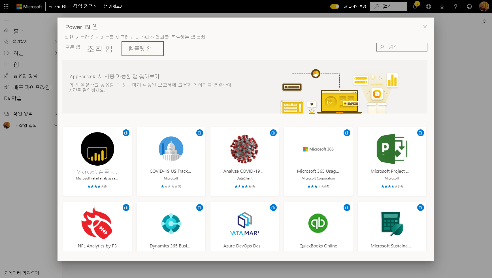

1. 표시되는 대화 상자에서 **설치**를 선택합니다.

    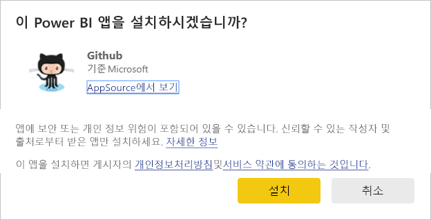
    
    앱은 연결된 작업 영역을 사용하여 설치됩니다. **앱을 사용자 지정하는 경우 이 연결된 작업 영역에서 작업을 수행합니다**.

    > [!NOTE]
    > AppSource에 나열되지 않은 앱의 설치 링크를 사용하면 유효성 검사 대화 상자에 선택을 확인하라는 메시지가 표시됩니다.
    >
    >AppSource에 나열되지 않은 템플릿 앱을 설치하려면 관리자에게 관련 권한을 요청해야 합니다. 자세한 내용은 Power BI 관리 포털에서 [템플릿 앱 설정](../admin/service-admin-portal.md#template-apps-settings)을 참조하세요.

    설치가 성공적으로 완료되면 새 앱이 준비되었다는 알림이 표시됩니다.

    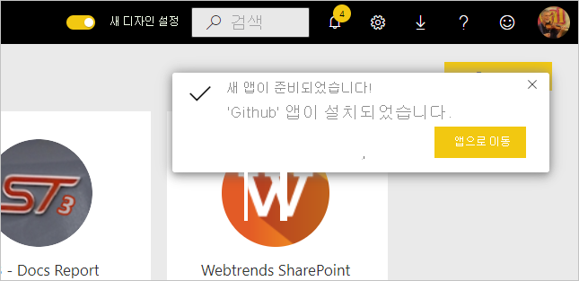

## 데이터에 연결

1. **앱으로 이동**을 선택합니다. **새 앱 시작** 창이 표시됩니다.

   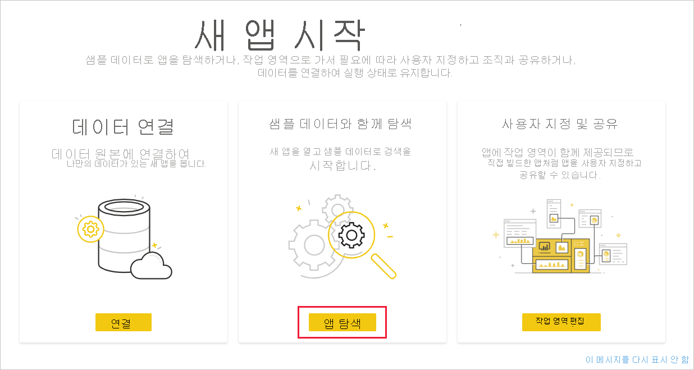

1. **연결**을 클릭합니다.
    
    데이터 원본을 샘플 데이터에서 사용자 고유의 데이터 원본으로 변경하는 대화 상자 또는 일련의 대화 상자가 열립니다. 일반적으로 데이터 세트 매개 변수 및 데이터 원본 자격 증명이 다시 정의됩니다. [알려진 제한 사항](service-template-apps-overview.md#known-limitations)을 참조하세요.
    
    아래 예제에서는 데이터에 연결하는 데 두 개의 대화 상자가 사용됩니다.

   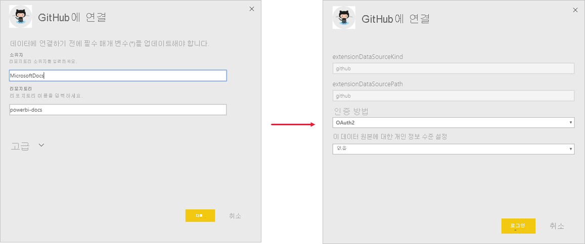

    연결 대화 상자 입력을 완료하면 연결 프로세스가 시작됩니다. 배너에서 샘플 데이터를 보고 있음을 알려 줍니다.

    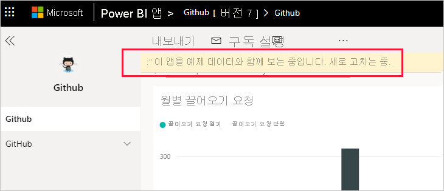

    데이터의 연결 및 업데이트가 완료될 때까지 기다립니다. 이 프로세스가 완료된 시간을 확인하려면 데이터 세트 행(새로운 디자인) 또는 탭(이전 디자인)에서 진행률 표시기를 확인합니다.

   연결 및 데이터 새로 고침이 완료되면 브라우저를 새로 고칩니다. 이제 배너에서 앱의 변경 내용을 적용하고 공유하려면 앱을 업데이트해야 함을 알려 줍니다.

    

## 앱 사용자 지정 및 공유

데이터에 연결 및 데이터 새로 고침 후 브라우저를 새로 고치면 이제 앱과 연결된 작업 영역이 표시됩니다. 이때 모든 작업 영역에서 편집하는 것처럼 아티팩트를 편집할 수 있습니다. 그러나 변경한 항목을 다른 이름으로 저장하지 않는 한, 새 버전으로 앱을 업데이트하면 변경 내용을 덮어씁니다. [덮어쓰기에 대한 자세한 내용을 참조하세요](#overwrite-behavior).

작업 영역에서 아티팩트를 편집하는 방법에 대한 자세한 내용은 다음을 참조하세요.
* [Power BI의 보고서 편집기 둘러보기](../create-reports/service-the-report-editor-take-a-tour.md)
* [Power BI 서비스의 디자이너를 위한 기본 개념](../fundamentals/service-basic-concepts.md)

작업 영역에서 아티팩트 변경을 완료하면 앱을 게시하고 공유할 준비가 됩니다. 이 작업을 수행하는 방법을 알아보려면 [앱 게시](../collaborate-share/service-create-distribute-apps.md#publish-your-app)를 참조하세요.

## 템플릿 앱 업데이트

때때로 템플릿 앱 작성자는 AppSource, 직접 링크 또는 둘 다를 통해 새로운 향상된 버전의 템플릿 앱을 릴리스합니다.

처음에 AppSource에서 앱을 다운로드한 경우 새 버전의 템플릿 앱을 사용할 수 있게 되면 다음 두 가지 방법으로 알림이 표시됩니다.
* 새 앱 버전을 사용할 수 있음을 알리는 업데이트 배너가 Power BI 서비스에 나타납니다.
  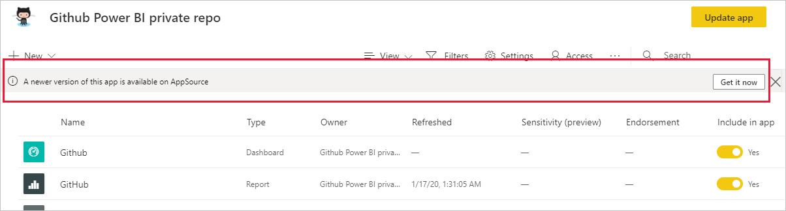
* Power BI 알림 창에서 알림을 받습니다.

  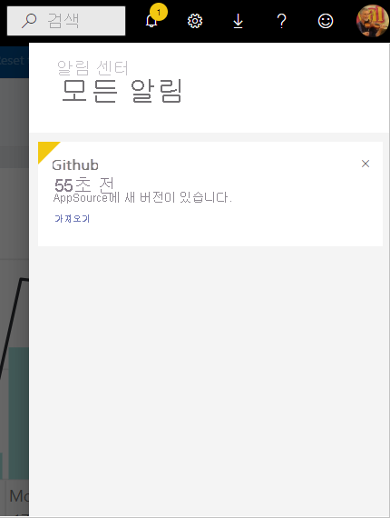

>[!NOTE]
>처음에 AppSource가 아닌 직접 링크를 통해 앱을 다운로드한 경우 새 버전을 사용할 수 있는 시기를 알 수 있는 유일한 방법은 템플릿 앱 작성자에게 문의하는 것입니다.

  업데이트를 설치하려면 알림 배너 또는 알림 센터에서 **지금 얻기**를 클릭하거나, AppSource에서 앱을 다시 찾고 **지금 가져오기**를 선택합니다. 템플릿 앱 작성자가 제공하는 업데이트의 직접 링크를 얻은 경우 링크를 클릭하면 됩니다.
  
  현재 버전을 덮어쓸지, 아니면 새 작업 영역에 새 버전을 설치할지 묻는 메시지가 표시됩니다. 기본적으로 “덮어쓰기”가 선택되어 있습니다.

  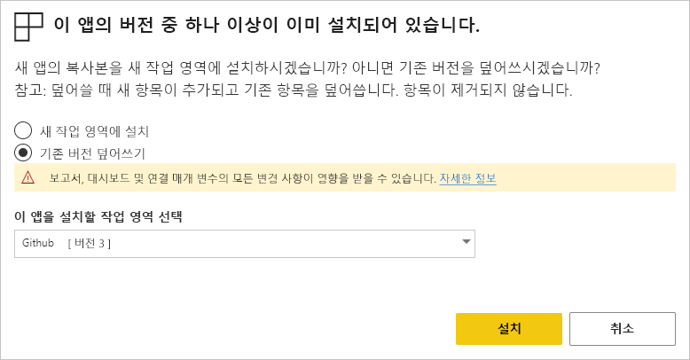

- **기존 버전 덮어쓰기:** 템플릿 앱의 업데이트된 버전으로 기존 작업 영역을 덮어씁니다. [덮어쓰기에 대한 자세한 내용을 참조하세요](#overwrite-behavior).

- **새 작업 영역에 설치:** 다시 구성(데이터에 연결, 탐색 및 권한 정의)해야 하는 작업 영역과 앱의 새 버전을 설치합니다.

### 덮어쓰기 동작

* 덮어쓰기를 수행하면 앱이 아닌 작업 영역 내부의 보고서, 대시보드 및 데이터 세트가 업데이트됩니다. 덮어쓰기를 수행해도 앱 탐색, 설정 및 권한은 변경되지 않습니다.
* 작업 영역을 업데이트한 후에는 **앱을 업데이트하여 작업 영역의 변경 내용을 앱에 적용해야 합니다**.
* 덮어쓰기를 수행해도 구성된 매개 변수와 인증은 유지됩니다. 업데이트 후에는 자동 데이터 세트 새로 고침이 시작됩니다. **새로 고치는 동안 앱, 보고서 및 대시보드에 샘플 데이터가 제공됩니다**.

  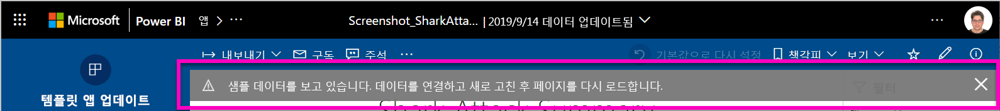

* 덮어쓰기를 수행하면 새로 고침이 완료되기 전까지 항상 샘플 데이터가 표시됩니다. 템플릿 앱 작성자가 데이터 세트 또는 매개 변수를 변경해도 작업 영역 및 앱의 사용자에게는 새로 고침이 완료될 때까지 새 데이터가 표시되지 않습니다. 오히려 이 기간에는 계속해서 샘플 데이터가 표시됩니다.
* 덮어쓰기가 수행되어도 사용자가 작업 영역에 추가한 새 보고서와 대시보드는 삭제되지 않습니다. 단지 원래 보고서와 대시보드를 원래 작성자가 적용한 변경 내용으로 덮어씁니다.

>[!IMPORTANT]
>덮어쓰기를 수행한 후에는 [앱을 업데이트](#customize-and-share-the-app)하여 조직 앱 사용자를 위해 보고서와 대시보드에 변경 사항을 적용해야 합니다.

## 다음 단계

[Power BI에서 동료와 작업 영역 만들기](../collaborate-share/service-create-workspaces.md)
