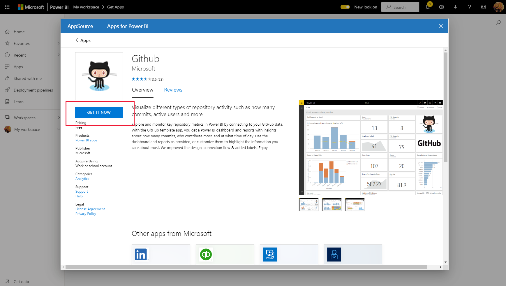

# 조직에 템플릿 앱 설치 및 배포

Power BI 분석가인가요? 그렇다면 이 문서에서는 Salesforce, Microsoft Dynamics, Google Analytics와 같이 비즈니스를 실행하는 데 사용하는 여러 서비스를 연결하기 위해 [템플릿 앱](service-template-apps-overview.md)을 설치하는 방법을 설명합니다. 그런 다음, 조직의 요구 사항에 맞게 템플릿 앱의 미리 빌드된 대시보드 및 보고서를 수정하고 [앱](../consumer/end-user-apps.md)으로 동료에게 배포할 수 있습니다. 

조직 외부에 배포하기 위해 템플릿 앱을 직접 만드는 데 관심이 있는 경우 [Power BI에서 템플릿 앱 만들기](service-template-apps-create.md)를 참조하세요. Power BI 파트너는 코딩이 거의 없거나 전혀 없이 Power BI 앱을 빌드하고 Power BI 고객에게 제공할 수 있습니다. 

## 필수 조건  

템플릿 앱을 설치, 사용자 지정 및 배포하려면 다음이 필요합니다. 

* [Power BI Pro 라이선스](../fundamentals/service-self-service-signup-for-power-bi.md)
* 테넌트에 템플릿 앱을 설치할 권한.
* AppSource 또는 앱 작성자에서 가져오는 앱의 유효한 설치 링크.
* [Power BI의 기본 개념](../fundamentals/service-basic-concepts.md)에 대한 이해.

## 템플릿 앱 설치

1. Power BI 서비스의 탐색 창에서 **앱** > **앱 가져오기** 를 선택합니다.

    

1. 표시되는 Power BI 앱 마켓플레이스에서 **템플릿 앱** 을 선택합니다. AppSource에서 사용할 수 있는 모든 템플릿 앱이 표시됩니다. 원하는 템플릿 앱을 찾아보거나 검색 상자를 사용하여 필터링된 선택 항목을 가져옵니다. 템플릿 앱 이름 또는 재무, 분석, 마케팅 등과 같은 범주의 이름 일부를 입력하면 원하는 항목을 보다 쉽게 찾을 수 있습니다.

    

1. 찾고 있는 템플릿 앱을 찾았으면 클릭합니다. 템플릿 앱 제품이 표시됩니다. **지금 가져오기** 를 클릭합니다.

   

1. 표시되는 대화 상자에서 **설치** 를 선택합니다.

    
    
    추가 [사용자 지정](#customize-and-share-the-app)에 필요한 모든 아티팩트가 있는 같은 이름의 작업 영역과 함께 앱이 설치됩니다.

    > [!NOTE]
    > AppSource에 나열되지 않은 앱의 설치 링크를 사용하면 유효성 검사 대화 상자에 선택을 확인하라는 메시지가 표시됩니다.
    >
    >AppSource에 나열되지 않은 템플릿 앱을 설치하려면 관리자에게 관련 권한을 요청해야 합니다. 자세한 내용은 Power BI 관리 포털에서 [템플릿 앱 설정](../admin/service-admin-portal.md#template-apps-settings)을 참조하세요.

    설치가 성공적으로 완료되면 새 앱이 준비되었다는 알림이 표시됩니다.

    

## 데이터에 연결

1. **앱으로 이동** 을 선택합니다.

   앱이 열리고 샘플 데이터가 표시됩니다.

1. 페이지 맨 위에 있는 배너에서 **데이터 연결** 링크를 선택합니다.

   

    이렇게 하면 데이터 원본을 샘플 데이터에서 자체 데이터 원본으로 변경하는 매개 변수 대화 상자([알려진 제한 사항 ](service-template-apps-overview.md#known-limitations) 참조)가 열린 다음 인증 방법 대화 상자가 열립니다. 이러한 대화 상자에서 값을 다시 정의해야 할 수도 있습니다. 자세한 내용은 설치 중인 특정 템플릿 앱의 설명서를 참조하세요.

   

    연결 대화 상자 입력을 완료하면 연결 프로세스가 시작됩니다. 배너에서는 데이터가 새로 고쳐지고 있고 그동안 샘플 데이터가 표시된다고 알려줍니다.

    

   로그인 과정에 사용하지 않도록 설정하지 않으면 보고서 데이터가 하루에 한 번 자동으로 새로 고쳐집니다. 원하는 경우 [새로 고침 일정을 직접 설정](./refresh-scheduled-refresh.md)하여 보고서 데이터를 최신 상태로 유지할 수도 있습니다.

## 앱 사용자 지정 및 공유

데이터에 연결하고 데이터 새로 고침이 완료되면 앱에 포함된 보고서 및 대시보드를 사용자 지정하고 동료와 앱을 공유할 수 있습니다. 그러나 변경한 항목을 다른 이름으로 저장하지 않는 한, 새 버전으로 앱을 업데이트하면 변경 내용을 덮어씁니다. [덮어쓰기에 대한 자세한 내용을 참조하세요](#overwrite-behavior).

앱을 사용자 지정하고 공유하려면 페이지의 오른쪽 위 모서리의 연필 아이콘을 선택합니다.

작업 영역에서 아티팩트를 편집하는 방법에 대한 자세한 내용은 다음을 참조하세요.
* [Power BI의 보고서 편집기 둘러보기](../create-reports/service-the-report-editor-take-a-tour.md)
* [Power BI 서비스의 디자이너를 위한 기본 개념](../fundamentals/service-basic-concepts.md)

작업 영역에서 아티팩트 변경을 완료하면 앱을 게시하고 공유할 준비가 됩니다. 이 작업을 수행하는 방법을 알아보려면 [앱 게시](../collaborate-share/service-create-distribute-apps.md#publish-your-app)를 참조하세요.

## 템플릿 앱 업데이트

때때로 템플릿 앱 작성자는 AppSource, 직접 링크 또는 둘 다를 통해 새로운 향상된 버전의 템플릿 앱을 릴리스합니다.

처음에 AppSource에서 앱을 다운로드한 경우 새 버전의 템플릿 앱을 사용할 수 있게 되면 다음 두 가지 방법으로 알림이 표시됩니다.
* 새 앱 버전을 사용할 수 있음을 알리는 업데이트 배너가 Power BI 서비스에 나타납니다.
  
* Power BI 알림 창에서 알림을 받습니다.

  

>[!NOTE]
>처음에 AppSource가 아닌 직접 링크를 통해 앱을 다운로드한 경우 새 버전을 사용할 수 있는 시기를 알 수 있는 유일한 방법은 템플릿 앱 작성자에게 문의하는 것입니다.

  업데이트를 설치하려면 알림 배너 또는 알림 센터에서 **지금 얻기** 를 클릭하거나, AppSource에서 앱을 다시 찾고 **지금 가져오기** 를 선택합니다. 템플릿 앱 작성자가 제공하는 업데이트의 직접 링크를 얻은 경우 링크를 클릭하면 됩니다.
  
  현재 버전을 덮어쓸지, 아니면 새 작업 영역에 새 버전을 설치할지 묻는 메시지가 표시됩니다. 기본적으로 “덮어쓰기”가 선택되어 있습니다.

  

- **기존 버전 덮어쓰기:** 템플릿 앱의 업데이트된 버전으로 기존 작업 영역을 덮어씁니다. [덮어쓰기에 대한 자세한 내용을 참조하세요](#overwrite-behavior).

- **새 작업 영역에 설치:** 다시 구성(데이터에 연결, 탐색 및 권한 정의)해야 하는 작업 영역과 앱의 새 버전을 설치합니다.

### 덮어쓰기 동작

* 덮어쓰기를 수행하면 앱이 아닌 작업 영역 내부의 보고서, 대시보드 및 데이터 세트가 업데이트됩니다. 덮어쓰기를 수행해도 앱 탐색, 설정 및 권한은 변경되지 않습니다.
* 작업 영역을 업데이트한 후에는 **앱을 업데이트하여 작업 영역의 변경 내용을 앱에 적용해야 합니다**.
* 덮어쓰기를 수행해도 구성된 매개 변수와 인증은 유지됩니다. 업데이트 후에는 자동 데이터 세트 새로 고침이 시작됩니다. **새로 고치는 동안 앱, 보고서 및 대시보드에 샘플 데이터가 제공됩니다**.

  

* 덮어쓰기를 수행하면 새로 고침이 완료되기 전까지 항상 샘플 데이터가 표시됩니다. 템플릿 앱 작성자가 데이터 세트 또는 매개 변수를 변경해도 작업 영역 및 앱의 사용자에게는 새로 고침이 완료될 때까지 새 데이터가 표시되지 않습니다. 오히려 이 기간에는 계속해서 샘플 데이터가 표시됩니다.
* 덮어쓰기가 수행되어도 사용자가 작업 영역에 추가한 새 보고서와 대시보드는 삭제되지 않습니다. 단지 원래 보고서와 대시보드를 원래 작성자가 적용한 변경 내용으로 덮어씁니다.

>[!IMPORTANT]
>덮어쓰기를 수행한 후에는 [앱을 업데이트](#customize-and-share-the-app)하여 조직 앱 사용자를 위해 보고서와 대시보드에 변경 사항을 적용해야 합니다.

## 템플릿 앱 삭제

설치된 템플릿 앱은 앱과 관련 작업 영역으로 구성됩니다. 템플릿 앱을 제거하려는 경우 두 가지 옵션이 있습니다.
* **앱 및 관련 작업 영역을 완전히 제거** 합니다. 템플릿 앱 및 관련 작업 영역을 완전히 제거하려면 앱 페이지의 앱 타일로 이동하여 휴지통 아이콘을 선택한 다음, 표시되는 대화 상자에서 **삭제** 를 클릭합니다.
* **앱 게시 취소**: 이 옵션은 앱을 제거하지만 관련 작업 영역은 유지합니다. 이 옵션은 예를 들어 유지하려는 사용자 지정 항목이 있는 경우에 유용합니다.

    앱 게시를 취소하려면 다음을 수행합니다.
    1. 앱을 엽니다.
    1. 앱 편집 연필 아이콘을 클릭하여 템플릿 앱의 작업 영역을 엽니다.
    1. 템플릿 앱 작업 영역에서 **추가 옵션(...)** 을 선택한 다음, **앱 게시 취소** 를 선택합니다.

        

## 다음 단계

[Power BI에서 동료와 작업 영역 만들기](../collaborate-share/service-create-the-new-workspaces.md)
