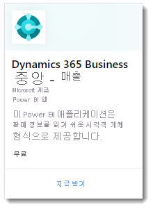
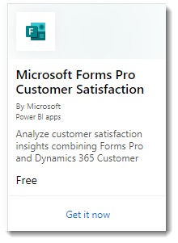

# Power BI 템플릿 앱이란?

새 Power BI *템플릿 앱*을 사용하면 Power BI 파트너는 코딩이 거의 없거나 전혀 없는 Power BI 앱을 만들고 모든 Power BI 고객에게 배포할 수 있습니다.  이 문서는 Power BI 템플릿 앱 프로그램의 개요입니다.

Power BI 파트너로서 고객이 즉시 사용할 수 있는 콘텐츠 세트를 만들고 직접 게시할 수 있습니다.  

고객이 자신의 계정에서 연결하고 인스턴스화할 수 있는 템플릿 앱을 빌드합니다. 도메인 전문가는 비즈니스 사용자가 쉽게 사용할 수 있는 방식으로 데이터의 잠금을 해제할 수 있습니다.  

파트너 센터에 템플릿 앱을 제출합니다. 그러면 앱은 [Power BI 앱 마켓플레이스](https://app.powerbi.com/getdata/services) 및 [Microsoft AppSource](https://appsource.microsoft.com/?product=power-bi)에서 공개적으로 사용할 수 있게 됩니다. 다음은 공용 템플릿 앱 생성 환경을 개괄적으로 살펴봅니다.

## Power BI 앱 마켓플레이스

Power BI 템플릿 앱을 사용하면 Power BI Pro 또는 Power BI Premium 사용자가 실시간 데이터 원본에 연결할 수 있는 미리 패키지된 대시보드 및 보고서를 통해 즉각적인 인사이트를 얻을 수 있습니다. 많은 Power BI 앱은 [Power BI 앱 마켓플레이스](https://app.powerbi.com/getdata/services)에서 이미 사용할 수 있습니다.

:::row:::
    :::column:::
        
    :::column-end:::
    :::column:::
        
    :::column-end:::
    :::column:::
        
    :::column-end:::
    :::column:::
        
    :::column-end:::
:::row-end:::

## 프로세스
템플릿 앱을 개발하고 제출하는 일반적인 프로세스는 여러 단계로 구성됩니다. 일부 단계는 동시에 둘 이상의 작업을 포함할 수 있습니다.

| 단계 | Power BI Desktop |  |Power BI 서비스  |  |파트너 센터  |
|---|--------|--|---------|---------|---------|
| **1단계** | .pbix 파일에서 데이터 모델 및 보고서 빌드 |  | 작업 영역을 만듭니다. .pbix 파일을 가져옵니다. 보완 대시보드 만들기  |  | 파트너로 등록 |
| **2단계** |  |  | 테스트 패키지 만들기 및 내부 유효성 검사 실행        |  | |
| **3단계** | |  | 테스트 패키지를 Power BI 테넌트 외부의 유효성 검사를 위한 사전 프로덕션으로 승격하고 AppSource에 제출합니다.  |  | 사전 프로덕션 패키지를 사용하여 Power BI 템플릿 앱 제안을 만들고 유효성 검사 프로세스를 시작합니다. |
| **4단계** | |  | 사전 프로덕션 패키지를 프로덕션으로 승격 |  | 실시간 전송 |

## 시작하기 전에

템플릿 앱을 만들려면 템플릿 앱을 만들 수 있는 권한이 있어야 합니다. 자세한 내용은 Power BI 관리 포털, 템플릿 앱 설정을 참조하세요. 

템플릿 앱을 Power BI 서비스 및 AppSource에 게시하려면 [파트너 센터 게시자가 되기](/azure/marketplace/become-publisher) 위한 요구 사항을 충족해야 합니다.
 
## 대략적인 단계

대략적인 단계는 다음과 같습니다. 

1. [요구 사항을 검토](#requirements)하여 충족하는지 확인합니다. 

2. Power BI Desktop에서 보고서를 빌드합니다. 매개 변수를 사용하여 다른 사람이 사용할 수 있는 파일로 저장할 수 있습니다. 

3. Power BI 서비스(app.powerbi.com)에서 테넌트의 템플릿 앱을 위한 작업 영역을 만듭니다. 

4. .pbix 파일을 가져오고 대시보드와 같은 콘텐츠를 앱에 추가합니다. 

5. 조직 내에서 직접 템플릿 앱을 테스트하기 위한 테스트 패키지를 만듭니다. 

6. 테스트 앱을 사전 프로덕션으로 승격하여 AppSource에서 유효성 검사를 위한 앱을 제출하고, 자신의 테넌트 외부에서 테스트합니다. 

7. 게시를 위해 [파트너 센터](/azure/marketplace/partner-center-portal/create-power-bi-app-offer)에 콘텐츠를 제출합니다. 

8. 제안을 AppSource에서 '라이브'로 이동하고 Power BI에서 앱을 프로덕션으로 이동합니다.

9. 이제 사전 프로덕션의 동일한 작업 영역에서 다음 버전 개발을 시작할 수 있습니다. 

## 요구 사항

템플릿 앱을 만들려면 템플릿 앱을 만들 수 있는 권한이 있어야 합니다. 자세한 내용은 Power BI [관리 포털, 템플릿 앱 설정](../admin/service-admin-portal.md#template-apps-settings) 을 참조하세요.

템플릿 앱을 Power BI 서비스 및 AppSource에 게시하려면 [파트너 센터 게시자가 되기](/azure/marketplace/become-publisher) 위한 요구 사항을 충족해야 합니다.
 > [!NOTE] 
 > 템플릿 앱 제출은 [파트너 센터](/azure/marketplace/partner-center-portal/create-power-bi-app-offer)에서 관리합니다. 동일한 Microsoft 개발자 센터 등록 계정을 사용하여 로그인합니다. AppSource 제안에는 하나의 Microsoft 계정만 있어야 합니다. 계정은 개별 서비스나 제품에 특정되어서는 안됩니다.

## 팁 

- 클릭 한 번으로 모든 사람이 시작할 수 있도록 앱에 샘플 데이터가 포함되어 있는지 확인합니다. 
- 테넌트 및 보조 테넌트에 설치하여 애플리케이션을 신중하게 검사합니다. 표시한 것만을 고객이 볼 수 있도록 합니다. 
- 온라인 상점으로 AppSource를 사용하여 애플리케이션을 호스트합니다. 이러한 방식으로 Power BI를 사용하는 모든 사용자가 앱을 찾을 수 있습니다. 
- 별도의 고유한 시나리오에 대해 둘 이상의 템플릿 앱을 제공하는 것을 고려하세요. 
- 예를 들어 설치 관리자에 의한 사용자 지정 연결 및 매개 변수 구성을 지원하는 데이터 사용자 지정을 활성화합니다.

자세한 제안 사항은 [Power BI에서 템플릿 앱 작성 팁](service-template-apps-tips.md)을 참조하세요.

## 알려진 제한 사항

| 기능 | 알려진 제한 사항 |
|---------|---------|
|목차:  데이터 세트   | 정확히 하나의 데이터 세트가 있어야 합니다. Power BI Desktop(.pbix 파일)에 기본 제공 데이터 세트만 허용됩니다.  지원되지 않음: 다른 템플릿 앱, 작업 영역 간 데이터 세트, 페이지를 매긴 보고서(.rdl 파일), Excel 통합 문서의 데이터 세트 |
|목차: 대시보드 | 실시간 타일은 허용되지 않음(즉, 푸시 또는 스트리밍 데이터 세트에 대한 지원이 없음) |
|목차: 데이터 흐름 | 지원되지 않음: 데이터 흐름 |
|파일의 내용 | PBIX 파일만 허용됩니다.  지원되지 않음: .rdl 파일(페이지를 매긴 보고서), Excel 통합 문서   |
| 데이터 원본 | 클라우드 예약 데이터 새로 고침에 대해 지원되는 데이터 원본은 허용됩니다.  지원되지 않음: <li> DirectQuery</li><li>라이브 연결(Azure AS 제외)</li> <li>온-프레미스 데이터 원본(개인 및 엔터프라이즈 게이트웨이는 지원되지 않음)</li> <li>실시간(푸시 데이터 세트에 대한 지원 없음)</li> <li>복합 모델</li></ul> |
| 데이터 세트: 작업 영역 간 | 작업 영역 간 데이터 세트는 허용되지 않습니다.  |
| 쿼리 매개 변수 | 지원되지 않음: 데이터 세트를 위한 "Any" 또는 "Binary" 형식 블록 새로 고침 작업의 매개 변수 |
| Power BI 시각적 개체 | 공개적으로 사용할 수 있는 Power BI 시각적 개체만 지원됩니다. [조직 Power BI 시각적 개체](../developer/visuals/power-bi-custom-visuals-organization.md)는 지원되지 않습니다. |
| 소버린 클라우드 | 소버린 클라우드에서는 템플릿 앱을 사용할 수 없습니다. |

## 지원
개발 중 지원을 받으려면 [https://powerbi.microsoft.com/support](https://powerbi.microsoft.com/support)를 사용하세요. 이 사이트를 적극적으로 모니터링하고 관리합니다. 고객 인시던트에서 해당 팀에 연락하는 방법을 신속하게 찾을 수 있습니다.

## 다음 단계

[템플릿 앱 만들기](service-template-apps-create.md)