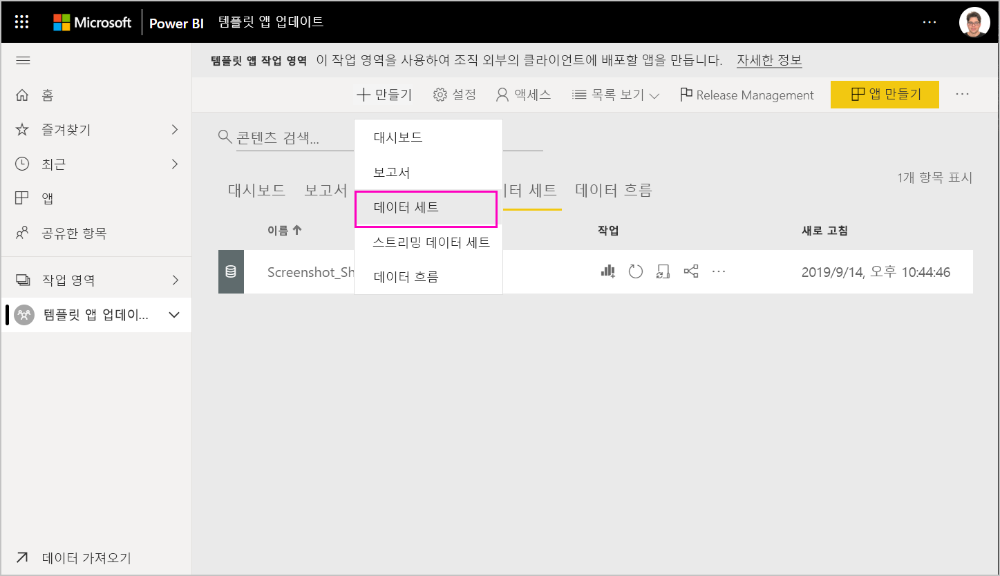
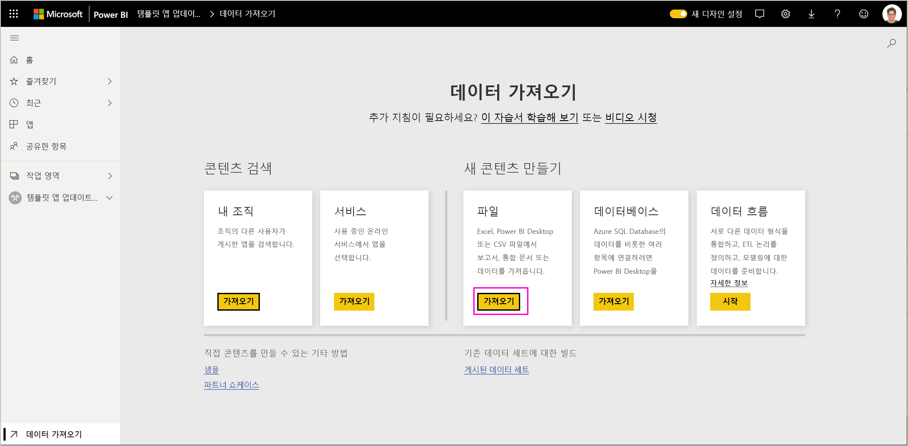
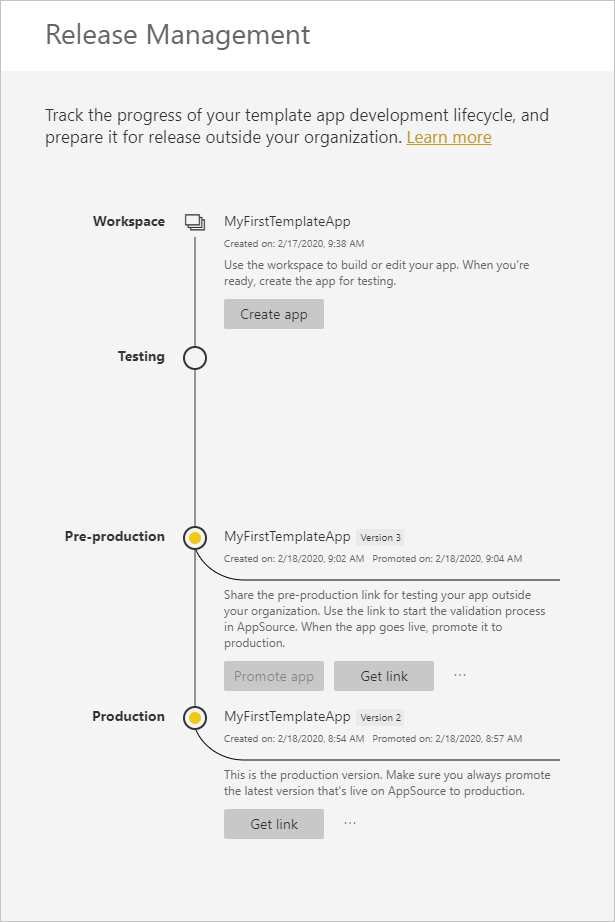
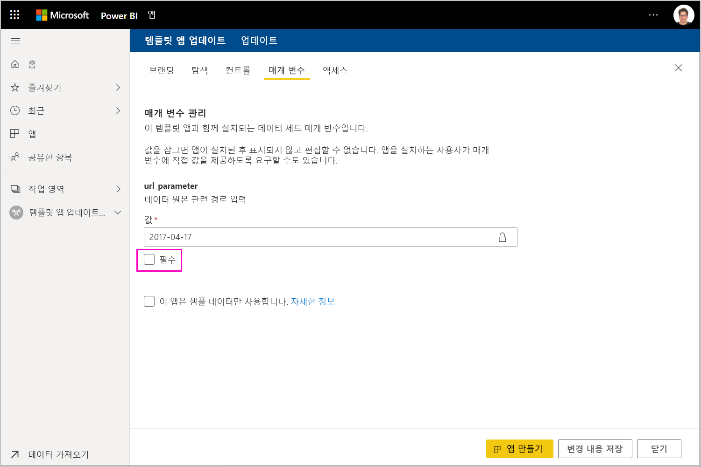
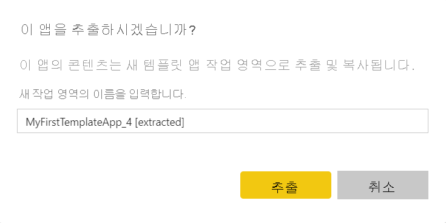

# 템플릿 앱 업데이트, 삭제 및 추출

이제 앱이 프로덕션 중이므로, 프로덕션 중인 앱을 중단하지 않고 테스트 단계에서 다시 시작할 수 있습니다.
## 앱 업데이트

Power BI Desktop에서 변경을 수행한 경우 (1)단계에서 시작합니다. Power BI Desktop에서 변경을 수행하지 않은 경우 (4)단계에서 시작합니다.

1. 업데이트된 데이터 세트를 업로드하고 기존 데이터 세트를 덮어씁니다. **정확히 동일한 데이터 세트 이름을 사용해야 합니다.** 다른 이름을 사용하면 앱을 업데이트하는 사용자를 위한 새 데이터 세트가 생성됩니다.

1. 컴퓨터에서 pbix 파일을 가져옵니다.

1. 덮어쓰기를 확인합니다.

1. **릴리스 관리** 창에서 **앱 만들기**를 선택합니다.
1. 앱 만들기 프로세스로 돌아갑니다.
1. **브랜딩**, **콘텐츠**, **제어** 및 **액세스**를 설정한 후 **앱 만들기**를 다시 선택합니다.
1. **닫기**를 선택하고 **릴리스 관리**로 돌아갑니다.

   이제 두 가지 버전이 있습니다. 프로덕션 중인 또는 테스트 중인 버전입니다.

    

1. 테넌트 외부 테스트에 대한 사전 프로덕션으로 앱을 승격할 준비가 되었으면 [릴리스 관리] 창으로 돌아가서 **테스트** 옆의 **앱 수준 올리기**를 선택합니다.

   이제 프로덕션 및 사전 프로덕션에 각각 버전이 있습니다.

   

   링크가 이제 활성화됩니다. **사전 프로덕션 단계에서 [앱 수준 올리기] 단추는 회색으로 표시됩니다**. 이는 Cloud 파트너 포털이 새 앱 버전의 유효성을 검사하고 해당 버전을 승인하기 전에 현재 앱 버전의 라이브 프로덕션 링크를 실수로 덮어쓰는 것을 방지하기 위한 것입니다.

1. [Power BI 앱 제품 업데이트](/azure/marketplace/cloud-partner-portal/power-bi/cpp-update-existing-offer)의 단계를 따라 CPP(Cloud 파트너 포털)에 링크를 다시 제출합니다. Cloud 파트너 포털에서 제품을 다시 **게시**한 다음, 유효성을 다시 검사하고 승인해야 합니다.

   제품이 승인되면 [앱 수준 올리기] 단추가 다시 활성화됩니다. 
1. 프로덕션 단계로 앱 수준을 올립니다.
   
### 업데이트 동작

1. 앱을 업데이트하면 템플릿 앱 설치 프로그램이 연결 구성을 잃지 않고 이미 설치된 작업 영역에서 [템플릿 앱을 업데이트](service-template-apps-install-distribute.md#update-a-template-app)할 수 있습니다.
1. 설치 프로그램 [덮어쓰기 동작](service-template-apps-install-distribute.md#overwrite-behavior)에서 데이터 세트 변경 사항이 설치된 템플릿 앱에 어떤 영향을 주는지 알아보세요.
1. 템플릿 앱을 업데이트(덮어쓰기)하면, 먼저 템플릿 앱이 샘플 데이터로 되돌아간 다음 자동으로 사용자의 구성(매개 변수 및 인증)에 다시 연결합니다. 새로 고침이 완료되기 전까지, 보고서, 대시보드 및 조직 앱이 샘플 데이터 배너를 표시합니다.
1. 업데이트된 데이터 세트에 사용자 입력이 필요한 새 쿼리 매개 변수를 추가한 경우, *필수* 확인란을 선택해야 합니다. 이렇게 하면 앱이 업데이트된 후에 설치 프로그램에 연결 문자열을 입력하라는 메시지가 표시됩니다.
 

## 작업 영역 추출
이제 추출 기능을 사용하면 그 어느 때보다 쉽게 이전 버전의 템플릿 앱으로 롤백할 수 있습니다. 다음 단계에서는 다양한 릴리스 단계에서 새 작업 영역으로 특정 앱 버전을 추출합니다.

1. [릴리스 관리] 창에서 자세히 **(...)** , **추출**을 차례로 누릅니다.

    
    
2. 대화 상자에서 추출된 작업 영역의 이름을 입력합니다. 새 작업 영역이 추가됩니다.

새 작업 영역 버전 관리가 다시 설정되며 새로 추출된 작업 영역에서 템플릿 앱을 계속 개발 및 배포할 수 있습니다.

## 템플릿 앱 버전 삭제
템플릿 작업 영역은 배포된 활성 템플릿 앱의 원본입니다. 템플릿 앱 사용자를 보호하려는 경우 먼저 작업 영역에서 생성된 모든 앱 버전을 제거해야 작업 영역을 삭제할 수 있습니다.
앱 버전을 삭제하면 더 이상 작동하지 않는 앱 URL도 삭제됩니다.

1. [릴리스 관리] 창에서 줄임표 **(...)**, **삭제**를 차례로 눌러 선택합니다.
 
 

>[!NOTE]
>고객 또는 **AppSource**가 사용 중인 앱 버전을 삭제하지 않아야 합니다. 삭제하면 더 이상 작동하지 않습니다.

## 다음 단계

[조직의 템플릿 앱 설치, 사용자 지정 및 배포](service-template-apps-install-distribute.md)에서 고객이 템플릿 앱과 상호 작용하는 방법을 참조하세요.

앱 배포에 대한 자세한 내용은 [Power BI 애플리케이션 제안](/azure/marketplace/cloud-partner-portal/power-bi/cpp-power-bi-offer)을 참조하세요.