# <a name="tutorial-use-cognitive-services-in-power-bi"></a>자습서:  Power BI에서 Cognitive Services 사용

Power BI를 사용하면 Azure Cognitive Services의 다양한 함수에 액세스하여 데이터 흐름을 위한 셀프 서비스 데이터 준비에서 데이터를 보강할 수 있습니다. 현재 지원되는 서비스는 [감정 분석](/azure/cognitive-services/text-analytics/how-tos/text-analytics-how-to-sentiment-analysis), [핵심 구 추출](/azure/cognitive-services/text-analytics/how-tos/text-analytics-how-to-keyword-extraction), [언어 감지](/azure/cognitive-services/text-analytics/how-tos/text-analytics-how-to-language-detection) 및 [이미지 태그 지정](/azure/cognitive-services/computer-vision/concept-tagging-images)입니다. 변환은 Power BI 서비스에서 실행되므로 Azure Cognitive Services 구독이 필요하지 않습니다. 이 기능을 사용하려면 Power BI Premium이 필요합니다.

Cognitive Services 변환은 [데이터 흐름을 위한 셀프 서비스 데이터 준비](https://powerbi.microsoft.com/blog/introducing-power-bi-data-prep-wtih-dataflows/)에서 지원됩니다. 시작하려면 아래의 텍스트 분석 및 이미지 태그 지정에 대한 단계별 예제를 사용하세요.

이 자습서에서는 다음 작업을 수행하는 방법을 알아봅니다.

> [!div class="checklist"]
> * 데이터 흐름으로 데이터 가져오기
> * 데이터 흐름에 있는 텍스트 열의 감정 점수 매기기 및 핵심 구 추출
> * Power BI Desktop의 결과에 연결


## <a name="prerequisites"></a>필수 조건

이 자습서를 완료하려면 다음이 필요합니다. 

- Power BI 계정. 아직 Power BI에 등록하지 않은 경우 시작하기 전에 [평가판에 등록합니다](https://app.powerbi.com/signupredirect?pbi_source=web).
- AI 워크로드를 사용하도록 설정된 Power BI Premium 용량에 대한 액세스 권한. 미리 보기 기간에는 이 워크로드가 기본적으로 해제됩니다. 프리미엄 용량을 사용하고 있으나 AI 인사이트가 표시되지 않는 경우 프리미엄 용량 관리자에게 문의하여 관리 포털에서 AI 워크로드를 사용하도록 설정합니다.

## <a name="text-analytics"></a>텍스트 분석

이 섹션의 단계를 수행하여 자습서의 텍스트 분석 부분을 완료합니다.

### <a name="step-1-apply-sentiment-scoring-in-power-bi-service"></a>1단계: Power BI 서비스에서 감정 점수 매기기 적용

시작하려면 프리미엄 용량을 사용하는 Power BI 작업 영역으로 이동한 후 화면 오른쪽 위에 있는 **만들기** 단추를 사용하여 새 데이터 흐름을 만듭니다.

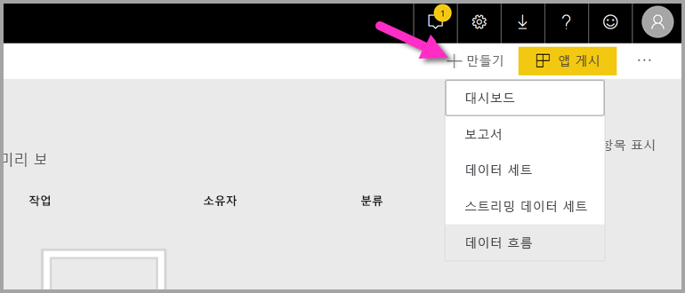

데이터 흐름 대화 상자에 새 데이터 흐름 만들기를 위한 옵션이 표시되면 **새 엔터티 추가** 를 선택합니다. 그런 다음, 데이터 원본 메뉴에서 **텍스트/CSV** 를 선택합니다.

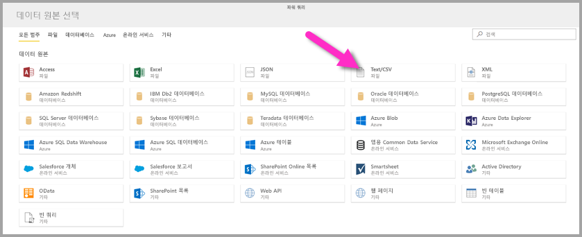

URL [https://pbiaitutorials.blob.core.windows.net/textanalytics/FabrikamComments.csv](https://pbiaitutorials.blob.core.windows.net/textanalytics/FabrikamComments.csv)를 URL 필드에 붙여넣고 **다음** 을 클릭합니다.

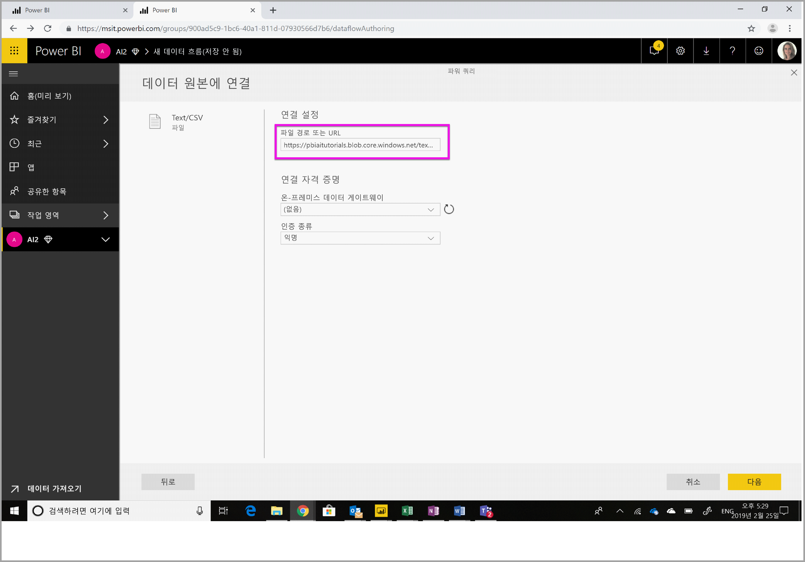

이제 데이터를 텍스트 분석에 사용할 준비가 되었습니다. 고객 의견 열에서 감정 점수 매기기 및 핵심 구 추출을 사용할 수 있습니다.

파워 쿼리 편집기에서 **AI 인사이트** 를 선택합니다.

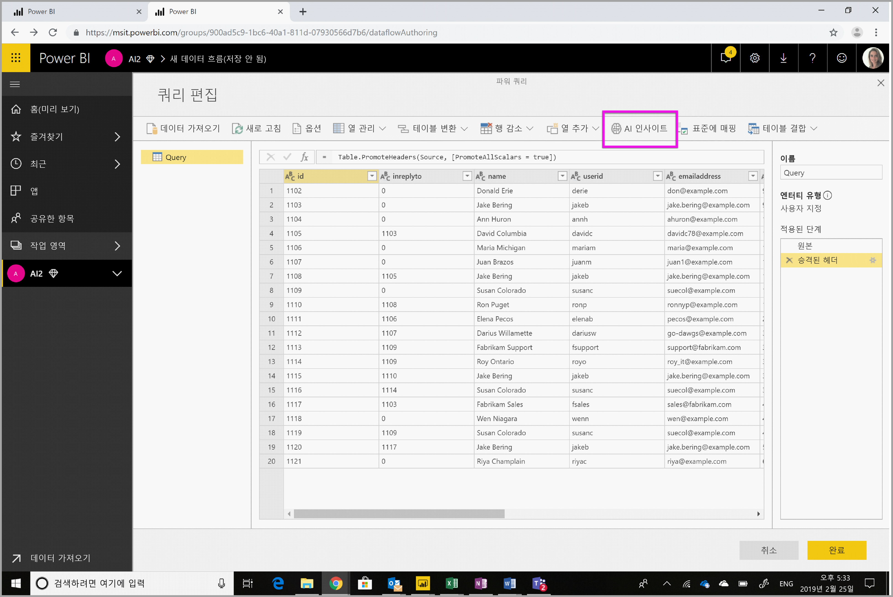

**Cognitive Services** 폴더를 확장하고 사용할 함수를 선택합니다. 이 예제에서는 설명 열의 감정에 대해 점수를 매기지만 동일한 단계를 수행하여 언어 감지 및 핵심 구 추출을 시도해 볼 수 있습니다.

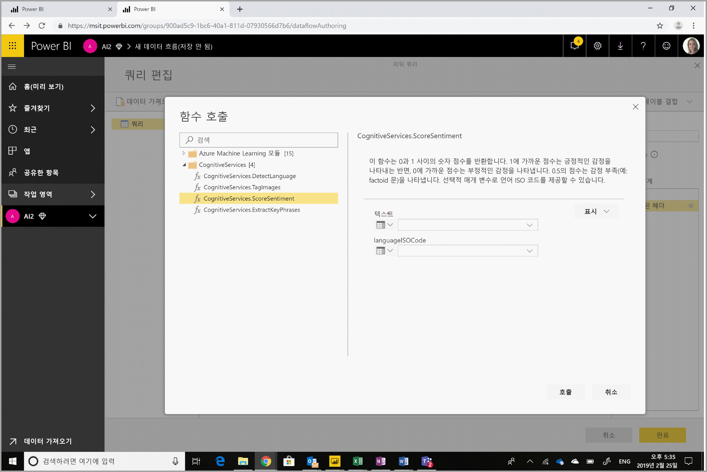

함수를 선택하면 필수 필드 및 선택적 필드가 표시됩니다. 예제 리뷰의 감정에 대해 점수를 매기려면 리뷰 열을 텍스트 입력으로 선택합니다. 문화권 정보는 선택적 입력 항목이며 ISO 형식이 필요합니다. 예를 들어 텍스트를 영어로 처리하려면 ‘en’을 입력합니다. 필드가 비어 있으면 Power BI가 감정에 대해 점수를 매기기 전에 먼저 입력 값의 언어를 감지합니다.

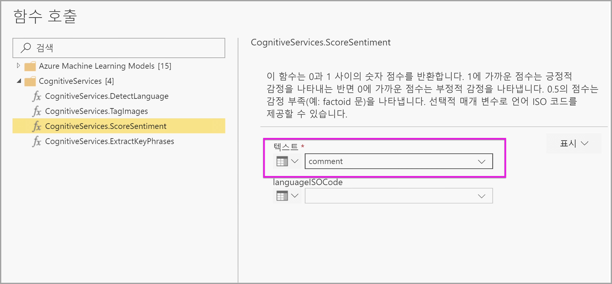

이제 **호출** 을 선택하여 함수를 실행합니다. 각 행의 감정 점수가 포함된 새 열이 테이블에 추가됩니다. **AI 인사이트** 로 다시 돌아가 동일한 방식으로 리뷰 텍스트의 핵심 구를 추출할 수 있습니다.

변환이 완료되면 쿼리 이름을 ‘고객 의견’으로 변경하고 **완료** 를 선택합니다.

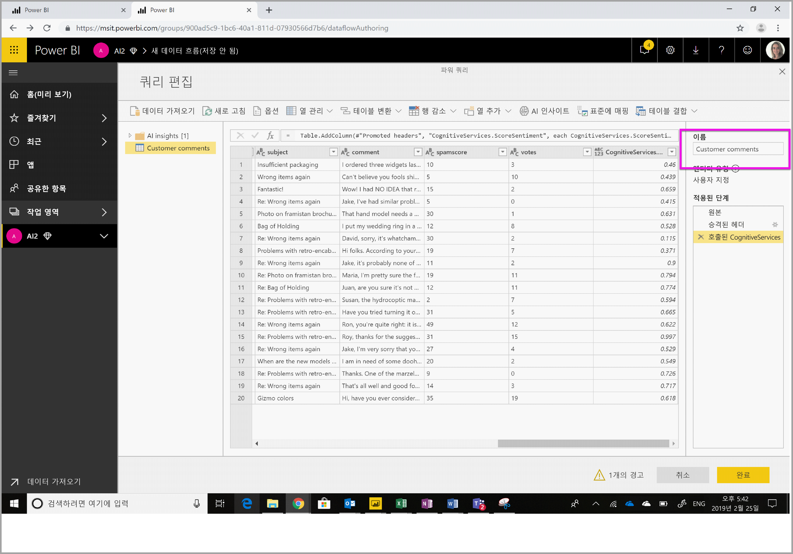

그런 다음, 이 데이터 흐름을 **저장** 하고 Fabrikam으로 이름을 지정합니다. 데이터 흐름을 저장한 후 표시되는 **지금 새로 고침** 단추를 선택합니다.

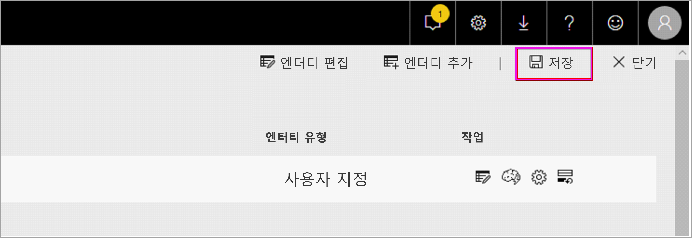

데이터 흐름을 저장하고 새로 고친 후에는 Power BI 보고서에 사용할 수 있습니다.

### <a name="step-2-connect-from-power-bi-desktop"></a>2단계: Power BI Desktop에서 연결

Power BI Desktop을 엽니다. 홈 리본에서 **데이터 가져오기** 를 선택합니다.

Power BI 섹션의 **Power BI 데이터 흐름(베타** )으로 이동하여 **연결** 을 선택합니다.

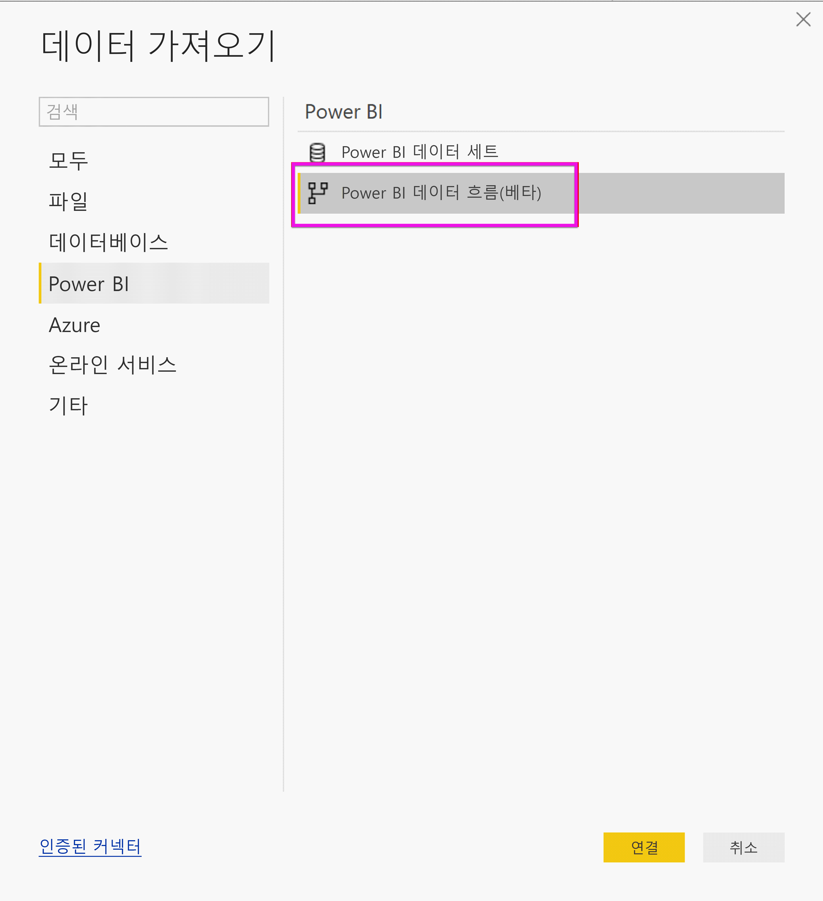

이것은 미리 보기 기능이므로 이 미리 보기 조건을 수락하는지 커넥터에서 묻습니다. 조건을 수락한 후 조직 계정으로 로그인합니다.

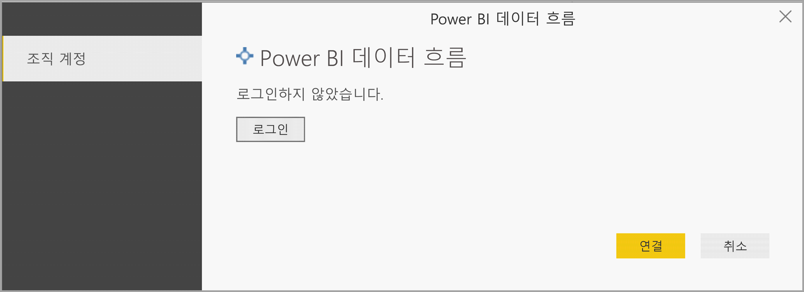

방금 만든 데이터 흐름을 선택합니다. 고객 의견 테이블로 이동하여 **로드** 를 클릭합니다.

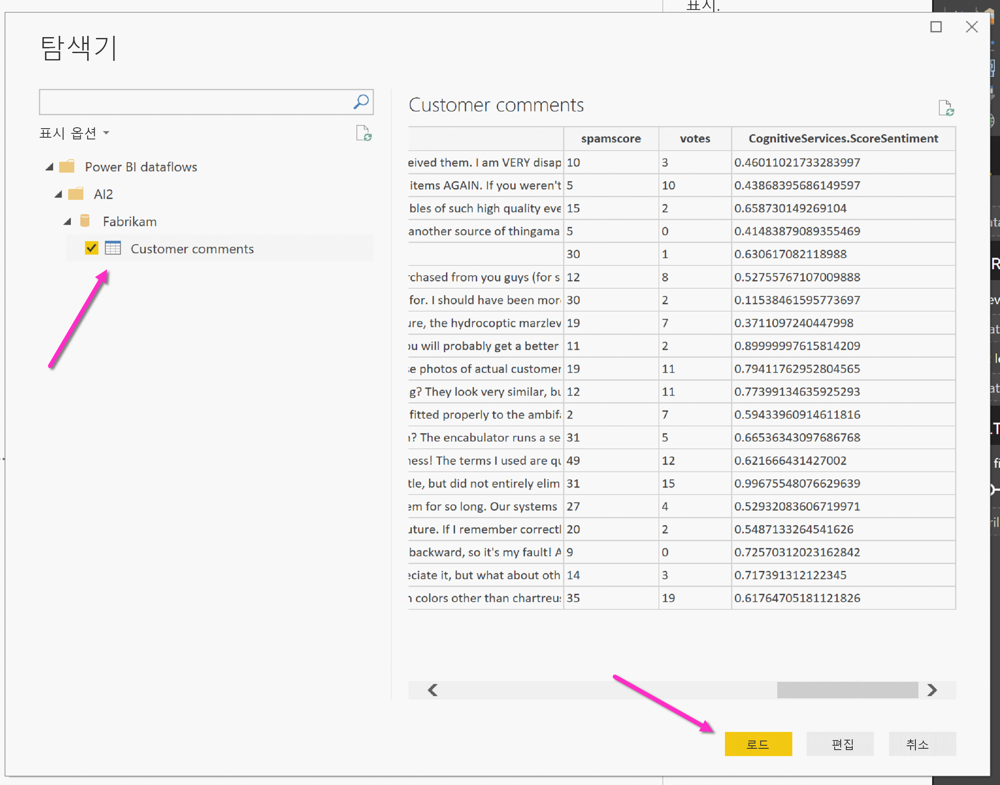

이제 데이터가 로드되었으므로 보고서 작성을 시작할 수 있습니다.

## <a name="image-tagging"></a>이미지 태그 지정

프리미엄 용량을 사용하는 Power BI 작업 영역으로 이동합니다. 화면 오른쪽 위에 있는 **만들기** 단추를 사용하여 새 데이터 흐름을 만듭니다.

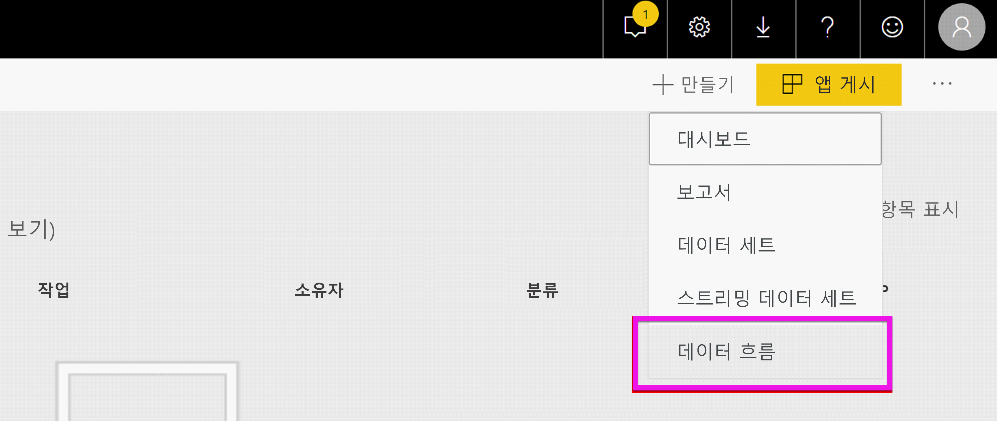

**새 엔터티 추가** 를 선택합니다.

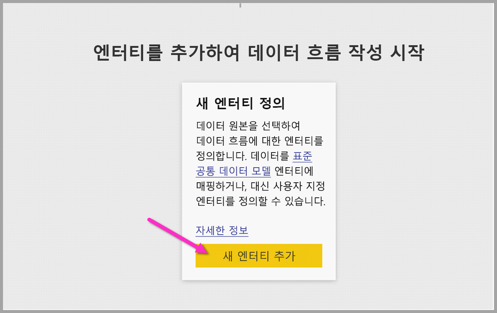

데이터 원본을 선택하라는 요청을 받으면 **빈 쿼리** 를 선택합니다.

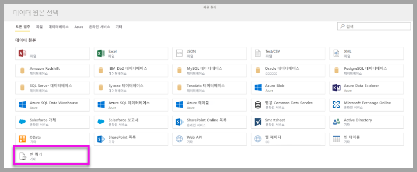

쿼리 편집기에서 아래 쿼리를 복사하고 다음을 클릭합니다. 아래 URL 경로를 다른 이미지로 바꾸거나 행을 더 추가할 수 있습니다. *Web.Contents* 함수가 이미지 URL을 이진 형식으로 가져옵니다. 이미지가 이진 형식으로 저장되어 있는 데이터 원본이 있는 경우 해당 이미지를 바로 사용할 수도 있습니다.


```python
let
  Source = Table.FromRows({
  { Web.Contents("https://images.pexels.com/photos/87452/flowers-background-butterflies-beautiful-87452.jpeg") },
  { Web.Contents("https://upload.wikimedia.org/wikipedia/commons/5/53/Colosseum_in_Rome%2C_Italy_-_April_2007.jpg") }}, { "Image" })
in
  Source
```

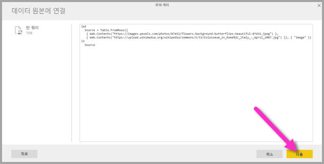

자격 증명을 묻는 메시지가 표시되면 ‘익명’을 선택합니다. 

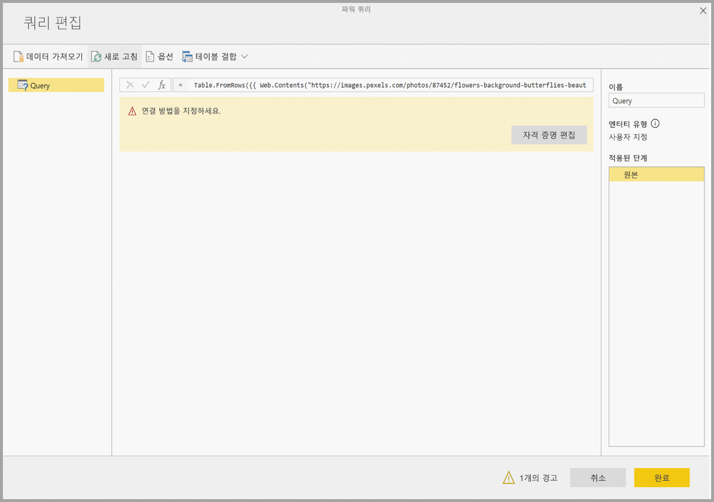

다음 이미지가 표시됩니다.

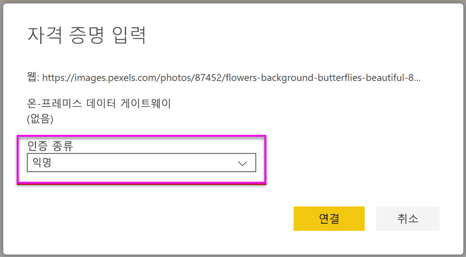

각각의 개별 웹 페이지에 대한 자격 증명을 묻는 메시지가 표시됩니다.

쿼리 편집기에서 **AI 인사이트** 를 선택합니다.

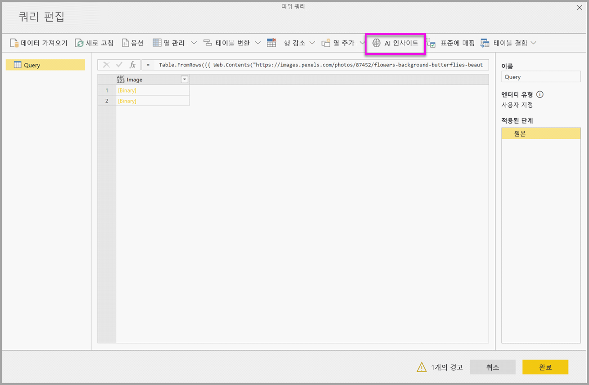

그런 다음, **조직 계정** 으로 로그인합니다.

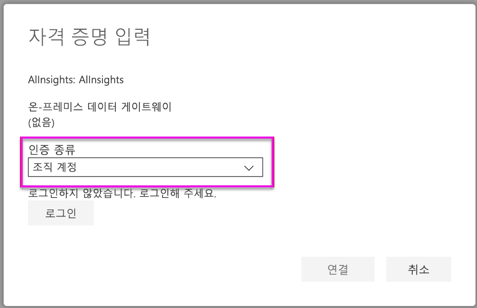

이미지 태그 지정 함수를 선택하고 열 필드에 _[이진]_ , 문화권 정보 필드 _en_ 을 입력합니다. 

> [!NOTE]
> 현재는 드롭다운을 사용하여 열을 선택할 수 없습니다. 이 문제는 프라이빗 미리 보기 기간에 최대한 신속하게 해결될 것입니다.

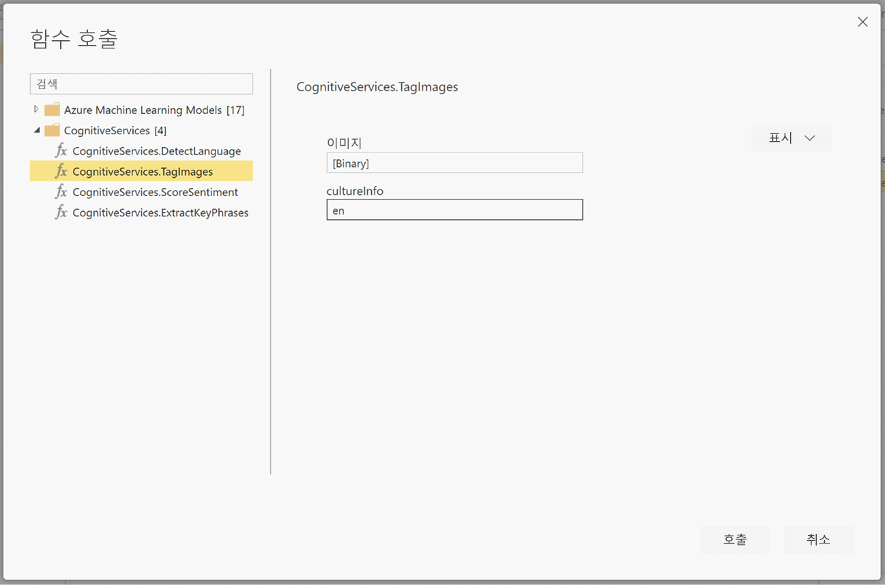

함수 편집기에서 열 이름을 묶는 따옴표를 제거합니다. 

> [!NOTE]
> 따옴표 제거는 임시 해결 방법이며 미리 보기 기간에 가능한 한 빠르게 해결될 것입니다.


함수는 쉼표로 구분된 형식의 태그와 json 레코드가 둘 다 포함된 레코드를 반환합니다. 확장 단추를 선택하여 둘 다 또는 둘 중 하나를 테이블에 열로 추가합니다.

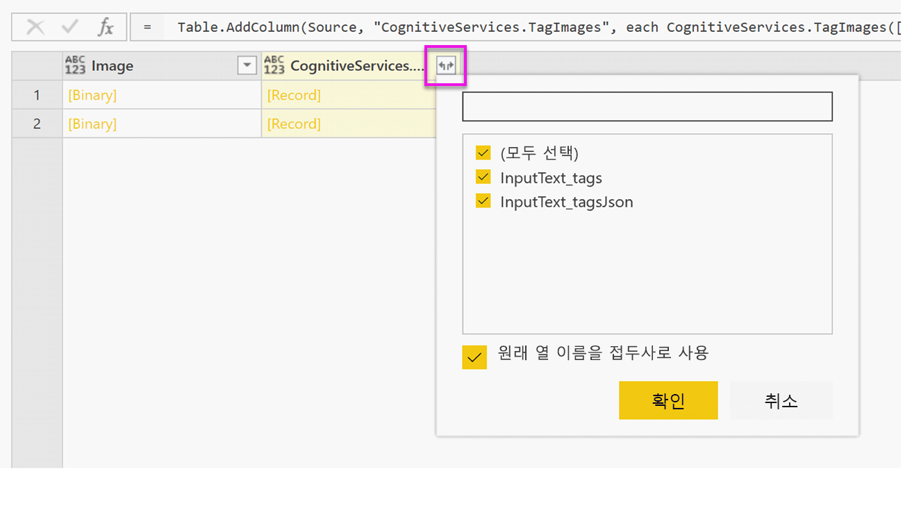

**완료** 를 선택하고 데이터 흐름을 저장합니다. 데이터 흐름 하나를 새로 고친 후에는 Power BI Desktop에서 데이터 흐름 커넥터를 사용하여 해당 데이터 흐름에 연결할 수 있습니다. 이 문서 5페이지의 단계를 참조하세요.

## <a name="clean-up-resources"></a>리소스 정리

쿼리가 더 이상 필요하지 않은 경우 파워 쿼리 편집기에서 쿼리 이름을 마우스 오른쪽 단추로 클릭하고 **삭제** 를 선택하여 쿼리를 삭제합니다.

## <a name="next-steps"></a>다음 단계

이 자습서에서는 감정 점수 매기기 및 이미지 태그 지정 함수를 Power BI 데이터 흐름에 적용했습니다. Power BI에서 Cognitive Services를 사용하는 방법을 자세히 알아보려면 다음 문서를 읽어보세요.

* [Azure의 Cognitive Services](/azure/cognitive-services/)
* [데이터 흐름에 대한 셀프 서비스 데이터 준비](../transform-model/dataflows/dataflows-introduction-self-service.md) 시작하기
* [Power BI Premium](https://powerbi.microsoft.com/power-bi-premium/)에 대한 자세한 정보

다음 문서에도 관심이 있을 수 있습니다.

* [자습서: Power BI에서 Machine Learning Studio(클래식) 모델 호출(미리 보기)](service-tutorial-invoke-machine-learning-model.md)
* [Power BI에서 Azure Machine Learning 통합(미리 보기)](../transform-model/dataflows/dataflows-machine-learning-integration.md)
* [Power BI에서 Cognitive Services 사용(미리 보기)](../transform-model/dataflows/dataflows-machine-learning-integration.md)