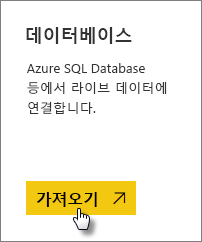
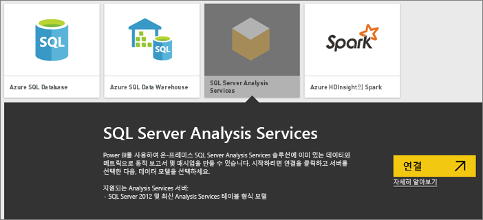
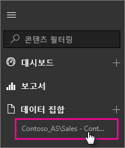

# Power BI의 SQL Server Analysis Services 라이브 데이터

Power BI에서는 두 가지 방법으로 라이브 SQL Server Analysis Services 서버에 연결할 수 있습니다. **데이터 가져오기** 에서 SQL Server Analysis Services 서버에 연결하거나 이미 Analysis Services 서버에 연결된 [Power BI Desktop 파일](service-desktop-files.md) 또는 [Excel 통합 문서](service-excel-workbook-files.md)에 연결할 수 있습니다. Power BI Desktop 파일의 백업 복사본을 로컬에서 유지 관리하는 다양한 도구 집합 및 기능 때문에 Power BI Desktop을 사용하는 것이 좋습니다.

>[!IMPORTANT]
> * 라이브 Analysis Services 서버에 연결하려면 관리자가 온-프레미스 데이터 게이트웨이를 설치하고 구성해야 합니다. 자세한 내용은 [온-프레미스 데이터 게이트웨이](service-gateway-onprem.md)를 참조하세요.
> * 게이트웨이를 사용하는 경우 데이터가 온-프레미스로 유지됩니다.  해당 데이터를 기반으로 하여 만든 보고서는 Power BI 서비스에 저장됩니다. 
> * [질문 및 답변 자연어 쿼리](../create-reports/service-q-and-a-direct-query.md)는 Analysis Services 라이브 연결에 대해 미리 보기 상태입니다.

## 데이터 가져오기에서 모델에 연결하려면

1. **내 작업 영역** 에서 **데이터 가져오기** 를 선택합니다. 사용 가능한 경우에 그룹 작업 영역으로 변경할 수도 있습니다.

   

2. **데이터베이스 및 기타** 를 선택합니다.

   

3. **SQL Server Analysis Services** > **연결** 을 선택합니다.

   

4. 서버를 선택합니다. 여기에 나열된 서버가 보이지 않으면 게이트웨이 및 데이터 원본이 구성되지 않았거나 계정이 게이트웨이에서 데이터 원본의 **사용자** 탭에 나열되지 않은 것입니다. 관리자에 게 문의하세요.

5. 연결하려는 모델을 선택합니다. 테이블 형식 또는 다차원일 수 있습니다.

모델에 연결하면 Power BI 사이트의 **내 작업 영역/데이터 세트** 에 나타납니다. 그룹 작업 영역으로 전환된 경우 데이터 세트는 그룹 내에 표시됩니다.

## 대시보드 타일

보고서의 시각 효과를 대시보드에 고정하면 고정된 타일이 10분마다 자동으로 새로 고쳐집니다. 온-프레미스 Analysis Services 서버의 데이터가 업데이트되면 타일이 10분 후에 자동 업데이트됩니다.

## 일반적인 문제

* 모델 스키마를 로드할 수 없습니다. 오류 - SSAS에 연결하는 사용자에게 SSAS 데이터베이스, 큐브 및 모델에 대한 액세스 권한이 없으면 이 오류가 발생합니다.

## 다음 단계

* [온-프레미스 데이터 게이트웨이](service-gateway-onprem.md)  
* [Analysis Services 데이터 원본 관리](service-gateway-enterprise-manage-ssas.md)  
* [온-프레미스 데이터 게이트웨이 문제 해결](service-gateway-onprem-tshoot.md)  

궁금한 점이 더 있나요? [Power BI 커뮤니티를 이용하세요.](https://community.powerbi.com/)
