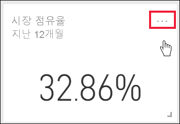
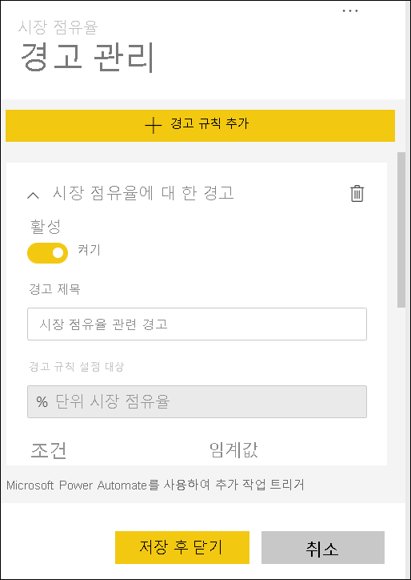
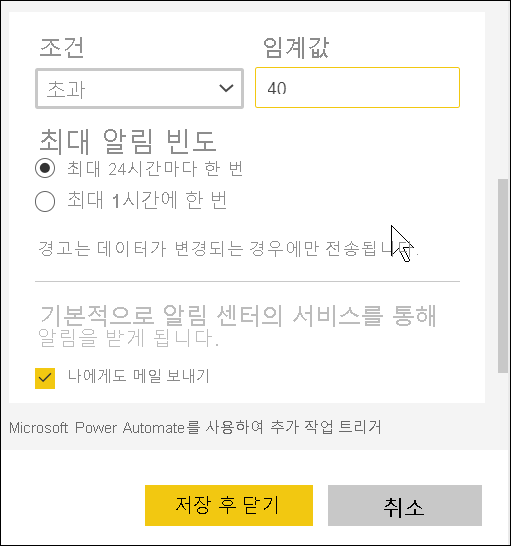
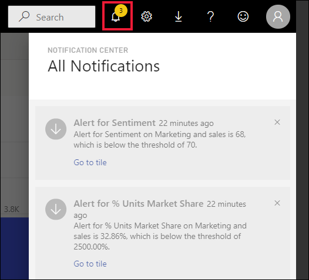
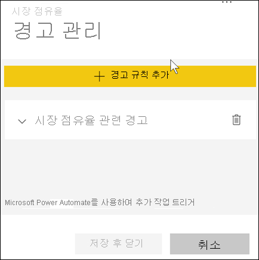

# 자습서:  Power BI 대시보드에서 경고 설정

[!INCLUDE[consumer-appliesto-yynn](../includes/consumer-appliesto-yynn.md)]

대시보드의 데이터가 설정해 놓은 한도보다 많게 또는 적게 변경되면 알리도록 Power BI 서비스에서 경고를 설정합니다. 경고는 보고서 시각적 개체에서 고정된 타일과 계기, KPI 및 카드에만 설정할 수 있습니다. 

대시보드에 대한 경고를 만들 수 있습니다.
- **내 작업 영역** 에서 만들고 저장했습니다.
- [프리미엄 용량](end-user-license.md)에서 공유되었습니다. 
- Power BI Pro 라이선스를 보유한 경우 어느 작업 영역에서도 액세스할 수 있습니다.    

경고는 새로 고쳐지는 데이터에만 적용됩니다. 데이터가 새로 고쳐지면, Power BI에서 해당 데이터에 대해 경고가 설정되어 있는지 확인됩니다. 데이터가 경고 임계값에 도달하면, 경고가 트리거됩니다. 

이 기능은 계속 발전하고 있으므로 [아래의 팁 및 문제 해결 섹션](#tips-and-troubleshooting)을 참조하세요.

대시보드를 공유하더라도 자신이 설정한 경고만 볼 수 있습니다. 데이터 경고는 플랫폼 전반에서 완전히 동기화되며 [Power BI 모바일 앱](mobile/mobile-set-data-alerts-in-the-mobile-apps.md) 및 Power BI 서비스에서 데이터 경고를 설정하고 확인합니다. 

> [!WARNING]
> 이러한 경고는 데이터에 대한 정보를 제공합니다. 모바일 디바이스에서 Power BI 데이터를 보는데 그 모바일 디바이스를 잃어버린 경우 Power BI 서비스를 사용하여 모든 경고를 해제하는 것이 좋습니다.
> 

이 자습서에서는 다음 내용을 다룹니다.
> [!div class="checklist"]
> * 경고를 설정할 수 있는 사용자
> * 경고를 지원하는 시각적 개체
> * 내 경고를 볼 수 있는 사용자
> * Power BI Desktop 및 Mobile에서 작동하는 경고
> * 경고를 만드는 방법
> * 내 경고를 수신하는 위치

## 사전 요구 사항

아직 Power BI에 등록하지 않은 경우 시작하기 전에 [평가판에 등록합니다](https://app.powerbi.com/signupredirect?pbi_source=web).

1. 이 예제에서는 영업 및 마케팅 샘플의 대시보드 카드 타일을 사용합니다. Power BI 서비스(app.powerbi.com)를 열고 로그인한 다음 **내 작업 영역** 을 엽니다.    
    

2. 왼쪽 아래 모서리에서 **데이터 가져오기** 를 선택합니다.

    

3. 데이터 가져오기 페이지가 표시되면 **샘플** 을 선택합니다.

4. 영업 및 마케팅 샘플을 선택한 다음 **연결** 을 선택합니다.

    

5. Power BI가 샘플에 연결된 후 표시되는 대화 상자에서 **대시보드로 이동** 을 선택합니다.     
    

## 대시보드 타일에 경고 추가

1. 대시보드 계기, KPI 또는 카드 타일에서 줄임표(...)를 선택합니다.
   
   

2. 경고 아이콘  또는 **경고 관리** 를 선택하여 **시장 점유율** 카드에 대한 경고를 하나 이상 추가합니다.

   

   
1. **경고 관리** 창에서 **+ 경고 규칙 추가** 를 선택합니다.  슬라이더가 **켜기** 로 설정되어 있는지 확인하고, 경고 제목을 입력합니다. 제목은 경고를 쉽게 인식하는 데 도움이 됩니다.
   
   
4. 아래로 스크롤하여 경고 세부 정보를 입력합니다.  이 예제에서는 시장 점유율이 40 이상으로 증가하는 경우 하루에 한 번 알리는 경고를 만듭니다. 경고는 [알림 센터](end-user-notification-center.md)에 표시됩니다. Power BI에서 전자 메일도 전송됩니다.
   
   

5. **저장 후 닫기** 를 선택합니다.
 

   > 

## 경고 수신
추적되는 데이터가 설정해 놓은 임계값 중 하나에 도달하면, 몇 가지 현상이 발생합니다. 먼저, Power BI에서 마지막 경고가 전송된 후 1시간을 초과하여 경과했는지 또는 24시간을 초과하여 경과했는지(선택한 옵션에 따라) 확인됩니다. 데이터가 임계값을 넘어서는 동안은, 경고를 수신하게 됩니다.

다음으로, Power BI에서 알림 센터에 경고를 보내고 필요에 따라 메일로 보냅니다. 각 경고에는 데이터에 대한 직접 링크가 포함됩니다. 관련 타일을 보려면 링크를 선택하세요.  

1. 전자 메일을 보내도록 경고를 설정해 놓으면, 다음과 같은 내용을 받은 편지함에서 찾을 수 있습니다. 이 경고는 **감정** 카드에 대해 설정된 경고입니다.
   
   
2. Power BI는 또한 **알림 센터** 에 메시지를 추가합니다.
   
   
3. 알림 센터를 열어서 경고 세부 정보를 봅니다.
   
    
   
  

## 경고 관리

경고를 관리하는 여러 가지 방식이 있습니다. 대시보드 타일 자체에서, Power BI 설정 메뉴에서, 그리고 [iPhone의 Power BI 모바일 앱](mobile/mobile-set-data-alerts-in-the-mobile-apps.md) 또는 [Windows 10용 Power BI 모바일 앱](mobile/mobile-set-data-alerts-in-the-mobile-apps.md)의 개별 타일에서 관리할 수 있습니다.

### 타일 자체에서

1. 타일에 대한 경고를 변경하거나 제거하려면, 경고 아이콘 을 선택하여 **경고 관리** 창을 다시 엽니다. 해당 타일에 설정해 놓은 모든 경고가 표시됩니다.
   
    .
2. 경고를 수정하려면, 경고 이름 왼쪽에 있는 화살표를 선택합니다.
   
    .
3. 경고를 삭제하려면, 경고 이름 오른쪽에 있는 휴지통을 선택합니다.
   
      

### Power BI 설정 메뉴에서

1. Power BI 메뉴 모음에서 기어 아이콘을 선택합니다.
   
    .
2. **설정** 에서 **경고** 를 선택합니다.
   
    
3. 여기에서 경고를 켜거나 끌 수 있으며, **경고 관리** 창을 열어서 내용을 변경하거나, 경고를 삭제할 수 있습니다.

## 팁 및 문제 해결 

* 계기, KPI 또는 카드에 경고를 설정할 수 없는 경우 Power BI 관리자 또는 IT 지원 센터에 도움을 요청하세요. 대시보드 또는 특정 유형의 대시보드 타일에 대해 경고가 꺼져 있거나 사용할 수 없는 경우도 있습니다.
* 경고는 새로 고쳐지는 데이터에만 적용됩니다. 정적 데이터에 대해서는 적용되지 않습니다. Microsoft에서 제공하는 대부분의 샘플은 정적입니다. 
* 공유 콘텐츠를 받고 보려면 Power BI Pro 또는 Premium 라이선스가 필요합니다. 자세한 내용은 [사용 중인 라이선스 확인](end-user-license.md)을 참조하세요.
* 보고서에서 대시보드로 고정한 스트리밍 데이터 세트에서 만든 시각적 개체에 경고를 설정할 수 있습니다. **타일 추가** > **사용자 지정 스트리밍 데이터** 를 사용하여 대시보드에서 직접 만든 스트리밍 타일에는 경고를 설정할 수 없습니다.

## 리소스 정리
경고 삭제 지침은 위에 설명되어 있습니다. 간단히 말해서 Power BI 메뉴 모음에서 기어 아이콘을 선택합니다. **설정** 에서 **경고** 를 선택하고 경고를 삭제합니다.

> [!div class="nextstepaction"]
> [모바일 디바이스에서 데이터 경고 설정](mobile/mobile-set-data-alerts-in-the-mobile-apps.md)

