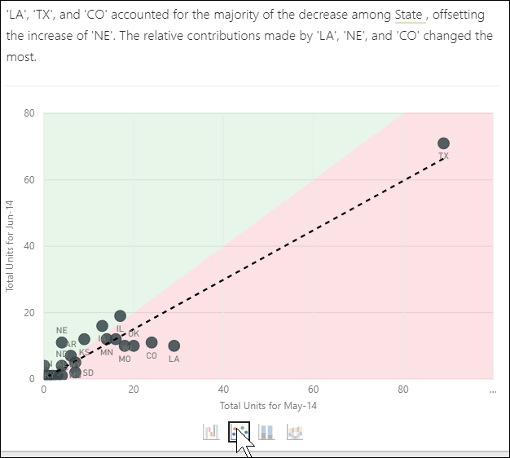

# 분석 기능을 사용하여 보고서 시각적 개체의 변동 설명

[!INCLUDE[consumer-appliesto-yynn](../includes/consumer-appliesto-yynn.md)]

종종 보고서 시각적 개체에서 값의 대폭 증가 후 대폭 하락을 보고 이러한 변동의 원인에 대해 궁금해합니다. **Power BI 서비스**의 **분석**을 사용하면 몇 번의 클릭으로 원인을 알 수 있습니다.

예를 들어 월 및 제조업체 기준으로 총 단위를 보여 주는 다음 시각적 개체를 생각해 보세요.   VanArsdel는 경쟁업체보다 실적이 좋지만 2014년 6월에 급락이 있었습니다. 이러한 경우에는 데이터를 탐색하여 발생한 변경 사항에 대해 설명할 수 있습니다. 

Power BI 서비스를 통해 시각적 개체의 증가, 감소 또는 비정상적 분포를 설명하고, 데이터에 대한 빠르고 자동화된 통찰력 있는 분석을 얻을 수 있습니다. 데이터 요소를 마우스 오른쪽 단추로 클릭하고, **분석 > 감소에 대해 설명하세요**(또는 이전 막대가 더 낮은 경우 증가) 또는 **분석 > 이 분포가 다른 경우 찾기**를 선택하면 사용하기 쉬운 창에 인사이트가 제공됩니다.

분석 기능은 상황에 따라 다르고 이전 막대 또는 열과 같은 바로 이전의 데이터 요소에 기반합니다.

> [!NOTE]
> 이 기능은 미리 보기 상태이며 변경될 대상입니다. 기본적으로 인사이트 기능을 사용할 수 있습니다(사용하기 위해 미리 보기 상자 확인란을 선택하지 않아도 됩니다).

### 선택된 요소 및 범주

Power BI는 여러 열을 검사한 후 상대적 기여도의 가장 큰 변화를 보여 주는 요소를 선택하고 표시합니다. 각 열에 대해 기여에 가장 의미 있는 변화가 있는 값이 설명에 나타나며, 또한 실제 증가 및 감소가 가장 큰 값도 제시됩니다.

Power BI가 생성하는 모든 인사이트를 보려면 스크롤 막대를 사용합니다. 가장 중요한 기여자가 제일 먼저 표시되도록 순서가 매겨집니다. 

## 인사이트 사용
인사이트를 사용하여 시각적 개체에 표시되는 추세를 설명하려면 가로 막대형 차트 또는 꺾은선형 차트에서 데이터 요소를 마우스 오른쪽 단추로 클릭하고 **분석**을 선택합니다. 그런 다음 표시되는 옵션(**증가 설명**, **감소 설명** 또는 **차이 설명**)을 선택합니다.

그러면 Power BI가 데이터에 기계 학습 알고리즘을 실행하고, 증가나 감소 또는 차이에 가장 큰 영향을 준 범주를 설명하는 시각적 개체와 설명으로 창을 채웁니다.  이 예에서 첫 번째 인사이트는 폭포 차트입니다.

폭포 시각적 개체의 맨 아래에 있는 작은 아이콘을 선택하여 정보를 분산형 차트, 누적 세로 막대형 차트 또는 리본 차트로 표시하도록 선택할 수 있습니다.

시각적 개체 및 기능에 대한 피드백을 제공하려면 페이지 맨 위에 있는 좋아요 및 싫어요 아이콘을 사용하세요.   

보고서가 읽기 또는 편집 보기인 경우 인사이트를 사용할 수 있습니다. 그러면 데이터를 분석하고 보고서에 쉽게 추가할 수 있는 시각적 개체를 만드는 데 유용하게 사용할 수 있습니다. 보고서를 편집 보기에서 연 경우 엄지 손가락 아이콘 옆에 더하기 기호가 표시됩니다. 보고서에 시각적 개체로 인사이트를 추가하려면 더하기 아이콘을 선택하세요. 

## 반환된 결과의 세부 정보

인사이트를 통해 반환된 세부 정보는 그간의 변화를 파악할 수 있도록 두 기간 사이의 차이점이 강조 표시됩니다.  

알고리즘은 이 모델의 다른 모든 열을 가져와 기간 전과 후 에 대해 해당 열별로 분석 결과를 계산하며 해당 분석 결과에서 발생한 변화의 정도를 확인한 다음, 가장 변화가 큰 열을 반환하는 것으로 생각할 수 있습니다. 예를 들어 위의 폭포 인사이트에서는 주가 선택되었는데, 6월부터 7월까지 루이지애나, 텍사스, 콜로라도 주의 기여도가 13%~19% 하락했고 총 단위의 감소에 가장 크게 기여했기 때문입니다.  

반환된 인사이트마다 네 가지 시각적 개체를 표시할 수 있습니다. 이러한 시각적 개체 중 3개가 두 기간 간 기여도의 변화를 강조 표시하기 위한 것입니다. 예를 들어 *2분기*에서 *3분기*의 증가를 설명하기 위한 것입니다. 리본 차트는 선택한 데이터 요소 전과 후의 변화를 보여 줍니다.

### 산점도

산점도 시각적 개체는 열(이 경우 주)의 각 값마다 두 번째 기간(y축)의 측정값 대비 첫 번째 기간(x축) 측정값을 보여 줍니다. 데이터 요소는 값이 증가한 경우 녹색 영역에, 감소한 경우 빨간색 영역에 위치합니다. 

점선은 최적을 보여 주며 이 선 위의 데이터 요소는 전반적인 추세 이상으로 증가한 것을, 이 선 아래의 데이터 요소는 추세 미만으로 증가한 것을 나타냅니다.  

이 기간 중 값이 비어 있는 데이터 항목은 산점도에 나타나지 않습니다.

### 100% 누적 세로 막대형 차트

100% 누적 세로 막대형 차트 시각적 개체는 선택한 데이터 요소 및 이전의 합계(100%)에 대한 기여도 값을 보여 줍니다. 이를 통해 각 데이터 요소의 기여도를 나란히 비교할 수 있습니다. 이 예에서 도구 설명은 선택한 값 텍사스의 실제 기여도를 보여 줍니다. 주 목록이 길기 때문에 도구 설명은 세부 정보를 보는 데 도움이 됩니다. 도구 설명을 사용하면 텍사스가 총 단위에 기여한 비율은 동일하지만(31% 및 32%) 총 단위의 실제 수는 89에서 71로 감소한 것을 볼 수 있습니다. Y축은 합계가 아니라 백분율이며, 각 열 밴드는 값이 아니라 백분율입니다. 

### 리본 차트

리본 차트 시각적 요소는 전과 후의 측정 값을 보여 줍니다. 특히 기여자의 *순위*가 변경된 경우 기여도의 변화를 보여 주는 데 유용합니다(예: *LA*는 2위 기여자에서 11위로 떨어졌습니다).  그리고 *TX*가 맨 위의 넓은 리본으로 표시되어 전과 후의 가장 중요한 기여자임을 보여 주지만 하락은 선택된 기간 중과 그 이후에 기여도 값이 하락했음을 보여 줍니다.

### 폭포 차트

네 번째 시각적 개체는 기간 사이의 실제 증가 또는 감소를 보여 주는 폭포 차트입니다. 이 시각적 개체는 2014년 6월의 감소에 대한 중요한 기여자 하나를 보여 줍니다(이 경우에는 **주**). **주**가 총 단위에 미친 상세한 영향은 루이지애나, 텍사스, 콜로라도에서의 하락이 가장 중요한 역할을 했다는 것입니다.      

 

## 고려 사항 및 제한 사항
이러한 인사이트는 이전 데이터 요소에서의 변경 내용을 기반으로 하므로 시각적 개체에서 첫 번째 데이터 요소를 선택하는 경우에는 사용할 수 없습니다. 

일부 시각적 개체 유형에는 **분석**을 사용할 수 없습니다. 

다음 목록은 **분석 - 증가/감소/차이 설명**에 대한 현재 지원되지 않는 시나리오의 컬렉션입니다.

* TopN 필터
* 포함/제외 필터
* 측정값 필터
* 숫자가 아닌 측정값
* “다음과 같이 값 표시” 사용
* 필터링된 측정값 - 필터링된 측정값은 특정 필터(예: *프랑스의 총 판매액*)가 적용된 시각적 개체 수준의 계산이며 인사이트 기능으로 만든 일부 시각적 개체에서 사용됩니다.
* 스칼라인 열 기준 정렬을 정의하지 않으면 X-축의 범주 열입니다. 계층 구조를 사용하는 경우 활성 계층 구조의 모든 열은 이 조건에 맞아야 합니다.

## 다음 단계
[폭포 차트](../visuals/power-bi-visualization-waterfall-charts.md)    
[분산형 차트](../visuals/power-bi-visualization-scatter.md)    
[세로 막대형 차트](../visuals/power-bi-report-visualizations.md)    
[리본 차트](../visuals/desktop-ribbon-charts.md)
