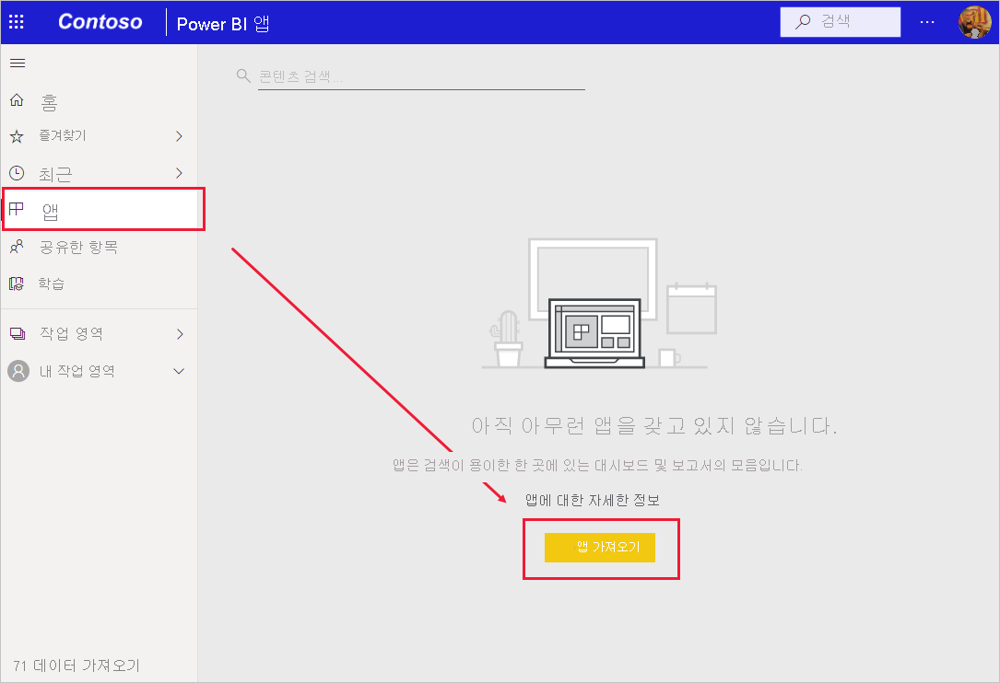
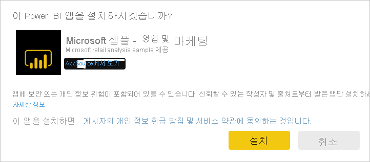
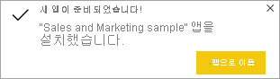
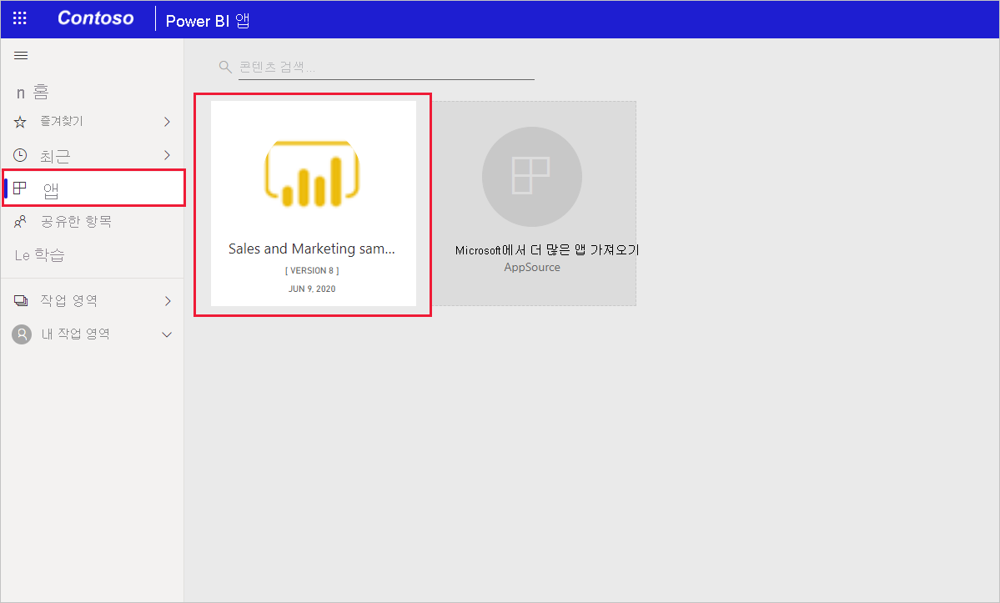
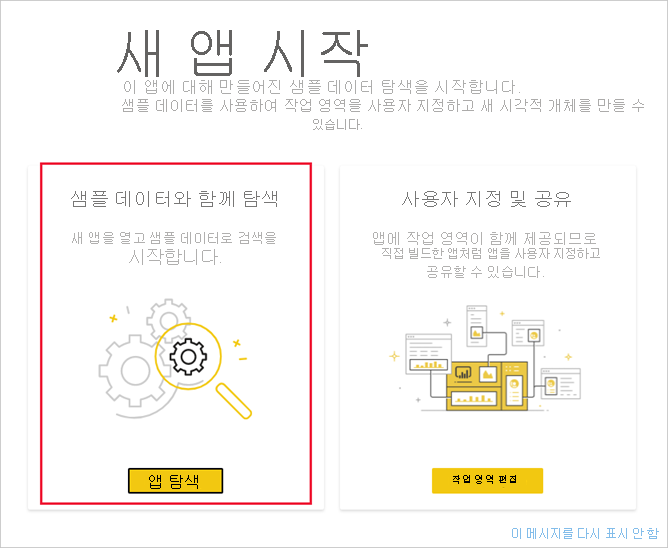

# Power BI 서비스에서 샘플 영업 및 마케팅 앱 설치 및 사용

[!INCLUDE[consumer-appliesto-yyny](../includes/consumer-appliesto-yyny.md)]

[Power BI 콘텐츠를 가져오는 방법을 기본적으로 이해](end-user-app-view.md)했으므로 이제 Microsoft AppSource(appsource.com)에서 영업 및 마케팅 앱을 다운로드해 보겠습니다. 

## Power BI 앱 마켓플레이스에서 앱 가져오기

1. 아직 로그인하지 않았으면 [Power BI 서비스에 로그인](./end-user-sign-in.md)합니다. 

1. Power BI에서 **앱 > 앱 가져오기**를 선택합니다. 

    

1. Power BI 앱 마켓플레이스가 열립니다. 영업 및 마케팅 앱을 찾습니다. 표시되지 않는 경우 검색 상자에 "Sales"를 입력 해 보세요.

    

1. 앱 타일을 클릭합니다. AppSource에서 앱 제품이 열립니다. **지금 가져오기**를 클릭합니다.

   

1. 이 앱을 설치할 것인지 확인합니다.

   

5. 앱이 설치되면 Power BI 서비스에 성공 메시지가 표시됩니다. **앱으로 이동**을 선택하여 앱을 엽니다. 디자이너가 앱을 만든 방법에 따라, 앱 대시보드 또는 앱 보고서가 표시됩니다.

    

    **앱**을 선택하고 **영업 및 마케팅**을 선택하여 앱 콘텐츠 목록에서 직접 앱을 열 수도 있습니다.

    

6. 새 앱을 탐색할지 또는 사용자 지정하고 공유할지를 선택합니다. Microsoft 샘플 앱을 선택했으므로 먼저 살펴보겠습니다. 

    

7.  새 앱이 대시보드를 사용하여 열립니다. 앱 *디자이너*가 대신 보고서로 열리도록 앱을 설정했을 수 있습니다.  

    

## 앱에서 대시보드 및 보고서와 상호 작용
앱을 구성하는 대시보드 및 보고서에서 데이터를 잠시 살펴보세요. 필터링, 강조 표시, 정렬 및 드릴다운과 같은 모든 표준 Power BI 상호 작용에 액세스할 수 있습니다.  대시보드와 보고서 간의 차이점이 약간 혼동되시나요?  [대시보드에 대한 문서](end-user-dashboards.md) 및 [보고서에 대한 문서](end-user-reports.md)를 읽어보세요.  

## 다음 단계
* [앱 개요로 돌아가기](end-user-apps.md)
* [Power BI 보고서 보기](end-user-report-open.md)
* [콘텐츠를 공유하는 다른 방법](end-user-shared-with-me.md)
