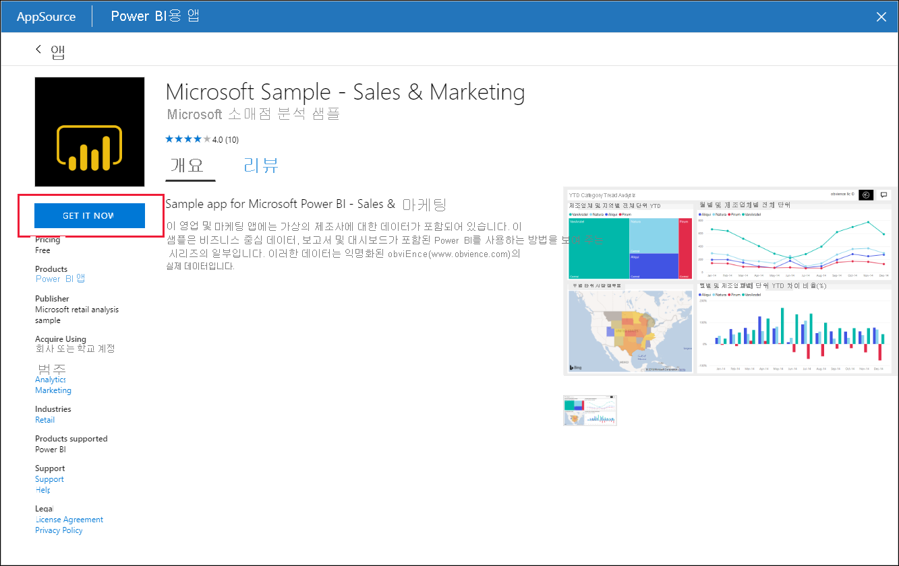
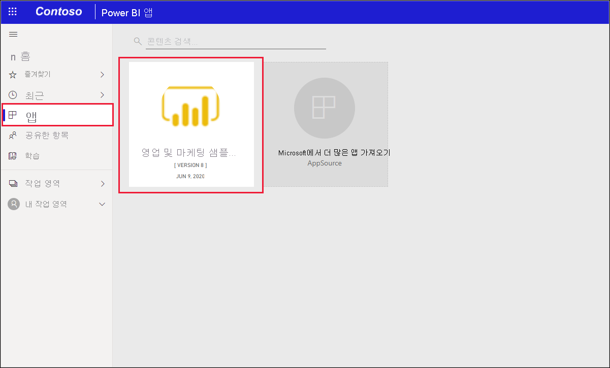
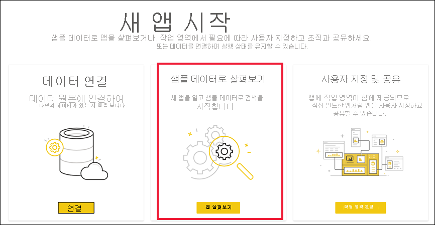
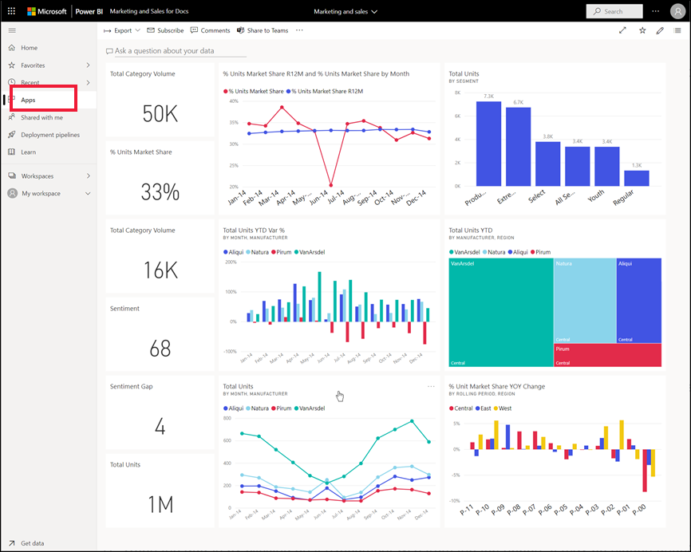

# Power BI 서비스에서 샘플 영업 및 마케팅 앱 설치 및 사용

[!INCLUDE[consumer-appliesto-yyny](../includes/consumer-appliesto-yyny.md)]

[Power BI 콘텐츠를 가져오는 방법을 기본적으로 이해](end-user-app-view.md)했으므로 이제 Microsoft AppSource를 사용하여 영업 및 마케팅 앱을 가져와 보겠습니다. 

## Microsoft AppSource에서 앱 가져오기

1. [https://appsource.microsoft.com](https://appsource.microsoft.com)을 엽니다.

   

1. 검색 상자에 **마케팅**을 입력하고 **제품별 상세 검색 > Power BI 앱** 옆에 확인 표시를 추가합니다. 

    

1. **Microsoft Sample - Sales & Marketing** 앱 타일을 선택합니다. 필요에 따라 개요 및 검토를 읽고 이미지를 살펴봅니다.  그런 다음, **지금 받기**를 선택합니다.

   

1. 이 앱을 설치할 것인지 확인합니다.

   

5. 앱이 설치되면 Power BI 서비스에 성공 메시지가 표시됩니다. **앱으로 이동**을 선택하여 앱을 엽니다. 디자이너가 앱을 만든 방법에 따라, 앱 대시보드 또는 앱 보고서가 표시됩니다.

    

    **앱**을 선택하고 **영업 및 마케팅** 앱 타일을 선택하여 앱 콘텐츠 목록에서 직접 앱을 열 수도 있습니다.

    

6. 자신의 고유한 데이터를 연결할지, 샘플 데이터를 탐색할지 또는 새 앱을 사용자 지정하고 공유할지를 선택합니다. Microsoft 샘플 앱을 선택했으므로 먼저 살펴보겠습니다. 

    

7.  새 앱이 대시보드를 사용하여 열립니다. 앱 *디자이너*가 대신 보고서로 열리도록 앱을 설정했을 수 있습니다.  

    

## 앱에서 대시보드 및 보고서와 상호 작용
앱을 구성하는 대시보드 및 보고서에서 데이터를 잠시 살펴보세요. 필터링, 강조 표시, 정렬 및 드릴다운과 같은 모든 표준 Power BI 상호 작용에 액세스할 수 있습니다.  대시보드와 보고서 간의 차이점이 약간 혼동되시나요?  [대시보드에 대한 문서](end-user-dashboards.md) 및 [보고서에 대한 문서](end-user-reports.md)를 읽어보세요.  

## 다음 단계
* [앱 개요로 돌아가기](end-user-apps.md)    
* [Power BI 보고서 보기](end-user-report-open.md)    
* [콘텐츠를 공유하는 다른 방법](end-user-shared-with-me.md)
