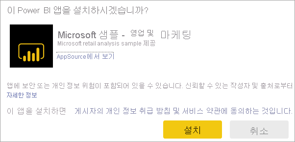

# Power BI에서 대시보드 및 보고서로 앱 설치 및 사용

[!INCLUDE[consumer-appliesto-ynny](../includes/consumer-appliesto-ynny.md)]

[!INCLUDE [power-bi-service-new-look-include](../includes/power-bi-service-new-look-include.md)]

이제 [앱에 대한 기본 이해](end-user-apps.md)를 했으므로, 앱을 열고 상호 작용하는 방법에 대해 알아보겠습니다. 

## 새 앱을 가져오는 방법
새 앱을 가져오는 방법은 몇 가지가 있습니다.
* Power BI의 Power BI 앱 마켓플레이스에서 가져올 수 있습니다.
* 앱 작성자로부터 받은 앱에 대한 직접 링크를 사용할 수 있습니다. 
* 조직의 보고서 디자이너는 Power BI 계정에 앱을 자동으로 설치할 수 있습니다.

Power BI 모바일 앱에서는 직접 링크를 통해서만 앱을 설치할 수 있습니다. 앱 설계자가 앱을 자동 설치할 경우 앱 목록이 표시됩니다.

## 앱 및 라이선스
일부 Power BI 사용자는 앱을 보고 상호 작용할 수 없습니다. 
- 평가판 라이선스가 있는 경우 사용자와 공유되고 프리미엄 용량의 작업 영역에 저장된 앱을 열 수 있습니다.
- Pro 라이선스가 있는 경우 공유된 앱을 열 수 있습니다.

## Power BI 앱 마켓플레이스에서 앱 가져오기

Power BI 앱 마켓플레이스에서 앱을 찾아 설치할 수 있습니다. 앱 마켓플레이스에서 조직 앱과 템플릿 앱을 모두 가져올 수 있습니다.

1. 아직 로그인하지 않았으면 [Power BI 서비스에 로그인](./end-user-sign-in.md)합니다. 

1. Power BI에서 **앱 > 앱 가져오기**를 선택합니다. 

    

1. Power BI 앱 마켓플레이스가 열립니다.

   

   세 개의 탭을 사용할 수 있습니다.
   * **모든 앱** - 템플릿 앱과 사용자가 사용할 수 있는 모든 조직 앱을 검색합니다. 템플릿 앱은 타일의 오른쪽 위 모서리에 있는 쇼핑백 아이콘으로 구분됩니다.
   * **조직 앱** - 사용자에게 공유된 조직 앱을 검색합니다. 
   * **템플릿 앱** - AppSource에서 호스트되는 템플릿 앱을 검색합니다.

   또는 검색 상자를 사용하여 필터링된 앱을 가져올 수 있습니다. 앱 또는 재무, 분석, 마케팅 등과 같은 범주의 이름 중 일부를 입력하면 원하는 항목을 보다 쉽게 찾을 수 있습니다. 

   검색 상자는 사용자가 연 탭에만 유효합니다. 즉, 선택한 유형의 앱만 반환됩니다. **모든 앱** 탭이 열려 있으면 조직 및 템플릿 앱이 모두 반환됩니다. 이 경우 조직 앱과 템플릿 앱의 이름이 같을 때 혼동될 수 있습니다. 템플릿 앱 타일의 오른쪽 위 모서리에는 쇼핑 백 아이콘이 있습니다.

원하는 앱을 찾았으면 **지금 가져오기**를 클릭하여 설치합니다.
* 조직 앱을 설치하는 경우 앱 목록에 즉시 추가됩니다.
* 템플릿 앱을 설치하는 경우 앱이 AppSource에서 템플릿 앱 제공으로 이동됩니다. Power BI 앱 마켓플레이스에서 샘플 템플릿 앱을 다운로드하고 설치하는 방법의 [예제](end-user-app-marketing.md)를 참조하세요. 

   > [!NOTE]
   > 평가판 사용자 라이선스를 사용하는 경우 Power BI Pro 계정으로 업그레이드하지 않거나 앱을 프리미엄 용량에 저장하지 않으면 앱을 다운로드할 수 있지만 볼 수는 없습니다. 자세한 내용은 [소비자 라이선스](end-user-license.md)를 참조하세요.

## 직접 링크에서 앱 설치
앱 디자이너로부터 받은 전자 메일의 직접 링크를 통해 조직 앱을 설치할 수도 있습니다.  

**컴퓨터에서** 

메일의 링크를 선택하면 Power BI 서비스([https://powerbi.com](https://powerbi.com))가 브라우저에서 앱을 엽니다. 

**iOS 또는 Android 모바일 디바이스에서** 

모바일 디바이스에서 메일의 링크를 선택하면 앱이 자동으로 설치되어 모바일 앱으로 열립니다. 먼저 로그인해야 할 수 있습니다. 

## 앱에서 대시보드 및 보고서와 상호 작용
앱을 구성하는 대시보드 및 보고서에서 데이터를 잠시 살펴보세요. 필터링, 강조 표시, 정렬 및 드릴다운과 같은 모든 표준 Power BI 상호 작용에 액세스할 수 있습니다.  대시보드와 보고서 간의 차이점이 약간 혼동되시나요?  [대시보드에 대한 문서](end-user-dashboards.md) 및 [보고서에 대한 문서](end-user-reports.md)를 읽어보세요.  

## 앱 업데이트 

때때로 앱 작성자는 앱의 새 버전을 릴리스할 수 있습니다. 새 버전을 가져오는 방법은 기존 버전을 받은 방법에 따라 달라집니다. 

* 조직에서 앱을 받은 경우 새 버전에 대한 업데이트가 완전히 투명하게 수행되므로 별도의 조치를 취할 필요가 없습니다. 

* AppSource에서 앱을 가져온 경우 다음에 앱을 열 때 알림 배너가 표시됩니다. 알림을 통해 새 버전을 사용할 수 있다는 것을 알 수 있습니다. 

    1. **가져오기**를 선택하여 업데이트합니다.  

        <!-- -->

    2. 업데이트된 앱을 설치하라는 메시지가 표시되면 **설치**를 선택합니다. 

         

    3. 이 앱의 버전이 이미 있으므로 기존 버전을 대체할지 아니면 새 작업 영역에 업데이트된 앱을 설치할지를 결정하세요.   

         

    > [!NOTE] 
    > 새 버전을 설치하면 보고서와 대시보드에 있을 수 있는 변경 사항이 덮어 쓰입니다. 업데이트된 보고서와 대시보드를 유지하려면 다른 이름으로 저장하거나 다른 위치에 저장한 후 설치하면 됩니다. 

    4. 업데이트된 버전이 설치되면 **앱 업데이트**를 선택하여 업데이트 프로세스를 완료합니다. 

## 다음 단계
* [앱 개요로 돌아가기](end-user-apps.md)
* [Power BI 보고서 보기](end-user-report-open.md)
* [콘텐츠를 공유하는 다른 방법](end-user-shared-with-me.md)

