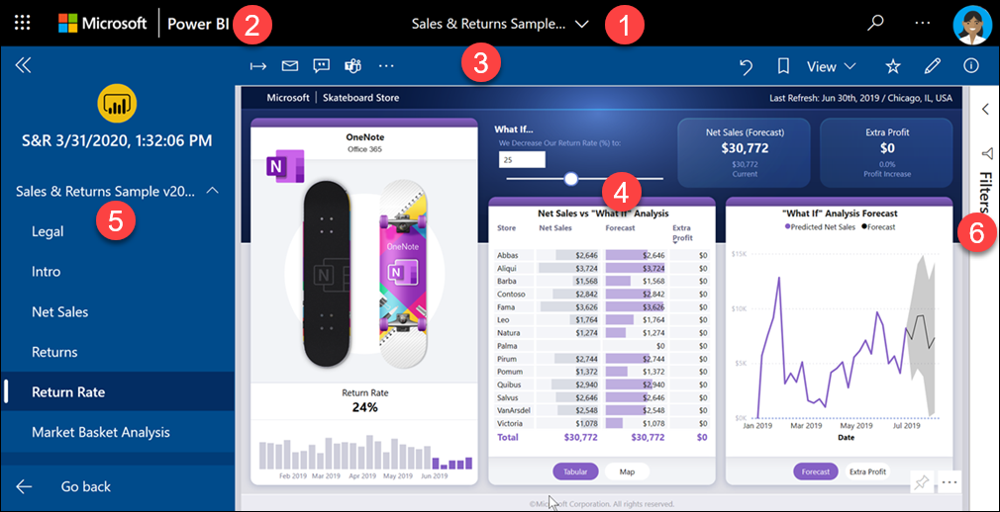
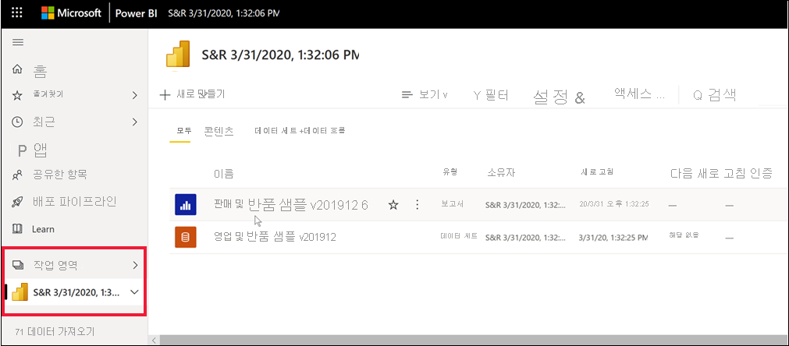

# Power BI에서 대시보드 및 보고서로 앱 설치 및 사용

[!INCLUDE[consumer-appliesto-ynny](../includes/consumer-appliesto-ynny.md)]

[!INCLUDE [power-bi-service-new-look-include](../includes/power-bi-service-new-look-include.md)]

이제 [앱에 대한 기본 이해](end-user-apps.md)를 했으므로, 앱을 열고 상호 작용하는 방법에 대해 알아보겠습니다. 

## 새 앱을 가져오는 방법
새 앱을 가져오는 방법은 몇 가지가 있습니다.
* Power BI 서비스의 Power BI 앱 마켓플레이스에서 가져올 수 있습니다.
* 앱 디자이너로부터 받은 앱의 직접 링크를 사용할 수 있습니다. 
* 조직의 앱 디자이너는 Power BI 계정에 앱을 자동으로 설치할 수 있습니다.

Power BI 모바일에서는 직접 링크를 통해서만 앱을 설치할 수 있습니다. 앱 설계자가 앱을 자동 설치할 경우 앱 목록이 표시됩니다.

## 앱 및 라이선스
일부 Power BI 사용자는 앱을 보고 상호 작용할 수 없습니다. 
- 무료 라이선스를 보유한 경우 프리미엄 용량에 저장되어 있고 지금까지 공유되어 온 앱을 열 수 있습니다.  
- Pro 라이선스가 있는 경우 공유된 앱을 열 수 있습니다.

따라서 앱을 열 수 없는 경우 관리자 또는 지원 센터에 문의하세요. 라이선싱에 관한 자세한 내용은 [Power BI 라이선싱](end-user-license.md)을 참조하세요.

## Power BI 앱 마켓플레이스에서 앱 가져오기

Power BI 앱 마켓플레이스에서 앱을 찾아 설치할 수 있습니다. 앱 마켓플레이스에서 조직 앱과 템플릿 앱을 모두 가져올 수 있습니다.

- ‘조직 앱’은 조직의 Power BI 사용자가 사용할 수 있습니다. 해당 앱에는 있는 그대로 사용하거나 사용자 지정하여 공유할 수 있는 미리 빌드된 대시보드와 보고서도 포함됩니다. 조직에는 판매를 추적하거나, 성능을 측정하거나, 채용 성공 여부를 분석하기 위한 앱이 있을 수 있습니다.
- ‘템플릿 앱’에는 SalesForce, Microsoft Dynamics, Google 애널리틱스와 같이 비즈니스를 실행하는 데 사용하는 여러 서비스를 연결하기 위해 사용할 수 있는 미리 빌드된 대시보드 및 보고서가 제공됩니다.

1. 아직 로그인하지 않았으면 [Power BI 서비스에 로그인](./end-user-sign-in.md)합니다. 

1. Power BI 서비스가 열리면 **앱 > 앱 가져오기** 를 선택합니다. 

    

1. Power BI 앱 마켓플레이스가 열립니다.

   

   세 개의 탭을 사용할 수 있습니다.
   * **모든 앱** - 템플릿 앱과 사용자가 사용할 수 있는 모든 조직 앱을 검색합니다. 템플릿 앱은 타일의 오른쪽 위 모서리에 있는 쇼핑백 아이콘으로 구분됩니다.
   * **조직 앱** - 사용자에게 공유된 조직 앱을 검색합니다. 
   * **템플릿 앱** - AppSource에서 호스트되는 템플릿 앱을 검색합니다.

   또는 검색 상자를 사용하여 필터링된 앱을 가져올 수 있습니다. 앱 또는 재무, 분석, 마케팅 등과 같은 범주의 이름 중 일부를 입력하면 원하는 항목을 보다 쉽게 찾을 수 있습니다. 

   검색 상자는 사용자가 연 탭에만 유효합니다. 즉, 선택한 유형의 앱만 반환됩니다. **모든 앱** 탭이 열려 있으면 조직 및 템플릿 앱이 모두 반환됩니다. 이 경우 조직 앱과 템플릿 앱의 이름이 같을 때 혼동될 수 있습니다. 템플릿 앱 타일의 오른쪽 위 모서리에는 쇼핑 백 아이콘이 있습니다.

4. 원하는 앱을 찾은 경우 **지금 가져오기** 를 선택하여 설치합니다.

   

* 조직 앱을 설치하는 경우 앱 목록에 즉시 추가됩니다.
* 템플릿 앱을 설치하는 경우 앱이 AppSource에서 템플릿 앱 제공으로 이동됩니다. Power BI 앱 마켓플레이스에서 샘플 템플릿 앱을 다운로드하고 설치하는 방법의 [예제](end-user-app-marketing.md)를 참조하세요. 앱은 동일한 이름의 작업 영역과 함께 설치됩니다.

   > [!NOTE]
   > 평가판 사용자 라이선스를 사용하는 경우 Power BI Pro 계정으로 업그레이드하지 않거나 앱을 Premium 공유 용량에 저장하지 않으면 앱을 다운로드할 수 있지만 볼 수는 없습니다. 자세한 내용은 [비즈니스 사용자를 위한 라이선스](end-user-license.md)를 참조하세요.

## 직접 링크에서 앱 설치
직접 링크에서 조직 앱을 설치할 수도 있습니다.    

**컴퓨터에서** 

메일의 링크를 선택하면 Power BI 서비스([https://app.powerbi.com](https://app.powerbi.com))가 브라우저에서 앱을 엽니다. 

**iOS 또는 Android 모바일 디바이스에서** 

모바일 디바이스에서 메일의 링크를 선택하면 앱이 자동으로 설치되어 모바일 앱으로 열립니다. 먼저 로그인해야 할 수 있습니다. 

## 앱에서 대시보드 및 보고서와 상호 작용
앱을 구성하는 대시보드 및 보고서에서 데이터를 잠시 살펴보세요. 필터링, 강조 표시, 정렬 및 드릴다운과 같은 모든 표준 Power BI 상호 작용에 액세스할 수 있습니다.  앱을 사용하여 수행할 수 있는 작업의 범위는 *디자이너* 가 할당한 권한에 의해 제어됩니다.  앱의 대시보드 및 보고서와 상호 작용하는 방법은 *디자이너* 가 할당한 액세스 및 역할에 의해 제어됩니다. 

대시보드와 보고서 간의 차이점이 약간 혼동되시나요?  [대시보드에 대한 문서](end-user-dashboards.md) 및 [보고서에 대한 문서](end-user-reports.md)를 읽어보세요.  

### 앱 열기

앱을 설치했거나 동료로부터 앱을 받았습니다. 해당 앱을 보려면 탐색 창에서 **앱** 을 선택하여 앱 콘텐츠 목록을 엽니다.

앱을 가리키고 선택하여 엽니다. 앱에 따라 다음과 같은 프롬프트가 표시될 수 있습니다.

선택할 옵션에 관한 지침은 [템플릿 앱 설치](../connect-data/service-template-apps-install-distribute.md)를 참조하세요.

앱을 가리켜서 세부 정보를 확인하고 앱 카드를 선택하여 앱을 엽니다.

앱이 열립니다. 모든 앱은 다양한 레이아웃, 시각적 개체, 색, 옵션에 따라 다르게 보입니다. 그러나 모든 앱에는 몇 가지 일반적인 기능이 있습니다.

1. 앱 이름 및 마지막으로 업데이트된 시간. 드롭다운 화살표를 선택하여 소유자 및 도움말 연락처를 조회합니다.
1. **Power BI** 를 선택하여 [홈](end-user-home.md)으로 돌아갑니다.
1. 작업 모음. 
1. 보고서 페이지 캔버스.
1. 앱 탐색 창.  앱 이름 아래에는 콘텐츠 목록이 있습니다. 이 앱에는 여섯 페이지가 있는 보고서가 하나 있습니다. 보고서 페이지 이름을 선택하여 보고서 페이지를 엽니다. 현재 ‘반품 비율’ 페이지가 열려 있습니다. 
1. 화살표를 선택하여 **필터** 창을 확장합니다.

액세스 권한이 부여된 경우 연결된 작업 영역을 탐색할 수도 있습니다.  템플릿 앱을 설치하거나 다운로드하면 Power BI 서비스에서 작업 영역을 만듭니다. 조직 앱을 설치할 때 작업 영역에 대한 액세스가 포함되지 않을 수 있습니다. [작업 영역에 대해 알아봅니다](end-user-workspaces.md). **Power BI**(2번)를 선택하여 **홈** 으로 돌아가서 **작업 영역** 을 선택합니다. 

## 앱 업데이트 

때때로 앱 디자이너는 앱의 새 버전을 릴리스할 수 있습니다. 새 버전을 가져오는 방법은 기존 버전을 받은 방법에 따라 달라집니다. 

* 조직에서 앱을 받은 경우 새 버전에 대한 업데이트가 완전히 투명하게 수행되므로 별도의 조치를 취할 필요가 없습니다. 

* AppSource에서 템플릿 앱을 가져온 경우 다음에 앱을 열 때 알림 배너가 표시됩니다. 알림을 통해 새 버전을 사용할 수 있다는 것을 알 수 있습니다. 

    1. **가져오기** 를 선택하여 업데이트합니다.  

        <!-- -->

    2. 업데이트된 앱을 설치하라는 메시지가 표시되면 **설치** 를 선택합니다. 

         

    3. 이 앱의 버전이 이미 있으므로 기존 버전을 대체할지 아니면 새 작업 영역에 업데이트된 앱을 설치할지를 결정하세요.   

         

     > [!NOTE] 
     > 새 버전을 설치하면 앱의 보고서와 대시보드에 대한 변경 내용을 덮어씁니다. 업데이트된 보고서와 대시보드를 유지하려면 다른 이름으로 저장하거나 다른 위치에 저장한 후 설치하면 됩니다. 

    4. 업데이트된 버전이 설치되면 **앱 업데이트** 를 선택하여 업데이트 프로세스를 완료합니다. 

## 고려 사항 및 문제 해결

- 앱 설치 기능은 Power BI 관리자가 켜고 끌 수 있습니다. 이 기능을 사용하도록 설정해야 하는 경우 IT 부서 또는 지원 센터에 문의하세요.    
- 앱을 사용하려면 Pro 라이선스가 있거나 앱을 프리미엄 공유 용량의 작업 영역에 저장해야 합니다. [라이선스에 대해 알아봅니다](end-user-license.md).

## 다음 단계
* [앱 개요로 돌아가기](end-user-apps.md)
* [Power BI 보고서 보기](end-user-report-open.md)
* [콘텐츠를 공유하는 다른 방법](end-user-shared-with-me.md)

