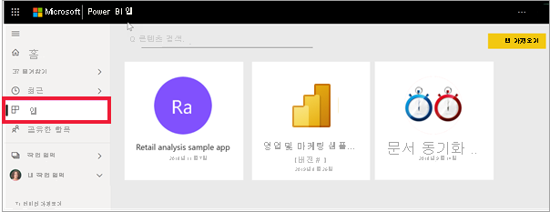

# Power BI의 앱

[!INCLUDE[consumer-appliesto-ynny](../includes/consumer-appliesto-ynny.md)]

[!INCLUDE [power-bi-service-new-look-include](../includes/power-bi-service-new-look-include.md)]

## Power BI 앱이란?
*앱*은 관련 대시보드 및 보고서를 모두 한 곳에서 결합하는 Power BI 콘텐츠 형식입니다. 앱은 하나 이상의 대시보드와 하나 이상의 보고서를 함께 번들할 수 있습니다. 앱은 귀하와 같은 *소비자*와 함께 앱을 배포하고 공유하는 Power BI *디자이너*에 의해 생성됩니다. 

앱이 **앱** 콘텐츠 목록에 구성되어 있습니다. 간단히 **앱**을 선택하여 앱을 표시합니다. 앱을 마우스로 가리켜 마지막으로 업데이트한 날짜와 소유자를 확인합니다. 

앱 기능을 사용하려면 Power BI Pro 라이선스가 필요하거나 앱을 프리미엄 용량에 저장해야 합니다. 라이선스 및 프리미엄 용량에 대한 자세한 내용은 [소비자 라이선스](end-user-license.md)를 참조하세요.

## 앱 *디자이너* 및 앱 *소비자*
사용자 역할에 따라 자신의 용도에 따라 또는 동료와 공유하기 위해 앱(*디자이너*)을 만들려는 사람이 있을 수 있습니다. 또는 다른 사용자가 만든 앱(*소비자*)를 받아 다운로드하는 사람일 수 있습니다. 이 문서는 앱 *소비자*를 위한 것입니다.

## 앱의 이점
앱은 한 번에 다양한 유형의 콘텐츠를 공유하는 쉬운 방법입니다. 앱 *디자이너*는 대시보드 및 보고서를 만들어 앱에 번들로 묶습니다. 그런 다음, *디자이너*는 *소비자*가 액세스할 수 있는 위치에서 앱을 공유하거나 게시합니다. 관련 대시보드 및 보고서가 함께 번들로 제공되기 때문에 Power BI 서비스([https://powerbi.com](https://powerbi.com)) 및 모바일 디바이스에서 보다 쉽게 찾아 설치할 수 있습니다. 앱을 설치한 후에는 다양한 여러 대시보드 또는 보고서가 앱, 브라우저 또는 모바일 디바이스에 모두 함께 있기 때문에 해당 이름을 기억할 필요가 없습니다.

앱을 사용하면 앱 작성자가 업데이트를 릴리스할 때마다 자동으로 변경 사항을 확인할 수 있습니다. 또한 작성자는 데이터 새로 고침 예약 빈도를 조절하기도 하므로, 최신 상태로 유지하는 것에 대해 염려할 필요가 없습니다. 

<!-- add conceptual art -->
## 새 앱 가져오기
새 앱을 가져오는 가장 좋은 방법은 [Power BI 앱 마켓플레이스](https://app.powerbi.com/groups/me/getapps/apps)에서 가져오는 것입니다.

앱을 가져오는 몇 가지 다른 방법이 있습니다. 아래에 이런 방법 일부가 나와 있습니다. 하지만 앱을 가져오고 탐색하는 방법에 대한 자세한 단계별 지침은 [앱 열기 및 상호 작용](end-user-app-view.md)을 참조하세요.

* 앱 디자이너는 앱을 Power BI 계정에 자동으로 설치할 수 있으며, 다음에 Power BI를 열면 새 앱이 **앱** 콘텐츠 목록에 표시됩니다. 
* 앱 디자이너는 앱의 직접 링크를 소비자에게 메일로 보낼 수 있습니다. 링크를 선택하면 Power BI 서비스에서 앱이 열립니다.
* 모바일 디바이스의 Power BI에서는 AppSource가 아닌 직접 링크를 통해서만 설치할 수 있습니다. 앱 작성자가 앱을 자동 설치할 경우 앱 목록이 표시됩니다. 

## 다음 단계
* [앱 열기 및 상호 작용](end-user-app-view.md)
* [콘텐츠를 공유하는 다른 방법](end-user-shared-with-me.md)

