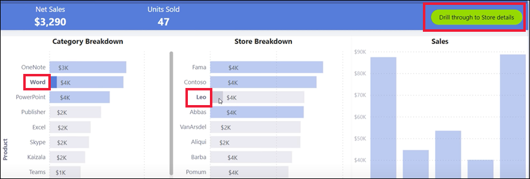

# Power BI 서비스의 단추
동료에게 받은 보고서에 단추가 표시된 것을 보고 사용하는 방법이 궁금했을 수도 있습니다. 일부에는 단어가 있고, 일부에는 화살표가 있으며, 또 다른 일부에는 드롭다운 메뉴도 있습니다. 이 문서에서는 단추를 인식하는 방법과 단추로 수행하는 작업을 파악하는 방법을 설명합니다.

## 단추를 인식하는 방법
단추는 보고서 페이지에서 도형, 이미지 또는 아이콘과 매우 비슷하게 보일 수 있습니다. 그러나 선택(클릭)했을 때 작업이 발생한다면 단추일 수 있습니다.

## 단추의 유형
보고서 작성자는 이동 및 탐색에 도움을 주기 위해 단추를 보고서에 추가합니다. 단추의 유형은 **뒤로**, **책갈피**, **드릴스루**, **페이지 탐색**, **질문 및 답변**, **웹 URL** 등입니다. 

### 뒤로 단추 
뒤로 단추에는 화살표 아이콘이 있을 수 있으며, 이 단추를 선택하면 Power BI의 이전 페이지로 돌아갑니다.  뒤로 단추는 드릴스루와 함께 사용되는 경우가 많습니다. 다음 예는 드릴스루와 함께 사용되는 뒤로 단추입니다.

1. 막대형 차트에서 **Word**를 선택합니다.
1. **드릴스루**를 선택하고 **시장 바구니 분석**을 선택합니다.

    

    **시장 바구니 분석**를 선택하면 Power BI에서 *시장 바구니 분석* 보고서 페이지가 열리고 원본 페이지에서 선택된 항목을 사용해 대상 페이지에 표시되는 항목이 필터링됩니다.

    

    이제 Word용으로 필터링된 **시장 바구니 분석** 보고서 페이지가 표시됩니다. 이전 페이지로 돌아가려면 뒤로 단추를 선택합니다. 

## 책갈피 단추
보고서 디자이너는 보고서와 함께 책갈피를 포함하는 경우가 많습니다. 오른쪽 위 모서리에서 **보기** > **책갈피**를 선택하여 보고서 책갈피 목록을 볼 수 있습니다. 보고서 디자이너가 책갈피 ‘단추’를 추가하는 경우 해당 책갈피와 연결된 특정 보고서 페이지로 이동하는 대안이 됩니다. 책갈피에서 캡처한 필터와 설정이 페이지에 적용됩니다. [Power BI의 책갈피에 대해 자세히 알아보세요](end-user-bookmarks.md). 

이 예제에서 단추는 책갈피 아이콘이고, 책갈피 이름은 *Urban*입니다. 

책갈피 단추를 선택하면 Power BI에서 해당 책갈피에 대해 정의된 위치 및 설정이 열립니다.  이 예에서 책갈피는 *Growth opportunities* 보고서 페이지에 있으며, 이 페이지는 **Urban**에 대해 교차 필터링되었습니다.

## 드릴스루 단추
Power BI 서비스에서 드릴스루하는 두 가지 방법이 있습니다. 드릴스루를 사용하면 다른 보고서 페이지로 이동하며, 해당 대상 페이지에서 데이터는 원본 페이지에서 만든 필터 및 선택 항목에 따라 표시됩니다.

보고서에서 드릴스루하는 한 가지 방법은 시각적 개체의 데이터 요소를 마우스 오른쪽 단추로 클릭하고 **드릴스루**를 선택한 후 대상을 선택하는 것입니다. 이 방법은 위에 나온 **뒤로 단추**라는 섹션에서 설명되어 있습니다. 그러나 보고서 디자이너가 드릴스루 ‘단추’를 대신 사용하여 동작을 보다 명확하게 만들고 중요 인사이트에 주의를 끄는 경우도 있습니다.  

드릴스루 단추에는 두 가지 이상의 필수 구성 요소가 있을 수 있습니다. 모든 필수 구성 요소가 충족되지 않으면 단추가 작동하지 않습니다. 예를 살펴보겠습니다.

다음은 *매장 세부 정보* 페이지로 이동하는 드릴스루 단추입니다. 단추 위로 마우스를 가져가면 매장과 제품을 모두 선택해야 한다는 것을 알 수 있는 도구 설명이 나타납니다. 각 항목 중 하나를 선택할 때까지 단추가 비활성 상태로 유지됩니다.

이제 하나의 제품(**Word**)과 하나의 매장(**Leo**)을 선택했으므로 단추의 색상이 변경되어 단추가 활성화되었음을 알립니다.

드릴스루 단추를 선택하면 *Store* 보고서 페이지로 이동합니다. *Store* 페이지는 선택한 **Word** 및 **Leo**에 대해 필터링됩니다.

드릴스루 단추에는 대상 선택 항목을 제공하는 드롭다운 메뉴가 있을 수도 있습니다. 원본 보고서 페이지에서 원하는 항목을 선택했으면 드릴스루에 대한 대상 보고서 페이지를 선택합니다. 아래 예에서는 *Market details* 보고서 페이지로 드릴스루하도록 선택을 변경합니다. 

## 페이지 탐색

페이지 탐색 단추를 사용하면 동일한 보고서의 다른 페이지로 이동합니다. 보고서 디자이너는 스토리를 알려 주거나 보고서 인사이트를 안내하기 위해 탐색 단추를 만드는 경우가 많습니다. 아래 예에서 보고서 디자이너는 보고서의 최상위 요약 페이지인 첫 번째 페이지로 이동하는 단추를 각 보고서 페이지에 추가했습니다. 이 보고서에는 많은 페이지가 있으므로 이 페이지 탐색 단추는 유용합니다.

## 질문 및 답변 단추 
질문 및 답변 단추를 선택하면 Power BI 질문 및 답변 탐색기 창이 열립니다. 질문 및 답변 창은 보고서 페이지 맨 위에 표시되고 X를 선택하여 닫을 수 있습니다. [질문 및 답변에 대해 알아보기](end-user-q-and-a.md)

## 웹 URL
웹 URL 단추는 새 브라우저 창을 엽니다. 보고서 디자이너는 이 유형의 단추를 참조 소스로, 회사 웹 사이트에 연결되는 링크로, 또는 심지어 다른 보고서나 대시보드에 대한 링크로 추가할 수도 있습니다. 아래 예에서 웹 URL 단추를 사용하면 보고서의 원본 파일을 다운로드할 수 있습니다. 

페이지가 별도의 창에서 열리기 때문에 창을 닫거나 Power BI 탭을 선택하여 Power BI 보고서로 돌아갑니다.

## 다음 단계
[책갈피](end-user-bookmarks.md)    
[드릴업, 드릴다운](end-user-drill.md)
