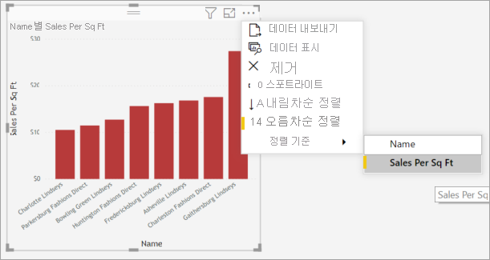

# Power BI 보고서에서 차트 정렬 방식 변경

[!INCLUDE[consumer-appliesto-ynnn](../includes/consumer-appliesto-ynnn.md)]

> [!IMPORTANT]
> **이 문서는 보고서 또는 데이터 세트에 대한 편집 권한이 없고 온라인 버전의 Power BI(Power BI 서비스)에서만 작업하는 Power BI 사용자를 대상으로 작성되었습니다. 보고서 *디자이너*, *관리자* 또는 *소유자*인 경우 이 문서에 모든 필요한 정보가 포함되지 않았을 수 있습니다. 대신, [Power BI Desktop에서 열 기준 정렬](../create-reports/desktop-sort-by-column.md)** 을 참조하세요.

Power BI 서비스에서 다양한 데이터 필드로 정렬하여 시각적 개체의 모양을 변경할 수 있습니다. 시각적 개체의 정렬 방법을 변경하여 전달하려는 정보를 강조 표시할 수 있습니다. 숫자 데이터(예: 판매 수치) 또는 텍스트 데이터(예: 주 이름) 중 어떤 데이터를 사용하든지 시각화를 원하는 대로 정렬할 수 있습니다. Power BI는 여러 가지 정렬 방법과 간편한 메뉴를 제공합니다. 

대시보드의 시각적 개체는 정렬할 수 없습니다. 하지만 Power BI 보고서에서는 대부분의 시각화를 한 번에 한 개, 경우에 따라 두 개의 필드를 기준으로 정렬할 수 있습니다. 특정 형식의 시각적 개체에는 정렬을 전혀 사용할 수 없습니다(트리 맵, 계기, 지도 등). 

## 시작

시작하려면 공유된 보고서를 엽니다. 정렬할 수 있는 시각적 개체를 선택하고 **추가 작업**(...)을 선택합니다.  정렬에 대해 세 가지 옵션이 있습니다. **내림차순 정렬**, **오름차순 정렬**, **정렬 기준**. 
    

### 사전순 또는 숫자순으로 정렬

시각적 개체 범주의 텍스트 이름 또는 각 범주의 숫자 값을 기준으로 시각적 개체를 사전순으로 정렬할 수 있습니다. 예를 들어 이 차트는 X 축 범주 매장 **이름**이 사전순으로 정렬되어 있습니다.

정렬 기준을 범주(매장 이름)에서 값(평방 피트당 매출)으로 대신 변경하는 것은 쉽습니다. **기타 작업**(...)을 선택하고 **정렬 기준**을 선택합니다. 시각적 개체에 사용되는 숫자 값을 선택합니다.  이 예제에서는 **Sales Per Sq Ft**를 선택했습니다.

필요한 경우, 오름차순 및 내림차순으로 정렬 순서를 변경합니다.  **기타 작업**(...)을 다시 선택하고 **내림차순 정렬** 또는 **오름차순 정렬**을 선택합니다. 정렬 작업에 사용 중인 필드는 굵은 글꼴로 표시되고 노란색 막대가 있습니다.

   

> [!NOTE]
> 일부 시각화는 정렬되지 않습니다. 예를 들어 트리맵, 지도, 등치 지역도, 분산형, 계기, 카드, 폭포 시각화는 정렬할 수 없습니다.

## 여러 열을 기준으로 정렬
이 테이블의 데이터는 **고객 수**를 기준으로 정렬됩니다.  단어 숫자 아래 있는 작은 화살표로 이를 알 수 있습니다. 화살표가 아래를 향하고 있는 것은 열이 내림차순으로 정렬되어 있음을 의미합니다.

정렬 순서에 열을 더 추가하려면 정렬 순서 옆에서 추가하려는 열 머리글을 Shift를 누른 상태로 클릭합니다. 예를 들어 **고객 수**를 클릭한 다음 Shift를 누른 상태에서 **총 수익**을 클릭하면 테이블은 먼저 고객 기준으로 정렬된 다음 수익 기준으로 정렬됩니다. 빨간색 윤곽선은 정렬 순서가 변경된 영역을 표시합니다.

같은 열에서 Shift를 누른 상태로 다시 클릭하면 해당 열의 정렬 방향이 변경됩니다. 또한 이전에 정렬 순서에 추가한 열을 Shift를 누른 상태로 클릭하면 해당 열이 정렬 순서의 뒤로 이동합니다.

## 정렬 순서에 적용한 변경 내용 저장
Power BI 보고서는 [읽기용 보기](end-user-reading-view.md)에서 작업하는 경우에도 필터, 슬라이서, 정렬 및 기타 데이터 뷰 변경 내용을 유지합니다. 따라서 보고서에서 다른 곳으로 이동했다가 나중에 돌아오면 정렬 변경 내용이 저장됩니다.  변경 내용을 보고서 *디자이너* 설정으로 다시 되돌리려면 위쪽 메뉴 모음에서 **기본값으로 다시 설정**을 선택합니다. 

그러나 **기본값으로 다시 설정** 단추가 회색으로 표시되면 보고서 *디자이너*가 변경 내용을 저장할 수 없도록 설정한 것입니다.

## 고려 사항 및 문제 해결

### 다른 조건을 사용하여 정렬
시각적 개체에 포함되지 않은 다른 필드나 다른 기준을 사용하여 시각적 개체를 정렬하려는 경우도 있습니다.  예를 들어 사전순이 아닌 월별로 순차적으로 정렬하려고 하거나 개별 숫자가 아닌 전체 숫자(예를 들어 0, 1, 20, 9가 아닌 0, 1, 9, 20 전체)별로 정렬하려고 할 수 있습니다.  

보고서를 설계한 사람만 이 변경 작업을 수행할 수 있습니다. *디자이너*의 연락처 정보는 머리글 표시줄에서 보고서 이름을 선택하여 확인할 수 있습니다.

콘텐츠에 대한 편집 권한이 있는 *디자이너*인 경우 [Power BI Desktop의 열 기준 정렬](../create-reports/desktop-sort-by-column.md)을 참조하여 데이터 세트를 업데이트하고 이러한 종류의 정렬을 설정하는 방법을 알아보세요.

## 다음 단계
[Power BI 보고서의 시각화](end-user-visualizations.md)에 대해 자세히 알아보세요.

[Power BI - 기본 개념](end-user-basic-concepts.md)
