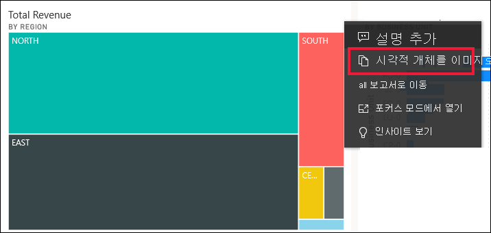
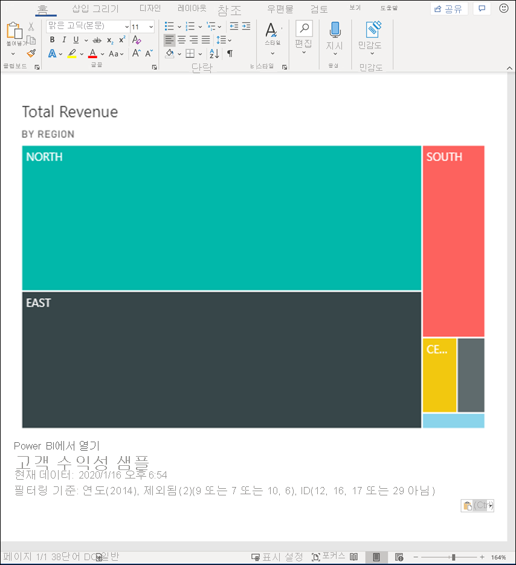
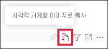
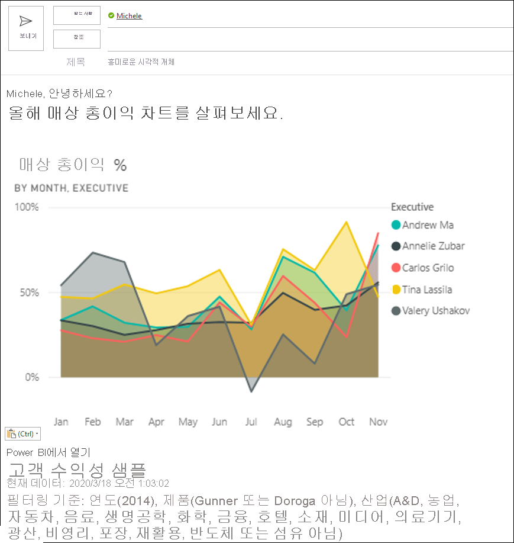
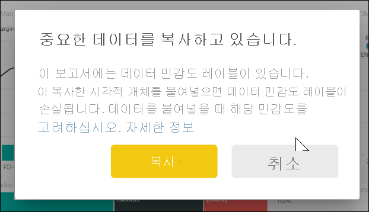
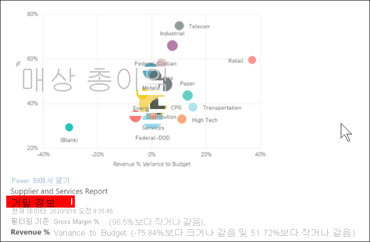
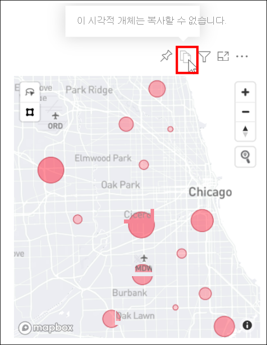

# 시각적 개체를 이미지로 클립보드에 복사

[!INCLUDE[consumer-appliesto-yyyn](../includes/consumer-appliesto-yyyn.md)]

Power BI 보고서 또는 대시보드에서 이미지를 공유하려고 했습니까? 이제 시각적 개체를 복사하여 붙여넣기를 지원하는 다른 애플리케이션에 붙여넣을 수 있습니다. 

시각적 개체의 정적 이미지를 복사하는 경우 메타데이터와 함께 시각적 개체의 복사본을 가져옵니다. 다음 내용이 포함됩니다.
* Power BI 보고서 또는 대시보드에 다시 연결
* 보고서 또는 대시보드의 제목
* 이미지에 기밀 정보가 포함되어 있는지 주의
* 마지막으로 업데이트된 타임스탬프
* 시각적 개체에 적용되는 필터

### 대시보드 타일에서 복사

1. 복사하려는 대시보드로 이동합니다.

2. 시각적 개체의 오른쪽 위 모서리에서 **기타 작업(...)** 을 선택하고 **시각적 개체를 이미지로 복사**를 선택합니다. 

    

3. **시각적 개체를 복사할 준비가 되고** 대화 상자가 표시되면 **클립보드로 복사**를 선택합니다.

    

4. 시각적 개체를 복사한 후 **Ctrl + V** 또는 오른쪽 단추로 클릭 > 붙여넣기를 사용하여 다른 애플리케이션에 붙여넣습니다. 아래 스크린샷에서는 시각적 개체를 Microsoft Word에 붙여넣었습니다. 

    

### 보고서 시각적 개체에서 복사 

1. 복사하려는 보고서로 이동합니다.

2. 시각적 개체의 오른쪽 위 모퉁이에서 **시각적 개체를 이미지로 복사** 아이콘을 선택합니다. 

    

3. **시각적 개체를 복사할 준비가 되고** 대화 상자가 표시되면 **클립보드로 복사**를 선택합니다.

    

4. 시각적 개체를 복사한 후 **Ctrl + V** 또는 오른쪽 단추로 클릭 > 붙여넣기를 사용하여 다른 애플리케이션에 붙여넣습니다. 아래 스크린샷에서는 시각적 개체를 전자 메일에 붙여넣었습니다.

    

5. 보고서에 데이터 민감도 레이블이 적용된 경우에는 복사 아이콘을 선택할 때 경고가 표시됩니다.  

    

    민감도 레이블은 붙여넣은 시각적 개체 아래의 메타데이터에 추가됩니다. 

    

## 고려 사항 및 문제 해결

   

Q: 시각적 개체에서 복사 아이콘을 사용하지 않도록 설정하는 이유는 무엇인가요?    
A: 현재 네이티브 Power BI 시각적 개체와 인증된 사용자 지정 시각적 개체를 지원합니다. 다음을 비롯한 특정 시각적 개체에 대한 지원이 제한됩니다. 
- ESRI 및 기타 지도 시각적 개체 
- Python 시각적 개체 
- R 시각적 개체 
- PowerApps    

A: 시각적 개체를 복사하는 기능은 IT 부서 또는 Power BI 관리자에 의해 해제될 수 있습니다.

Q: 시각적 개체를 제대로 붙여넣지 않는 이유는 무엇인가요?    
A: 사용자 지정 시각적 개체 및 애니메이션 시각적 개체에 대한 제한 사항이 있습니다. 

## 다음 단계
[Power BI 보고서의 시각화](end-user-visual-type.md)에 대해 자세히 알아보기

궁금한 점이 더 있나요? [Power BI 커뮤니티를 이용하세요.](https://community.powerbi.com/)

