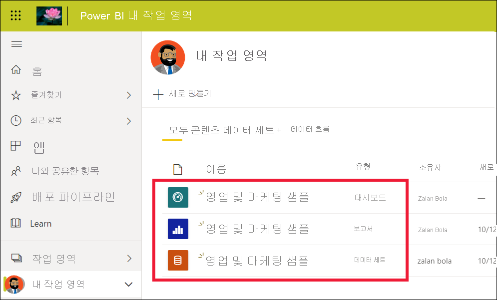
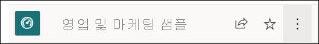
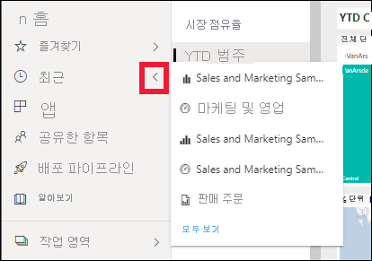
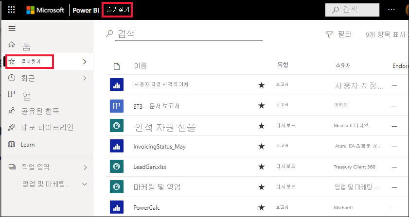
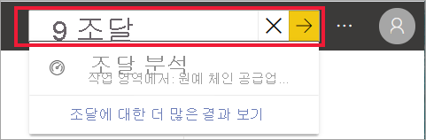
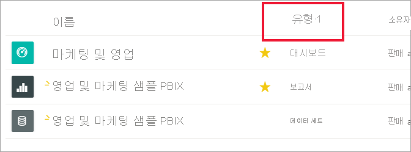
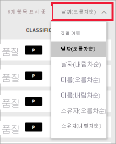
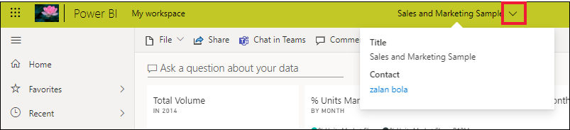
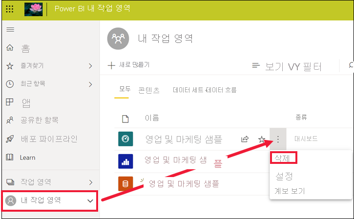

# 빠른 시작 - Power BI 서비스 살펴보기

[!INCLUDE [power-bi-service-new-look-include](../includes/power-bi-service-new-look-include.md)]

이제 [Power BI의 기본 사항](end-user-basic-concepts.md)을 알아보았으므로 **Power BI 서비스** 를 살펴보겠습니다. 이전 문서에서 언급했듯이, 팀 내의 어떤 동료는 **Power BI Desktop** 에서 모든 시간을 보내면서 데이터를 결합하고 다른 사용자를 위한 보고서, 대시보드 및 앱을 만듭니다. 이들은 *디자이너* 입니다. 반면 Power BI 서비스를 이용하는 내내 다른 사람이 만든 콘텐츠를 보고 상호 작용하는 이들도 있습니다( **소비** 경험). 이들은 *비즈니스 사용자* 입니다. 이 빠른 시작은 *비즈니스 사용자* 를 위한 것입니다. 

   
 
## 사전 요구 사항

- 아직 Power BI에 등록하지 않은 경우 시작하기 전에 [평가판에 등록합니다](https://app.powerbi.com/signupredirect?pbi_source=web).

- [Power BI 서비스 기본 개념](end-user-basic-concepts.md)을 참조합니다.

- *디자이너* 가 만든 Power BI 콘텐츠(보고서, 대시보드, 앱)를 보려면 다음 두 가지 조건 중 하나가 필요합니다.
    - Power BI Pro 라이선스
    - 조직에서는 Power BI Premium 구독, 그리고 Premium 용량에서 공유할 콘텐츠가 필요합니다.    
    [라이선스 및 구독에 대해 알아보세요](end-user-license.md).     

    이 빠른 시작의 목적을 달성하기 위해, 이러한 조건 중 어느 것도 요구하지 않을 것입니다. Power BI 서비스 인터페이스에서 바로 사용할 수 있는 샘플 콘텐츠를 Microsoft에서 준비해 두었습니다. 이 샘플 콘텐츠를 사용하여 Power BI 서비스 사용 방법을 알아보겠습니다. 

## Power BI 서비스 열기

먼저 Power BI 서비스(app.powerbi.com)를 엽니다. 
1. 왼쪽 탐색 창이 축소되어 있으면 탐색 창 아이콘  클릭하여 펼칩니다. 

1. 왼쪽 아래 모서리에서 **데이터 가져오기** 를 선택합니다. Power BI 서비스 둘러보기에 사용할 샘플 데이터를 가져오겠습니다. 온갖 종류의 샘플 데이터가 제공되는데, 이번에는 마케팅과 영업 관련 데이터를 사용하겠습니다. 

   ![[데이터 가져오기] 단추를 보여주는 스크린샷](./media/end-user-experience/power-bi-get-data.png)

1. **데이터 가져오기** 화면이 열리면 **샘플** 을 선택합니다.

   ![[샘플] 주위에 빨간색 상자가 표시된 [데이터 가져오기] 화면을 보여주는 스크린샷](./media/end-user-experience/power-bi-sample.png)

1. **영업 및 마케팅** > **연결** 을 선택합니다. 

   ![[영업 및 마케팅] 샘플을 선택한 스크린샷](./media/end-user-experience/power-bi-sales.png)

5. Power BI 서비스가 **내 작업 영역** 에 샘플을 설치합니다.  **내 작업 영역** 은 학습 및 실험을 위한 프라이빗 샌드박스입니다.  **내 작업 영역** 의 콘텐츠는 본인만 볼 수 있습니다. 이 샘플에는 대시보드 하나, 보고서 하나, 데이터 세트가 하나 포함되어 있습니다. 일반적으로 *비즈니스 사용자* 는 데이터 세트를 받지 않지만, 이 샘플은 모든 사용자를 위해 설계되었으며 데이터 세트 하나를 포함하고 있습니다.

    

    *비즈니스 사용자* 와 공유되는 대부분의 콘텐츠는 기본 데이터 세트에 대한 직접 액세스를 제공하지 않습니다. Power BI 샘플은 모든 Power BI 고객을 위해 만들어지므로 데이터 세트가 포함되어 있습니다.   

    샘플에 대한 자세한 내용은 [Power BI용 샘플 가져오기](../create-reports/sample-datasets.md)를 참조하세요.

## 콘텐츠 보기(대시보드 및 보고서)
콘텐츠는 작업 영역을 기준으로 구성됩니다. 모든 비즈니스 사용자는 하나 이상의 작업 영역을 갖게 되며, 이 작업 영역을 **내 작업 영역** 이라고 합니다. *디자이너* 동료가 비즈니스 사용자와 콘텐츠를 공유할 경우 추가 작업 영역이 생길 수 있습니다.  예를 들어 *디자이너* 가 자신의 작업 영역 중 하나에 대한 액세스 권한을 비즈니스 사용자에게 할당하면 해당 작업 영역이 비즈니스 사용자의 Power BI 사이트에 표시됩니다.  

**내 작업 영역** 에는 소유하고 만드는 모든 콘텐츠가 저장됩니다. 고유한 콘텐츠에 대한 개인 샌드박스 또는 작업 영역으로 생각하면 됩니다. 많은 Power BI *비즈니스 사용자* 는 새 콘텐츠를 만드는 일이 업무에 포함되어 있지 않으므로 **내 작업 영역** 이 비어 있는 상태로 유지됩니다.  정의상 *비즈니스 사용자* 는 다른 사용자가 만든 데이터를 사용하고 해당 데이터를 이용해 비즈니스 의사 결정을 내립니다. 콘텐츠를 만드는 경우 대신 [*보고서 작성자* 를 위한 Power BI 문서](../index.yml)를 읽어 보시기 바랍니다.

작업 영역은 단순한 콘텐츠 목록 이상의 기능을 제공합니다. 이 페이지에서는 작업 영역의 대시보드와 보고서에 관해 자세히 알아볼 수 있습니다. 잠시 시간을 내어 콘텐츠 소유자, 마지막으로 새로 고친 날짜, 데이터 민감도 및 보증을 확인해 보세요(있는 경우). 대시보드 및 보고서에 대한 작업 목록을 표시하려면 **추가 작업(...)** 을 선택하세요.   

자세한 내용은 [작업 영역](end-user-workspaces.md)을 참조하세요.

![보고서에 대한 [추가 작업] 메뉴가 표시된 앱 작업 영역 화면](./media/end-user-experience/power-bi-more-actions.png)

작업 영역은 필요한 데이터를 얻는 경로 중 하나이기도 합니다. 작업 영역의 목록에서 대시보드나 보고서를 선택하여 열 수 있습니다.  별표 아이콘을 가리키고 선택하여 대시보드나 보고서를 즐겨찾기에 추가할 수 있습니다. *디자이너* 가 [공유 권한](end-user-shared-with-me.md)을 부여할 경우 여기서도 공유할 수 있습니다. 

1. 대시보드 이름을 선택하여 엽니다. Power BI 서비스가 Power BI Desktop과 차이가 나는 부분이 대시보드입니다. [대시보드에 대한 자세한 정보](end-user-dashboards.md)

    

2. 대시보드에서 수행할 수 있는 작업은 상단 메뉴 모음에 표시됩니다.    

    

3. 대시보드 타일을 마우스로 가리키고 **추가 옵션(...)** 을 선택하면 해당 타일과 상호 작용할 수 있는 옵션이 표시됩니다.

    

4. 대시보드 타일을 선택하여 해당 타일을 만드는 데 사용된 보고서를 엽니다. 타일의 시각적 개체가 포함된 보고서 페이지가 열립니다. 여기서는 트리 맵이 있는 대시보드 타일을 선택했습니다. Power BI 서비스 **YTD 범주** 보고서 페이지가 열립니다.

    

    보고서에는 여러 섹션이 있습니다. 왼쪽에는 클릭 가능한 보고서 페이지 목록이 있습니다. 위쪽에는 보고서에서 수행할 수 있는 작업이 포함된 메뉴 모음이 있습니다.  사용할 수 있는 옵션은 보고서 *디자이너* 가 할당한 역할 및 권한에 따라 달라집니다. 오른쪽에는 **필터** 창이 있습니다. 그리고 가운데 캔버스는 보고서 자체를 포함하고 있습니다. 대시보드와 마찬가지로 전체 보고서, 개별 시각적 개체 및 단일 보고서 페이지에 대해 수행할 수 있는 작업이 있습니다. 

    보고서 [Power BI 보고서](end-user-reports.md)에 대해 알아보세요.

## 왼쪽 탐색 창 사용
동료가 콘텐츠를 공유할 때 탐색 창을 더욱 유용하게 사용할 수 있습니다. 빠른 시작의 이번 섹션에서는 *영업 및 마케팅* 샘플을 잠시 미뤄 두고, 많은 공유 콘텐츠가 있는 Power BI *비즈니스 사용자* 에게 속한 대시보드 및 보고서를 살펴보겠습니다.

1. **홈** 은 Power BI 서비스에 로그인할 때 기본적으로 표시되는 방문 페이지입니다. 홈은 유용한 출발점이자 콘텐츠를 탐색할 수 있는 대안입니다. 홈의 콘텐츠는 즐겨찾기, 최근 콘텐츠, 자주 사용하는 콘텐츠 및 추천 콘텐츠로 구성됩니다. 또한 홈에는 가장 최근에 사용한 작업 영역과 앱이 표시됩니다. 항목을 선택하면 해당 항목이 열립니다.

    홈에는 검색 및 정렬 도구, 탐색 창이 있고 대시보드, 보고서 및 앱을 열기 위해 선택할 수 있는 *카드* 가 포함된 캔버스도 있습니다. 처음에는 홈 캔버스에 그다지 많은 카드가 표시되지 않을 수 있으나, 동료들과 Power BI를 사용하다 보면 점점 더 많아집니다. 홈 캔버스에 표시되는 권장 콘텐츠 및 학습 리소스도 업데이트됩니다.

   

    자세한 내용은 [Power BI 홈](end-user-home.md)을 참조하세요.

2. **즐겨찾기** 및 **최근 콘텐츠** 에는 화살표가 있습니다. 화살표를 선택하면 상위 5개 즐겨찾기 또는 가장 최근에 방문한 5개 콘텐츠가 즉시 표시됩니다. 플라이아웃에서 콘텐츠를 선택하여 엽니다. 

   

    즐겨찾기 또는 최근 콘텐츠의 전체 목록을 보려면 단어나 아이콘을 선택합니다. 이러한 콘텐츠 목록은 보고서, 앱 및 대시보드에 대한 추가 정보를 제공합니다.

    

    자세한 내용은 [Power BI의 최근 항목](end-user-recent.md) 및 [Power BI의 즐겨찾기](end-user-recent.md)를 참조하세요.

4. **앱** 을 선택하면 비즈니스 사용자와 공유된 모든 앱 또는 비즈니스 사용자가 설치한 모든 앱이 표시됩니다. **공유한 항목** 을 선택하면 나와 공유된 대시보드 및 보고서가 표시됩니다. 여러분은 Power BI 서비스를 처음 시작하기 때문에 이러한 콘텐츠 영역이 비어 있습니다. 

    [앱](end-user-apps.md) 및 [공유한 항목](end-user-shared-with-me.md)에 대해 알아보세요.

### 콘텐츠 검색 및 정렬
Power BI 서비스를 처음 사용하는 경우 몇 개의 콘텐츠만 있습니다. 그러나 동료가 콘텐츠 공유를 시작하고 앱 다운로드를 시작하면 긴 콘텐츠 목록이 표시될 수 있습니다. 그러면 검색 및 정렬이 매우 유용해집니다.

검색은 Power BI 서비스의 거의 모든 부분에서 사용할 수 있습니다. 검색 상자 또는 검색 돋보기 아이콘만 찾으면 됩니다.    

검색 필드에 대시보드, 보고서, 통합 문서, 앱 또는 소유자의 이름을 전부 또는 일부 입력합니다. Power BI가 모든 콘텐츠를 검색합니다.

또한 콘텐츠를 정렬하는 다양한 방법이 있습니다. 열 머리글을 마우스로 가리키고 열을 정렬할 수 있음을 나타내는 화살표를 찾습니다. 모든 열을 정렬할 수 있는 것은 아닙니다. 

또는 콘텐츠 목록의 오른쪽 위 모서리에서 검색 **필터** 를 찾습니다. 콘텐츠 종류, 소유자 또는 그 밖의 사용 가능한 필드 중에 선택하여 콘텐츠를 빠르게 찾을 수 있습니다.

자세한 내용은 [Power BI 탐색: 검색 및 정렬](end-user-search-sort.md)을 참조하세요.

## 소유자 찾기
유용한 팁을 살펴보면서 이 빠른 시작을 마무리하겠습니다. 대시보드, 보고서 또는 앱에 대한 질문이 있는 경우 소유자를 조회하면 됩니다. 콘텐츠를 연 상태에서 제목 드롭다운을 선택하면 소유자가 표시됩니다. 소유자는 개인일 수도 있고 그룹일 수도 있습니다.

## 리소스 정리
이 빠른 시작을 완료한 후 필요한 경우 샘플 대시보드, 보고서 및 데이터 세트를 삭제할 수 있습니다.

1. Power BI 서비스(app.powerbi.com)를 열고 로그인합니다.    
2. Power BI 홈을 열고, 아래로 스크롤하여 **내 작업 영역** 을 선택합니다.      

3. 대시보드, 보고서 또는 데이터 세트를 마우스로 가리키고 **추가 옵션(...)**  > **삭제** 를 선택합니다. 3개 모두 제거할 때까지 반복합니다.

    

## 다음 단계

> [!div class="nextstepaction"]
> [Power BI 서비스의 읽기용 보기](end-user-reading-view.md)
