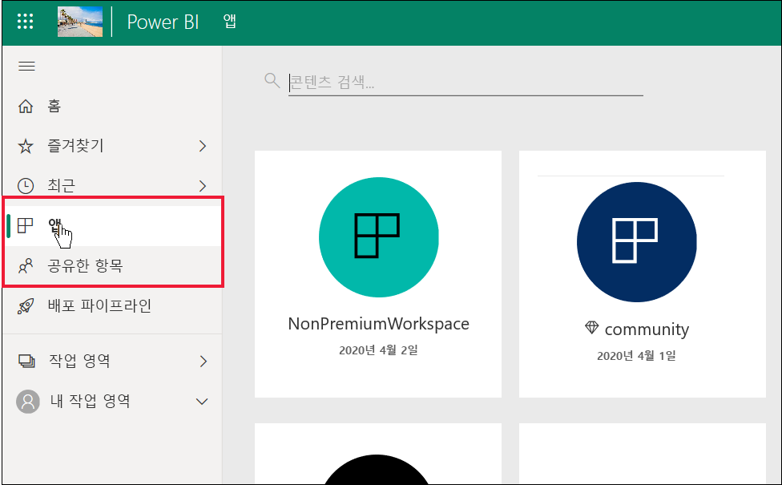

# ‘소비자’ 및 다른 무료 사용자를 위한 Power BI 기능 목록 

[!INCLUDE[consumer-appliesto-ynnn](../includes/consumer-appliesto-ynnn.md)]

‘소비자’는 비즈니스 의사 결정을 내리기 위해 보고서 및 대시보드를 탐색하는 데 Power BI 서비스를 사용할 수 있습니다.  해당 보고서와 대시보드는 Power BI *Pro* 라이선스가 있는 ‘디자이너’가 만든 것입니다.  Pro 사용자는 동료와 콘텐츠를 공유하고, 동료가 콘텐츠를 사용하여 수행할 수 있는 작업을 제어할 수 있습니다. 디자이너가 링크를 전송하여 콘텐츠를 공유하는 경우도 있고, 콘텐츠가 자동으로 설치되고 Power BI **앱** 또는 **공유한 항목**에 표시되는 경우도 있습니다.

디자이너는 여러 가지 방법으로 콘텐츠를 공유할 수 있습니다. 그러나 이 문서는 Power BI ‘소비자’를 대상으로 작성되었으므로 소비자가 콘텐츠를 받고 조작하는 방법만 설명합니다.  콘텐츠를 공유하는 다른 방법에 대한 자세한 내용은 [Power BI에서 작업을 공유하는 방법](../service-how-to-collaborate-distribute-dashboards-reports.md)을 참조하세요.

[이전 문서](end-user-license.md)에서는 다양한 유형의 Power BI 라이선스(무료 및 Pro)와 구독(프리미엄)뿐만 아니라 사용 중인 라이선스와 구독을 조회하는 방법에 대해서도 설명했습니다. 이 문서에는 라이선스와 구독에 따라 사용자에게 제공되는 Power BI 기능이 나와 있습니다.   

<art>

## 빠른 용어 복습
목록을 살펴보기 전에 몇 가지 Power BI 개념을 복습해 보겠습니다. 빠른 복습이기 때문에, 추가 정보가 필요한 경우 [소비자 라이선스 및 구독](end-user-license.md)이나 [Power BI 기본 개념](end-user-basic-concepts.md)을 참조하세요.

### 작업 영역 및 역할
작업 영역에는 다음과 같은 두 종류가 있습니다. **내 작업 영역**과 앱 작업 영역입니다. **내 작업 영역**에는 본인만 액세스할 수 있습니다. 협업과 공유가 필요한 경우에는 콘텐츠 디자이너가 앱 작업 영역을 사용해야 합니다. 

작업 영역 ‘역할’은 Power BI 디자이너가 작업 영역에서 누가 어떤 작업을 수행할 수 있는지를 관리하는 데 사용합니다.  ‘소비자’에게는 **보기 권한자** 역할이 할당됩니다.  

### 프리미엄 용량 구독
조직에 프리미엄 용량 구독이 있는 경우 관리자와 Pro 사용자는 ‘프리미엄 용량’에 작업 영역을 할당할 수 있습니다.  프리미엄 용량의 작업 영역은 무료 사용자에게 Pro 라이선스를 요구하지 않고, Pro 사용자가 무료 사용자와 공유하고 협업할 수 있는 공간입니다. 해당 작업 영역 내에서 무료 사용자는 상승된 권한을 갖습니다(아래 목록 참조). 

### 라이선스 
각 Power BI 서비스 사용자는 무료 라이선스 또는 Pro 라이선스를 보유합니다. 특정 기능은 Pro 라이선스가 있는 사용자를 위해 예약됩니다.

- **무료 라이선스** - 일반적으로 조직 내의 ‘소비자’에게 할당됩니다.  개인으로 Power BI에 등록하고 [독립 실행형 모드로 Power BI 서비스](../service-self-service-signup-for-power-bi.md)를 사용해 보려는 사용자도 사용합니다.  
- **Pro 라이선스** - 일반적으로 조직 내의 디자이너, 분석가 및 개발자에게 할당됩니다.   
- **무료 라이선스 + 프리미엄 용량** - Pro 사용자가 프리미엄 용량에 만들어 공유한 콘텐츠를 무료 사용자(‘소비자’)가 확인하고 조작할 수 있게 합니다.  따라서 Pro 사용자가 작업 영역 내에서 또는 **공유한 항목**을 사용하여 무료 사용자와 협업할 수 있습니다.

무료 사용자가 프리미엄 용량 구독이 있는 조직의 멤버가 되면 고급 기능을 사용할 수 있게 됩니다. Pro 동료가 프리미엄 용량 작업 영역을 사용하여 콘텐츠를 공유하는 한, 무료 사용자도 콘텐츠를 확인하고 Pro 동료와 협업할 수 있습니다.  **이 경우 무료 사용자는 비즈니스 의사 결정을 위해 콘텐츠를 받고 공유할 수 있는 Power BI ‘소비자’가 됩니다.**  

## ‘소비자’ 및 무료 사용자를 위한 Power BI 기능 목록 
다음 차트에는 프리미엄 구독이 있는 조직의 ‘소비자’가 수행할 수 있는 작업이 나와 있습니다.     

첫 번째 열은 **내 작업 영역**의 콘텐츠를 사용하는 무료 사용자를 나타냅니다. 해당 사용자는 작업 영역에서 동료와 협업할 수 없습니다. 동료는 사용자와 콘텐츠를 직접 공유할 수 없으며, 사용자도 **내 작업 영역**에서 공유할 수 없습니다. 

두 번째 열은 ‘소비자’를 나타냅니다.   소비자는 다음 특성을 갖습니다.

- 무료 사용자 라이선스가 있습니다.
- 프리미엄 용량 구독이 있는 조직에 속해 있습니다.
- 프리미엄 용량의 앱 작업 영역을 사용하여 콘텐츠를 공유하는 Pro 사용자의 콘텐츠(앱, 대시보드, 보고서)를 가져옵니다.
- 앱 작업 영역의 **보기 권한자** 역할이 할당되었습니다. 

### 범례
 기능은 현재 시나리오에서 사용할 수 있는 기능입니다.    
 기능은 현재 시나리오에서 사용할 수 없는 기능입니다.    
 **** 기능 가용성은 **내 작업 영역**으로 제한됩니다. **내 작업 영역**의 콘텐츠는 소유자 개인만 사용할 수 있으며, Power BI의 다른 사용자가 공유하거나 볼 수 없습니다.    
 \* Pro 사용자나 관리자는 이 기능에 대한 액세스를 켜거나 끌 수 있습니다.    
   

### 기능 목록

|기능   | 시나리오 1: 프리미엄 용량에서 호스트된 콘텐츠에 대한 액세스 권한이 없는 Power BI 무료 사용자    | 시나리오 2: 프리미엄 용량에 저장된 콘텐츠에 대한 **보기 권한자** 권한이 있는 Power BI 무료 사용자. 이 사용자가 Power BI ‘소비자’입니다.  |
|---|---|---|
|**앱** 
|자동 설치 |  | *| 
|열기 |  |   | 
|즐겨찾기 |  |   |
 |편집, 업데이트, 다시 공유, 다시 게시 |  |   |
 |새 앱 만들기 |  |   |
 |Appsource: 다운로드, 열기 |   | | 
|조직 저장소: 다운로드, 열기|  |  |
 |**앱 작업 영역**
| 작업 영역 또는 콘텐츠 만들기, 편집, 삭제  |   | |
|보증 추가 |   | | 
|열기, 보기  |   |    | 
| 작업 영역 데이터 흐름에 저장된 데이터 읽기 | ||
|**대시보드**
|동료의 대시보드 받기, 보기, 조작 |  |    | 
| 타일에 경고 추가  |   |    | 
| 다른 사용자의 댓글 보기 및 응답: 사용자 댓글 추가  |   |  *  | 
| 복사본 저장 |  | | 
|시각적 개체를 이미지로 복사 | ||
|만들기, 편집, 업데이트, 삭제 |  | | 
|Excel로 타일 내보내기 | | |
|즐겨찾기 || |
|기능 | ||
|전체 화면 및 포커스 모드 | | |
|전역 검색 |* |* |
|타일 인사이트 |     | *|
|  Q&A: 대시보드에서 사용  |* |* |
|Q&A: 추천 질문 및 저장된 질문 추가 |   | |
|Q&A: 질문 검토 |   | |  
|성능 검사기 |  | |
|Q&A 또는 보고서에서 타일 고정 |  | | 
|인쇄 |* |* |
|새로 고침 |  | | 
|다시 공유 |   | | 
|직접 구독 |* |*  |
|다른 사용자 구독 |   | | 
|**데이터 세트**
|  추가, 삭제, 편집  |    |   |   
| 이 작업 영역의 데이터 세트를 기반으로 하여 다른 작업 영역에 보고서 만들기 |   | |  
|  데이터 세트 인사이트  |   || 
|새로 고침 예약 |  || 
|**보고서**
|동료의 보고서 받기 |  |    | 
| 동일한 버전의 보고서에서 동료와 협업 | |    | 
| Excel에서 보고서 분석  |*  |*  | 
| 다른 사용자가 만든 책갈피 보기, 사용자 책갈피 추가  | |  |
| 다른 사용자의 댓글 보기 및 응답: 새 댓글 추가  | |  |
|표시 크기 변경   |  |   | 
| 복사본 저장 | |*  
|시각적 개체를 이미지로 복사* |
| 보고서 시각적 개체 교차 강조 표시 및 교차 필터링   | |  |
|  드릴   |  |  |
| 드릴스루 |* |* |
|  포함(웹에 게시, 퍼블릭) | * | |  
|  보고서 시각적 개체에서 요약된 데이터 내보내기*  | | |
|보고서 시각적 개체에서 기본 데이터 내보내기* |  |  | 
|  즐겨찾기에 보고서 추가  | | |
|  필터: 형식 변경  |* |* |
|  필터: 조작   || |
|  필터: 영구  |* |* |
| 필터 창에서 검색 |* |* |
| 전체 화면 및 포커스 모드   | | |
|  보고서 인사이트1  |   || 
| 계보 보기  | | |
|PDF: 보고서 페이지에서 만들기 | |  |
|성능 검사기 || |
| PowerPoint: 보고서 페이지에서 만들기*   | | |
|  콘텐츠를 홈으로 승격  |   | | 
| 보고서 페이지 인쇄* | | |
|Q&A 시각적 개체 조작 | | |
|QR 코드 | | |
|  새로 고침  | | |
|  외부 사용자와 콘텐츠 공유  |   | | 
| 공유: 다른 사용자가 항목을 다시 공유하도록 허용 |   | | 
|테이블로 표시(데이터 표시)| | |
|  슬라이서: 추가 또는 삭제  | | |
| 슬라이서 조작 | | |
|  보고서 시각적 개체 정렬  | | |
|  직접 보고서 구독* | | |
|  다른 사용자가 보고서 구독  |   | | 
|  관련 항목 보기 | | |
|  시각적 개체: 보고서의 형식 변경  |* |* |
|  시각적 개체 조작 변경  |  | |
|  시각적 개체: 새로 추가  |  | |
|  시각적 개체: 새 필드 추가  |   | |
|시각적 개체: 형식 변경 |  | |
| 시각적 개체: 마우스로 가리켜 세부 정보 및 도구 설명 표시  |  | |

1. **공유한 항목** 콘텐츠 보기에서만 사용 가능 

## 다음 단계
[‘소비자’용 Power BI](end-user-consumer.md)     
