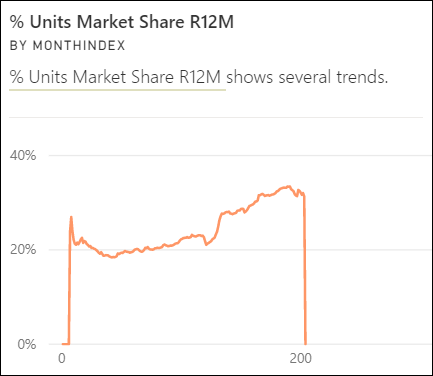
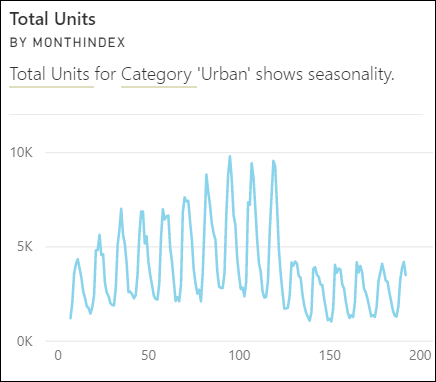
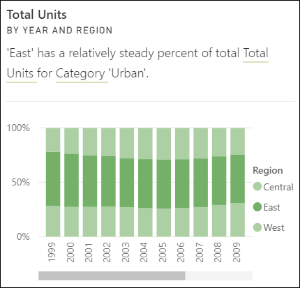

# Power BI에서 지원되는 정보의 유형

[!INCLUDE[consumer-appliesto-yyny](../includes/consumer-appliesto-yyny.md)]

Power BI에 데이터를 살펴보고 흥미로운 추세 및 패턴을 찾도록 요청할 수 있습니다. 찾은 추세 및 패턴은 *인사이트* 라는 시각적 개체 형식으로 제공됩니다. 

인사이트를 사용하는 방법에 대한 자세한 내용은 [Power BI 인사이트](end-user-insights.md)를 참조하세요.

## 정보는 어떻게 작동하나요?
Power BI는 데이터 세트의 다른 하위 집합을 빠르게 검색합니다. 검색 시 Power BI는 정교한 알고리즘을 적용하여 관심을 가질 가능성이 높은 인사이트를 검색합니다. Power BI *비즈니스 사용자* 는 대시보드 타일에서 인사이트를 실행할 수 있습니다.

## 일부 용어
Power BI는 통계 알고리즘을 사용하여 인사이트를 파악합니다. 알고리즘은 이 문서의 다음 섹션에 나열되어 있습니다. 알고리즘에 대한 자세한 내용을 알아보기 전에 익숙하지 않은 용어에 대한 정의는 다음과 같습니다. 

* **측정값** - 측정값은 계산을 수행하는 데 사용할 수 있는 양적(숫자) 필드입니다. 일반적인 계산은 합계, 평균 및 최소값입니다. 예를 들어 회사에서 스케이트보드를 만들고 판매하는 경우 회사의 측정값은 판매된 스케이트보드의 개수와 연간 평균 수익일 수 있습니다.  
* **차원** - 차원은 범주별 (텍스트) 데이터입니다. 차원은 사람, 개체, 항목, 제품, 장소 및 시간을 설명합니다. 데이터 세트에서 차원은 *측정값* 을 유용한 범주로 그룹화하는 방법입니다. 스케이트보드 회사의 경우 일부 차원에는 모델, 색, 국가 또는 마케팅 캠페인별 판매(측정값)를 보는 것이 포함될 수 있습니다.   
* **상관 관계** - 상관 관계는 사물의 동작이 어떻게 관련되어 있는지 알려 줍니다.  증가 및 감소 패턴이 비슷한 경우, 해당 동작은 양의 상관 관계가 있습니다. 그리고 패턴이 반대면 해당 동작은 음의 상관 관계가 있습니다. 예를 들어 TV 마케팅 캠페인을 실행할 때마다 빨간색 스케이트보드의 판매량이 증가하는 경우, 빨간색 스케이트보드의 판매량과 TV 캠페인은 양의 상관 관계가 있습니다.
* **시계열** - 시계열은 시간을 연속 데이터 요소로 표시하는 방법입니다. 이러한 데이터 요소는 초, 시간, 월 또는 연도와 같이 증가할 수 있습니다.  
* **연속 변수** - 연속 변수는 최소와 최대 제한 사이의 모든 값일 수 있으며, 그렇지 않으면 이산 변수입니다. 온도, 무게, 연령 및 시간 등을 예로 들 수 있습니다. 연속 변수에는 값의 소수 또는 부분이 포함될 수 있습니다. 스케이트보드는 절반만 판매할 수 없기 때문에 파란색 스케이트보드의 총판매량은 이산 변수입니다.  

## 어떤 유형의 인사이트를 찾을 수 있나요?
Power BI가 사용하는 알고리즘입니다. 

### 범주 이상값(상한/하한)
하나 또는 두개 범주에 다른 범주보다 훨씬 큰 값이 있는 경우를 강조 표시합니다.  

### 시계열의 변경 지점
데이터의 시계열 추세에서 중요한 변경 내용이 있는 경우를 강조 표시합니다.

### Correlation
데이터 세트에 범주 또는 값에 대해 여러 측정값이 유사한 패턴이나 추세를 표시하는 경우를 검색합니다.

### 하위 분산
차원의 데이터 포인트가 평균에서 멀지 않아 "분산"이 낮은 경우를 검색합니다. "판매"라는 측정값과 "지역" 차원이 있다고 가정해 보겠습니다. 지역을 살펴보면 데이터 포인트와 (데이터 포인트의) 평균 간에 차이가 거의 없음을 알 수 있습니다. 이 인사이트는 모든 지역에서 판매의 분산이 임계값보다 낮은 경우 트리거됩니다. 다시 말해 판매가 모든 지역에서 상당히 비슷한 경우에 트리거됩니다.

### 과반수(중요한 요인)
다른 차원을 기준으로 분석할 때 전체 값의 과반수가 단일 요인으로 인한 경우를 찾습니다.  

### 이상값
이 인사이트 유형은 클러스터링 모델을 사용하여 비 시계열 데이터의 이상값을 찾습니다. 이상값은 다른 범주와 현저하게 다른 값을 갖는 특정 범주가 있는 경우를 검색합니다.

### 시계열의 전반적인 추세
시계열 데이터의 위쪽 또는 아래쪽 추세를 검색합니다.

### 시계열의 계절성
시계열 데이터에서 매주, 매월 또는 매년 계절성과 같은 주기적인 패턴을 찾습니다.

### 안정적 지분
연속 변수에서 부모의 전체 값과 자식 값의 지분 간에 부모-자식 상관 관계가 있는 경우를 강조 표시합니다. 안정적 지분 인사이트는 측정값, 차원 및 다른 날짜/시간 차원의 컨텍스트에 적용됩니다. 이 인사이트는 특정 차원 값(예: “동부 지역”)이 해당 날짜/시간 차원에서 전체 판매 중 안정적 비율을 차지하는 경우 트리거됩니다.

안정적 지분 인사이트와 하위 분산 인사이트는 둘 다 시간에 따른 값 분산의 부족과 관련이 있으므로 비슷합니다. 하지만 안정적 지분 인사이트는 시간에 따른 **전체 비율** 의 분산 부족을 측정하는 반면 하위 분산 인사이트는 차원에서의 절대적 측정값 분산 부족을 측정합니다.

### 시계열 이상값
시계열 데이터에서 값이 다른 날짜/시간 값과 크게 다른 특정 날짜 또는 시간이 있는 경우를 검색합니다.

## 다음 단계
[Power BI 정보](end-user-insights.md)

궁금한 점이 더 있나요? [Power BI 커뮤니티를 이용하세요.](https://community.powerbi.com/)

