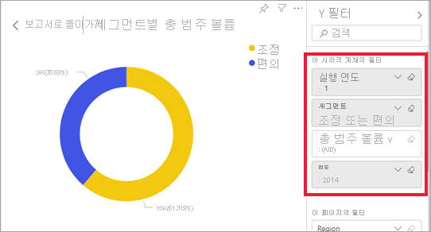

# Power BI 보고서에서 시각적 개체가 서로 교차 필터링되는 방식

[!INCLUDE[consumer-appliesto-yyny](../includes/consumer-appliesto-yyny.md)]

Power BI의 뛰어난 기능 중 하나는 보고서 페이지의 모든 시각적 개체가 상호 연결되는 방식입니다. 시각적 개체 중 하나에서 데이터 요소를 선택하는 경우 페이지에서 해당 데이터를 포함하는 다른 모든 시각적 개체는 해당 선택 사항에 따라 변경됩니다. 

## 시각적 개체가 상호 작용하는 방법

기본적으로, 보고서 페이지에 있는 하나의 시각적 개체에서 하나의 데이터 요소를 선택하면 이 페이지에 있는 다른 시각적 개체도 교차 필터링되거나 교차 강조 표시됩니다. 페이지의 시각적 개체가 상호 작용하는 방법은 보고서 ‘디자이너’에 의해 설정됩니다.  *디자이너*는 시각적 개체 상호 작용을 설정하거나 끄고, 기본 교차 필터링, 크로스 강조 표시 및 [드릴링](end-user-drill.md) 동작을 변경할 수 있는 옵션이 있습니다. 

계층 또는 드릴링이 아직 발생하지 않은 경우 [Power BI에서 드릴다운](end-user-drill.md)을 참조하여 모든 정보를 확인할 수 있습니다. 

### 교차 필터링 및 교차 강조 표시

교차 필터링 및 교차 강조 표시는 데이터에서 하나의 값이 다른 값에 어떻게 기여하는지 살펴볼 때 유용합니다. *교차 필터* 및 *교차 강조 표시*는 여기서 설명하는 동작을 **필터** 창에서 시각적 개체를 필터링하고 강조 표시할 때 나타나는 결과와 구분하는 데 사용합니다.  

아래 보고서 페이지를 살펴보면서 이러한 용어를 정의해 봅시다. “세그먼트별 총 범주 볼륨” 도넛형 차트에는 “조정” 및 “편의”라는 2개의 값이 있습니다. 

1. **조정**을 선택하면 어떻게 되는지 살펴봅시다.

    

2. **교차 필터링**은 적용되지 않는 데이터를 제거합니다. 도넛형 차트에서 **조정**을 선택하면 꺾은선형 차트가 교차 필터링됩니다. 이제 꺾은선형 차트에 조정 세그먼트의 데이터 요소만 표시됩니다. 

3. **교차 강조 표시**는 원래 데이터 요소를 모두 유지하지만 선택 항목에 적용되지 않는 부분을 흐리게 표시합니다. 도넛형 차트에서 **조정**을 선택하면 세로 막대형 차트가 교차 강조 표시됩니다. 세로 막대형 차트는 편의 세그먼트에 적용되는 모든 데이터를 흐리게 표시하고 조정 세그먼트에 적용되는 모든 데이터를 강조 표시합니다. 

## 고려 사항 및 문제 해결
- 보고서에 [드릴링](end-user-drill.md)을 지원하는 시각적 개체가 있는 경우 기본적으로 하나의 시각적 개체 드릴링이 보고서 페이지의 다른 시각적 개체에 영향을 주지 않습니다. 그러나 보고서 *디자이너*가 이 동작을 변경할 수 있으므로 드릴 가능한 시각적 개체를 확인하여 보고서 *디자이너*에서 **기타 시각적 개체 드릴 필터링**을 사용하도록 설정했는지 확인합니다.
    
- 시각적 개체 수준 필터는 보고서 페이지의 다른 시각적 개체를 교차 필터링 및 교차 강조 표시할 때 유지됩니다. 따라서 보고서 디자이너나 사용자가 VisualA에 시각적 개체 수준 필터를 적용했으며 visualA를 사용하여 visualB를 조작하는 경우 visualA의 시각적 개체 수준 필터가 visualB에 적용됩니다.

    

## 다음 단계
[보고서 필터를 사용하는 방법](../consumer/end-user-report-filter.md)

[필터링 및 강조 표시 정보](end-user-report-filter.md)
