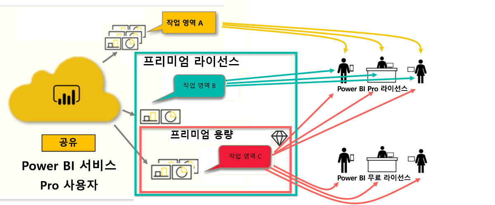

# Power BI 라이선스 유형
‘소비자’는 비즈니스 의사 결정을 내리기 위해 보고서 및 대시보드를 탐색하는 데 Power BI 서비스를 사용할 수 있습니다.  잠시 동안 Power BI를 사용하고 있거나 ‘디자이너’ 동료와 함께 채팅 중이었다면 특정 라이선스 유형을 보유한 경우에만 작동하는 특정 기능이 있다는 것을 알 수 있었을 것입니다.  

이 문서에서는 라이선스 유형과 조합(무료, Pro, Premium 및 Premium 용량) 간의 차이점을 설명합니다. 사용 중인 라이선스 조합을 확인하는 방법도 알아봅니다.  

먼저, 두 범주의 라이선스인 사용자 단위 라이선스 및 조직 라이선스를 살펴보겠습니다. 시작 지점은 라이선스에서 사용할 수 있는 기본 기능입니다. 그런 다음, Power BI 관리자와 콘텐츠 소유자가 역할 및 사용 권한을 사용하여 기본 라이선스 기능을 수정하는 방법을 살펴보겠습니다. 

예를 들어, 라이선스에서 허용하는 경우에도 관리자는 데이터 내보내기, Q&A 자연어 쿼리 사용 또는 웹에 게시와 같은 작업을 수행하도록 기능을 제한할 수 있습니다. 또한 보고서 *디자이너*가 작업 영역에 콘텐츠를 할당하면 작업 영역 역할에 사용자를 할당할 수 있습니다. 역할은 해당 작업 영역 내에서 수행할 수 있는 작업과 수행할 수 없는 작업을 결정합니다. *디자이너*는 권한 설정을 사용하여 라이선스 제한을 추가로 조정할 수 있습니다. 다시 말하면 복잡하다고 할 수 있습니다. 이 문서는 전체는 아니더라도 대부분의 혼동을 정리해 줄 것입니다.

## 사용자 단위 라이선스
첫 번째 라이선스 유형은 **사용자 단위** 라이선스입니다. 각 Power BI 서비스 사용자는 무료 라이선스 또는 Pro 라이선스를 보유합니다. 특정 기능은 Pro 라이선스가 있는 사용자를 위해 예약됩니다.  

- **Power BI Pro 라이선스** 사용자는 콘텐츠를 만들고 공유하여 다른 Pro 사용자와 협업할 수 있습니다. Pro 라이선스 사용자만이 보고서를 게시하고, 대시보드 및 보고서를 구독하고, 작업 영역에서 동료와 협업할 수 있습니다. 

    

    Power BI Pro는 다른 사용자가 Power BI 서비스 게시한 보고서 및 대시보드를 읽고 상호 작용할 수 있도록 하는 개별 사용자 라이선스입니다. 이 라이선스 유형이 있는 사용자는 다른 Power BI Pro 사용자와 콘텐츠를 공유하고 공동 작업할 수 있습니다. Power BI Pro 사용자만 콘텐츠를 게시하거나 다른 사용자와 공유하거나 다른 사용자가 만든 콘텐츠를 사용할 수 있습니다. 이에 대한 예외는 [Power BI Premium 용량](#understanding-premium-and-premium-capacity)에서 호스트되는 콘텐츠입니다. Pro 라이선스는 일반적으로 보고서 *디자이너* 및 개발자가 사용합니다. 자세한 내용은 아래의 [Power BI Premium 용량](#understanding-premium-and-premium-capacity)을 참조하세요.

- **독립 실행형 Power BI 무료 라이선스**는 여전히 효과적이지만 Power BI를 처음 사용하는 사용자나 자신을 위해 콘텐츠를 만드는 사용자를 위한 라이선스입니다. [Power BI 서비스에 개별 등록](../service-self-service-signup-for-power-bi.md). 무료 독립 실행형 라이선스는 조직 라이선스와 연결되지 않습니다. 

    무료 독립 실행형 사용자 라이선스는 Microsoft 샘플을 사용하여 Power BI에 대해 알아보는 사용자에게 적합합니다. 무료 독립 실행형 라이선스 사용자는 다른 사용자가 공유하는 콘텐츠를 볼 수 없으며 고유의 콘텐츠를 다른 Power BI 사용자와 공유할 수도 없습니다. 

    

지금까지 이해하셨나요?  정상입니다. 또 다른 계층인 **프리미엄 용량**을 추가해 보겠습니다.

## Premium 및 Premium 용량 이해
Premium은 **조직** 라이선스입니다. 조직에서 모든 Power BI **사용자 단위** 라이선스를 기준으로 기능 계층을 추가한다고 생각하면 됩니다. 

조직에서 Premium 라이선스를 구매하는 경우 일반적으로 관리자는 콘텐츠를 만들고 공유하는 직원에게 Pro 라이선스를 할당합니다. 또한 관리자는 해당 콘텐츠를 소비하는 모든 사용자에게 무료 라이선스를 할당합니다. Pro 사용자는 [작업 영역](end-user-workspaces.md)을 만들고 콘텐츠(대시보드, 보고서, 앱)를 해당 작업 영역에 추가합니다. 다른 사용자가 해당 작업 영역에서 공동으로 작업할 수 있도록 하기 위해 Pro 사용자는 *용량*, 사용 권한 및 역할의 조합을 사용합니다. 

조직에서 Premium 라이선스를 구매하는 경우 조직은 조직에만 할당되는 Power BI 서비스의 용량을 받습니다. 이 용량은 공유되지 않습니다. 이 용량은 Microsoft에서 완전히 관리되는 전용 하드웨어에서 지원됩니다. 조직은 전용 용량을 광범위하게 적용하거나 특정 작업 영역에 할당하도록 선택할 수 있습니다. Premium 용량의 작업 영역은 무료 사용자에게 Pro 계정을 요구하지 않고 무료 사용자와 공유하고 공동으로 작업할 수 있는 공간입니다.  

Premium 용량에서 콘텐츠 디자이너에는 Pro 라이선스가 여전히 필요합니다. 디자이너는 데이터 원본, 모델 데이터에 연결하여 작업 영역 앱으로 패키징된 보고서와 대시보드를 만듭니다. Pro 라이선스가 없는 사용자는 Power BI Premium에 있는 작업 영역에 계속 액세스할 수 있습니다. 단, 해당 콘텐츠가 Premium *용량*에 있고 작업 영역 소유자가 권한을 부여하기만 하면 됩니다.

아래 다이어그램에서 왼쪽은 작업 영역에서 콘텐츠를 만들고 공유하는 Pro 사용자를 나타냅니다.  
- **작업 영역 A**는 Premium이 없는 조직에서 만들어졌습니다. 

- **작업 영역 B**는 Premium 라이선스를 보유한 조직에서 만들어졌지만 이 특정 작업 영역은 Premium 용량에 저장되지 않았습니다. 작업 영역에는 다이아몬드 아이콘이 없습니다.

- **작업 영역 C**는 Premium 라이선스가 있는 조직에서 생성되었으며 Premium 용량에 저장되었습니다. 이 작업 영역에는 다이아몬드 아이콘이 있습니다.  

Power BI Pro *디자이너*는 세 가지 작업 영역 중 하나를 사용하여 다른 Pro 사용자와 공유하고 공동 작업할 수 있습니다. 디자이너는 전체 조직과 작업 영역을 공유하거나 작업 영역 역할을 Pro 사용자에게 할당하기만 하면 됩니다. 

Power BI Pro *디자이너*는 작업 영역 C를 사용하여 무료 사용자와만 공유하고 공동으로 작업할 수 있습니다. 무료 사용자가 작업 영역에 액세스할 수 있으려면 작업 영역을 Premium 용량에 할당해야 합니다. 작업 영역 내에서 디자이너는 협력자에게 *관리자*, *멤버*, *참가자* 또는 *보기 권한자* 역할을 할당합니다. 역할은 작업 영역 내에서 수행할 수 있는 작업을 결정합니다. Power BI *소비자*에게는 일반적으로 *보기 권한자* 역할이 할당됩니다. 자세한 내용은 [Power BI 소비자용 작업 영역](end-user-workspaces.md)을 참조하세요.

## 보유한 라이선스 확인
Power BI 라이선스 정보를 조회하는 방법에는 여러 가지가 있습니다. 

먼저, **사용자** 라이선스를 확인합니다.

- 특정 버전의 Microsoft Office에는 Power BI Pro 라이선스가 포함됩니다.  보유한 Office 버전에 Power BI가 포함되는지 확인하려면 [Office 포털](https://portal.office.com/account)을 방문하여 **구독**을 선택합니다.

    첫 번째 사용자인 Pradtanna에게는 Power BI Pro 라이선스를 포함하는 Office 365 E5가 있습니다.

    

    두 번째 사용자인 Zalan에게는 Power BI 무료 라이선스가 있습니다. 

    

다음으로, 계정에 Premium 라이선스도 있는지 확인합니다. 위의 사용자(Pro 또는 무료) 중 하나는 Premium 라이선스를 보유한 조직에 속할 수 있습니다.  두 번째 사용자인 Zalan의 경우를 확인해 보겠습니다.  

- Power BI 서비스에서 **내 작업 영역**을 선택하고 오른쪽 위 모서리에서 톱니 모양 아이콘을 선택합니다. **개인 스토리지 관리**를 선택합니다.

    

    **사용자 단위** 라이선스인 Pro 또는 무료는 클라우드에서 Power BI 보고서 또는 Excel 통합 문서를 호스팅하는 데 사용할 수 있는 10GB 스토리지를 제공합니다. 10GB 이상이 표시되는 경우에는 Premium 라이선스를 보유한 조직 계정의 구성원입니다.

    

    Office 포털 페이지에서 Zalan의 사용자 구독은 Power BI(무료)에 해당합니다. 그러나 조직에서 Premium 라이선스를 구매했기 때문에 Power BI 서비스 Zalan은 10GB의 스토리지로 제한되지 않으며 100GB를 사용할 수 있습니다. Premium 라이선스가 있는 조직의 *소비자*인 경우 *디자이너*가 Premium 용량에 작업 영역을 배치하는 한, Zalan에는 공유 콘텐츠를 보고, 동료와 공동으로 작업하고, 앱에서 작업하는 기능이 있습니다. 권한 범위는 Power BI 관리자 및 콘텐츠 디자이너가 설정합니다. Pro 사용자는 이미 Zalan을 사용하여 작업 영역을 공유하고 있습니다. 다이아몬드 아이콘을 사용하면 이 작업 영역이 Premium 용량에 저장된 것을 알 수 있습니다. 

   
## 작업 영역 역할 이해
지금까지 사용자 단위 라이선스, Premium 라이선스 및 Premium 용량을 검토했습니다. 이제 작업 영역 *역할*을 살펴보겠습니다.

이 문서는 Power BI *소비자*에 대한 문서이므로 다음과 같은 시나리오가 가능합니다.

-  사용자는 Power BI Premium 라이선스가 있는 조직 내에서 *무료* 사용자입니다. 
- Power BI Pro 사용자는 대시보드 및 보고서의 컬렉션을 만들고 이 컬렉션을 전체 조직에 *앱*으로 게시했습니다.  
- 앱이 *작업 영역* 내에 있으며 작업 영역이 Premium 용량에 있습니다.    
- 이 앱 작업 영역에는 하나의 대시보드와 두 개의 보고서가 있습니다.
- Pro 사용자는 **보기 관리자** 역할을 할당했습니다.

### 보기 관리자 역할
역할을 통해 Power BI *디자이너*는 팀이 공동 작업할 수 있도록 작업 영역에서 누가 어떤 작업을 수행할 수 있는지 관리할 수 있습니다. 이러한 역할 중 하나는 **보기 관리자**입니다. 

작업 영역이 Power BI Premium 용량에 있으면 뷰어 역할을 가진 사용자는 Power BI Pro 라이선스가 없어도 작업 영역에 액세스할 수 있습니다. 그러나 보기 관리자 역할은 기본 데이터를 액세스하거나 내보낼 수 없기 때문에 대시보드, 보고서 및 앱과 안전하게 상호 작용할 수 있는 방법입니다.

> [!TIP]
> 다른 역할(관리자, 멤버 및 참가자)에 대해 알아보려면 [새 작업 영역 만들기](../service-new-workspaces.md)를 참조하세요.

