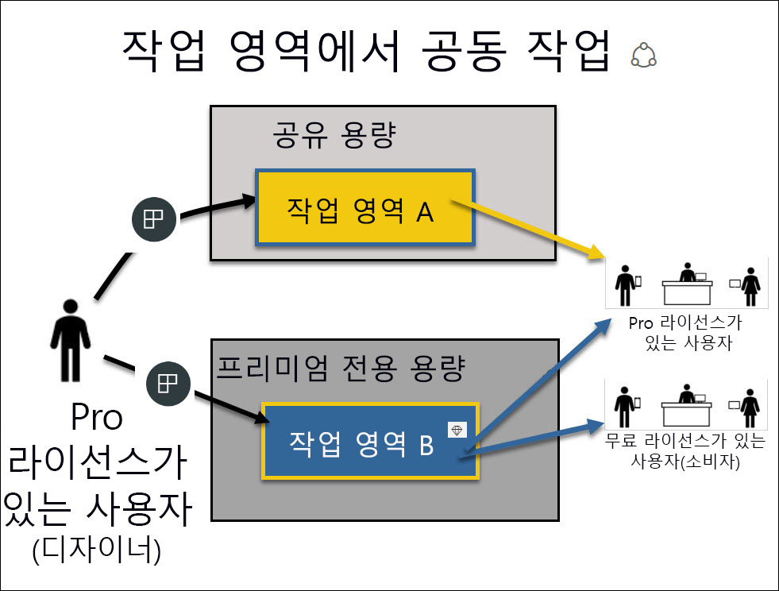

# *소비자* 자격으로 Power BI 서비스 사용

[!INCLUDE[consumer-appliesto-ynnn](../includes/consumer-appliesto-ynnn.md)]

[*소비자*](end-user-consumer.md)는 데이터 기반의 비즈니스 의사 결정을 내리기 위해 보고서 및 대시보드를 탐색하는 데 Power BI 서비스를 사용할 수 있습니다. 한동안 Power BI를 사용해 왔거나 *디자이너* 동료와 얘기를 나눠 왔다면 특정 라이선스, 구독 또는 권한 유형을 보유한 경우에만 작동하는 특정 기능이 있다는 것을 알 수 있었을 것입니다. 

Power BI 서비스에서 수행할 수 있는 작업은 다음 세 가지 사항에 따라 다릅니다.
-    사용하고 있는 라이선스 및 구독 유형
-    콘텐츠가 저장되는 위치
-    할당된 역할 및 권한

이 문서에서는 각 라이선스 유형의 기능과 *콘텐츠가 저장되는 위치*가 *해당 콘텐츠를 사용하여 수행할 수 있는 작업*에 어떻게 영향을 미칠 수 있는지에 대해 설명합니다. 또한 라이선스 및 구독을 조회하고 콘텐츠가 저장되는 위치를 파악하는 방법을 알아봅니다. 역할과 권한에 대한 자세한 내용은 [작업 영역 역할](end-user-workspaces.md)을 참조하세요.

## 라이선스

각 Power BI 서비스 사용자는 *무료* 라이선스 또는 *Pro* 라이선스를 보유합니다. Power BI *소비자*인 경우 관리자가 관리하는 무료 라이선스를 사용하고 있을 것입니다. 

동시에 둘 이상의 라이선스를 보유할 수 있습니다.  이 서비스는 항상 현재 보유하고 있는 가장 좋은 라이선스와 동일한 환경을 제공합니다. 

## Power BI 프리미엄 용량

프리미엄은 전용 용량으로 콘텐츠를 저장하는 다양한 방법을 제공하는 조직 단위 구독입니다. 프리미엄을 사용하면 조직의 내외에 있는 누구나 개별 Power BI Pro 라이선스를 구입하지 않고도 Power BI 콘텐츠를 볼 수 있습니다. 

프리미엄을 통해 콘텐츠를 보는 수신자에게 Pro 라이선스를 요구하지 않고도 Pro 사용자별 콘텐츠를 광범위하게 배포할 수 있습니다. 콘텐츠 디자이너에게는 Pro 라이선스가 필요합니다. 디자이너는 데이터 원본, 모델 데이터에 연결하여 작업 영역 앱으로 패키징된 보고서와 대시보드를 만듭니다. Pro 라이선스가 없는 사용자도 뷰어 역할이 있는 한 Power BI 프리미엄 용량에 있는 작업 영역에 계속 액세스할 수 있습니다.

이러한 작업 영역 내에서 디자이너는 동료가 콘텐츠와 상호 작용할 수 있는 범위를 결정하는 **뷰어**, **참가자**, **구성원** 및 **관리자** 같은 역할을 할당합니다. 자세한 내용은 [작업 영역 권한 및 역할](end-user-workspaces.md)을 참조하세요. 

프리미엄 용량에 대한 자세한 내용은 [Microsoft Power BI Premium이란?](../admin/service-premium-what-is.md)을 참조하세요.

## 보유한 라이선스 확인

사용자에게 할당된 라이선스를 확인하려면 [Microsoft **내 계정** 페이지](https://portal.office.com/account)를 참조하세요.  **구독** 탭을 선택합니다.

첫 번째 사용자인 Pradtanna에게는 Power BI Pro 라이선스를 포함하는 Office 365 E5가 있습니다.

두 번째 사용자인 Zalan에게는 Power BI 무료 라이선스가 있습니다. 

## 프리미엄 용량에 대한 액세스 권한이 있는지 확인

다음으로, 프리미엄 용량이 있는 조직에 속하여 있는지 확인합니다. 위의 사용자(Pro 또는 무료) 중 하나는 프리미엄 용량을 보유한 조직에 속할 수 있습니다.  두 번째 사용자인 Zalan의 경우를 확인해 보겠습니다.  

사용 가능한 스토리지 크기를 조회하여 Zalan의 조직에 프리미엄 용량이 있는지 확인할 수 있습니다. 

- Power BI 서비스에서 **내 작업 영역**을 선택하고 오른쪽 위 모서리에서 톱니 모양 아이콘을 선택합니다. **개인 스토리지 관리**를 선택합니다.

    

    10GB를 초과하는 용량이 표시되는 경우에는 프리미엄 구독을 보유한 조직 계정의 구성원입니다. 아래 이미지는 Zalan의 조직이 최대 100GB의 스토리지를 보유하고 있음을 보여 줍니다.  

    

Pro 사용자는 이미 Zalan을 사용하여 작업 영역을 공유하고 있습니다. 다이아몬드 아이콘은 이 작업 영역이 프리미엄 용량에 저장된 것을 나타냅니다. 

## 프리미엄 용량에서 호스트되는 콘텐츠 식별

조직에 프리미엄 용량이 있는지 확인하는 또 다른 방법은 다이아몬드 아이콘이 있는 앱 및 앱 작업 영역을 찾는 것입니다. 다이아몬드는 콘텐츠가 프리미엄 용량에 저장되었다는 것을 나타냅니다. 

아래 이미지에서는 3개의 앱이 프리미엄 용량에 저장되어 있습니다.

    
*소비자*는 *디자이너*가 프리미엄 전용 용량에 작업 영역을 배치하는 한 **해당 작업 영역 내에서** 공유 콘텐츠를 보고, 동료와 협업하고, 앱 대시보드 및 보고서 등을 사용해 작업할 수 있습니다. 권한 범위는 Power BI 관리자 및 콘텐츠 디자이너가 설정합니다. 

   

## 모든 항목 요약

조직에서 프리미엄 구독을 구매하는 경우 일반적으로 관리자는 프리미엄 용량에서 작업하고 콘텐츠를 만들며 공유하는 직원에게 Pro 라이선스를 할당합니다. 또한 관리자는 해당 콘텐츠를 소비하는 모든 사용자에게 무료 라이선스를 할당합니다. Pro 사용자는 [앱 작업 영역](end-user-workspaces.md)을 만들고 콘텐츠(대시보드, 보고서, 앱)를 해당 작업 영역에 추가합니다. 무료 사용자가 해당 작업 영역에서 공동 작업할 수 있도록 하기 위해 관리자 또는 Pro 사용자는 작업 영역을 *전용 용량*에 할당합니다.    
 

|라이선스 유형  |공유 용량  |전용 용량  |
|---------|---------|---------|
|**Free**     |  사용자 자신을 위한 콘텐츠를 만들고 해당 콘텐츠와 상호 작용하는 개인 샌드박스로 사용합니다. 이 방법은 Power BI 서비스를 시험적으로 사용해 볼 수 있는 좋은 방법입니다. 다른 사람의 콘텐츠를 사용하거나 본인의 콘텐츠를 다른 사용자와 공유할 수 없습니다. 1     |   전용 용량에 할당되어 사용자와 공유되는 콘텐츠와 상호 작용합니다. 무료 사용자에게 Pro 계정이 없어도 Free 및 Pro 사용자가 협업을 수행할 수 있습니다.      |
|**Pro**     |  콘텐츠를 만들고 공유하여 다른 Pro 사용자와 협업합니다.        |  콘텐츠를 만들고 공유하여 Free 및 Pro 사용자와 협업합니다.       |

1 [고려 사항 및 문제 해결](#considerations-and-troubleshooting)을 참조하세요. 

아래 다이어그램에서 왼쪽은 앱 작업 영역에서 콘텐츠를 만들고 공유하는 Pro 사용자를 나타냅니다. 

- **작업 영역 A**는 프리미엄 용량이 없는 조직에서 만들어졌습니다. 

- **작업 영역 B**는 프리미엄 구독이 있는 조직에서 생성되었으며 작업 영역은 전용 용량에 저장되었습니다. 이 작업 영역에는 다이아몬드 아이콘이 있습니다.  

    

Power BI Pro *디자이너*는 세 가지 각 작업 영역에서 다른 Pro 사용자와 공유하고 협업할 수 있습니다. 그러나 Power BI Pro 사용자가 무료 사용자와 공유하고 협업을 수행할 수 있는 유일한 방법은 프리미엄 전용 용량에 있는 작업 영역 B를 사용하는 것입니다.  해당 작업 영역 내에서 디자이너는 협업자에게 역할을 할당합니다. 역할은 작업 영역 내에서 수행할 수 있는 작업을 결정합니다. Power BI *소비자*에게는 일반적으로 *보기 권한자* 역할이 할당됩니다. 역할에 대한 자세한 내용은 [Power BI 소비자용 작업 영역](end-user-workspaces.md)을 참조하세요.

## 고려 사항 및 문제 해결
- 둘 이상의 Power BI 라이선스를 보유할 수 있습니다. Power BI 서비스는 항상 현재 보유하고 있는 가장 좋은 라이선스와 동일한 환경을 제공합니다. 예를 들어 Pro 라이선스와 무료 라이선스를 모두 보유한 경우 Power BI 서비스는 Pro 라이선스를 사용합니다.

- 콘텐츠(대시보드, 보고서, 앱)를 공유하고 만들려는 경우에는 Power BI *소비자*가 아닌 *디자이너*일 수 있습니다. Pro 사용자 라이선스로 변경하는 것을 고려하세요. Pro 기능을 사용하려면 언제든지 Power BI 서비스에 표시되는 업그레이드 대화 상자를 선택하여 Power BI Pro의 60일 무료 개별 평가판에 등록할 수 있습니다.

    

  60일 평가판이 만료되면 라이선스가 Power BI 무료 라이선스로 다시 변경됩니다. 이후에는 Power BI Pro 라이선스가 필요한 기능에 더 이상 액세스할 수 없습니다. Pro 라이선스를 계속 사용하려면 관리자에게 Power BI Pro 라이선스 구매에 대해 문의하세요. 관리자가 없는 경우 [Power BI 가격 책정 페이지](https://powerbi.microsoft.com/pricing/)를 참조하세요.     

- 무료 라이선스에 등록한 경우에는 만료되지 않습니다. 따라서 Pro 평가판으로 업그레이드하거나 조직에서 Pro 라이선스를 제공한 이후 평가판 기간이 종료되거나 조직에서 제공한 Pro 라이선스를 제거하는 경우, 사용자 또는 관리자가 라이선스를 취소하지 않는 한 계속해서 사용할 수 있는 무료 라이선스가 있습니다. 

- 1 Power BI 서비스의 무료 사용자 라이선스는 Power BI 서비스를 탐색하거나 사용해 **내 작업 영역**에서 개인 데이터 분석 및 시각화를 수행하는 사용자에게 적합합니다. 무료 사용자는 Power BI를 사용하여 동료와 협업하지 않습니다. 무료 라이선스 사용자는 다른 사용자가 공유하는 콘텐츠를 볼 수 없으며 본인의 콘텐츠를 다른 Power BI 사용자와 공유할 수도 없습니다. 

    

## 다음 단계
- [저는 Power BI *소비자*인가요?](end-user-consumer.md)    
- [작업 영역에 대한 자세한 정보](end-user-workspaces.md)    
- [라이선스 유형별 Power BI 서비스 기능 보기](end-user-features.md)
