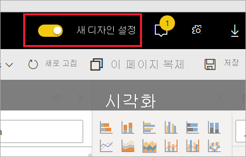
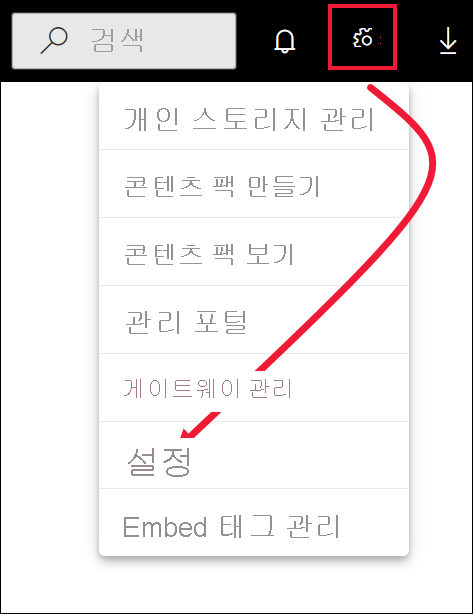
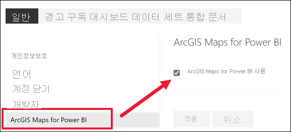

# Power BI 서비스 미리 보기 기능에 옵트인

[!INCLUDE[consumer-appliesto-yynn](../includes/consumer-appliesto-yynn.md)]

## *미리 보기 기능* 이란?
Power BI 서비스를 개선하면서 *미리 보기 기능*으로 몇 가지 새로운 기능을 출시할 예정입니다. 이제 미리 보기 기능을 설정하거나 해제할 수 있으므로 이를 시험해 볼 수 있습니다.

일부 미리 보기 기능은 Power BI 대시보드, 홈 또는 보고서 자체에서 설정하고 해제할 수 있습니다. 위의 홈, 보고서, 대시보드가 표시되는 Power BI 메뉴 모음에서 **새로운 디자인** 미리 보기 기능을 설정/해제할 수 있습니다. 

   

다른 미리 보기 기능은 *설정* 메뉴에서 사용할 수 있습니다. 이 문서에서는 설정 메뉴를 통해 미리 보기 기능에 액세스하는 방법을 보여줍니다.

## 미리 보기를 찾아 설정(및 해제)
1. Power BI 화면의 오른쪽 위에 있는 기어 아이콘을 선택하고 **설정**을 선택하여 [설정] 메뉴를 엽니다.
   
   .
2. **일반** 탭을 선택합니다. 미리 보기가 있을 경우 **미리 보기 기능**에 대한 옵션이 표시되거나 왼쪽에 미리 보기 기능이 표시될 것입니다.  이 예에서는 ArcGIS 지도에 대한 미리 보기가 있습니다. 
   
   
3. 새로운 환경을 시도하려면 **설정** 라디오 단추를 선택하거나 확인란을 표시합니다. 그런 다음, **적용**을 선택합니다.
4. 미리 보기 기능을 해제하려면 위의 1~3단계를 따르고 3단계에서 **해제**를 선택하거나 확인란을 선택 취소하고 **적용**을 선택합니다.

질문이나 의견이 있으신가요? [Power BI 커뮤니티 포럼 방문](https://community.powerbi.com/t5/Navigation-Preview-Forum/bd-p/NavigationPreview)

