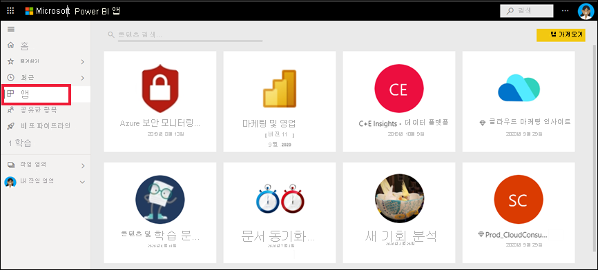
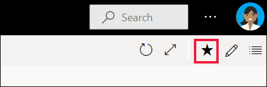
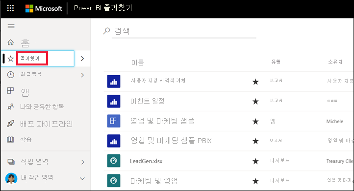
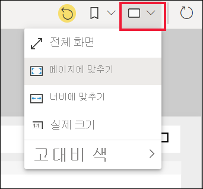
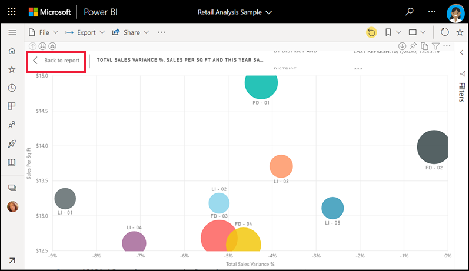
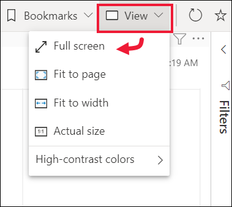
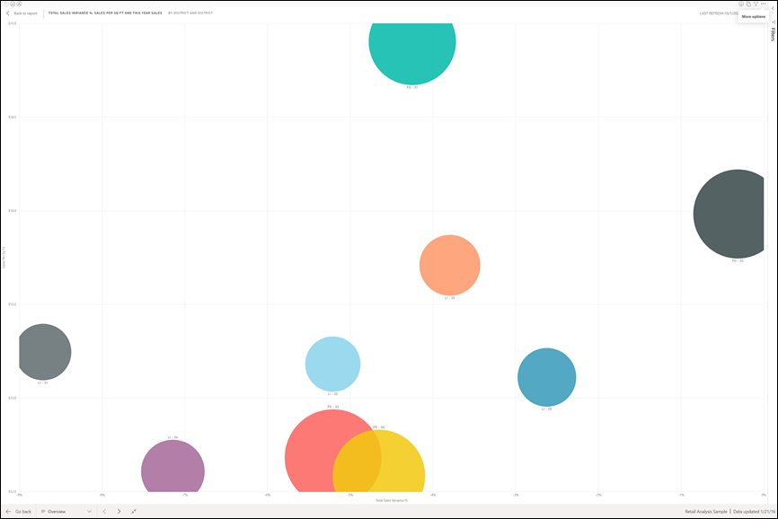
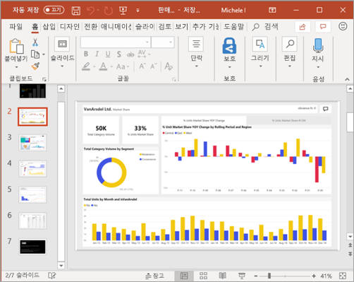

# 빠른 시작: 비즈니스 사용자를 위한 Power BI 기능 알아보기

[!INCLUDE[consumer-appliesto-ynny](../includes/consumer-appliesto-ynny.md)]

이 빠른 시작에서는 Power BI를 조작하여 데이터 기반 비즈니스 인사이트를 검색하는 방법을 알아봅니다. 이 문서에서는 자세한 내용을 제공하는 대신 Power BI **비즈니스 사용자**가 사용할 수 있는 다양한 작업을 빠르게 둘러볼 수 있습니다.

아직 Power BI에 등록하지 않은 경우 시작하기 전에 [평가판에 등록합니다](https://app.powerbi.com/signupredirect?pbi_source=web).

## Power BI란? 
Power BI는 관련 없는 데이터 원본을 시각적으로 몰입도가 뛰어나고 일관된 대화형 정보로 변환하는 소프트웨어 서비스, 앱, 커넥터 컬렉션입니다. 데이터가 간단한 Excel 스프레드시트든, 서로 다른 데이터 원본의 데이터 컬렉션이든 간에 Power BI를 통해 손쉽게 데이터 원본에 연결하고, 중요한 내용을 시각화(또는 검색)하고, 이 내용을 원하는 모든 사람과 공유할 수 있습니다. 

브라우저 또는 모바일 디바이스에서 Power BI 서비스를 엽니다. 사용자와 동료가 자동으로 업데이트되고 새로 고쳐지는 신뢰할 수 있는 동일한 앱, 대시보드 및 보고서를 사용할 수 있으므로 항상 최신 콘텐츠로 작업하게 됩니다.   

## 읽기용 보기
Power BI 서비스에서는 다음 두 가지 모드로 보고서와 상호 작용할 수 있습니다. 편집용 보기 및 읽기용 보기.  비즈니스 사용자는 읽기용 보기를 사용하여 다른 사용자가 만든 보고서를 사용할 가능성이 높습니다. 편집용 보기는 보고서를 만들어 사용자와 공유 하는 보고서 디자이너가 사용합니다. 읽기용 보기는 동료가 만든 보고서를 탐색하고 상호 작용하는 방법입니다. 

읽기용 보기에서도 콘텐츠는 정적이지 않습니다. 추세, 인사이트, 기타 비즈니스 인텔리전스를 찾아볼 수 있습니다. 콘텐츠를 조각화 및 분석하고 원하는 표현을 사용해서 질문을 할 수도 있습니다. 또는 데이터가 자동으로 흥미로운 인사이트를 제공할 때까지 기다립니다. 데이터가 변경되면 경고가 표시되고, 설정한 일정에 따라 메일로 보고서가 전송됩니다. 어떤 디바이스에서든, 클라우드나 온-프레미스 모두에서, 언제든지 모든 데이터를 사용할 수 있습니다. 

이러한 항목 등을 자세히 알아보려면 계속 읽어보세요.

## Power BI 콘텐츠
Power BI에서 “콘텐츠”라는 용어를 사용하는 경우 보고서, 대시보드, 앱을 나타냅니다. 이러한 구성 요소는 데이터를 살펴보고 비즈니스 결정을 내리는 데 사용됩니다. 

> [!NOTE]
> 모바일 디바이스에서도 대시보드, 보고서, 앱을 살펴보고 공유할 수 있습니다.

###  앱

*앱*은 관련 대시보드 및 보고서를 모두 한 곳에서 결합하는 Power BI 콘텐츠 형식입니다. 앱은 하나 이상의 대시보드와 하나 이상의 보고서를 함께 번들할 수 있습니다. 앱은 앱을 배포하고 비즈니스 사용자와 공유하는 Power BI 디자이너가 만듭니다. 

앱을 보는 한 가지 방법은 탐색 창에서 **앱**을 선택하고 열려는 앱을 선택하는 것입니다.

앱을 보는 방법에 대한 자세한 내용은 [Power BI 앱](end-user-apps.md)을 참조하세요.

### 보고서

Power BI 보고서는 해당 데이터 세트에서 얻은 다양한 결과 및 인사이트를 나타내는 시각적 개체가 포함된 데이터 세트에 대한 다각적인 데이터 뷰입니다. 보고서에는 단일 시각적 개체 또는 여러 페이지의 시각적 개체가 있을 수 있습니다. 보고서는 보고서를 배포하고 비즈니스 사용자와 공유하는 Power BI 디자이너가 만듭니다.

보고서를 보는 방법에 대한 자세한 내용은 [Power BI 보고서](end-user-reports.md)를 참조하세요.

### 대시보드

Power BI 대시보드는 시각화를 사용하여 스토리를 전달하는 단일 페이지로, 캔버스라고도 합니다. 한 페이지로 제한되기 때문에 해당 스토리의 가장 중요한 요소만 포함할 경우 잘 디자인된 대시보드라 할 수 있습니다.

대시보드에 표시되는 시각화를 타일이라고 하며, 보고서 ‘디자이너’가 대시보드에 고정합니다. 대부분의 경우, 타일을 선택하면 시각화가 생성된 보고서 페이지로 이동합니다. 

대시보드를 보는 방법에 대한 자세한 내용은 [Power BI 대시보드](end-user-dashboards.md)를 참조하세요.
 
## Power BI 서비스에서 상호 작용

### 동료와 협업
메일이 필요 없습니다. 대시보드에서 동료와 대시보드에 관한 대화를 시작하거나 개별 댓글을 추가합니다. 댓글 기능은 다른 사용자와 협업할 수 있는 여러 가지 방법 중 하나일 뿐입니다. 

[댓글 추가](end-user-comment.md)에 대한 자세한 정보

### Power BI에서 자동으로 작업 수행
Power BI 서비스에서 자동으로 작업을 수행하는 두 가지 방법은 구독과 경고를 사용하는 것입니다. 

#### 대시보드(또는 보고서) 구독
대시보드를 모니터링하기 위해 Power BI를 열 필요가 없습니다.  대신에 구독하면 Power BI가 설정된 일정에 따라 해당 대시보드의 스냅샷을 메일로 보내 줍니다. 

 [Power BI 구독](end-user-subscribe.md)에 대한 자세한 정보

#### 데이터가 임계값에 도달하면 경고 받기
데이터는 라이브 상태이며, 시각적 개체가 자동으로 업데이트되어 데이터를 반영합니다. 데이터가 설정된 임계값보다 높거나 낮게 변경될 때 알림을 받으려면 데이터 경고를 사용합니다. 알림은 계기, KPI 및 카드에 대해 작동합니다.    

값이 설정된 한도를 초과해서 증가하거나 감소하면 Power BI에서 메일을 보냅니다.  

[Power BI 경고](end-user-alerts.md)에 대한 자세한 정보

### 질문 및 답변을 사용하여 자연어 사용에 대해 질문하기
경우에 따라 자연어를 사용하여 질문을 하면 가장 빠르게 사용자 데이터로 답변을 받을 수 있습니다. 질문 및 답변 상자는 대시보드의 위쪽에서 사용할 수 있습니다. “판매 단계별 대규모 영업 기회 수를 깔때기로 표시합니다.”를 예로 들 수 있습니다. 

[Power BI 질문 및 답변](end-user-q-and-a.md)에 대한 자세한 정보

### 시각화의 세부 정보 표시
시각적 개체는 데이터 요소로 구성되며, 데이터 요소를 가리키면 세부 정보를 볼 수 있습니다.

### 대시보드를 즐겨찾기에 추가
콘텐츠를 즐겨찾기로 지정하면 [홈](end-user-home.md)과 탐색 창에서 콘텐츠에 액세스할 수 있습니다. 탐색 창은 Power BI 서비스의 모든 영역에 표시됩니다. 즐겨찾기는 일반적으로 가장 자주 방문하는 대시보드, 보고서 페이지 및 앱입니다.

콘텐츠를 즐겨찾기로 저장하려면 Power BI 서비스의 오른쪽 위 모서리에서 별모양 아이콘을 선택합니다. 
   

즐겨찾기를 보려면 탐색 창에서 **즐겨찾기**를 선택합니다.

메뉴 모음에서 사용할 수 있는 다른 작업을 살펴봅니다.  이러한 작업은 이 문서에서 모두 설명하지 않지만 다른 문서에 설명되어 있습니다.  Power BI 목차 또는 **검색** 필드를 사용하여 자세히 알아보세요. 

[즐겨찾기 및 추천](end-user-favorite.md)에 대한 자세한 정보

### 표시 크기 조정
보고서는 다양한 디바이스에서 다양한 화면 크기 및 가로 세로 비율로 볼 수 있습니다.  기본 렌더링으로는 디바이스에서 보고자 하는 모습이 아닐 수 있습니다.  

조정하려면 오른쪽 위에 있는 메뉴 모음에서 **보기** 아이콘을 선택하고 표시 옵션 중 하나를 선택합니다. 

### 페이지에 있는 모든 시각적 개체의 상호 연결 방법 참조
보고서 페이지에서 관련 시각화를 교차 강조 표시하고 교차 필터링합니다. 단일 보고서 페이지에 있는 시각화는 모두 서로 "연결되어" 있습니다.  즉, 하나의 시각화에서 하나 이상의 값을 선택하면 동일한 값을 사용하는 다른 시각화가 선택 항목에 따라 변경됩니다.

> 

[시각적 상호 작용](end-user-interactions.md)에 대한 자세한 정보

<!-- ###  Open the **Selection** pane
Easily navigate between the visualizations on the report page. 

1. Select **View > Selection pane** to open the Selection pane. Toggle **Selection pane** to On.

    

2. The Selection pane opens on your report canvas. Select a visual from the list to make it active.

     -->

### 개별 시각적 개체 확대
시각적 개체를 마우스로 가리키고 **포커스 모드** 아이콘을 선택해 합니다. 아래와 같이 포커스 모드에서 시각화를 보고 전체 보고서 캔버스를 채우도록 확장합니다.

메뉴 모음, 필터 창, 기타 크롬 없이 동일한 시각화를 표시하려면 보기 드롭다운에서 **전체 화면**을 선택합니다.   

[포커스 모드 및 전체 화면 모드](end-user-focus.md)에 대한 자세한 정보

### 시각화 정렬
보고서 페이지의 시각적 개체를 정렬하고 적용된 변경 내용과 함께 저장할 수 있습니다. 

시각적 개체를 마우스로 가리켜 활성화하고 **추가 옵션**(...)을 선택하여 정렬 옵션을 엽니다.

 

[시각적 개체 정렬](end-user-search-sort.md)에 대한 자세한 정보

### 시각화를 만드는 데 사용된 데이터 표시
Power BI 시각화는 기본 데이터 세트의 데이터를 사용하여 구성됩니다. 숨은 기능에 관심이 있는 경우 Power BI를 사용하면 시각적 개체를 만드는 데 사용되는 데이터를 *표시*할 수 있습니다. **테이블로 표시**를 선택하면 Power BI에서 데이터를 시각화 아래(또는 옆)에 표시합니다.

시각적 개체를 활성화하고 **추가 옵션**(...)을 선택한 다음 **테이블로 표시**를 선택합니다.
   
   

### Excel로 데이터 내보내기
시각적 개체를 만드는 데 사용된 데이터를 표시하는 것은 물론, 해당 데이터를 내보내 Microsoft Excel에서 볼 수도 있습니다. Excel로 내보내는 경우, Power BI에 속하지 않는 스프레드시트인 별도의 문서가 생성됩니다. Excel 파일에서 변경한 내용은 Power BI의 데이터에 영향을 주지 않습니다. 데이터를 자세히 살펴보려고 하든, 다른 애플리케이션에서 또는 다른 목적으로 데이터를 사용하려고 하든 간에 Power BI는 필요한 유연성을 제공합니다.

<!-- Exporting isn't limited to individual visuals; you can export entire reports to PowerPoint or PDF to share with your colleagues.

 -->

비즈니스 사용자가 Power BI 서비스에서 수행할 수 있는 몇 가지 작업을 간략하게 살펴보았습니다.  

## 리소스 정리
- 앱에 연결한 경우 탐색 창에서 **앱**을 선택하여 앱 콘텐츠 목록을 엽니다. 삭제할 앱을 마우스로 가리키고 휴지통 아이콘을 선택합니다.

- Power BI 샘플 보고서에 가져오거나 연결한 경우 탐색 창에서 **내 작업 영역**을 엽니다. 맨 위에 있는 탭을 사용하여 대시보드, 보고서 및 데이터 세트를 찾고 각각의 휴지통 아이콘을 선택합니다.

## 다음 단계
[비즈니스 사용자를 위한 Power BI](end-user-consumer.md)

