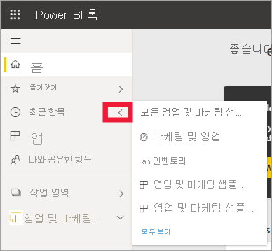
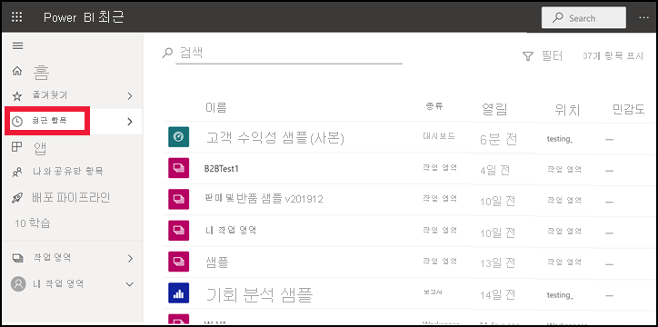
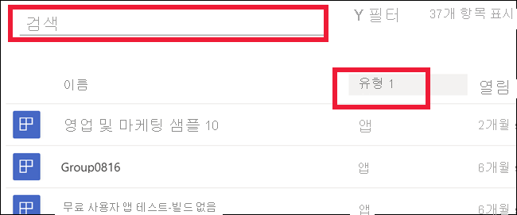

# Power BI 서비스의 **최근** 콘텐츠

[!INCLUDE[consumer-appliesto-yyny](../includes/consumer-appliesto-yyny.md)]

**최근** 콘텐츠에는 Power BI 서비스에서 마지막으로 방문한 항목이 포함되어 있습니다. 여기에는 대시보드, 보고서, 앱 및 통합 문서가 포함됩니다. 탐색 모음에서 **최근** 을 선택하면 Power BI가 이 콘텐츠를 날짜별 내림차순으로 표시합니다.  정렬 순서를 변경하려면 머리글 중 하나를 선택하고 오름차순 또는 내림차순을 선택합니다.

두 항목은 [즐겨찾기](end-user-favorite.md)이고 별 아이콘이 있습니다. 그리고 하나의 항목인 고객 수익성 샘플은 [프리미엄 용량](end-user-license.md)에 저장됩니다.

## 가장 최근 5개 보기

가장 최근에 방문한 5개 항목만 표시하려면 탐색 창에서 **최근** 오른쪽에 있는 화살표를 선택합니다.  여기에서 콘텐츠를 선택하여 엽니다. 

## 최근 콘텐츠 모두 보기

최근에 방문한 항목이 5개를 초과하는 경우 **모두 보기** 를 선택하여 **최근** 화면을 엽니다. 이 문서의 시작 부분에서 설명한 것처럼, 플라이아웃을 건너뛰고 **최근** 단어 또는 해당 아이콘 을 선택하여 **최근** 화면을 열 수 있습니다.

## 최근 콘텐츠 목록 검색 및 정렬

목록이 길어지면 [검색 필드와 정렬을 사용하여 필요한 항목을 찾습니다](end-user-search-sort.md). 열을 정렬할 수 있는지 확인하려면 마우스로 가리켜서 화살표가 나타나는지 봅니다. 이 예제에서는 **형식** 을 마우스로 가리키면 화살표가 표시됩니다. 최근 콘텐츠는 콘텐츠 유형별로 알파벳순으로 정렬할 수 있습니다. 

Amanda가 Power BI 서비스 **최근** 콘텐츠 목록을 채우는 방법을 보여주는 비디오를 시청한 다음, 비디오 아래의 단계별 지침을 수행하여 직접 사용해보세요.

<iframe width="560" height="315" src="https://www.youtube.com/embed/G26dr2PsEpk" frameborder="0" allowfullscreen></iframe>

> [!NOTE]
> 이 비디오에서는 이전 버전의 Power BI 서비스를 사용합니다.

<!--
## Actions available from the **Recent** content list
The actions available to you will depend on the settings assigned by the content *designer*. Some of your options may include:
* Select the star icon to [favorite a dashboard, report, or app](end-user-favorite.md) .
* Some dashboards and reports can be re-shared  .
* [Open the report in Excel](end-user-export.md)  
* [View insights](end-user-insights.md) that Power BI finds in the data . -->

## 다음 단계
[Power BI 서비스 앱](end-user-apps.md)

궁금한 점이 더 있나요? [Power BI 커뮤니티를 이용하세요.](https://community.powerbi.com/)

