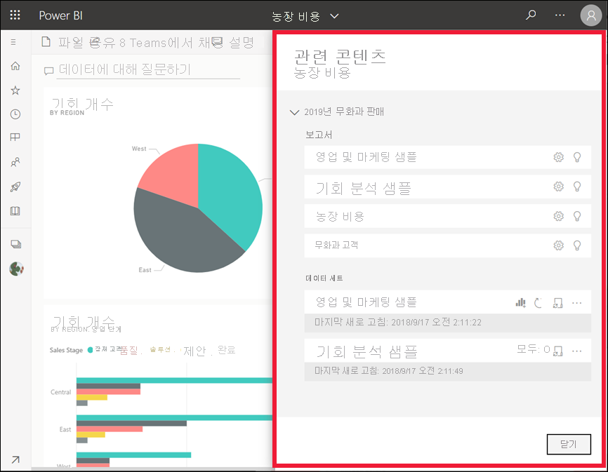
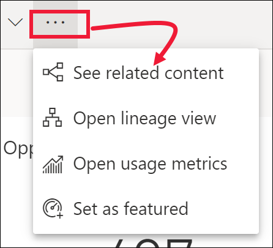

# Power BI 서비스에서 관련 콘텐츠 보기

[!INCLUDE[consumer-appliesto-yyny](../includes/consumer-appliesto-yyny.md)]

[!INCLUDE [power-bi-service-new-look-include](../includes/power-bi-service-new-look-include.md)]

**관련 콘텐츠** 창은 Power BI 서비스 콘텐츠(대시보드, 보고서 및 데이터 세트)가 서로 어떻게 연결되어 있는지를 보여 줍니다. **관련 콘텐츠** 창은 작업을 수행하기 위한 실행 공간이기도 합니다. 여기에서 대시보드 열기, 보고서 열기, 유용한 정보 생성, Excel에서 데이터 분석 등의 작업을 수행할 수 있습니다.  

Power BI 서비스에서 보고서는 데이터 세트를 기반으로 작성되고, 보고서의 시각적 개체는 대시보드에 고정되며, 대시보드의 시각적 개체는 다시 보고서로 연결됩니다. 그렇다면 마케팅 보고서의 시각적 개체는 어느 대시보드에서 호스트하는지 어떻게 알 수 있을까요? 그리고 이러한 대시보드를 어떻게 찾나요? 조달 대시보드가 둘 이상의 데이터 세트에 있는 시각적 개체를 사용하고 있나요? 그렇다면 이름을 무엇으로 지정하고 어떻게 열고 편집할 수 있나요? HR 데이터 세트를 사용하는 보고서 또는 대시보드가 있을까요? 링크가 끊어지지 않도록 하면서 데이터 세트를 이동할 수는 없을까요? 이와 같은 질문에 대한 답변은 모두 **관련 콘텐츠** 창에서 확인할 수 있습니다.  관련 콘텐츠 창은 관련 콘텐츠를 표시해 줄 뿐 아니라 콘텐츠에 대해 작업을 수행하고 관련 콘텐츠 사이를 손쉽게 탐색할 수 있게 합니다.

> [!NOTE]
> 스트리밍 데이터 세트에는 관련 콘텐츠 기능이 작동하지 않습니다.
> 
> 

## 대시보드 또는 보고서에 대한 관련 콘텐츠 보기
Will이 대시보드에 대한 관련 콘텐츠를 보여주는 비디오를 시청합니다. 그런 다음, 비디오 아래의 단계별 지침에 따라 직접 조달 분석 샘플을 사용해 봅니다.

> [!NOTE]
> 이 비디오는 이전 버전의 Power BI 서비스에 기반합니다. 

<iframe width="560" height="315" src="https://www.youtube.com/embed/B2vd4MQrz4M#t=3m05s" frameborder="0" allowfullscreen></iframe>

대시보드 또는 보고서를 열고 메뉴 모음에서 **추가 옵션**(...)을 선택한 다음, 드롭다운에서 **관련 항목 보기**를 선택합니다.

**관련 콘텐츠** 창이 열립니다. 대시보드의 경우, 여기에 시각화가 고정되고 관련된 데이터 세트가 있는 모든 보고서가 표시됩니다. 이 대시보드의 경우 하나의 보고서에만 고정된 시각화가 있으며 해당 보고서는 하나의 데이터 세트를 기반으로 합니다. 이 문서의 시작 부분에 있는 이미지를 살펴보면 4 개의 보고서에서 고정된 시각화와 2개의 데이터 세트가 있는 대시보드의 관련 콘텐츠를 볼 수 있습니다.

여기서 권한에 따라 관련 콘텐츠에 대한 작업을 직접 수행할 수 있습니다.  예를 들어 보고서 또는 대시보드 이름을 선택하여 엽니다.  나열된 보고서의 경우 아이콘을 선택하여 보고서 설정 열기 및 편집, [인사이트 얻기](end-user-insights.md) 및 그 밖의 작업을 할 수 있습니다. 데이터 세트의 경우 마지막 새로 고침 날짜 및 시간 검토, [Excel에서 분석](../collaborate-share/service-analyze-in-excel.md), [인사이트 얻기](end-user-insights.md), 새로 고침 및 그 밖의 작업을 수행할 수 있습니다.  

<!-- ## See related content for a dataset
You'll need at least *view* permissions to a dataset to open the **Related content** pane. In this example, we're using the [Procurement Analysis sample](../create-reports/sample-procurement.md).

From the nav pane, locate the **Workspaces** heading and select a workspace from the list. If you have content in a workspace, it will display in the canvas to the right. 

In a workspace, select the **Datasets** tab and locate the **See related** icon .

Select the icon to open the **Related content** pane.

From here, you can take direct action on the related content. For example, select a dashboard or report name to open it.  For any dashboard in the list, select an icon to [share the dashboard with others](../collaborate-share/service-share-dashboards.md) or to open the **Settings** window for the dashboard. For a report, select an icon to [analyze in Excel](../collaborate-share/service-analyze-in-excel.md), [rename](../create-reports/service-rename.md), or [get insights](end-user-insights.md).  -->

## 제한 사항 및 문제 해결
* "관련 항목 보기"가 없다면 아이콘 을 찾으세요. **관련 콘텐츠** 창을 여는 아이콘을 선택합니다.
* 보고서의 관련 콘텐츠를 열려면 [읽기용 보기](end-user-reading-view.md)여야 합니다.
* 스트리밍 데이터 세트에서는 관련 콘텐츠 기능을 사용할 수 없습니다.

## 다음 단계
* [Power BI 서비스 시작](../fundamentals/service-get-started.md)
* 궁금한 점이 더 있나요? [Power BI 커뮤니티를 이용하세요.](https://community.powerbi.com/)
