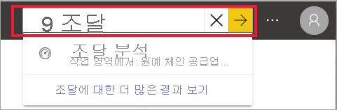
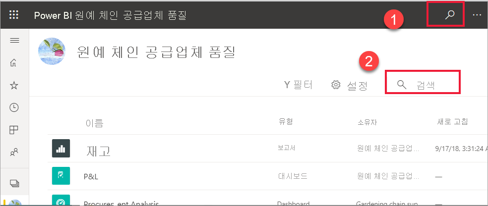
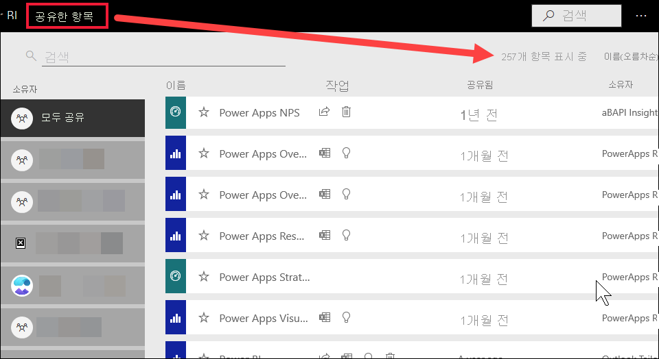
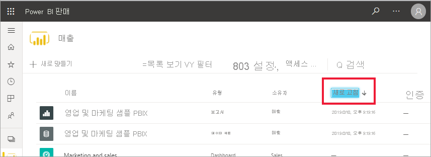

# Power BI 소비자를 위한 탐색: 전역 검색

[!INCLUDE[consumer-appliesto-yyny](../includes/consumer-appliesto-yyny.md)]

[!INCLUDE [power-bi-service-new-look-include](../includes/power-bi-service-new-look-include.md)]

Power BI 서비스를 처음 사용하는 경우 몇 개의 콘텐츠(대시보드, 보고서, 앱)만 있습니다. 그러나 동료가 콘텐츠 공유를 시작하고 앱 다운로드를 시작하면 긴 콘텐츠 목록이 표시될 수 있습니다. 그러면 검색 및 정렬이 매우 유용해집니다.

## 콘텐츠 검색
 검색은 Power BI 서비스의 거의 모든 부분에서 사용할 수 있습니다. 검색 상자 또는 검색 아이콘만 찾으면 됩니다. .

 검색 필드에 대시보드, 보고서, 통합 문서, 앱 또는 소유자의 이름을 전부 또는 일부 입력합니다. Power BI가 모든 콘텐츠를 검색합니다. 

  

 작업 영역과 같은 Power BI의 일부 영역에는 두 가지 검색 필드가 있습니다. 메뉴 모음의 검색 필드는 모든 콘텐츠를 검색하는 반면, 작업 영역 캔버스의 검색 필드는 해당 작업 영역만 검색합니다.

  

## 콘텐츠 목록 정렬

콘텐츠가 몇 개 없는 경우에는 정렬이 필요하지 않을 수 있습니다.  그러나 긴 목록의 대시보드 및 보고서가 있으면 정렬을 통해 필요한 항목을 찾을 수 있습니다. 예를 들어 이 **공유한 항목** 콘텐츠 목록에는 257개 항목이 있습니다. 

현재 이 콘텐츠 목록은 A에서 Z까지 이름순으로 정렬됩니다. 정렬 기준을 변경하려면 **이름(A-Z)** 오른쪽에 있는 화살표를 선택합니다.

정렬은 작업 영역에서도 사용할 수 있습니다. 이 예제에서 콘텐츠는 **새로 고친** 날짜를 기준으로 정렬됩니다. 작업 영역에 대한 정렬 기준을 설정하려면 열 머리글을 선택하고 한 번 선택하여 해당 머리글을 선택한 다음 다시 선택하여 정렬 방향을 변경합니다. 

모든 열을 정렬할 수 있는 것은 아닙니다. 열 제목을 마우스로 가리켜 정렬 가능한 열을 확인합니다.

## 고려 사항 및 문제 해결
* 데이터 세트의 경우 **정렬 기준**에서 소유자별 기준은 사용할 수 없습니다.

## 다음 단계
[보고서에서 시각적 개체 정렬](end-user-change-sort.md)

[시각적 개체에서 데이터 정렬](end-user-change-sort.md)

궁금한 점이 더 있나요? [Power BI 커뮤니티를 이용하세요.](https://community.powerbi.com/)
