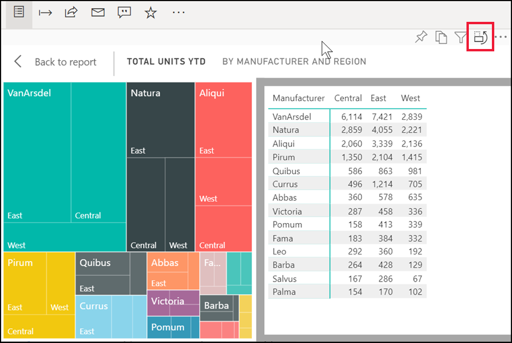

# Power BI 보고서와 함께 데이터 표시

[!INCLUDE[consumer-appliesto-yyny](../includes/consumer-appliesto-yyny.md)]

[!INCLUDE [power-bi-service-new-look-include](../includes/power-bi-service-new-look-include.md)]

Power BI 시각적 개체는 기본 데이터 세트의 데이터를 사용하여 구성됩니다. 숨은 기능에 관심이 있는 경우 Power BI 서비스를 사용하면 보고서의 시각적 개체를 만드는 데 사용된 데이터를 *표시*할 수 있습니다. **테이블로 표시**를 선택하면 Power BI에서 데이터를 시각적 개체 아래(또는 옆)에 표시합니다.

대시보드에서 기본 데이터를 보려면 [Excel로 내보내기](end-user-export.md)를 사용합니다.

## 시각적 개체를 만드는 데 사용된 데이터 표시
1. Power BI 서비스에서 [보고서를 열고](end-user-report-open.md) 시각적 개체를 선택합니다.  
2. 시각적 개체에 숨겨져 있는 데이터를 표시하려면 **기타 옵션**(...), **테이블로 표시**를 차례로 선택합니다.
   
   
3. 기본적으로 데이터는 시각적 개체 아래에 표시됩니다.
   
   

4. 방향을 변경하려면 시각화의 오른쪽 위에서 세로 레이아웃  을 선택합니다.
   
   

보고서로 돌아가려면 왼쪽 위 모서리에서 **보고서로 돌아가기**를 선택합니다. 

   

## 다음 단계
[Power BI 보고서의 시각적 개체](../visuals/power-bi-report-visualizations.md)    
[Power BI 보고서](end-user-reports.md)    
